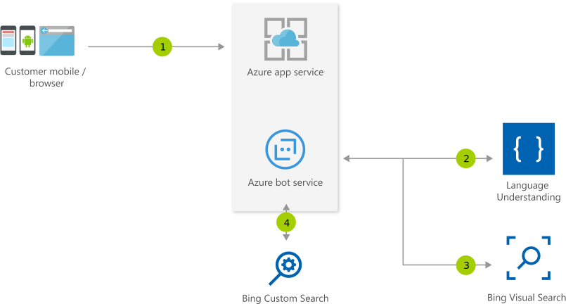

[!INCLUDE [header_file](../../../includes/sol-idea-header.md)]

This solution idea uses Azure services with a bot assistant to improve interactions with customers and provide suggestions based on visual information.

## Architecture

*Download a [Visio file](https://arch-center.azureedge.net/retail-assistant-or-vacation-planner-with-visual-capabilities.vsdx) of this architecture.*

### Dataflow

1. The user uses an application, which is hosted on [Azure App Service](/azure/app-service), either via a web browser or a mobile device.
1. App Service communicates with [Azure Bot Service](/azure/bot-service) to facilitate the interaction between the user and the application.
1. Bot Service uses [Azure Cognitive Services Language Understanding](/azure/cognitive-services/luis/what-is-luis) to identify user intents and meaning.
1. Language Understanding (LUIS) returns the identified user intent to the Azure bot.
1. The bot passes a visual context input, such as an image, to the [Bing Visual Search API](/azure/cognitive-services/bing-visual-search).
1. The API returns output to Bot Service.
1. Optionally, the bot retrieves more information for user queries within the user's domain by using the [Bing Custom Search API](/azure/cognitive-services/bing-custom-search).
1. The Custom Search API returns output to Bot Service.

### Components

- [App Service](https://azure.microsoft.com/services/app-service) provides a framework for building, deploying, and scaling web apps.
- [Bot Service](https://azure.microsoft.com/services/bot-services) provides an integrated development environment for bot building.
- [Cognitive Services](https://azure.microsoft.com/services/cognitive-services) consists of cloud-based services that provide AI functionality.
- [Azure Cognitive Service for Language](https://azure.microsoft.com/services/cognitive-services/language-service) is part of Cognitive Services that offers many natural language processing services.
- [Conversational language understanding](https://azure.microsoft.com/services/cognitive-services/language-understanding-intelligent-service) is a feature of Cognitive Service for Language. This cloud-based API service offers machine-learning intelligence capabilities for building conversational apps. You can use language understanding (LUIS) to predict the meaning of a conversation and pull out relevant, detailed information.
- The [Bing Visual Search API](https://www.microsoft.com/bing/apis/bing-visual-search-api) returns data that's related to a given image, such as similar images, shopping sources for purchasing the item in the image, and webpages that include the image.
- The [Bing Custom Search API](https://www.microsoft.com/bing/apis/bing-custom-search-api) provides a way to create tailored ad-free search experiences for topics.

## Scenario details

This solution features a bot assistant with search integration. The bot can help customers interact with a business application. It can also provide suggestions based on visual information.

### Potential use cases

This solution can be used broadly, but is ideal for the retail industry and the travel and hospitality industries.

## Next steps

- [What is Azure Cognitive Services?](/azure/cognitive-services/what-are-cognitive-services)
- [What is Language Understanding (LUIS)?](/azure/cognitive-services/luis/what-is-luis)
- [Bing Search API documentation](/azure/cognitive-services/bing-web-search)
- [What is the Bing Visual Search API?](/azure/cognitive-services/bing-visual-search)
- [What is the Bing Custom Search API?](/azure/cognitive-services/bing-custom-search)
- [App Service overview](/azure/app-service/overview)
- [Azure Bot Service documentation](/azure/bot-service)
- [Introduction to Bot Framework Composer](/composer/introduction)

## Related resources

- [Commerce chatbot](./commerce-chatbot.yml)
- [Product recommendations for retail using Azure](./product-recommendations.yml)
- [Visual assistant](./visual-assistant.yml)
- [Artificial intelligence (AI) - Architectural overview](../../data-guide/big-data/ai-overview.md)
- [Choose a Microsoft Azure Cognitive Services technology](../../data-guide/technology-choices/cognitive-services.md)
