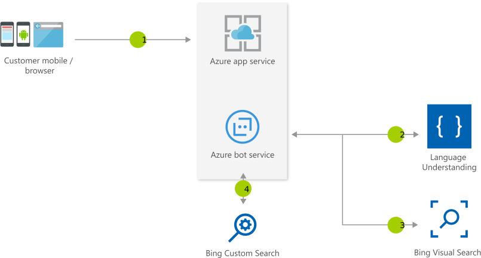

# Retail Assistant with Visual Capabilities using Cognitive Services

[!INCLUDE [header_file](../header.md)]

The retail assistant or vacation planner can help your customers have interactions with your business bot and provide suggestions based on the visual information. 

## Architecture

## Data Flow

1. Users interact with your business assistant
1. Assistant understands context from LUIS
1. Assistant passes visual context to the Bing Visual Search API
1. Optionally Bot gets more information for user queries exclusively from your domain using the Bing Custom Search API

