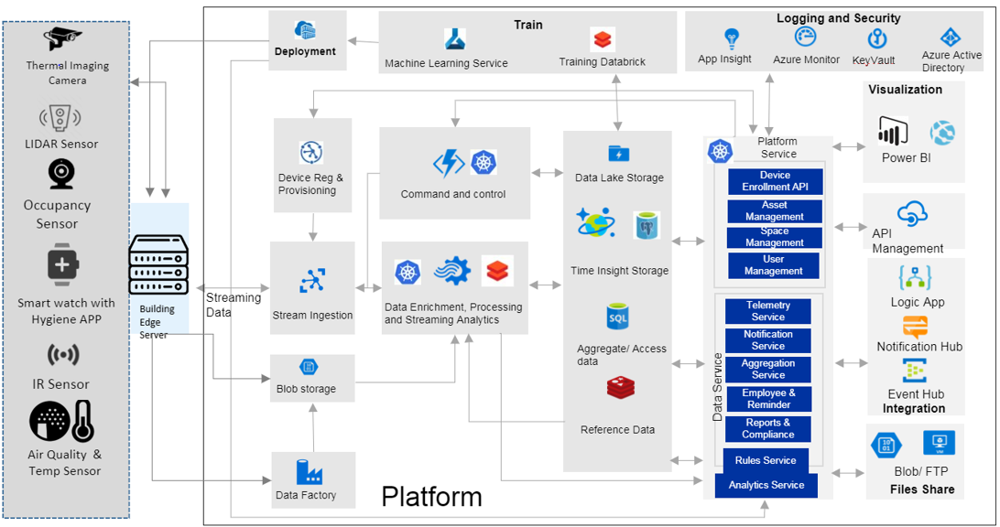

# Create a safe building

The world is cautiously reopening in a physical business environment where COVID-19 remains a factor. To help keep people healthy, [Cognizant](https://www.cognizant.com/) adapted their [OneFacility](https://azuremarketplace.microsoft.com/en-us/marketplace/consulting-services/cognizant.one_facility) solution to make workspaces safer for everyone who enters them. The **Cognizant Safe Buildings** solution provides a strategic approach to create safe buildings with sustainably healthy working environments.

The solution monitors critical insights so you can act and respond to risks. It also builds confidence that you're focused on making sure people are safe. The measurements the solution reacts to are: human body temperature, effective physical distancing, hand sanitization compliance, and air quality tracking.

Using [Azure IoT Hub](https://azure.microsoft.com/services/iot-hub/) and other Azure services, the **Cognizant Safe Buildings** solution brings together people, regulations, analytics, and technology to transform smart buildings into safe buildings. Through the use of different devices, the solution collects biometric and environmental data. When the system detects any deviation to health and safety protocol in a building, the solution activates. **Safe Buildings** layers safety controls to protect, monitor, and respond with real-time alerts.

## Potential use cases

**Safe Buildings** adapts to stores, offices, factories, warehouses, recreation spaces, hotels, and restaurants. It's adaptable to any interior space where people congregate.

## Architecture

1. Different devices collect data: thermal imaging cameras, LIDAR sensors, occupancy sensors, smart watches with hygiene apps, IR sensors, and air quality and temperature sensors. That data flows into the building's IoT Edge server.

1. The server feeds the data to the Azure IoT Hub, Azure Data Factory, and Azure Blob storage.

1. The Azure IoT Hub sends data through an Azure Kubernetes Service (AKS).

1. AKS routes the data so Azure Stream Analytics and Azure Databricks can analyze and enrich it.

1. **Safe Buildings** sends the processed data to various data stores:
 
    * Data Lake - Azure Data Lake Storage

    * Time Insight - Azure Cosmos DB and Azure Database for PostgreSQL

    * Aggregate/Access data - Azure SQL Database

    * Reference Data - Azure Cache for Redis

6. From there, different services and APIs consume the data:

    * Data Service - These services consume the data, process it, and pass it on to downstream services that notify users of any abnormalities that **Safe Buildings** detected.

    * Platform Service - These services analyze device, asset, spatial, and user metrics and pass the information to a web app instance of Power BI. Power BI displays the statistics in a meaningful and useful way.

    * Training - Azure Databricks and Azure Machine Learning take the data and update deep learning models. **Safe Buildings** uses Azure Container Registry to distribute the models to the IoT Edge server and the Data Service.

    * Command and Control - AKS passes the data from the Platform Service to Azure Functions.

## Components

* [Azure IoT Edge](https://azure.microsoft.com/services/iot-edge/) allows you to deploy your cloud workloads to run on Internet of Things (IoT) edge devices via standard containers. Workloads like artificial intelligence, Azure and third-party services, or your own business logic.

* [Azure IoT Hub](https://azure.microsoft.com/services/iot-hub/) enables highly secure and reliable communication between your IoT application and the devices it manages.

* [Azure Kubernetes Service](https://azure.microsoft.com/services/kubernetes-service/) deploy and manage containerized applications more easily with a fully managed Kubernetes service.

* [Azure Stream Analytics](https://azure.microsoft.com/services/stream-analytics/) is an easy-to-use, real-time analytics service designed for mission-critical workloads.

* [Azure Databricks](https://azure.microsoft.com/services/databricks/) unlocks insights from all your data and build artificial intelligence (AI) solutions. Set up your Apache Spark environment in minutes, autoscale, and collaborate on shared projects in an interactive workspace.

* [Azure Data Lake Storage](https://azure.microsoft.com/services/storage/data-lake-storage/) - A highly scalable and cost-effective data lake solution for big data analytics.

* [Azure Cosmos DB](https://azure.microsoft.com/services/cosmos-db/) -  A fully managed NoSQL database service for modern app development. Azure Cosmos DB has guaranteed single-digit millisecond response times. It also guarantees 99.999-percent availability backed by SLAs, automatic and instant scalability, and open-source APIs for MongoDB and Cassandra.

* [Azure Database for PostgreSQL](https://azure.microsoft.com/services/postgresql/) - Focus on application innovation, not database management, with fully managed and intelligent Azure Database for PostgreSQL.

* [Azure SQL Database](https://azure.microsoft.com/services/sql-database/) - The intelligent, scalable, relational database service built for the cloud. It’s evergreen and always up to date, with AI-powered and automated features that optimize performance and durability for you.

* [Azure Cache for Redis](https://azure.microsoft.com/services/cache/) - Fully managed, open source–compatible in-memory data store to power fast, scalable applications.

* [Azure Machine Learning](https://azure.microsoft.com/services/machine-learning/) empowers developers and data scientists to build, train, and deploy machine learning models faster. Continuous retraining, updating, and improving data collection and analysis makes the models better over time.

* [Azure Monitor](https://azure.microsoft.com/services/monitor/) collects, analyzes, and acts on telemetry data from your Azure and on-premises environments.

* [Power BI](https://powerbi.microsoft.com/) enables team members to discover insights hidden in your data.

* [Azure Functions](https://azure.microsoft.com/services/functions/) lets you build and debug locally without additional setup, deploy and operate at scale in the cloud, and integrate services using triggers and bindings.

* In addition, **Safe Buildings** has access to these other Azure services: [Azure Active Directory](https://azure.microsoft.com/services/active-directory/), [Azure API Management](https://azure.microsoft.com/services/api-management/), [Azure Blob storage](https://azure.microsoft.com/services/storage/blobs/), [Azure Container Registry](https://azure.microsoft.com/services/container-registry/), [Azure Data Factory](https://azure.microsoft.com/services/data-factory/), [Azure Event Hubs](https://azure.microsoft.com/services/event-hubs/), [Azure Key Vault](https://azure.microsoft.com/services/key-vault/), [Azure Logic App](https://azure.microsoft.com/services/logic-apps/), [Azure Notification Hubs](https://azure.microsoft.com/services/notification-hubs/), [Azure VMs](https://azure.microsoft.com/services/virtual-machines/), [Azure Webapp Service](https://azure.microsoft.com/services/app-service/web/).

## Next steps

* For more information, please contact [iotcovidsupport@microsoft.com](mailto:iotcovidsupport@microsoft.com).

* Visit the Microsoft commercial marketplace for info on Cognizant's [OneFacility](https://azuremarketplace.microsoft.com/en-us/marketplace/consulting-services/cognizant.one_facility).
