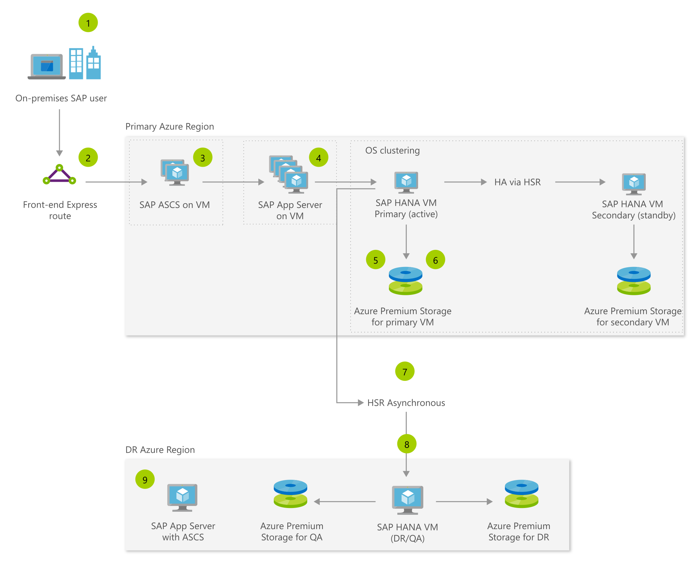

# SAP S/4 HANA VM on Azure and Linux| Microsoft Azure

[!INCLUDE [header_file](../../../includes/sol-idea-header.md)]

This SAP S/4HANA on Azure VM solution architecture illustrates how a user request flows through an SAP landscape built using high-performance Azure Virtual Machines and in-memory SAP HANA databases running on Azure Virtual Machines for unparalleled scalability and performance. This system takes advantage of Linux OS clustering for high availability, premium storage for performance, data replication for high availability via HANA System Replication (HSR), and a full disaster recovery (DR) configuration for guaranteed 99.95% system availability with asynchronous HSR.

## Architecture

*Download an [SVG](../media/sap-s4-hana-vm-on-linux.svg) of this architecture.*

## Data Flow

1. In this example, an on-premises SAP user executes a sales order request via SAP's S/4HANA Fiori interface, custom application interface, or others.
1. Azure high-speed ExpressRoute gateway is used to connect securely from On-premises network to Azure Virtual Machines and other Azure resources
1. Request flows into highly available SAP ABAP SAP Central Services ASCS and then through SAP application servers running on Azure Virtual Machines in a Azure VM Availability Set offering a 99.95 percent uptime SLA.
1. Request is sent from app server to SAP HANA running on on an Azure Virtual Machine optimized for large memory SAP HANA workloads.
1. Primary (active) and secondary (standby) running on SAP certified M-series virtual machines with Write Accelerator are clustered at OS level for 99.95 percent availability, and data replication is handled through HANA System Replication in synchronous mode (HSR) from primary to secondary enabling zero RPO.
1. In-memory data of SAP HANA is persisted to high-performance Azure Premium Storage.
1. In-memory HANA data is replicated to a disaster recovery (DR) region virtual machine through an Azure high-speed backbone network and HSR in asynchronous mode. The disaster recovery VM can be smaller than the production VM to save costs.
1. VMs on the DR region can be used for nonproduction to save costs by mounting both the non-production storage and DR replicated volume (read-only).
1. SAP App Server with ASCS on the DR side can be in standby shutdown mode, and can be started when needed to save costs.

## Components

* SAP on Azure requires that you run your SAP workloads on certified Microsoft Azure [Virtual Machines](https://azure.microsoft.com/services/virtual-machines). SAP requires at least two vCPUs and a ratio of 6:1 between memory and vCPU. M-Series VMs, and GS5 VM are optimized to run demanding SAP HANA workloads.
* Azure [Premium Storage](https://azure.microsoft.com/services/storage/disks) provides improved throughput and less variability in I/O latencies. For improved performance, [Premium Storage](https://azure.microsoft.com/services/storage/disks) uses SSD in Azure Storage nodes, and read cache that's backed by the local SSD of an Azure compute node. Azure Write Accelerator is a performance enhancement for M-Series VMs exclusively. It improves I/O latency of writes against Azure [Premium Storage](https://azure.microsoft.com/services/storage/disks).
* Azure [ExpressRoute](https://azure.microsoft.com/services/expressroute) used on the front end (see diagram) provides a high bandwidth secure connectivity to establish reliable connections between your network and the Microsoft Azure network.
* Azure [Virtual Network](https://azure.microsoft.com/services/virtual-network)s provide the flexibility and security needed to establish reliable connections between your network and the Microsoft Azure network.

## Next steps

* [SAP Certifications for Azure](https://docs.microsoft.com/azure/virtual-machines/workloads/sap/sap-certifications)
* [Premium Storage: high-performance storage for Azure Virtual Machine workloads](https://docs.microsoft.com/azure/storage/storage-premium-storage)
* [ExpressRoute overview](https://azure.microsoft.com/services/expressroute)
* [Virtual Network overview](https://docs.microsoft.com/azure/virtual-network/virtual-networks-overview)
