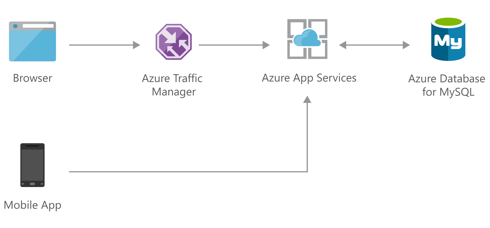

[!INCLUDE [header_file](../../../includes/sol-idea-header.md)]

Rapidly build engaging, performant, and scalable cross-platform and native apps for iOS, Android, Windows, or Mac.

## Architecture

_Download an [SVG](../media/scalable-web-and-mobile-applications-using-azure-database-for-mysql.svg) of this architecture._

### Dataflow

1.  A browser or mobile app makes requests for resources from the API.
1.  The requests are transmitted using HTTPS with [TLS termination](/azure/app-service/configure-ssl-certificate), which is handled by Azure App Services.
1.  Azure App Services handles API requests, and it can be [scaled up](/azure/app-service/manage-scale-up) or [scaled out](/azure/azure-monitor/autoscale/autoscale-get-started) to handle the changing demand.
1.  Azure Database for MySQL provides a relational database service that's powered by the MySQL community edition. Use the [flexible server](/azure/mysql/flexible-server/overview) deployment mode to enable scaling your database within seconds.

### Components

- [Azure App Services](https://azure.microsoft.com/services/app-service)
- [Azure Database for MySQL](https://azure.microsoft.com/services/mysql)

## Next steps

Learn more about the component technologies:

- [App Service overview](/azure/app-service/overview)
- [What is Azure Database for MySQL?](/azure/mysql/overview)

## Related resources

Explore related architectures:

- [Scalable web and mobile applications using Azure Database for PostgreSQL](./scalable-web-and-mobile-applications-using-azure-database-for-postgresql.yml)
- [Social app for mobile and web with authentication](./social-mobile-and-web-app-with-authentication.yml)
- [Task-based consumer mobile app](./task-based-consumer-mobile-app.yml)
