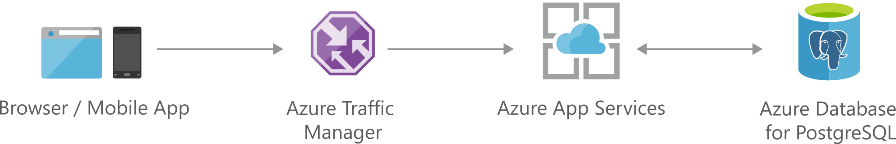

[!INCLUDE [header_file](../../../includes/sol-idea-header.md)]

Rapidly build engaging, performant, and scalable cross-platform and native apps for iOS, Android, Windows, or Mac.

## Potential use cases

This solution is for any organization that utilizes both web and mobile applications.

## Architecture

_Download an [SVG](../media/scalable-web-and-mobile-applications-using-azure-database-for-postgresql.svg) of this architecture._

### Dataflow

1. A browser or mobile app makes requests for resources from the API.
1. The requests are transmitted using HTTPS with [TLS termination](/azure/app-service/configure-ssl-certificate), which is handled by Azure App Services.
1. Azure App Services handles API requests, and it can be [scaled up](/azure/app-service/manage-scale-up) or [scaled out](/azure/azure-monitor/autoscale/autoscale-get-started) to handle the changing demand.
1. Azure Database for PostgreSQL provides a relational database service that's based on the open-source Postgres database engine. Use [Hyperscale (Citus)](/azure/postgresql/hyperscale-overview) or [Flexible Server (Preview)](/azure/postgresql/flexible-server/overview) deployment modes for highly scalable databases.

### Components

- [Azure App Services](https://azure.microsoft.com/services/app-service)
- [Azure Database for PostgreSQL](https://azure.microsoft.com/en-us/services/postgresql)

## Contributors

*This article is maintained by Microsoft. It was originally written by the following contributors.*

Principal author:

 * [Andrew Harvey](https://www.linkedin.com/in/andrewharvey) | Principal Program Manager - Microsoft for Startups

## Next steps

Learn more about the component technologies:

- [App Service overview](/azure/app-service/overview)
- [What is Azure Database for PostgreSQL?](/azure/postgresql/overview)
- [Tutorial: Deploy a Django web app with PostgreSQL in Azure App Service](/azure/app-service/tutorial-python-postgresql-app)

## Related resources

Explore related architectures:

- [Scalable web and mobile applications using Azure Database for MySQL](./scalable-web-and-mobile-applications-using-azure-database-for-mysql.yml)
- [Social app for mobile and web with authentication](./social-mobile-and-web-app-with-authentication.yml)
- [Task-based consumer mobile app](./task-based-consumer-mobile-app.yml)
