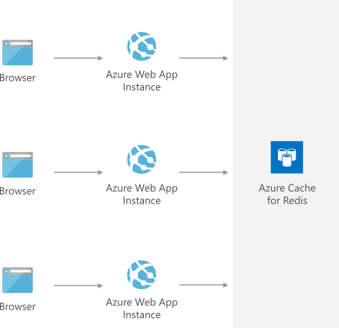

[!INCLUDE [header_file](../../../includes/sol-idea-header.md)]

Quickly save, retrieve, and update web session data such as user cookies and output pages. Azure Cache for Redis improves the performance of your application by increasing its responsiveness and enabling it to handle increasing loads with less web-compute resources.

## Architecture

### Components

Key technologies used to implement this architecture:

- [App Service](https://azure.microsoft.com/services/app-service)
- [Azure Cache for Redis](https://azure.microsoft.com/en-us/services/cache)

## Next steps

Product documentation:

- [App Service overview](/azure/app-service/overview)
- [About Azure Cache for Redis](/azure/azure-cache-for-redis/cache-overview)

Microsoft Learn modules:

- [Develop for Azure Cache for Redis](/learn/modules/develop-for-azure-cache-for-redis)
- [Explore Azure App Service](/learn/modules/introduction-to-azure-app-service)
- [Host a web application with Azure App Service](/learn/modules/host-a-web-app-with-azure-app-service)

## Related resources

- [Ten design principles for Azure applications](../../guide/design-principles)
- [Architect scalable e-commerce web app](../../solution-ideas/articles/scalable-ecommerce-web-app.yml)
- [Scalable Episerver marketing website](../../solution-ideas/articles/digital-marketing-episerver.yml)
- [Scalable Sitecore marketing website](../../solution-ideas/articles/digital-marketing-sitecore.yml)
- [Scalable Umbraco CMS web app](../../solution-ideas/articles/medium-umbraco-web-app.yml)
- 