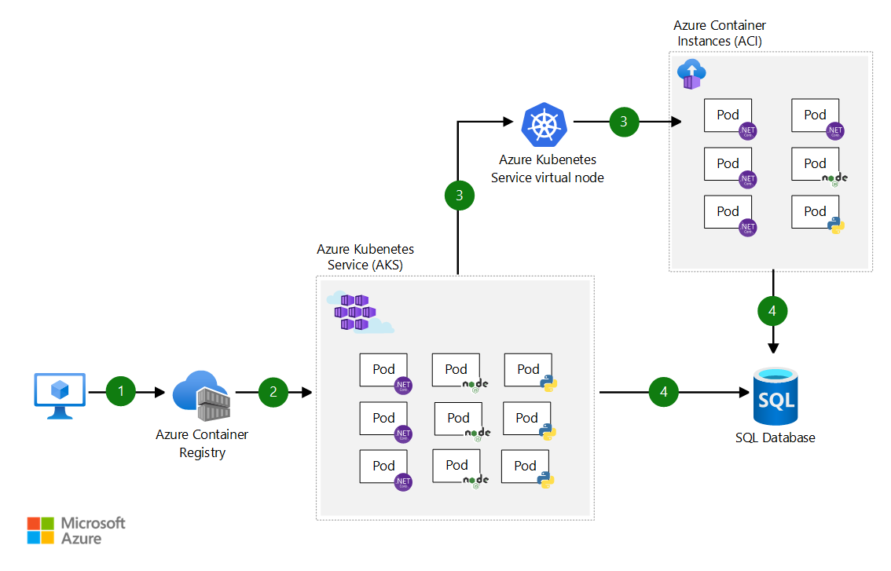

[!INCLUDE [header_file](../../../includes/sol-idea-header.md)]

Use the AKS virtual node to provision pods inside ACI that start in seconds. This enables AKS to run with just enough capacity for your average workload. As you run out of capacity in your AKS cluster, scale out additional pods in ACI without any additional servers to manage.

## Architecture

*Download an [SVG](../media/scale-using-aks-with-aci.svg) of this architecture.*

## Data Flow

1. User registers container in Azure Container Registry
1. Container images are pulled from the Azure Container Registry
1. AKS virtual node, a Virtual Kubelet implementation, provisions pods inside ACI from AKS when traffic comes in spikes.
1. AKS and ACI containers write to shared data store
