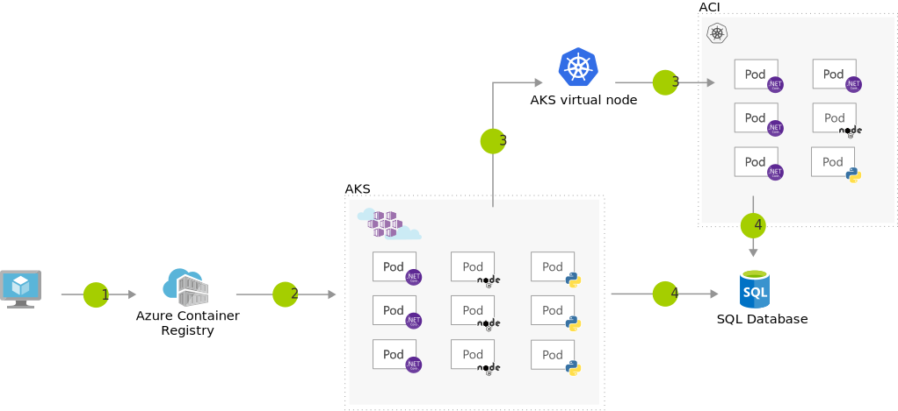

[!INCLUDE [header_file](../../../includes/sol-idea-header.md)]

Use the AKS virtual node to provision pods inside ACI that start in seconds. This enables AKS to run with just enough capacity for your average workload. As you run out of capacity in your AKS cluster, scale out additional pods in ACI, without any additional servers to manage.

## Potential use cases

Organizations utilize this solution so they don't need extra servers to perform this type of scaling.

## Architecture

*Download a [Visio file](https://arch-center.azureedge.net/scale-using-aks-with-aci.vsdx) of this architecture.*

### Dataflow

1. User registers a container in Azure Container Registry.
1. Container images are pulled from the Azure Container Registry.
1. AKS virtual node, a Virtual Kubelet implementation, provisions pods inside ACI from AKS, when traffic comes in spikes.
1. AKS and ACI containers write to a shared data store.

### Components

- [Azure Kubernetes Service](https://azure.microsoft.com/services/kubernetes-service) offers fully managed Kubernetes clusters for deployment, scaling, and management of containerized applications.
- [Azure Container Registry](https://azure.microsoft.com/services/container-registry) is a managed, private Docker registry service on Azure. Use Container Registry to store private Docker images, which are deployed to the cluster.
- [Azure Container Instances](https://azure.microsoft.com/services/container-instances) offers the fastest and simplest way to run a container in Azure, without having to manage any virtual machines and without having to adopt a higher-level service. Azure Kubernetes Service (AKS) can use the Virtual Kubelet to provision pods inside Azure Container Instance(ACI) that start in seconds. This enables AKS to run with just enough capacity for your average workload. As you run out of capacity in your AKS cluster, scale out more pods in ACI without any extra servers to manage.
- [Azure SQL Database](https://azure.microsoft.com/services/sql-database) is a fully managed and intelligent relational database service built for the cloud. With SQL Database, you can create a highly available and high-performance data storage layer for modern cloud applications.

## Contributors

*This article is maintained by Microsoft. It was originally written by the following contributors.*

Principal author:

 * [Uthappa Kattera Chengappa](https://www.linkedin.com/in/uthappa) | Principal Cloud Solution Architect

## Next steps

- To learn how to use virtual nodes in AKS, see [Create and configure an Azure Kubernetes Services cluster to use virtual nodes](/azure/aks/virtual-nodes).
- For information about scaling, see [Scale with ease using AKS and ACI](https://azure.microsoft.com/resources/scale-with-ease-using-aks-and-aci), [Scaling options for applications in Azure Kubernetes Service (AKS) ](/azure/aks/concepts-scale), and [Scale single database resources in Azure SQL Database](/azure/azure-sql/database/single-database-scale).
- For information about the AKS product roadmap, see [Azure Kubernetes Service Roadmap on GitHub](https://github.com/Azure/AKS/projects/1).

## Related resources

If you need a refresher in Kubernetes, complete the [Introduction to Kubernetes on Azure learning path](/training/paths/intro-to-kubernetes-on-azure).
