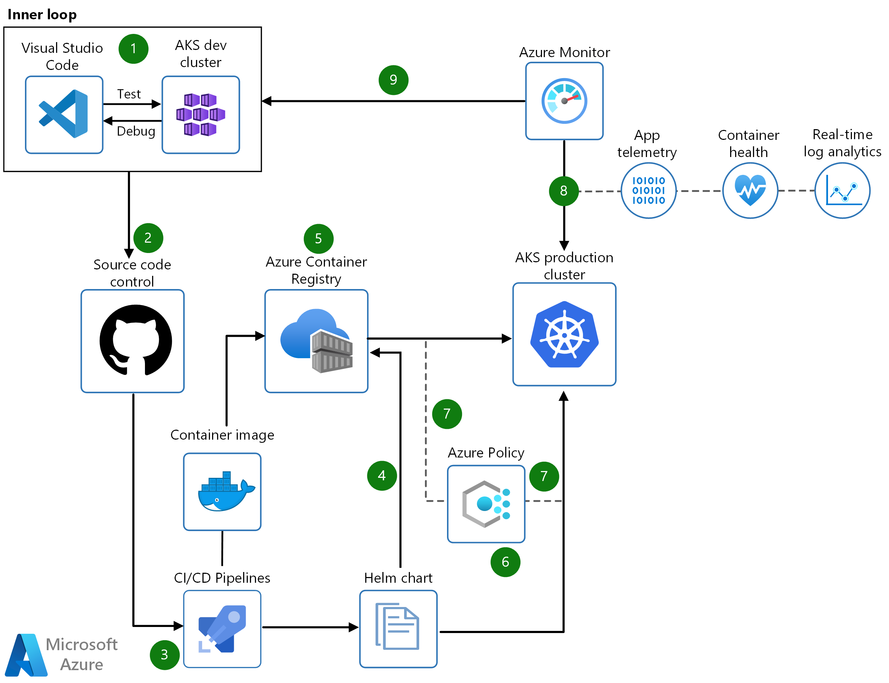

[!INCLUDE [header_file](../../../includes/sol-idea-header.md)]

DevOps and Kubernetes are better together. Implementing secure DevOps together with Kubernetes on Azure, you can achieve the balance between speed and security and deliver code faster at scale. Put guardrails around the development processes using CI/CD with dynamic policy controls and accelerate feedback loop with constant monitoring. Use Azure Pipelines to deliver fast while ensuring enforcement of critical policies with Azure Policy. Azure provides you real-time observability for your build and release pipelines, and the ability to apply compliance audit and reconfigurations easily.

## Architecture

*Download an [SVG](../media/secure-devops-for-kubernetes.svg) of this architecture.*

<!-- markdownlint-disable MD033 -->

Developers rapidly iterate, test, and debug different parts of an application together in the same Kubernetes cluster

Code is merged into a GitHub repository, after which automated builds and tests are run by Azure Pipelines

Code is merged into a GitHub repository, after which automated builds and tests are run by Azure Pipelines

Release pipeline automatically executes pre-defined deployment strategy with each code change

App telemetry, container health monitoring, and real-time log analytics are obtained using Azure Monitor

## Data Flow

1. Developers rapidly iterate, test, and debug different parts of an application together in the same Kubernetes cluster.
1. Code is merged into a GitHub repository, after which automated builds and tests are run by Azure Pipelines.
1. Release pipeline automatically executes pre-defined deployment strategy with each code change.
1. Kubernetes clusters are provisioned using tools like Helm charts that define the desired state of app resources and configurations.
1. Container image is pushed to Azure Container Registry.
1. Cluster operators define policies in Azure Policy to govern deployments to the AKS cluster.
1. Azure Policy audits requests from the pipeline at the AKS control plane level.
1. App telemetry, container health monitoring, and real-time log analytics are obtained using Azure Monitor.
1. Insights used to address issues and fed into next sprint plans.

[Build and deploy to Azure Kubernetes Service](/azure/devops/pipelines/ecosystems/kubernetes/aks-template?view=azure-devops)
