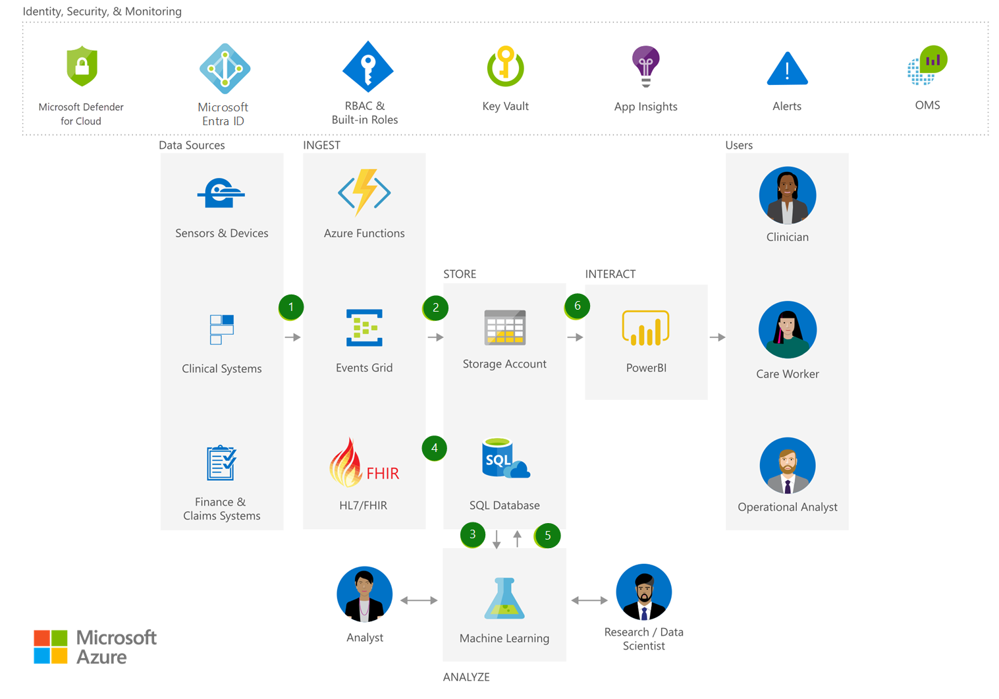

[!INCLUDE [header_file](../../../includes/sol-idea-header.md)]

This article describes how you can store, manage, and analyze HIPAA-compliant and HITRUST-compliant health data and medical records with a high level of built-in security.

## Architecture

*Download an [SVG](../media/security-compliance-blueprint-hipaa-hitrust-health-data-ai.svg) of this architecture.*

### Dataflow

1. Securely ingest bulk patient data into [Azure Blob storage](/azure/storage/blobs).
1. [Event Grid](/azure/event-grid) publishes patient data to [Azure Functions](/azure/azure-functions) for processing, and securely stores patient data in SQL Database.
1. Analyze patient data using [Machine Learning](/azure/machine-learning), and create a Machine Learning-trained model.
1. Ingest new patient data in HL7/FHIR format and publish to Azure Functions for processing. Store in [SQL Database](/azure/sql-database).
1. Analyze newly ingested data using the trained Machine Learning model.
1. Interact with patient data using Power BI while preserving Azure role-based access control (Azure RBAC).

### Components

- [Azure Functions](https://azure.microsoft.com/services/functions): Process events with serverless code
- [Event Grid](https://azure.microsoft.com/services/event-grid): Get reliable event delivery at massive scale
- [Storage Accounts](https://azure.microsoft.com/services/storage): Durable, highly available, and massively scalable cloud storage
- [Azure SQL Database](https://azure.microsoft.com/services/sql-database): Managed, intelligent SQL in the cloud
- [Azure Machine Learning](https://azure.microsoft.com/services/machine-learning): Bring AI to everyone with an end-to-end, scalable, trusted platform with experimentation and model management
- [Power BI Embedded](https://azure.microsoft.com/services/power-bi-embedded): Embed fully interactive, stunning data visualizations in your applications
- [Defender for Cloud](https://azure.microsoft.com/services/security-center): Unify security management and enable advanced threat protection across hybrid cloud workloads
- [Azure Active Directory](https://azure.microsoft.com/services/active-directory): Synchronize on-premises directories and enable single sign-on
- [Key Vault](https://azure.microsoft.com/services/key-vault): Safeguard and maintain control of keys and other secrets
- Application Insights: Detect, triage, and diagnose issues in your web apps and services
- [Azure Monitor](https://azure.microsoft.com/services/monitor): Full observability into your applications, infrastructure, and network
- [Operation Management Suite](https://www.microsoft.com/cloud-platform/operations-management-suite): A collection of management services that were designed in the cloud from the start
- [Azure RBAC and built-in roles](/azure/role-based-access-control/built-in-roles): Azure role-based access control (Azure RBAC) has several built-in role definitions that you can assign to users, groups, and service principals.

## Scenario details

This solution demonstrates how you can store, manage, and analyze HIPAA-compliant and HITRUST-compliant health data and medical records with a high level of built-in security.

### Potential use cases

This solution is ideal for the medical and healthcare industry.

## Next steps

- [Azure Functions Documentation](/azure/azure-functions)
- [Azure Event Grid Documentation](/azure/event-grid)
- [Azure Storage Documentation](/azure/storage)
- [Azure SQL Database Documentation](/azure/sql-database)
- [Azure Machine Learning Documentation](/azure/machine-learning)
- [Power BI Embedded Documentation](/azure/power-bi-embedded)
- [Microsoft Defender for Cloud Documentation](/azure/security-center)
- [Get started with Azure AD](/azure/active-directory/get-started-azure-ad)
- [What is Azure Key Vault?](/azure/key-vault/key-vault-overview)
- [What is Application Insights?](/azure/application-insights/app-insights-overview)
- [Monitoring Azure applications and resources](/azure/monitoring-and-diagnostics/monitoring-overview)
- [What is Operations Management Suite (OMS)?](/azure/operations-management-suite/operations-management-suite-overview)
- [Built-in roles for Azure role-based access control](/azure/role-based-access-control/built-in-roles)

## Related resources

- [Health data consortium on Azure](../../example-scenario/data/azure-health-data-consortium.yml)
- [Virtual health on Microsoft Cloud for Healthcare](../../example-scenario/mch-health/virtual-health-mch.yml)
- [Confidential computing on a healthcare platform](../../example-scenario/confidential/healthcare-inference.yml)
