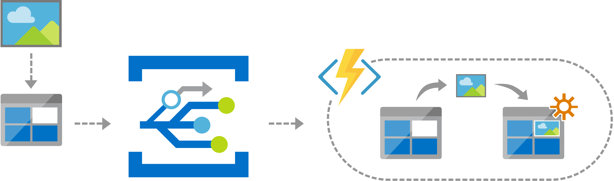

[!INCLUDE [header_file](../../../includes/sol-idea-header.md)]

This article describes how to use Azure Event Grid to connect data sources and event handlers. The solution triggers a serverless function to run image analysis when a new photo enters an Azure Blob Storage container.

## Architecture

*Download an [SVG](../media/serverless-application-architectures-using-event-grid.svg) of this architecture.*

### Dataflow

1. A user uploads a photo to a Blob storage container.
1. Blob Storage publishes storage object events to Event Grid.
1. Event Grid triggers an Azure Function, based on the event criteria that the Function subscribed.  
1. The function retrieves the photo and runs the image process on it (such as to shrink an image). Then it saves the new image to another Blob storage container.

### Components

- [Azure Event Grid](https://azure.microsoft.com/services/event-grid)
- [Azure Functions](https://azure.microsoft.com/services/functions)
- [Azure Blob Storage](https://azure.microsoft.com/services/storage/blobs)

## Scenario details

The core design concept uses Event Grid to connect data sources and event handlers. Event Grid decouples event publishers from event subscribers by using a pub/sub model and a simple HTTP-based event delivery. This process allows the system to build scalable serverless applications.

### Potential use cases

This solution idea publishes Blob Storage events by using Azure Event Grid. Then Azure Functions receives the event with built-in Event Grid support and processes the data in Blob Storage. Developers only need to focus on implementing the business logic in Azure Functions using this solution. Event Grid provides a reliable near-real-time notifications system for the event-driven integration between Blob Storage and Azure Functions. For example, Event Grid instantly triggers a serverless function to run an image process (such as to shrink an image), whenever someone adds a new photo to a Blob Storage container.

## Contributors

*This article is maintained by Microsoft. It was originally written by the following contributors.*

Principal author:

 * [Herman Wu](https://www.linkedin.com/in/hermanwu01) | Senior Software Engineer

*To see non-public LinkedIn profiles, sign in to LinkedIn.*

## Next steps

Learn more about the component technologies:

- [What is Azure Event Grid?](/azure/event-grid/overview)
- [Introduction to Azure Functions](/azure/azure-functions/functions-overview)
- [Introduction to Azure Blob storage](/azure/storage/blobs/storage-blobs-introduction)

## Related resources

Explore related architectures:

- [Application integration using Event Grid](./application-integration-using-event-grid.yml)
- [Ops automation using Event Grid](./ops-automation-using-event-grid.yml)
- [Event-based cloud automation](../../reference-architectures/serverless/cloud-automation.yml)
- [Gridwich cloud media system](../../reference-architectures/media-services/gridwich-architecture.yml)
