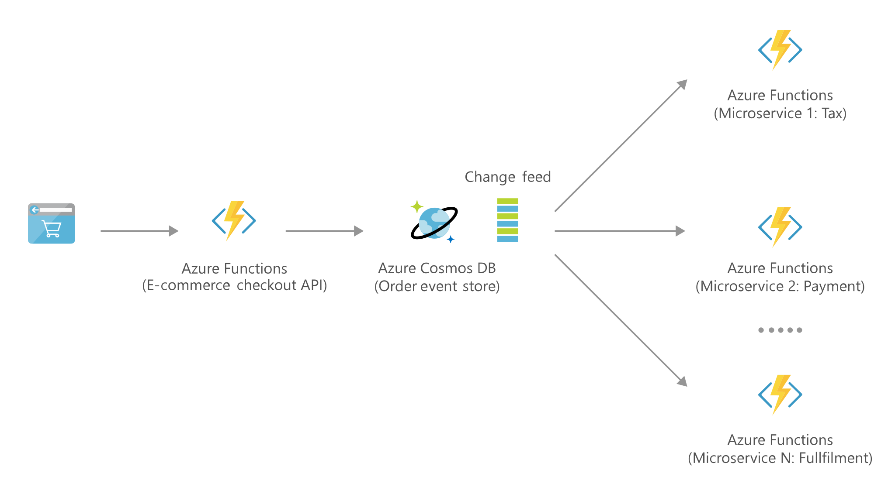

[!INCLUDE [header_file](../../../includes/sol-idea-header.md)]

Use Azure Functions and Azure Cosmos DB to build globally distributed, scalable serverless applications.

## Architecture

*Download an [SVG](../media/serverless-apps-using-cosmos-db.svg) of this architecture.*
