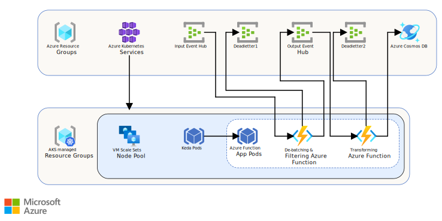

<!-- cSpell:ignore KEDA deadletter autoscaler -->
[!INCLUDE [header_file](../../../includes/sol-idea-header.md)]

This article describes a variation of a [serverless](https://azure.microsoft.com/solutions/serverless) event-driven architecture that runs on Azure Kubernetes Service (AKS) with KEDA scaler. The solution ingests a stream of data, processes the data, and then writes the results to a back-end database.

## Architecture

*Download a [Visio file](https://arch-center.azureedge.net/serverless-event-processing-aks-diagram.vsdx) of this architecture.*

### Dataflow

1. AKS with the KEDA scaler is used to autoscale Azure Functions containers based on the number of events needing to be processed.
1. Events arrive at the Input Event Hub.
1. The De-batching and Filtering Azure Function is triggered to handle the event. This step filters out unwanted events and de-batches the received events before submitting to the Output Event Hub.
1. If the De-batching and Filtering Azure Function fails to store the event successfully, the event is submitted to the Deadletter Event Hub 1.
1. Events arriving at the Output Event Hub trigger the Transforming Azure Function. This Azure Function transforms the event into a message for the Azure Cosmos DB instance.
1. The event is stored in an Azure Cosmos DB database.

### Components

- [Azure Kubernetes Service](https://azure.microsoft.com/services/kubernetes-service) (AKS) simplifies deploying a managed Kubernetes cluster in Azure by offloading the operational overhead to Azure. As a hosted Kubernetes service, Azure handles critical tasks, like health monitoring and maintenance.
- [KEDA](https://keda.sh) is an event-driven autoscaler used to scale containers in the Kubernetes cluster based on the number of events needing to be processed.
- [Event Hubs](https://azure.microsoft.com/services/event-hubs) ingests the data stream. Event Hubs is designed for high-throughput data streaming scenarios.
- [Azure Functions](https://azure.microsoft.com/services/functions) is a serverless compute option. It uses an event-driven model, where a piece of code (a *function*) is invoked by a trigger.
- [Azure Cosmos DB](https://azure.microsoft.com/services/cosmos-db) is a multi-model database service that is available in a serverless, consumption-based mode. For this scenario, the event-processing function stores JSON records, using the [Azure Cosmos DB for NoSQL](/azure/cosmos-db/introduction).

> [!NOTE]
> For Internet of Thing (IoT) scenarios, we recommend [Azure IoT Hub](https://azure.microsoft.com/services/iot-hub). IoT Hub has a built-in endpoint that's compatible with the Azure Event Hubs API, so you can use either service in this architecture with no major changes in the back-end processing. For more information, see [Connecting IoT Devices to Azure: IoT Hub and Event Hubs](/azure/iot-hub/iot-hub-compare-event-hubs).

## Scenario details

This article describes a [serverless](https://azure.microsoft.com/solutions/serverless) event-driven architecture that runs on AKS with KEDA scaler. The solution ingests a stream of data, processes the data, and then writes the results to a back-end database.

To learn more about the basic concepts, considerations, and approaches for serverless event processing, see the [Serverless event processing](../../reference-architectures/serverless/event-processing.yml) reference architecture.

### Potential use case

A popular use case for implementing an end-to-end event stream processing pattern includes the Event Hubs streaming ingestion service to receive and process events per second using a de-batching and transformation logic implemented with highly scalable, event hub-triggered functions.

## Contributors

*This article is maintained by Microsoft. It was originally written by the following contributors.*

Principal author:

- [Rajasa Savant](https://www.linkedin.com/in/rajasa-savant-72645728) | Senior Software Development Engineer

*To see non-public LinkedIn profiles, sign in to LinkedIn.*

## Next steps

- [Introduction to Azure Kubernetes Service](/azure/aks/intro-kubernetes)
- [Azure Event Hubs documentation](/azure/event-hubs/)
- [Introduction to Azure Functions](/azure/azure-functions/functions-overview)
- [Azure Functions documentation](/azure/azure-functions/)
- [Overview of Azure Cosmos DB](/azure/cosmos-db/introduction)
- [Choose an API in Azure Cosmos DB](/azure/cosmos-db/choose-api)

## Related resources

- [Serverless event processing](../../reference-architectures/serverless/event-processing.yml) is a reference architecture detailing a typical architecture of this type, with code samples and discussion of important considerations.
- [Monitoring serverless event processing](../../serverless/guide/monitoring-serverless-event-processing.md) provides an overview and guidance on monitoring serverless event-driven architectures like this one.
- [De-batching and filtering in serverless event processing with Event Hubs](./serverless-event-processing-filtering.yml) describes in more detail how these portions of the architecture work.
- [Private link scenario in event stream processing](./serverless-event-processing-private-link.yml) is a solution idea for implementing a similar architecture in a virtual network with private endpoints, in order to enhance security.
