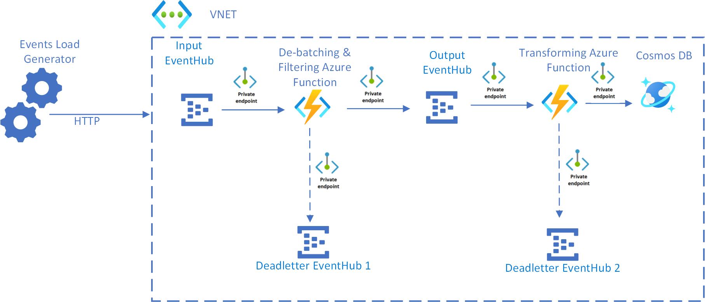

<!-- cSpell:ignore KEDA deadletter headsetter -->
[!INCLUDE [header_file](../../../includes/sol-idea-header.md)]

This article describes a serverless event-driven architecture in a virtual network that ingests and processes a stream of data and then writes the results to a database.

## Architecture

### Dataflow

1. VNet integration is used to put all Azure resources behind [Azure Private Endpoints](/azure/private-link/private-endpoint-overview).
1. Events arrive at the Input Event Hub.
1. The De-batching and Filtering Azure Function is triggered to handle the event. This step filters out unwanted events and de-batches the received events before submitting them to the Output Event Hub.
1. If the De-batching and Filtering Azure Function fails to store the event successfully, the event is submitted to the Deadletter Event Hub 1.
1. Events arriving at the Output Event Hub trigger the Transforming Azure Function. This Azure Function transforms the event into a message for the Azure Cosmos DB instance.
1. The event is stored in an Azure Cosmos DB database.
1. If the Transforming Azure Function fails to store the event successfully, the event is saved to the Deadletter Event Hub 2.

> [!NOTE]
> For simplicity, subnets are not shown in the diagram.

### Components

- [Azure Private Endpoint](/azure/private-link/private-endpoint-overview) is a network interface that connects you privately and securely to a service powered by Azure Private Link. Private Endpoint uses a private IP address from your VNet, effectively bringing the service into your VNet.
- [Event Hubs](https://azure.microsoft.com/services/event-hubs) ingests the data stream. Event Hubs is designed for high-throughput data streaming scenarios.
- [Azure Functions](https://azure.microsoft.com/services/functions) is a serverless compute option. It uses an event-driven model, where a piece of code (a *function*) is invoked by a trigger.
- [Azure Cosmos DB](https://azure.microsoft.com/services/cosmos-db) is a multi-model database service that is available in a serverless, consumption-based mode. For this scenario, the event-processing function stores JSON records, using the [Azure Cosmos DB for NoSQL](/azure/cosmos-db/introduction).

## Scenario details

This solution idea shows a variation of a serverless event-driven architecture that ingests a stream of data, processes the data, and writes the results to a back-end database. In this example, the solution is hosted inside a virtual network with all Azure resources behind private endpoints.

To learn more about the basic concepts, considerations, and approaches for serverless event processing, consult the [Serverless event processing](../../reference-architectures/serverless/event-processing.yml) reference architecture.

### Potential use cases

A popular use case for implementing an end-to-end event stream processing pattern includes the Event Hubs streaming ingestion service to receive and process events per second by using de-batching and transformation logic implemented with highly scalable functions triggered by Event Hubs.

## Contributors

*This article is maintained by Microsoft. It was originally written by the following contributors.*

Principal author:

- [Rajasa Savant](https://www.linkedin.com/in/rajasa-savant-72645728) | Senior Software Development Engineer

*To see non-public LinkedIn profiles, sign in to LinkedIn.*

## Next steps

- [Manage a Private Endpoint connection](/azure/private-link/manage-private-endpoint)
- Private Endpoint quickstart guides:
  - [Create a Private Endpoint using the Azure portal](/azure/private-link/create-private-endpoint-portal)
  - [Create an Azure Private Endpoint using Azure PowerShell](/azure/private-link/create-private-endpoint-powershell)
  - [Create a Private Endpoint using Azure CLI](/azure/private-link/create-private-endpoint-cli)
  - [Create a Private Endpoint by using an ARM template](/azure/private-link/create-private-endpoint-template)
- [Azure Event Hubs documentation](/azure/event-hubs)
- [Introduction to Azure Functions](/azure/azure-functions/functions-overview)
- [Azure Functions documentation](/azure/azure-functions)
- [Overview of Azure Cosmos DB](/azure/cosmos-db/introduction)
- [Choose an API in Azure Cosmos DB](/azure/cosmos-db/choose-api)

## Related resources

- [Serverless event processing](../../reference-architectures/serverless/event-processing.yml) is a reference architecture detailing a typical architecture of this type, with code samples and discussion of important considerations.
- [Monitoring serverless event processing](../../serverless/guide/monitoring-serverless-event-processing.md) provides an overview and guidance on monitoring serverless event-driven architectures like this one.
- [De-batching and filtering in serverless event processing with Event Hubs](./serverless-event-processing-filtering.yml) describes in more detail how these portions of the architecture work.
- [Azure Kubernetes in event stream processing](./serverless-event-processing-aks.yml) describes a variation of a serverless event-driven architecture running on Azure Kubernetes with KEDA scaler.
