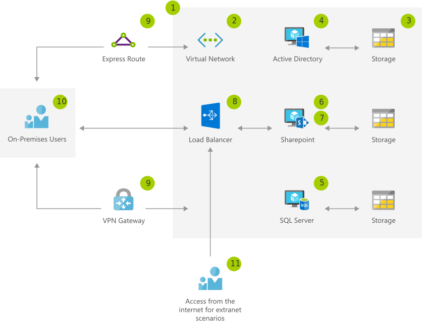

[!INCLUDE [header_file](../../../includes/sol-idea-header.md)]

This solution provides a small scale deployment of SharePoint, by using a single Azure Active Directory (Azure AD), SQL, and SharePoint resources.

## Potential use cases

This solution address the capability to deliver agile development architecture to teams within your business, by using the latest and greatest support platforms.

## Architecture

*Download a [Visio file](https://arch-center.azureedge.net/sharepoint-farm-devtest.vsdx) of this architecture.*

### Dataflow

1. Create resource group for the storage, network, and virtual machine, plus other dependent elements.
1. Create a virtual network to host the virtual machines and load balancers for the deployment. Ensure the network has appropriate Network Security Groups implement to protect network traffic flow.
1. Create the storage accounts that will host the virtual machine images (VHDs).
1. Create the Active Directory installation. Either utilizing a new Virtual Machine or using Azure Active Directory Domain Services. If using Azure Active Directory, you also need to consider synchronizing identities to Azure AD with Azure AD Connect.
1. Install a supported version of SQL Server on an Azure VM or deploy a pay-as-you-go instance of SQL Server.
1. Deploy SharePoint onto an Azure VM, or use a trial image from the gallery, which already has SharePoint Server installed.
1. Create the SharePoint farm.
1. Set up an Azure external load balancer to direct incoming HTTPS traffic to the SharePoint server.
1. Use ExpressRoute or VPN Gateway for management access to resource group.
1. On-premises users can access the SharePoint sites via the internet, ExpressRoute, or VPN Gateway.
1. External users can be granted access as required to the SharePoint sites for testing.

### Components

* [Azure Resource Group](https://azure.microsoft.com/features/resource-manager): Container that holds related resources for an Azure solution
* [Virtual Network](https://azure.microsoft.com/services/virtual-network): Provision private networks, optionally connect to on-premises datacenters
* [Storage Accounts](https://azure.microsoft.com/services/storage): Durable, highly available, and massively scalable cloud storage
* [Azure Active Directory](https://azure.microsoft.com/services/active-directory): Synchronize on-premises directories and enable single sign-on
* SharePoint Server: Microsoft's collaboration server product
* Host enterprise [SQL Server](https://azure.microsoft.com/services/virtual-machines/sql-server) apps in the cloud
* [Load Balancer](https://azure.microsoft.com/services/load-balancer): Deliver high availability and network performance to your applications
* [Azure ExpressRoute](https://azure.microsoft.com/services/expressroute): Dedicated private network fiber connections to Azure
* [VPN Gateway](https://azure.microsoft.com/services/vpn-gateway): Establish secure, cross-premises connectivity

## Next steps

* [Azure Resource Group Documentation](/azure/azure-resource-manager/resource-group-overview)
* [Virtual Network Documentation](/azure/virtual-network/virtual-networks-overview)
* [Storage Documentation](/azure/storage/blobs/storage-blobs-introduction)
* [Active Directory Documentation](https://support.microsoft.com/help/2721672/microsoft-server-software-support-for-microsoft-azure-virtual-machines)
* [SharePoint Server Documentation](/sharepoint/administration/intranet-sharepoint-server-in-azure-dev-test-environment)
* [SQL Server Documentation](/azure/azure-sql/virtual-machines/windows/create-sql-vm-portal)
* [Load Balancer Documentation](/azure/load-balancer/load-balancer-standard-overview)
* [ExpressRoute Documentation](/azure/expressroute)
* [VPN Gateway Documentation](/azure/vpn-gateway)
