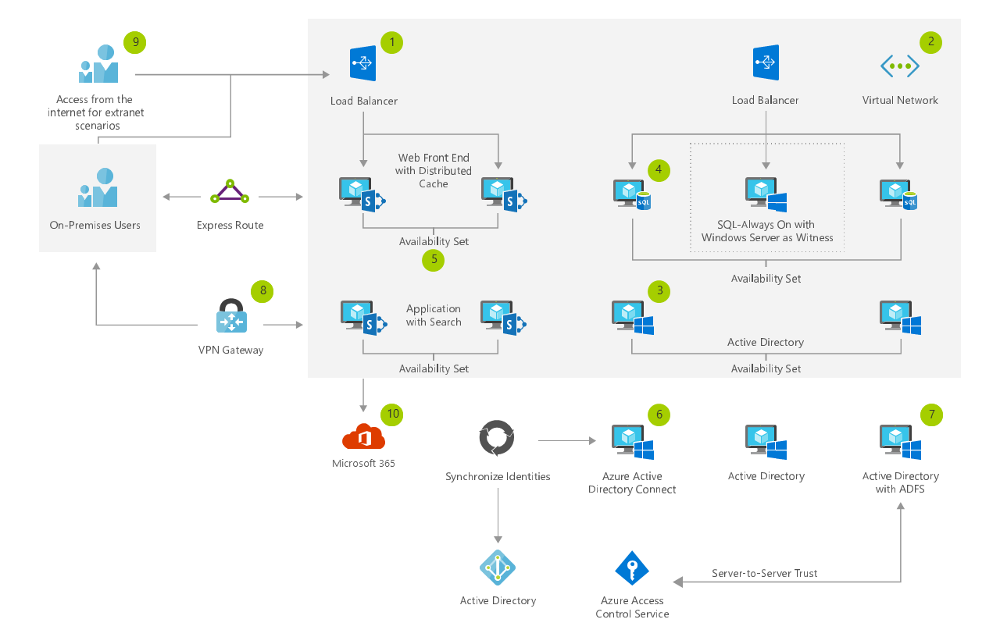

[!INCLUDE [header_file](../../../includes/sol-idea-header.md)]

This solution provides a highly available deployment of SharePoint, by using a load-balanced Azure Active Directory (Azure AD) instance, a highly available SQL always-on instance, and highly available SharePoint resources.

## Potential use cases

This solution addresses the need to deliver a highly available intranet capability, by using the latest and greatest supported platforms.

## Architecture

*Download an [SVG](../media/sharepoint-farm-microsoft-365.svg) of this architecture.*

### Dataflow

1. Create a resource group to host all Azure based infrastructure and services.
1. Create a virtual network in Azure.
1. Deploy Windows Servers to host Active Directory services for SharePoint, SQL server service accounts, and machine accounts.
1. Deploy SQL Server Always-on for high availability (HA) support for the SharePoint farm.
1. Deploy the SharePoint Server instances. In this scenario, we use two frontend servers with distributed cache and two applications with search roles. This gives us high availability.
1. Install Azure AD Connect on an on-premises server, to synchronize your identities to Azure Active Directory.
1. Optionally configure Active Directory Federation Services on premises, to support federated authentication to Microsoft 365.
1. Deploy ExpressRoute or set up a site-to-site VPN link, for administrative access to the servers that are hosted in Azure VMs.
1. Set up and provision external access to the hybrid farm that's hosted in Azure VMs.
1. Set up and configure hybrid workloads between Microsoft 365 and the SharePoint farm.

### Components

* [Azure Resource Group](https://azure.microsoft.com/features/resource-manager): Container that holds related resources for an Azure solution.
* [Virtual Network](https://azure.microsoft.com/services/virtual-network): Provision private networks, and optionally connect to on-premises datacenters.
* [Storage Accounts](https://azure.microsoft.com/services/storage): Enable durable, highly available, and massively scalable cloud storage.
* [Azure Active Directory](https://azure.microsoft.com/services/active-directory): Synchronize on-premises directories, and enable single sign-on.
* [SharePoint Server](https://www.microsoft.com/microsoft-365/sharepoint/sharepoint-server): Microsoft's collaboration server product.
* Host enterprise [SQL Server](https://azure.microsoft.com/services/virtual-machines/sql-server) apps in the cloud.
* [Load Balancer](https://azure.microsoft.com/services/load-balancer): Deliver high availability and network performance to your applications.
* [Azure ExpressRoute](https://azure.microsoft.com/services/expressroute): Dedicated private network fiber connections to Azure
* [VPN Gateway](https://azure.microsoft.com/services/vpn-gateway): Establish secure, cross-premises connectivity.
* Azure AD Connect: Synchronize on-premises directories, and enable single sign-on.
* Active Directory Federation Services: Synchronize on-premises directories, and enable single sign-on.
* Hybrid Workloads: Scale between on-premises environments and the cloud.

## Next steps

* [Azure Resource Group Documentation](/azure/azure-resource-manager/resource-group-overview)
* [Virtual Network Documentation](/azure/virtual-network/virtual-networks-overview)
* [Storage Documentation](/azure/storage/blobs/storage-blobs-introduction)
* [Active Directory Documentation](https://support.microsoft.com/help/2721672/microsoft-server-software-support-for-microsoft-azure-virtual-machines)
* [SharePoint Server Documentation](/sharepoint/administration/intranet-sharepoint-server-2016-in-azure-dev-test-environment)
* [SQL Server Documentation](/azure/azure-sql/virtual-machines/windows/create-sql-vm-portal)'
* [Load Balancer Documentation](/azure/load-balancer/load-balancer-standard-overview)
* [ExpressRoute Documentation](/azure/expressroute)
* [VPN Gateway Documentation](/azure/vpn-gateway)
* [Azure AD Connect Documentation](/azure/active-directory/connect/active-directory-aadconnect)
* [Active Directory Federation Services Documentation](/azure/active-directory/connect/active-directory-aadconnectfed-whatis)
* [Hybrid Workloads Documentation](/sharepoint/hybrid/hybrid)
