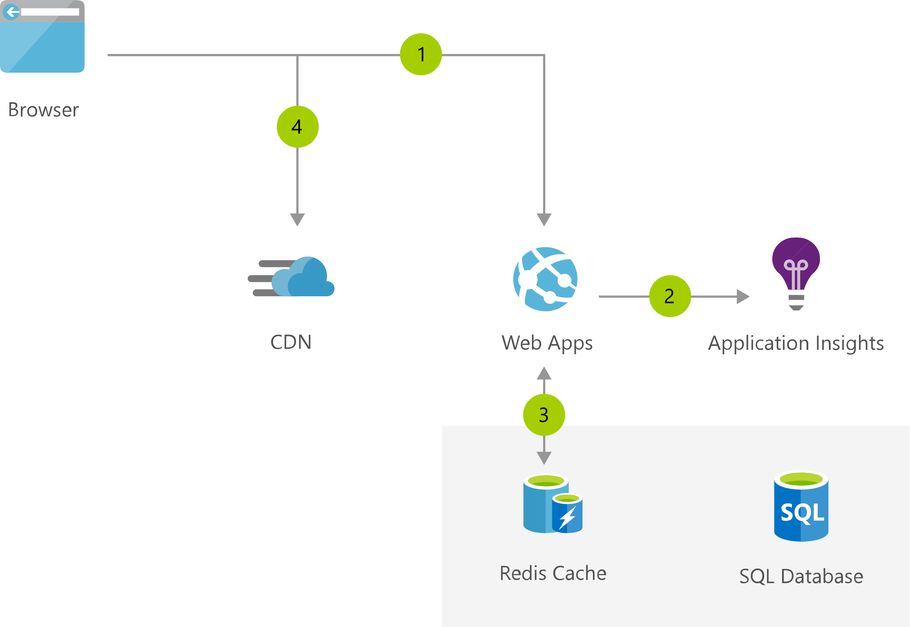

[!INCLUDE [header_file](../../../includes/sol-idea-header.md)]

Quickly build and launch digital campaigns that automatically scale based on customer demand.

## Potential use cases

Start simple with the content management system that enables you to easily maintain the messaging on your website in real time, from a browser, with no coding required.

## Architecture

*Download an [SVG](../media/simple-branded-website.svg) of this architecture.*

### Data flow

1. User accesses Web Apps from Azure App Service in a browser.
1. Application Insights detects issues and analyzes usage for your web apps.
1. Web App connects to SQL Database and Azure Cache for Redis for better performance.
1. Browser pulls static resources such as video from Azure Content Delivery Network to reduce load time.

### Components

* [Web Apps](https://azure.microsoft.com/services/app-service/web): Build and deploy web apps faster at scale
* [Azure SQL Database](https://azure.microsoft.com/services/sql-database): Managed, intelligent SQL in the cloud
* [Content Delivery Network](https://azure.microsoft.com/services/cdn): Ensure secure, reliable content delivery with broad global reach
* [Azure Cache for Redis](https://azure.microsoft.com/services/cache): Power applications with high-throughput, low-latency data access
* Application Insights: Detect, triage, and diagnose issues in your web apps and services

## Next steps

* [Deploy web apps with CMS using pre-built templates](https://azure.microsoft.com/resources/templates/?term=CMS)
* [Build an ASP.NET app in Azure with SQL Database](/azure/app-service/app-service-web-tutorial-dotnet-sqldatabase)
* [Use Azure Content Delivery Network in Azure App Service](/azure/cdn/cdn-add-to-web-app)
* [How to use Azure Cache for Redis](/azure/redis-cache/cache-dotnet-how-to-use-azure-redis-cache)
* [Application Performance Management with Application Insights](/azure/application-insights/app-insights-detect-triage-diagnose)
