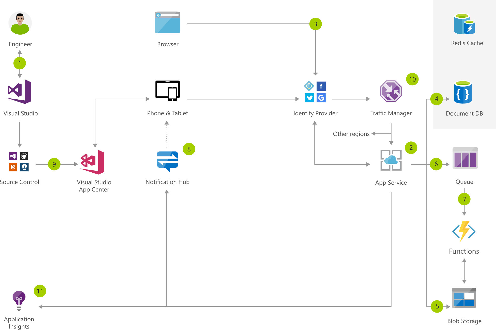

[!INCLUDE [header_file](../../../includes/sol-idea-header.md)]

This mobile client app offers social image sharing with a companion web app. The app back-end service does background image processing using an Azure function, and it can notify users of progress via a notification hub. Non-image data is stored in Azure Cosmos DB. The web app accesses the back end service data and images via Azure Traffic Manager.

See the following services, which are featured in this solution architecture:

- [Visual Studio Team Services](https://azure.microsoft.com/services/visual-studio-team-services)
- [Visual Studio](https://www.visualstudio.com/vs)
- [Visual Studio Tools for Xamarin](https://www.visualstudio.com/xamarin)
- [Application Insights](https://azure.microsoft.com/services/application-insights)
- [Visual Studio App Center](https://www.visualstudio.com/app-center)
- [App Service Mobile Apps](https://azure.microsoft.com/services/app-service/mobile)

## Potential use cases

The mobile client app works in offline mode, which allows you to view and upload images, even when you don't have a network connection.

## Architecture

*Download an [SVG](../media/social-mobile-and-web-app-with-authentication.svg) of this architecture.*

### Dataflow

1. Create the app using Visual Studio and Xamarin.
1. Add the Azure App Service Mobile Apps back end service to the app solution.
1. Implement authentication through social identity providers.
1. Store non-image data in Azure Cosmos DB and cache it in Azure Cache for Redis.
1. Store uploaded images in Azure Blob Storage.
1. Queue messages about newly uploaded images.
1. Use Azure Functions to dequeue messages and process images retrieved from blob storage.
1. Send push notifications to users through a notification hub.
1. Build and test the app through Visual Studio App Center and publish it.
1. Control the distribution of user traffic to service endpoints in different datacenters.
1. Use Application Insights to monitor the app service.

### Components

* Build the web front end, mobile apps, and back end services with C# in [Visual Studio](/visualstudio) 2017 or [Visual Studio](/visualstudio) for Mac.
* [Xamarin](/xamarin): Create mobile apps for iOS and Android using C# and Azure SDKs.
* [Visual Studio App Center](https://azure.microsoft.com/services/app-center): App Center enables a continuous integration and deployment workflow by pulling code from BitBucket, GitHub, and Visual Studio Team Services.
* An [App Service](https://azure.microsoft.com/services/app-service) web app can host a customer-facing web app and a service that is used by both the web and mobile client.
* Use [Azure Functions](https://azure.microsoft.com/services/functions) for serverless background processing. For example, one Azure function can automatically resize new blobs when they're added to a container, while another function listens for messages on a queue in order to delete multiple background images.
* Application Insights: Detect issues, diagnose crashes, and track usage in your web app with Application Insights. Make informed decisions throughout the development lifecycle.
* [Azure Cosmos DB](https://azure.microsoft.com/services/cosmos-db) is a fully managed NoSQL document database service. It offers querying and transaction-processing over schema-free data, predictable and reliable performance, and rapid development.
* Azure [Queue storage](https://azure.microsoft.com/services/storage/queues) is used for durable messaging between the App Service backend and Azure Functions.
* [Blob storage](https://azure.microsoft.com/services/storage/blobs): Azure Storage hosts image files to take advantage of better scalability with lower cost. Communication between the web app and the Azure function is often performed using blob triggers and Azure Queue storage.
* Azure [Notification Hubs](https://azure.microsoft.com/services/notification-hubs) are used for scalable, cross-platform push notifications.
* Azure [Traffic Manager](https://azure.microsoft.com/services/traffic-manager) controls the distribution of user traffic for service endpoints in different datacenters in order to deliver a highly responsive and available application.

## Next steps

* [Visual Studio Documentation](/visualstudio)
* [Xamarin Documentation](/xamarin)
* [Visual Studio App Center Documentation](/appcenter)
* [Azure App Service Overview](https://azure.microsoft.com/services/app-service)
* [Azure Functions Documentation](/azure/azure-functions/functions-triggers-bindings)
* [Application Insights Documentation](/azure/application-insights)
* [Azure Cosmos DB Documentation](/azure/cosmos-db)
* [Queue Storage Documentation](/azure/storage/queues/storage-dotnet-how-to-use-queues)
* [Blob Storage Documentation](/azure/storage/blobs/storage-dotnet-how-to-use-blobs)
* [Notification Hubs Documentation](/azure/notification-hubs)
* [Traffic Manager Documentation](/azure/traffic-manager/traffic-manager-overview)
