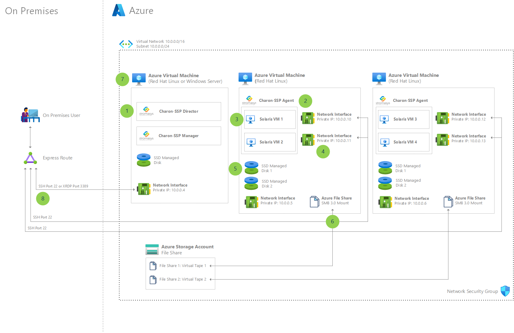

# Charon-SSP Solaris emulator on Azure VMs

This reference architecture shows how an emulator solution called Charon-SSP from the Microsoft partner, Stromasys, runs a SPARC processor-based Solaris virtual machine (VM) in Azure. Charon-SSP is a member of the Charon cross-platform hardware virtualization product family. The emulator can create virtual replicas of Sun-4m, Sun-4u, or Sun-4v SPARC family members on standard x86-64 computer systems running Linux on physical hardware or a hypervisor.

Running applications in an emulator on Azure has several benefits, such as reduced operational costs and energy consumption. In addition, you can run multiple application instances on a single x86-64 standard host or existing virtualization infrastructure, giving you the added advantages of consolidation while easing management and maintenance of legacy systems.

## Use cases

- Enable low-friction "lift-and-shift" from on-premises workloads running on SPARC Solaris machines into Azure.
- Continue to use applications that run on end-of-life SPARCstation or SPARCserver, without changes.
- Manage multiple server hosts and child Solaris VMs from a single interface.
- Allow mapping to low-cost Azure storage to archive tapes for regulatory and compliance purposes.

## Architecture

1. The Stromasys Charon-SSP Director allows managing multiple server hosts, each potentially running one or more child Solaris VMs. This allows a single place of management as you scale out your farm of host VMs and their Solaris child VMs.
2. The Stromasys Charon-SSP Agent runs on Linux distributions on Azure VMs. This component runs the child Solaris VMs and emulates the SPARC processor architecture.
3. The Solaris VMs are based on the SPARC processor architecture.
4. The child Solaris VMs each get their own Azure network interface, and therefore have their own dedicated private IP addresses. Optionally, you can easily set up an Azure public IP address on the same network interface.
5. The Solaris VM images can reside on the solid-state drive (SSD) managed disk of the host Azure VM. Azure Ultra SSD managed disks are also a potential option for even higher input/output operations per second (IOPS).
6. Azure Storage Account file shares are mounted on the Linux VM to allow mapping the Charon-SSP Virtual Tape Manager to a locally-mounted device, which is then backed by an Azure Files storage account in the cloud. This mapping allows for low-cost storage for archived tapes for regulatory and compliance purposes.
7. The management VM running Charon-SSP Director and Manager can be either Windows-based, or Linux-based with a graphic user interface like [GNOME](https://www.gnome.org/).
8. End users can secure-shell (SSH) connect directly to the Solaris VMs, which have their own dedicated network interface cards and IP addresses.
   
   [XDMCP](https://wiki.ubuntu.com/xdmcp) is available for desktop access to the Solaris VMs. XDMCP is not an encrypted protocol, so the recommended topology for accessing a Solaris VM via XDMCP is to create a Windows Server VM in Azure as a "hop" server, in which an XDMCP client such as [MobaXterm](https://mobaxterm.mobatek.net/) can be installed. Then all network traffic occurs over the private Azure virtual network.

## Components

- [Azure Virtual Machines](https://azure.microsoft.com/services/virtual-machines/) (VMs) is one of several types of on-demand, scalable computing resources that Azure offers. An Azure VM gives you the flexibility of virtualization without having to buy and maintain the physical hardware that runs it. With Azure VMs, you have a choice of operating system which includes both Windows and Linux.
- [Azure Virtual Network](/azure/virtual-network/virtual-networks-overview) is the fundamental building block for your private network in Azure. Virtual networks let many types of Azure resources, such as VMs, securely communicate with each other, the internet, and on-premises networks. VNet is similar to a traditional network that you'd operate in your own data center, but brings with it additional benefits of Azure's infrastructure such as scale, availability, and isolation.
- [Azure Virtual Network interface cards](/azure/virtual-network/virtual-network-network-interface) enable an Azure VM to communicate with internet, Azure, and on-premises resources. As shown in this architecture, you can add additional network interface cards to the same Azure VM, which allows the Solaris child VMs to have their own dedicated network interface devices and IP addresses.
- [Azure SSD managed disks](/azure/virtual-machines/managed-disks-overview) are block-level storage volumes that are managed by Azure and used with Azure VMs. The available types of disks are ultra disks, premium SSDs, standard SSDs, and standard hard disk drives (HDDs). For this architecture, we recommend either Premium SSDs or Ultra Disk SSDs.
- [Azure Files](/azure/storage/files/storage-files-introduction) storage accounts offer fully-managed file shares in the cloud that are accessible via the industry standard Server Message Block (SMB) protocol. Azure file shares can be mounted concurrently by cloud and on-premises deployments of Windows, Linux, and macOS.
- [Azure ExpressRoute](/azure/expressroute/expressroute-introduction) lets you extend your on-premises networks into the Microsoft cloud over a private connection facilitated by a connectivity provider. With ExpressRoute, you can establish connections to Microsoft cloud services, such as Microsoft Azure and Microsoft 365.
- [Stromasys Charon-SSP](https://azuremarketplace.microsoft.com/marketplace/apps/stromasys.virtual_sparc_in_azure_cloud) emulator recreates the SPARC virtual hardware layer on industry standard x86-64 computer systems and VMs. The virtual layer acts as SPARC hardware, and is compatible with any SUN software running on it. This means there's no need for code conversion or source code. Charon-SSP is fully compatible with SPARC hardware, including storage, Ethernet, and serial I/O.

## Next steps

- For more information, please contact [legacy2azure@microsoft.com](mailto:legacy2azure@microsoft.com).
- For more information about Stromasys Charon-SSP, visit the [Azure Marketplace](https://azuremarketplace.microsoft.com/marketplace/apps/stromasys.virtual_sparc_in_azure_cloud).
- Read the [Charon-SSP Azure Setup Guide](https://azure.microsoft.com/resources/stromasys-charon-ssp-solaris-emulator-azure-setup-guide/).
