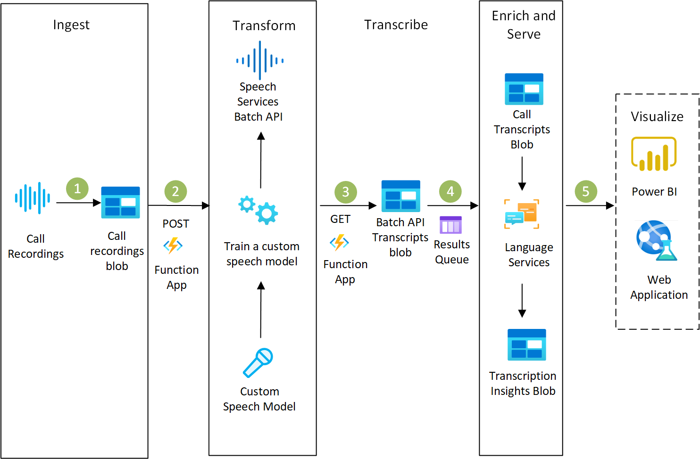

[!INCLUDE [header_file](../../../includes/sol-idea-header.md)]

With Speech services, it's easy to transcribe every call. Index the transcription for [full-text search](/azure/search/search-what-is-azure-search), or apply [Text Analytics](/azure/cognitive-services/Text-Analytics) to detect sentiment, language, and key phrases for insights. If your call center recordings involve specialized terminology, such as product names or IT jargon, create a custom [language model](/azure/cognitive-services/speech-service/how-to-customize-language-model) to teach Speech Services the vocabulary. A custom [acoustic model](/azure/cognitive-services/speech-service/how-to-customize-acoustic-models) helps Speech Services understand speakers even with background noise or poor phone connections.

For more information, read how [batch transcription](/azure/cognitive-services/speech-service/batch-transcription) works with Speech Services.

## Architecture

*Download an [SVG](../media/speech-services.svg) of this architecture.*

### Data flow

1. Adapt a model for your domain and deploy that model
1. Upload your recordings to a blob container
1. Create a POST request to batch transcription
1. Speech Services schedules the transcription job
1. Stereo files are split into two channels
1. Mono files undergo diarization to distinguish between speakers
1. Download the transcription using the transcription ID

### Components

* [Azure Blob Storage](/azure/storage/blobs)
* [Speech Services](/azure/cognitive-services/Speech-Service)

## Next steps

* [Artificial intelligence (AI) - Architectural overview](../../data-guide/big-data/ai-overview.md)
* [Speech-to-text conversion](../../reference-architectures/ai/speech-to-text-transcription-pipeline.yml)
