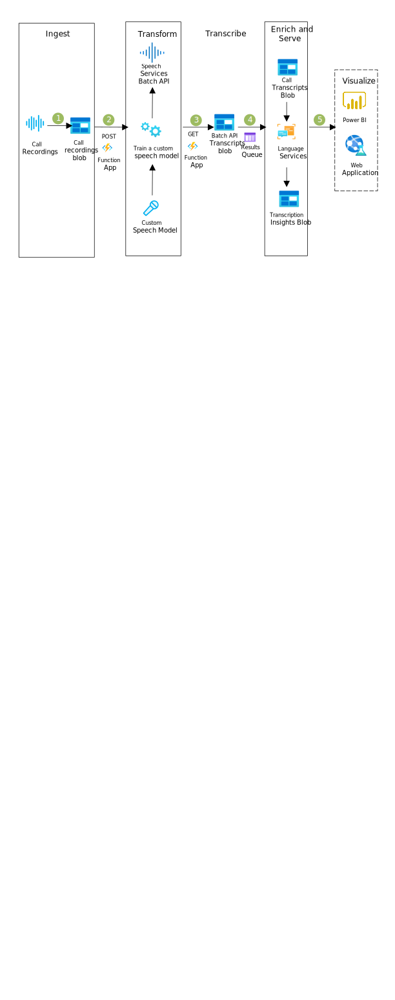

[!INCLUDE [header_file](../../../includes/sol-idea-header.md)]

This solution uses Azure Speech Services to transcribe calls and then run full-text searches, detect sentiment and language, and create custom language and acoustic models.

## Architecture

*Download a [Visio file](https://arch-center.azureedge.net/speech-services.vsdx) of this architecture.*

### Dataflow

1. The first step begins with the collection of data. Calls in a call center are usually recorded. It would be best to store those recordings in their raw state (.wav or .mp3 file formats) into a Blob Storage.
1. A function app is then used to issue a GET request to a speech service endpoint, to get the results transcribed. You can also use Queue Storage to start partitioning the files before issuing a GET request to a speech service endpoint. For customization, you can use Custom Speech to build a custom model and deploy the model to an endpoint, to get the results transcribed.
1. The transcribed results will generate an output as a .txt file, which can be moved to Blob Storage by using a POST request to the Speech service endpoint.
1. Queue Storage works with individual files before sending them to their final destination. A call transcripts blob is used to store the call transcripts in a .txt file format, and a transcription insights blob will store the transcription insights that are generated using Language services to detect sentiment, language, and key phrases for insights.
1. Finally, the visualization stage can be served either via a web app or a dashboard in Power BI.

### Components

* [Azure Blob Storage](https://azure.microsoft.com/services/storage/blobs)
* [Speech service](https://azure.microsoft.com/services/cognitive-services/speech-services)
* [Cognitive Service for Language](https://azure.microsoft.com/services/cognitive-services/language-service)
* [Azure Functions](https://azure.microsoft.com/services/functions)
* [Azure Queue Storage](https://azure.microsoft.com/services/storage/queues)

## Scenario details

Speech Services is part of the Cognitive Services family of products and this service uses AI to work and process audio files. Some of the most common use cases for working with speech files involve the transcription of an audio file into a text file by relying on the Speech-to-text API. Furthermore, the previous use case can see its value amplified with the use of other Cognitive Services which can process the transcriptions and mine the data with APIs such as Text Analytics, Sentiment Analysis, Cognitive Search and Translation.

Several industries rely on supporting their customers over the phone, such as call centers, medical response units, emergency services units, and so on.

Traditionally, a call center relies on agents who talk over the phone with customers. The agents need to handle two jobs at the same time: listening and speaking over the phone, while at the same time taking notes for further analysis and documentation of a particular case. This makes the job not only harder for the agent, but also less efficient. It could even impact negatively on the call centers' most common KPIS, such as AHT (average handling time) and FCR (first call resolution).

## Potential use cases

This solution can be for organizations that record conversations (for training or quality assurance) that also want a written transcript. It's ideal for the education, retail, healthcare, and nonprofit industries.

## Next steps

To learn more about these services, see the following articles:

* [Azure Blob Storage](/azure/storage/blobs)
* [Speech service](/azure/cognitive-services/Speech-Service)
* [Train a Custom Speech model](/azure/cognitive-services/speech-service/how-to-custom-speech-train-model)
* [Cognitive Service for Language](/azure/cognitive-services/language-service/overview)
* [Azure Functions](/azure/azure-functions/functions-reference)
* [Azure Queue Storage](/azure/storage/queues/storage-queues-introduction)

## Related resources

* [Artificial intelligence (AI) - Architectural overview](../../data-guide/big-data/ai-overview.md)
* [Speech-to-text conversion](/azure/architecture/example-scenario/ai/speech-to-text-transcription-analytics)
