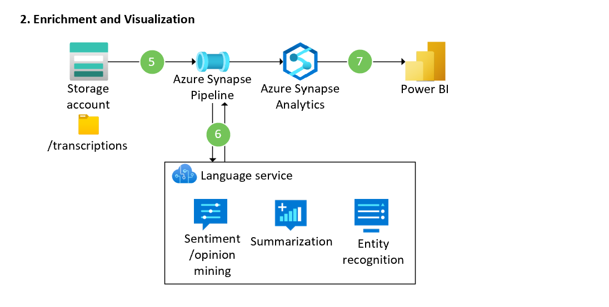

Customer care centers are an integral part of the success of many businesses in many diffrent industries. Speech recognition and analysis of recorded customer calls can provide your business with valuable information about current trends, product shortcomings, and successes. 

The examples solution described below outlines a repeatable pipeline for transcribing and analyzing conversation data. The solution uses the Speech API from [Azure Cognitive Services](/azure/cognitive-services/speech-service/overview) for audio transcription and diarization. [Azure Synapse Analytics](/azure/synapse-analytics/) is used to process and perform NLP tasks such as sentiment analysis and custom named entity recognition through API calls to [Azure Cognitive Service for Language](/azure/cognitive-services/language-service/). 

The services and pipeline describe here can scale to accomodate any volume of recorded data, and process transcribed text to recognize and remove sensitive information, perform sentiment analysis, and so on.

## Potential use cases
This solution will provide value for any organization that record conversations as part of their operations. In particular, customer-facing or internal call centers or support desks will benefit from the insights dervied from this solution. 

## Architecture
This architecture consists of two piplines: 
* A transcription pipeline to convert audio to text
* An encrichment and visualization pipeline

### Transcription pipeline

### Dataflow for transcription pipeline
1. Audio files are uploaded to an Azure Storage account by any supported method. Users can use a UI-based tool such as [Azure Storage Explorer](https://azure.microsoft.com/features/storage-explorer/) or programmatically using an available [storage SDK or API](/azure/storage/blobs/reference).
2. The upload to Azure Storage triggers an Azure Logic App. The Logic App will securely access any needed credentials in Azure Key Vault, and form the request to the Speech service's batch transcription API. 
3. The Logic App submit the audio files call to the Speech service, including optional settings for speaker diarization. 
4. The speech service completes the batch transcription and securely loads the transcription results to the Storage Account. 

### Enrichment and visualization pipeline

### Dataflow for enrichment and visualization pipeline
5. An Azure Synapse pipeline runs to retrieve and process the transcribed audio text. 
6. The processed text is sent via API call to the Language service where various NLP enrichments are performed, such as sentiment and opinion mining, summarization, and custom or pre-built named entity recognition. 
7. The processed data is then stored in Azure Synapse Analytics SQL pool where it can be served to visualization tools such as Power BI. 

*Download a [Visio file](https://arch-center.azureedge.net/[filename].vsdx) of this architecture.*

### Components
- [Azure Blob Storage](https://azure.microsoft.com/product-categories/storage/) Massively scalable and secure object storage for cloud-native workloads, archives, data lakes, high-performance computing, and machine learning. Used to store the audio files, transcription results, and serve as a data lake for downstream analytics. 
- [Azure Logic Apps](https://azure.microsoft.com/services/logic-apps/) is an integration platform as a service (iPaaS) built on a containerized runtime. It is used in this solution to integrate storage and speech AI services. 
- [Azure Cognitive Services Speech service](https://azure.microsoft.com/services/cognitive-services/speech-services) an AI-based API that provides speech capabilities such as speech-to-text, text-to-speech, speech translation, and speaker recognition. Its batch transcription functionality is used in this solution. 
- [Azure Cognitive Services for Language](https://azure.microsoft.com/services/cognitive-services/language-service/) an AI-based, high-quality natural language capabilities, from sentiment analysis and entity extraction to automated question answering.
- [Azure Synapse Analytics](https://azure.microsoft.com/services/synapse-analytics/) is a suite of services that provide data integration, enterprise data warehousing, and big data analytics. It is used in this solution to transform and enrich transcription data, and serves data to downstream visualization tools.
- [Power BI](https://powerbi.microsoft.com/) data modeling and visual analytics tool. Used in this solution to present transcribed audio insights to end-users and decision makers. 

### Alternatives
Some alternative approaches to this solution architecture include: 
* Configure the Storage Blob Storage account to use a hierarchical namespace. This setting offers additional ACL-based security controls, and can provide performance improvement for some big data workloads. 
* Azure Functions could be used as a code-first integration tool instead of Logic Apps or Azure Synapse pipelines, depending on the size and scale of the workload.

## Considerations
These considerations implement the pillars of the Azure Well-Architected Framework, which is a set of guiding tenets that can be used to improve the quality of a workload. For more information, see [Microsoft Azure Well-Architected Framework](/azure/architecture/framework).

### Scalability
- The batch speech API is designed for high volume, but other Cognitive Services APIs might have request limits based on the subscription tier. Consider containerizing these APIs to avoid throttling large volume processing. Containers give you flexibility of deployment, whether in the cloud or on-premises. You can also mitigate side effects of new version rollouts by using containers. For more information, see [Container support in Azure Cognitive Services](/azure/cognitive-services/cognitive-services-container-support).

### Security
- The request to the speech API can include a SAS URI for a destination container in Azure storage. This allows the speech service to directly output the transcription files to that location. If your organization does not allow the use of SAS URIs for storage, then you will need to implement a function to periodically poll the speech API for completed assets. 
- Store credentials such as account or api keys in Azure Key Vault as secrets. Configure your Logic App and Synapse pipelines to access the Key Vault using managed identities to avoid storing secrets in applications settings or code. 
- The audio files stored in the blob might contain sensitive customer data. If multiple clients are using this solution, it's important to restrict access to these files. Using hierarchical namespace on the storage account and enforcing folder/file-level permissions to only the needed Azure Active Directory 

### Cost optimization
All of the Azure services described in this architecture have the option of pay-as-you-go billing, meaning the solution cost scales linearly. 

Azure Synapse has the option for a serverless SQL pool, which means that the compute for the data warehousing workload can be spun up on demand. If your Synapse is not serving other downstream use cases, consider serverless as a way to constrain costs. 

See the [Overview of the cost optimization pillar](/azure/architecture/framework/cost/overview) for more cost optimization strategies.

Click here to to see the suggested services in the azure pricing calculator: https://azure.com/e/27232ae18e00459fa724d25275250f11

## Contributors
*This article is maintained by Microsoft. It was originally written by the following contributors.*

**Principal authors:** 
 * [Brady Leavitt](https://www.linkedin.com/in/bradyleavitt/) | (Azure AI/ML Solution Specialist)
 * [Christina Skarpathiotaki](https://www.linkedin.com/in/christinaskarpathiotaki/) | (Specialized AI Cloud Solution Architect)

## Next steps
* [Quickstart: Recognize and convert speech to text](/azure/cognitive-services/speech-service/get-started-speech-to-text?tabs=windowsinstall%2Cterminal&pivots=programming-language-python)
* [Quickstart: Create an integration workflow with multi-tenant Azure Logic Apps and the Azure portal](/azure/logic-apps/quickstart-create-first-logic-app-workflow)
* [Quickstart: Get started with Language Studio](/azure/cognitive-services/language-service/language-studio)
* [Cognitive Services in Azure Synapse Analytics](/azure/synapse-analytics/machine-learning/overview-cognitive-services)

## Related resources
- [What is the Speech service?](/azure/cognitive-services/speech-service/overview)
- [What is Azure Logic Apps?](/azure/logic-apps/logic-apps-overview)
- [What is Azure Cognitive Service for Language?](/azure/cognitive-services/language-service/overview)
- [What is Azure Synapse Analytics](/azure/synapse-analytics/overview-what-is)