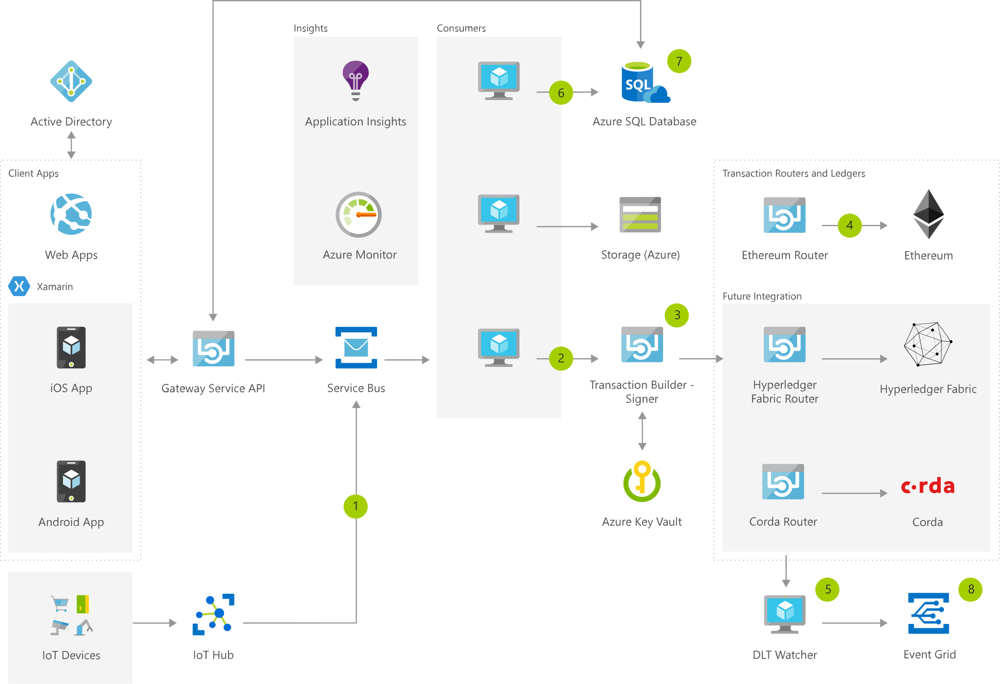

[!INCLUDE [header_file](../../../includes/sol-idea-header.md)]

A common blockchain pattern is the IoT-enabled monitoring of an asset, as it moves along a multi-party supply chain.

## Architecture

*Download an [SVG](../media/supply-chain-track-and-trace.svg) of this architecture.*

IoT devices communicate with IoT Hub. IoT Hub as a route configured that will send specific messages to a Service Bus associated with that route. The message is still in the native format for the device and needs to be translated to the format used by Azure Blockchain Workbench.

An Azure Logic App performs that transformation. It's triggered when a new message is added to the Service Bus associated with the IoT hub, it then transforms the message and delivers it to the Service Bus used to deliver messages to Azure Blockchain Workbench.

The first service bus effectively serves as an "Outbox" for IoT Hub and the second one serves as an "Inbox" for Azure Blockchain Workbench.

### Dataflow

1. IoT devices communicate with IoT Hub. IoT Hub as a route configured that will send specific messages to a Service Bus associated with that route. The message is still in the native format for the device and needs to be translated to the format used by Azure Blockchain Workbench. An Azure Logic App performs that transformation. It's triggered when a new message is added to the Service Bus associated with the IoT hub, it then transforms the message and delivers it to the Service Bus used to deliver messages to Azure Blockchain Workbench. The first service bus effectively serves as an "Outbox" for IoT Hub and the second one serves as an "Inbox" for Azure Blockchain Workbench.
1. DLT Consumer fetches the data from the message broker (Service Bus) and sends data to Transaction Builder - Signer.
1. Transaction Builder builds and signs the transaction.
1. The signed transaction gets routed to the Blockchain (Private Ethereum Consortium Network).
1. DLT Watcher gets confirmation of the transaction commitment to the Blockchain and sends the confirmation to the message broker (Service Bus).
1. DB consumers send confirmed blockchain transactions to off-chain databases (Azure SQL Database).
1. Information analyzed and visualized using tools such as Power BI by connecting to off-chain database (Azure SQL Database).
1. Events from the ledger are delivered to Event Grid and Service Bus for use by downstream consumers. Examples of "downstream consumers" include logic apps, functions or other code that is designed to take action on the events. For example, an Azure Function could receive an event and then place that in a datastore such as SQL Server.

### Components

* Application Insights: Detect issues, diagnose crashes, and track usage in your web app with Application Insights. Make informed decisions throughout the development lifecycle.
* [Web Apps](https://azure.microsoft.com/services/app-service/web): Quickly create and deploy mission critical web apps at scale
* [Storage Accounts](https://azure.microsoft.com/services/storage): Durable, highly available, and massively scalable cloud storage
* [Virtual Machines](https://azure.microsoft.com/services/virtual-machines): Provision virtual machines for Ubuntu, Red Hat, and more
* [Azure Active Directory](https://azure.microsoft.com/services/active-directory): Synchronize on-premises directories and enable single sign-on
* [Azure SQL Database](https://azure.microsoft.com/services/sql-database) is a relational database service that lets you rapidly create, extend, and scale relational applications into the cloud.
* [Azure Monitor](https://azure.microsoft.com/services/monitor): Highly granular and real-time monitoring data for any Azure resource.
* [Service Bus](https://azure.microsoft.com/services/service-bus): Connect across private and public cloud environments
* [Event Grid](https://azure.microsoft.com/services/event-grid): Get reliable event delivery at massive scale

## Scenario details

### Potential use cases

A great example of this pattern is the refrigerated transportation of perishable goods like food or pharmaceuticals where certain compliance rules must be met throughout the duration of the transportation process. In this scenario, an initiating counterparty (such as a retailer) specifies contractual conditions, such as a required humidity and temperature range, that the custodians on the supply chain must adhere to.

At any point, if the device takes a temperature or humidity measurement that is out of range, the smart contract state will be updated to indicate that it's out of compliance, by recording a transaction on the blockchain and triggering remediating events downstream.

## Deploy this scenario

* [Deploy to Azure](https://azuremarketplace.microsoft.com/marketplace/consulting-services/akvelon.azure_blockchain_workbench)

## Next steps

* [Find run-time exceptions with Application Insights](/azure/application-insights/app-insights-tutorial-runtime-exceptions)
* [Create a blockchain app with Azure Blockchain Workbench](/azure/blockchain/workbench/create-app)
* [Azure Storage on Blockchain Workbench](/azure/blockchain/workbench/architecture#azure-storage)
* [Azure and Linux Virtual Machines](/azure/virtual-machines/linux/overview)
* [Blockchain Workbench API app registration](/azure/blockchain/workbench/deploy#blockchain-workbench-api-app-registration)
* [Blockchain Workbench Database](/azure/blockchain/workbench/getdb-details)
* [Log Analytics Tutorial](/azure/log-analytics/log-analytics-tutorial-viewdata)
* [Service Bus on Blockchain Workbench](/azure/blockchain/workbench/messages-overview#using-service-bus-topics-for-notifications)
* [Event Notifications on Blockchain Workbench](/azure/blockchain/workbench/messages-overview#event-notifications)

## Related resources

* [Real-time asset tracking and management using IoT Central](real-time-asset-tracking-mgmt-iot-central.yml)
* [Getting started with Azure IoT solutions](/azure/architecture/reference-architectures/iot/iot-architecture-overview)
