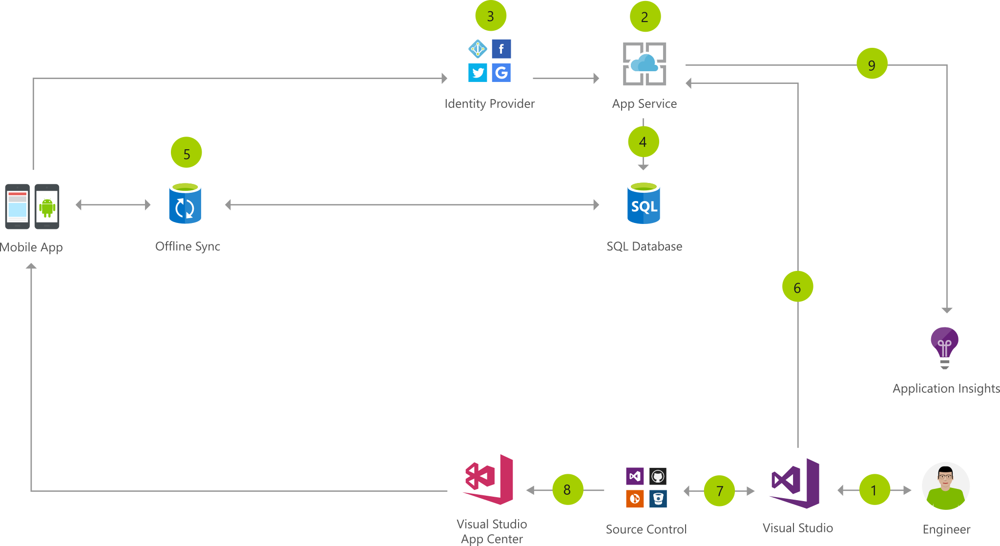

[!INCLUDE [header_file](../../../includes/sol-idea-header.md)]

This consumer mobile app architecture uses Azure App Service Mobile Apps to simplify authentication with multiple social identity providers, store data and sync it for offline access, and send push notifications.

The app is built with Visual Studio (PC or Mac) and Xamarin, sharing C# code across Android, iOS, and Windows, without compromising the user experience. Visual Studio App Center is used to automate builds and tests and distribute to beta testers and app stores, while also providing usage monitoring and analytics in conjunction with App Insights.

The following Azure services are used in the solution architecture:

- [Azure DevOps](https://azure.microsoft.com/services/devops)
- [Visual Studio](https://www.visualstudio.com/vs)
- [Visual Studio Tools for Xamarin](https://www.visualstudio.com/xamarin)
- [Application Insights](https://azure.microsoft.com/services/application-insights)
- [Visual Studio App Center](https://www.visualstudio.com/app-center)
- [App Service - Mobile Apps](https://azure.microsoft.com/services/app-service/mobile)

## Architecture

*Download an [SVG](../media/task-based-consumer-mobile-app.svg) of this architecture.*

### Data flow

1. Create the mobile app using Visual Studio and Xamarin.
1. Create and configure a new Mobile Apps back end on the Azure portal, or through Visual Studio, and configure the solution in Visual Studio to communicate with the back end.
1. Implement authentication through social identity providers.
1. Create a model-driven data structure through the App Service APIs and SDK.
1. Implement offline sync to make the mobile app functional without a network connection.
1. If you created the back end in Visual Studio, you can publish the app service directly from Visual Studio (PC or Mac).
1. Store the solution source code with your source control provider of choice.
1. Build and test the app through Visual Studio App Center and publish it.
1. Use Application Insights to monitor the App Service.

### Components

* Build the web front end, mobile apps, and back end services with C# in [Visual Studio](https://www.visualstudio.com/vs) 2017 or [Visual Studio](https://www.visualstudio.com/vs) for Mac.
* [Building Cross-Platform Applications](/xamarin/cross-platform/app-fundamentals/building-cross-platform-applications/): Create mobile apps for iOS and Android using C# and Azure SDKs.
* [Visual Studio App Center](https://www.visualstudio.com/app-center): App Center enables a continuous integration and deployment workflow by pulling code from BitBucket, GitHub, and Visual Studio Team Services.
* [App Service](https://azure.microsoft.com/services/app-service): The client app uses one of the mobile client SDKs to connect to an Azure Mobile App backend. The client SDKs have built-in support for offline sync and authentication, making it much easier to build a full-featured app.
* Application Insights: Detect issues, diagnose crashes, and track usage in your web app with Application Insights. Make informed decisions throughout the development lifecycle.
* [Azure SQL Database](https://azure.microsoft.com/services/sql-database): Structured data is stored in SQL Database, a cloud relational database service, which supports transactions and efficient querying.
* [Offline sync](/azure/app-service-mobile/app-service-mobile-offline-data-sync): Use the offline data sync feature of the Azure Mobile App client SDKs to create responsive and robust apps that remain useful even when there are network issues.
* [Identity Provider](/azure/app-service/app-service-authentication-overview): Use App Service authentication/authorization to integrate with a social or enterprise identity provider.

## Next steps

* [Visual Studio documentation](/visualstudio)
* [Xamarin documentation](/xamarin)
* [Visual Studio App Center documentation](/appcenter)
* [Azure App Service Overview](https://azure.microsoft.com/services/app-service)
* [Application Insights documentation](/azure/application-insights)
* [Azure SQL Database documentation](/azure/sql-database)
* [Offline sync documentation](/azure/app-service-mobile/app-service-mobile-offline-data-sync)
* [Identity Provider documentation](/azure/app-service/app-service-authentication-overview)
