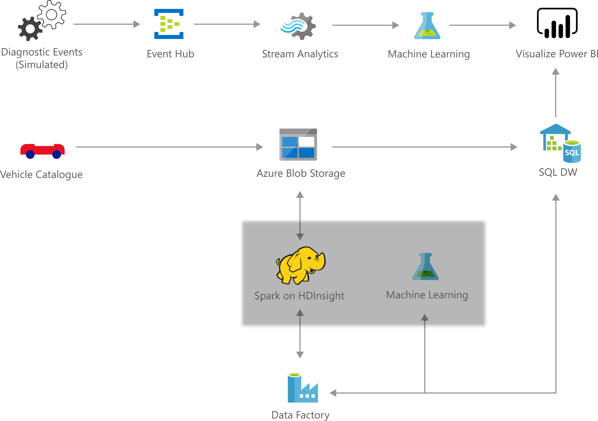

# Telemetry Analytics

[!INCLUDE [header_file](../../../includes/sol-idea-header.md)]

Supercomputers have moved out of the lab and are now parked in our garage! These cutting-edge automobiles contain a myriad of sensors, giving them the ability to track and monitor millions of events every second. We expect that by 2020, most of these cars will be connected to the internet. Imagine tapping into this wealth of data to provide best-in-class safety, reliability, and driving experience. Microsoft has made this imagination a reality via Cortana Intelligence. Microsoft's Cortana Intelligence is a fully managed big data and advanced analytics suite that enables you to transform your data into intelligent action.

We want to introduce you to the Cortana Intelligence Vehicle Telemetry Analytics Solution Template. This solution demonstrates how car dealerships, automobile manufacturers, and insurance companies can use the capabilities of Cortana Intelligence to gain real-time and predictive insights on vehicle health and driving habits.

## Architecture

*Download an [SVG](../media/telemetry-analytics.svg) of this architecture.*

## Description

The solution is implemented as a [lambda architecture pattern](https://en.wikipedia.org/wiki/Lambda_architecture) showing the full potential of the Cortana Intelligence platform for real-time and batch processing. It includes a Vehicle Telematics simulator, leverages Event Hubs for ingesting millions of simulated vehicle telemetry events into Azure, then uses Stream Analytics for gaining real-time insights on vehicle health and persists that data into long-term storage for richer batch analytics. It takes advantage of Machine Learning for anomaly detection in real-time and batch processing to gain predictive insights. HDInsight is leveraged to transform data at scale, and Data Factory handles orchestration, scheduling, resource management, and monitoring of the batch processing pipeline. Finally, Power BI gives this solution a rich dashboard for real-time data and predictive analytics visualizations. Try it today!

## Pricing Info

Your Azure subscription used for the deployment will incur consumption charges on the services used in this solution. For pricing details, visit the [Azure pricing page](https://azure.microsoft.com/pricing/calculator). See the 'Services Used' section on the right pane for the list of the services used in this solution.

Ensure you stop the data generator when not actively using the solution. Running the data generator (Vehicle Telematics Simulator) will incur higher costs.

Delete the solution if you are not using it.

## Additional Reference

[Playbook including technical guide](https://docs.microsoft.com/azure/machine-learning/team-data-science-process/cortana-analytics-playbook-vehicle-telemetry)

## Prerequisite

If you don't have an [Azure subscription](https://azure.microsoft.com/free), get started with Azure free subscription.

You also need to download [Power BI desktop](https://docs.microsoft.com/power-bi//desktop-get-the-desktop).
