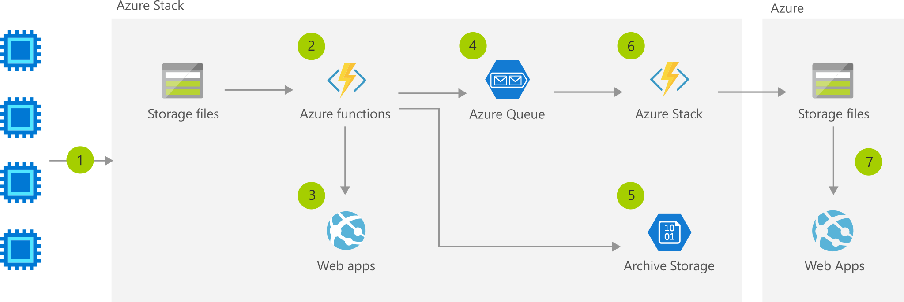

[!INCLUDE [header_file](../../../includes/sol-idea-header.md)]

Easily tier data and applications on-premises and in Azure, with architecture that supports greater efficiency in applications. Filter unnecessary data early in the process, easily bring cloud applications close to the data on-premises, and analyze large scale aggregate data from multiple locations in Azure, for fleet-level insights.

## Architecture

*Download a [Visio file](https://arch-center.azureedge.net/tiered-data-for-analytics.vsdx) of this architecture.*

### Data flow

1. Data flows into a storage account.
1. Function on Azure Stack analyzes the data for anomalies or compliance.
1. Locally-relevant insights are displayed on the Azure Stack app.
1. Insights and anomalies are placed into a queue.
1. The bulk of the data is placed into an archive storage account.
1. Function sends data from queue to Azure Storage.
1. Globally-relevant and compliant insights are available in the global app.

### Components

* [Storage](https://azure.microsoft.com/services/storage): Durable, highly available, and massively scalable cloud storage
* [Azure Functions](https://azure.microsoft.com/services/functions): Process events with serverless code
* [Azure Stack](https://azure.microsoft.com/overview/azure-stack): Build and run innovative hybrid applications across cloud boundaries

## Next steps

* [Storage documentation](/azure/storage)
* [Azure Functions documentation](/azure/azure-functions)
* [Azure Stack documentation](/azure/azure-stack/user/azure-stack-solution-staged-data-analytics)
