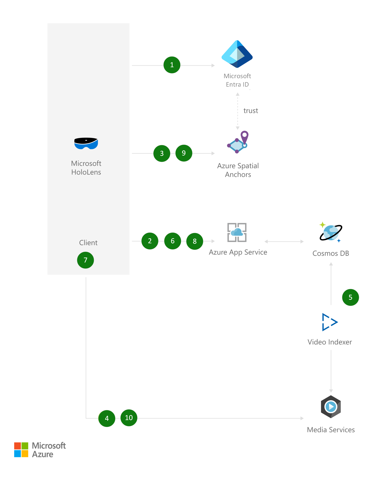

# Training and procedural guidance powered by mixed reality

[!INCLUDE [header_file](../header.md)]

Enable your team and employees to learn new processes and materials faster, with fewer errors, and greater confidence by providing persistent holographic instructions mapped to precise locations in their physical workspace. Jumpstart employee comprehension with head-up, hands-free experiences using HoloLens devices. And with Azure Spatial Anchors, you can place directions on the procedure's most important objects and return to this content over time.

## Architecture

*Download an [SVG](../media/training-and-procedural-guidance-powered-by-mixed-reality.svg) of this architecture.*

## Data Flow

1. The user creating the training session authenticates using their Azure Active Directory credentials from HoloLens.
1. The client application connects to its own web service to create a training session. Metadata about that training session is stored in Azure Cosmos DB.
1. The user scans the environment and places a first anchor where the first step of the procedure needs to happen. Azure Spatial Anchors validates that the user has sufficient permissions to create anchors via Azure AD, and then stores the anchor.
1. The user records a video of the procedure on HoloLens and uploads it to Azure
1. The video is encoded with Media Services and prepared for on-demand viewing, as well as processed with Video Indexer for better content search. Video Indexer stores the metadata on Azure Cosmos DB.
1. The app saves against its web service the anchor ID for that first step, alongside a link to the video.
1. The user, in the same session, then moves on to step 2, places an anchor there, and again records a video of the procedure and saves the resulting anchor ID and video link to its web service. That process is then repeated until all steps in the procedure are executed. As the user moves from step to step, previous anchors are still visible with their respective step number.
1. A trainee comes in, selects the training session, retrieves anchor IDs and links to videos that are part of the procedure.
1. The trainee scans the room to find the anchors indicating the real-world location of each step in the procedure. As soon as one is found, all anchors are retrieved and shown in the app.
1. The trainee can then retrace the exact steps of the expert who recorded the procedure, and view holographic videos of each step at the right location in the lab.

## Components

* [Spatial Anchors](https://azure.microsoft.com/services/spatial-anchors): Create multi-user, spatially aware mixed reality experiences
* [Azure Active Directory](https://azure.microsoft.com/services/active-directory): Synchronize on-premises directories and enable single sign-on
* [Azure Cosmos DB](https://azure.microsoft.com/services/cosmos-db): Globally distributed, multi-model database for any scale
* [App Service](https://azure.microsoft.com/services/app-service): Quickly create powerful cloud apps for web and mobile
* [Media Services](https://azure.microsoft.com/services/media-services): Encode, store, and stream video and audio at scale
* [Video Indexer](https://azure.microsoft.com/services/media-services/video-indexer): Make your media more discoverable and accessible

## Next steps

* [Share Spatial Anchors across devices](https://docs.microsoft.com/azure/spatial-anchors/tutorials/tutorial-share-anchors-across-devices)
* [Create a new tenant in Azure Active Directory](https://docs.microsoft.com/azure/active-directory/fundamentals/active-directory-access-create-new-tenant)
* [Build a .NET web app with Azure Cosmos DB using the SQL API and the Azure portal](https://docs.microsoft.com/azure/cosmos-db)
* [Authenticate and authorize users end-to-end in Azure App Service](https://docs.microsoft.com/azure/app-service/app-service-web-tutorial-auth-aad)
* [Upload, encode, and stream videos using .NET](https://docs.microsoft.com/azure/media-services/latest/stream-files-tutorial-with-api)
* [What is Video Indexer?](https://docs.microsoft.com/azure/media-services/latest/stream-files-tutorial-with-api)
