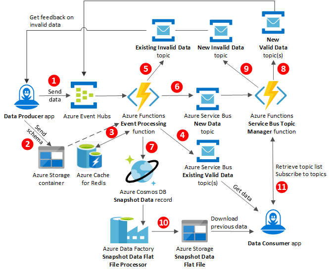

[!INCLUDE [header_file](../../../includes/sol-idea-header.md)]

This article describes an elastic, flexible [publish-subscribe model](../../patterns/publisher-subscriber.yml) for data producers and consumers to create and consume validated, curated content or data.

## Architecture

*Download a [Visio file](https://arch-center.azureedge.net/transit-hub.vsdx) of this architecture.*

### Dataflow

1. The **Data Producer** app publishes data to Azure Event Hubs, which sends the data to the Azure Functions **Event Processing** function.
1. The **Data Producer** also sends the JSON schema for storage in an Azure Storage container.
1. The **Event Processing** function retrieves the JSON schema from Azure Cache for Redis to reduce latency, and uses the schema to validate the data.

   If the schema isn't cached yet, the **Event Processing** function retrieves the schema from the Azure Storage container. The request for the schema also stores the schema in Azure Cache for Redis for future retrieval.

   > [!NOTE]
   > Azure Schema Registry in Event Hubs can be a viable alternative to storing and caching JSON schemas. For more information, see [Azure Schema Registry in Event Hubs (Preview)](/azure/event-hubs/schema-registry-overview).

1. If a topic already exists and the data is valid, the **Event Processing** function merges the data into the existing **Valid Data** Azure Service Bus topic, and sends the topic to the **Data Consumer** app.

1. If a topic already exists and the data is invalid, the **Event Processing** function merges the data into the existing **Invalid Data** Service Bus topic, and sends the topic back to the data producer. The data producer subscribes to the **Invalid Data** topics to get feedback about invalid data that the producer created.

1. If a topic doesn't exist yet, the **Event Processing** function publishes the new data to a **New Data** Service Bus topic, and sends the topic to the **Service Bus Topic Manager** function.

1. If the new data is valid, the **Event Processing** function also inserts the data as a new **Snapshot Data** record in Azure Cosmos DB.

1. If the new data is valid, the **Service Bus Topic Manager** function creates a new **Valid Data** Service Bus topic, and sends the topic to Event Hubs.

1. If the new data is invalid, the **Service Bus Topic Manager** function creates a new **Invalid Data** Service Bus topic, and sends the topic back to the **Data Producer** app.

1. The **Snapshot Data Flat File Processor** in Azure Data Factory runs on a schedule to extract all snapshot data from the **Snapshot Data** Azure Cosmos DB database. The processor creates a flat file and publishes it to a **Snapshot Data Flat File** in Azure Storage for downloads.

1. The **Data Consumer** app retrieves a list of all the Service Bus topics that the **Service Bus Topic Manager** has available for subscription. The app registers with the **Service Bus Topic Manager** to subscribe to Service Bus topics.

### Components

- [Azure Event Hubs](https://azure.microsoft.com/services/event-hubs)
- [Azure Service Bus](https://azure.microsoft.com/services/service-bus)
- [Azure Functions](https://azure.microsoft.com/services/functions)
- [Azure Data Factory](https://azure.microsoft.com/services/data-factory)
- [Azure Cosmos DB](https://azure.microsoft.com/services/cosmos-db)
- [Azure Blob Storage](https://azure.microsoft.com/services/storage/blobs)
- [Azure Cache for Redis](https://azure.microsoft.com/services/cache)

## Scenario details

The Transit Hub is a dynamic [publish-subscribe model](../../patterns/publisher-subscriber.yml) for data producers and data consumers to create and consume validated, curated content or data. The model is elastic to allow for scale and performance. Data producers can quickly onboard and upload data to a service. The service validates the data against a schema that the data producer provides. The service then makes the validated data available for subscribers to consume data they're interested in.

The service validating the data doesn't need to know about the payload, only whether it's valid against the schema that the producer provides. This flexibility means the service can accept new payload types without having to be redeployed. This solution also lets data consumers get historical data that was published before the consumer subscribed.

### Potential use cases

This model is especially useful in the following scenarios:

- Messaging systems where user volume and status are unknown or vary unpredictably
- Publishing systems that potentially need to support new or unknown data sources
- Commerce or ticketing systems that need to continually update data and cache it for fast delivery

## Contributors

*This article is maintained by Microsoft. It was originally written by the following contributors.*

Principal author:

 * [Rick Weyenberg](https://www.linkedin.com/in/rickweyenberg) | Principal Cloud Solution Architect

*To see non-public LinkedIn profiles, sign in to LinkedIn.*

## Next steps

- [Azure Web PubSub service documentation](/azure/azure-web-pubsub)
- [Service Bus queues, topics, and subscriptions](/azure/service-bus-messaging/service-bus-queues-topics-subscriptions#topics-and-subscriptions)
- [Tutorial: Create a serverless notification app with Azure Functions and Azure Web PubSub service](/azure/azure-web-pubsub/tutorial-serverless-notification)

## Related resources

- [Publisher-Subscriber pattern](../../patterns/publisher-subscriber.yml)
- [Asynchronous messaging options in Azure](../../guide/technology-choices/messaging.yml)
