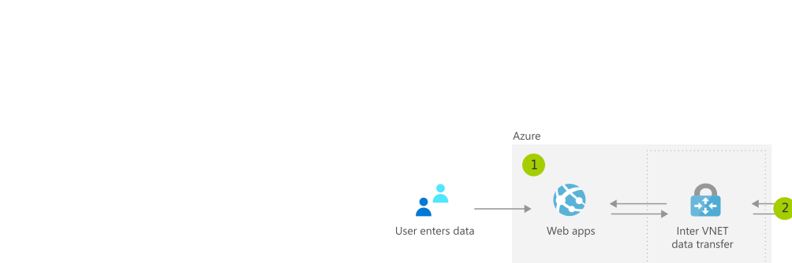

[!INCLUDE [header_file](../../../includes/sol-idea-header.md)]

Create cloud-based applications by using Azure Stack while integrating and preserving mainframe and core business process application data.

## Architecture

*Download a [Visio file](https://arch-center.azureedge.net/unlock-legacy-data.vsdx) of this architecture.*

### Dataflow

1. User enters data into Azure-based web app.
1. Application commits data to database over virtual network-to-virtual network VPN connection to Azure Stack.
1. Data is processed by applications running on a Kubernetes cluster on Azure Stack.
1. Kubernetes cluster communicates with legacy system on corporate network.

### Components

* [Virtual Network](https://azure.microsoft.com/services/virtual-network): Provision private networks, and optionally connect to on-premises datacenters.
* [VPN Gateway](https://azure.microsoft.com/services/vpn-gateway): Establish secure, cross-premises connectivity.

## Scenario details

Use Azure Stack to update and extend your legacy application data with the latest cloud technology, such as Azure web services, containers, serverless computing, and microservices architectures.

### Potential use cases

This is a solution to create new applications while integrating and preserving legacy data in mainframe and core business process applications.

## Next steps

* [Virtual Network documentation](/azure/virtual-network/virtual-networks-overview)
* [VPN Gateway documentation](/azure/vpn-gateway/vpn-gateway-about-vpngateways)

## Related resources

* [Baseline architecture for AKS on Azure Stack HCI](../../example-scenario/hybrid/aks-baseline.yml)
* [Cross-cloud scaling with Azure Functions](../../solution-ideas/articles/cross-cloud-scaling.yml)
* [Hybrid connections](../../solution-ideas/articles/hybrid-connectivity.yml)
