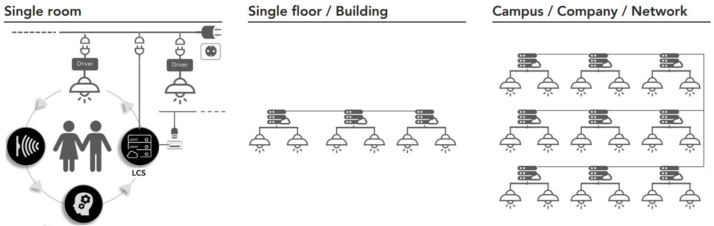

[!INCLUDE [header_file](../../../includes/sol-idea-header.md)]

Smart, connected Internet of Things (IoT) devices can make life healthier and safer. For example, research increasingly confirms the importance of high-quality light and natural light cycles for promoting human alertness, health, well-being, and productivity. BrainLit's patented BioCentric Lighting™ (BCL) system is a dynamic, self-learning, IoT-based system that creates high-quality natural lighting for indoor environments.

The BCL system can also deliver radiant energy in the non-visible ultraviolet (UV) spectrum to kill viruses. All UV radiation has antimicrobial capabilities. The shortest wavelength, 200-300 nm UVC radiation, causes DNA inactivation and prevents viral replication. UVC radiation disinfection is an important weapon in the fight against COVID. BrainLit's new UVEN concept combines BCL light control with UVC disinfection to promote health and well-being and help kill viruses.

Other UVC virus-killing technology that uses plug-in devices, robots, drones, and wands can't provide overall space coverage or performance and effectiveness data. To operate these devices safely and efficiently disrupts business and personnel, resulting in loss of productivity and lower space utilization. UVEN disinfection operates in unoccupied spaces during non-use times, providing safe, comprehensive, autonomous microbe deactivation without business disruption.

Because IoT devices work directly on the physical environment and may use and collect sensitive data, device safety and security are paramount. UVEN double fail-safe features ensure occupants receive beneficial light only. The [Azure Sphere](https://azure.microsoft.com/services/azure-sphere/) standalone microprocessor unit (MCU)-based platform securely runs IoT apps and connects directly to the cloud for complete Azure-based security and the latest OS and app updates.

The system can continually integrate new research developments and public health updates via its cloud connection, ensuring an up-to-date and scientifically based lighting and disinfection system.

UVEN combined BCL and UVC technology offers:
- A smart, safe, and secure integrated system solution for lighting and disinfection, with optimal usage of floor areas.
- Long-term solutions that can adapt lighting and disinfection doses and recipes to changing circumstances.
- Overall better health and improved immune systems for occupants through optimized lighting and a virus-free environment.

## Potential use cases

This solution is ideal for the healthcare and facilities industries. We recommend using the solution in the following scenarios:

- UVEN cells can fit any layout of a specific area, like a reception counter, or split between several areas, like a number of washrooms.
- The modular system can scale to fit any space, from individual rooms and homes to large campuses and public areas.
- Azure Sphere-based infrastructure can easily integrate with existing IoT devices or building management systems.

## Architecture

### Workflow

- The system uses radar proximity sensors to detect when people are present. Whenever a space is unoccupied, the panels emit UV radiation to heavily reduce or eliminate viruses and bacteria.
- One UVEN lighting control system (LCS) can control both BCL light and UVC radiation emissions for up to 20 luminaires. The LCS connects to radar sensors, electrical power, and to the internet or other LCSs for updates and real-time calibration.
- Several cells can connect in a cluster. Only one of the clustered LCSs needs to connect to the internet. An LCS or cluster can operate standalone, or in an overall UVEN BCL network system with other clusters.
- A UVEN BCL Net is completely decentralized and offers unlimited scalability, control, and flexibility.

### Components

The UVEN system consists of light-emitting diode (LED) luminaires that are controlled by Azure Sphere-powered lighting control systems.

#### UVEN components

The basic UVEN ceiling panel consists of dynamic, adaptable LEDs that integrate BCL with disinfection in the same luminaire. As well as offering a large range of visible and UV emissions, the LEDs provide exceptional color and detail rendering, and the ability to dim smoothly down to 0.1%. LEDs are low-cost, long-lasting, and environmentally sustainable compared to traditional incandescent and fluorescent indoor light sources.

When people are present, the ceiling panels emit BCL light only. In unoccupied spaces, the panels emit UV radiation to heavily reduce or eliminate viruses and bacteria. Separate drivers optimized to operate in their respective regimes maintain full BCL and UV functionality simultaneously.

Radar motion sensors, alarms, and manual overrides provide double fail-safe insurance so users receive beneficial light only. Flexible, scalable, updatable LCSs based on Azure Sphere technology control luminaires, sensors, and safety and alarm mechanisms.

UV radiation can damage surfaces and equipment. UVEN advanced sensors and controllers ensure that the luminaires generate the minimum doses of UVC radiation to ensure disinfection. The system can continually integrate new research developments and public health guidelines via its cloud connection, providing the best scientifically based lighting and disinfection.

UVEN administrative support tools include an admin panel to maintain information about users and devices, and a dashboard to provide an overall view of user activity and exposure.

#### Azure Sphere

[Azure Sphere](https://azure.microsoft.com/services/azure-sphere) is a secure application platform for IoT connected devices with built-in cloud communication and security. The platform consists of an Azure Sphere-certified secured MCU chip that runs a custom high-level Linux-based microcontroller operating system (OS). The Azure Sphere OS provides a platform for IoT application development, including both high-level and real-time capable applications. The OS connects to the cloud-based Azure Sphere Security Service (AS3) for continuous, renewable security.

AS3 establishes a secure connection between a device and the internet or cloud, ensures secure boot, and enables maintenance, updates, and control for Azure Sphere-certified chips. AS3 authenticates device identity, ensures the integrity and trust of the system software, and certifies that the device is running a trusted code base. The service also provides a secure channel to automatically download and install OS and customer application updates to deployed devices.

The MediaTek 3620 is the first Azure Sphere-certified chip. The chip includes an ARM Cortex-A7 500-MHz processor, two ARM Cortex-M4F 200-MHz I/O subsystems, Wi-Fi capability, and the Microsoft Pluton security subsystem with a dedicated ARM Cortex-M4F core. The Linux-based Azure Sphere OS lets developers write applications that can run on either the A7 core with access to external communications, or as real-time capable apps on one of the M4 processors. Developers can distribute applications to Azure Sphere devices through the same secure mechanism as the Azure Sphere OS updates.

Azure Sphere *greenfield* implementations involve designing and building new IoT devices with Azure Sphere-certified chips. *Brownfield* implementation allows existing IoT devices to securely connect to the internet through an Azure Sphere Guardian module. The guardian module contains an Azure Sphere certified chip, the Azure Sphere OS, and AS3. The module connects to the IoT device through an existing peripheral, and then securely connects to the internet. The IoT device itself isn't exposed to the internet.

## Next steps

- For more information, please contact [iotcovidsupport@microsoft.com](mailto:iotcovidsupport@microsoft.com).
- For more information about the BCL system, see the [BrainLit](https://www.brainlit.com/) website.
- For more information about Azure Sphere, see the [Azure Sphere documentation](/azure-sphere).
- For Azure Sphere code samples, see [Azure Sphere Samples](https://github.com/Azure/azure-sphere-samples).

## Related resources

- [Azure IoT reference architecture](../../reference-architectures/iot.yml)
- [Cognizant Safe Buildings with IoT and Azure](safe-buildings.yml)
- [COVID-19 safe environments with IoT Edge monitoring and alerting](cctv-iot-edge-for-covid-19-safe-environment-and-mask-detection.yml)
- [Create smart places by using Azure Digital Twins](../../example-scenario/iot/smart-places.yml)

