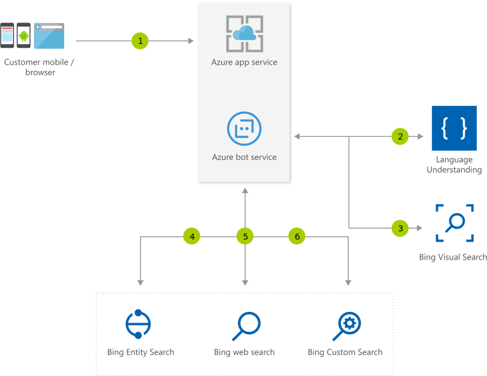

[!INCLUDE [header_file](../../../includes/sol-idea-header.md)]

This solution presents a visual assistant that provides rich information that's based on the content of an image.

## Architecture

*Download a [Visio file](https://arch-center.azureedge.net/visual-assistant.vsdx) of this architecture.*

### Dataflow

1. Users interact with a bot through a mobile app or a web app.
1. The bot uses Language Understanding Intelligence Service (LUIS), which is built into the application, to identify the user intent and conversational context.
1. The bot passes visual context, such as an image, to the Bing Visual Search API.
1. The bot retrieves information from the Bing Entity Search API about people, places, artwork, monuments, and objects that are related to the image.
1. The bot retrieves information from barcodes.
1. Optionally, the bot gets more information about barcodes or queries that's limited to the user's domain by using the Bing Custom Search API.
1. The visual assistant presents the user with the information about related products, destinations, celebrities, places, monuments, and artwork.

### Components

- [Azure App Service](https://azure.microsoft.com/services/app-service) is a fully managed HTTP-based service for hosting web apps, REST APIs, and mobile backends.
- [Azure Bot Service](https://azure.microsoft.com/services/bot-services) offers an environment for developing intelligent, enterprise-grade bots that enrich customer experiences. The integrated environment also provides a way to maintain control of your data.
- The [Bing Custom Search API](https://www.microsoft.com/bing/apis/bing-custom-search-api) provides a way to create customized search experiences with Bing's powerful ranking and global-scale search index.
- The [Bing Entity Search API](https://www.microsoft.com/bing/apis/bing-entity-search-api) offers search capabilities that identify relevant entities, such as well-known people, places, movies, TV shows, video games, books, and businesses.
- The [Bing Visual Search API](https://www.microsoft.com/bing/apis/bing-visual-search-api) returns data that's related to a given image, such as similar images, shopping sources for purchasing the item in the image, and webpages that include the image.
- The [Bing Web Search API](https://www.microsoft.com/bing/apis/bing-web-search-api) provides search results after you issue a single API call. The results compile relevant information from billions of webpages, images, videos, and news.
- [Azure Cognitive Service for Language](https://azure.microsoft.com/services/cognitive-services/language-service) is part of [Azure Cognitive Services](https://azure.microsoft.com/services/cognitive-services) that offers many natural language processing services.
- [Conversational language understanding](https://azure.microsoft.com/services/cognitive-services/language-understanding-intelligent-service) is a feature of Cognitive Service for Language. This cloud-based API service offers machine-learning intelligence capabilities for building conversational apps. You can use LUIS to predict the meaning of a conversation and pull out relevant, detailed information.

## Scenario details

This solution presents a visual assistant that provides rich information that's based on the content of an image. The assistant's capabilities include reading business cards, deciphering barcodes, and recognizing well-known people, places, objects, artwork, and monuments.

### Potential use cases

Organizations can use this solution to provide:

- Appointment scheduling.
- Order and delivery tracking in manufacturing, automotive, and transportation applications.
- Barcode purchases in retail.
- Payment processing in finance and retail.
- Subscription renewals in retail.
- The identification of well-known people, places, objects, art, and monuments, in the education, media, and entertainment industries.

## Next steps

- To design an app that detects context that matters to you, see [Quickstart: Create an object detection project with the Custom Vision client library](/azure/cognitive-services/custom-vision-service/quickstarts/object-detection).
- To explore the search capabilities that Bing provides, see [Bing family of search APIs](/bing/search-apis/bing-web-search/bing-api-comparison).
- To build LUIS into your bot, see [Add natural language understanding to your bot](/azure/bot-service/bot-builder-howto-v4-luis).
- To explore a Learn module about how LUIS works, see [Create a language model with Conversational Language Understanding](/training/modules/create-language-model-with-language-understanding).
- To learn how to build with Bot Service, see [Build a bot with the Language Service and Azure Bot Service](/training/modules/build-faq-chatbot-qna-maker-azure-bot-service).
- To create a bot that incorporates QnA Maker and Bot Service, see [Create conversational AI solutions](/training/paths/create-bots-with-the-azure-bot-service).
- To solidify your understanding of LUIS, Bot Service, and the Bing Visual Search API, see [Exam AI-900: Microsoft Azure AI Fundamentals](/certifications/exams/ai-900).
- To certify your knowledge about Cognitive Services, see [Microsoft Certified: Azure AI Engineer Associate](/certifications/azure-ai-engineer).
- To learn more about the components in this solution, see these resources:

  - [App Service overview](/azure/app-service/overview)
  - [Azure Bot Service documentation](/azure/bot-service)
  - [What is Bing Custom Search?](/bing/search-apis/bing-custom-search/overview)
  - [What is Bing Entity Search API?](/bing/search-apis/bing-entity-search/overview)
  - [What is the Bing Visual Search API?](/bing/search-apis/bing-visual-search/overview)
  - [What is the Bing Web Search API?](/bing/search-apis/bing-web-search/overview)
  - [What is Language Understanding (LUIS)?](/azure/cognitive-services/luis/what-is-luis)

## Related resources

- [Artificial intelligence (AI) - Architectural overview](../../data-guide/big-data/ai-overview.md)
- [Image classification on Azure](../../example-scenario/ai/intelligent-apps-image-processing.yml)
- [Interactive voice response application with bot](./interactive-voice-response-bot.yml)
- [Retail assistant with visual capabilities](./retail-assistant-or-vacation-planner-with-visual-capabilities.yml)
