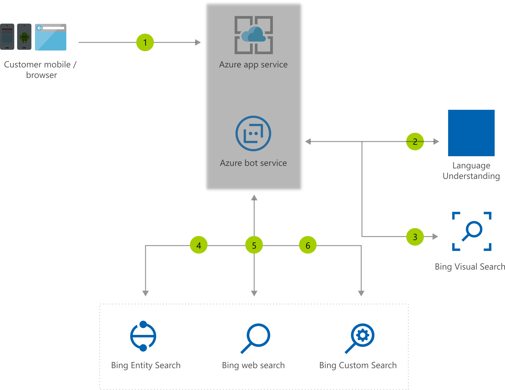

[!INCLUDE [header_file](../../../includes/sol-idea-header.md)]

Visual assistant provides rich information based on content of the image with capabilities such as reading business card, identifying barcode, and recognizing popular people, places, objects, artworks, and monuments.

## Architecture

*Download an [SVG](../media/visual-assistant.svg) of this architecture.*

### Dataflow

1. Users interact with Bot through mobile app or web app.
1. Bot understands user intent and conversational context by using LUIS, which is built into the application.
1. Bot passes visual context (that is, image) to the Bing Visual Search API.
1. Bot gets additional information from Bing Entity Search for rich context on people, place, artwork, monument, and objects.
1. Bot gets additional information for barcodes.
1. Optionally, Bot gets more information on barcodes/queries exclusively from your domain through the Bing Custom Search API.
1. Visual Assistant renders similar products/destinations from your domain or provides more information around celebrity/place/monuments/artworks.

### Components

* [Azure App Service](/azure/app-service/): A fully managed HTTP-based service for hosting web apps, REST APIs, and mobile backends
* [Azure Bot Service](/azure/bot-service/): Develop intelligent, enterprise-grade bots that enrich your customer experience, all while maintaining control of your data
* [Bing Custom Search](/bing/search-apis/bing-custom-search/overview): Build customized search that fits your business needs with Bing's powerful ranking and global-scale search index
* [Bing Entity Search](/bing/search-apis/bing-entity-search/overview): Infuse a deep knowledge search into your existing content by identifying the most relevant
* [Bing Visual Search](/bing/search-apis/bing-visual-search/overview): Find visual insights from your images
* [Bing Web Search](/bing/search-apis/bing-web-search/overview): Bring intelligent search to your apps and harness the ability to comb through billions of webpages, images, videos, and news, all with a single API call
* [Language Understanding Intelligence Service (LUIS)](/azure/cognitive-services/luis/what-is-luis): Build natural language into apps, bots, and IoT devices

## Next steps

* Let your app detect context that matters to you by training your own [Custom Vision model](/azure/cognitive-services/custom-vision-service/quickstarts/object-detection)
* Explore the [Bing family of search APIs](/bing/search-apis/bing-web-search/bing-api-comparison)
* [Build in LUIS into your Bot](/azure/bot-service/bot-builder-howto-v4-luis)
* Explore how LUIS works in this [Learn Module](/learn/modules/create-language-model-with-language-understanding/)
* Learn how to build with [Azure Bot Service](/learn/modules/build-faq-chatbot-qna-maker-azure-bot-service/)
* Create a Bot that incorporates [both QnA Maker and Azure Bot Service](/learn/paths/create-bots-with-the-azure-bot-service/)
* Solidify your understanding of LUIS, Azure Bot Service, and Bing Visual Search with [Microsoft Certified: AI Fundamentals](/learn/certifications/exams/ai-900)
* Use your knowledge in Azure Cognitive Services and [become a Microsoft Certified: Azure AI Engineer Associate](/learn/certifications/azure-ai-engineer/)

## Related resources

* [Artificial intelligence (AI) - Architectural overview](../../data-guide/big-data/ai-overview.md)
* [Image classification on Azure](../../example-scenario/ai/intelligent-apps-image-processing.yml)
* [Interactive voice response application with bot](./interactive-voice-response-bot.yml)
* [Retail Assistant with Visual Capabilities](./retail-assistant-or-vacation-planner-with-visual-capabilities.yml)
