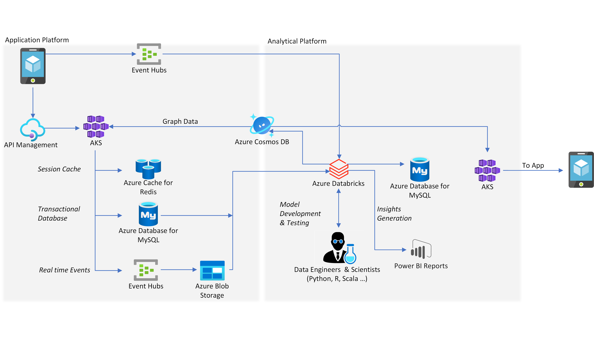

[!INCLUDE [header_file](../../../includes/sol-idea-header.md)]

With Azure, it's easy to build web and mobile applications to help with digital payments, hotel or rental car bookings, e-commerce platforms and more.

## Potential use cases

A microservices-based architecture enables organizations to seamlessly scale on demand, to cater to internet-scale users.

## Architecture

### Dataflow

This reference architecture is inspired by HSBC's digital payment platform, PayMe for Business. Each microservice is fully contained and connects to its own database hosted on a PaaS instance. The architecture uses polyglot persistence with a purpose-built data store for each microservice. The analytical platform pulls the data from the disparate data stores to form a unified data platform, which can be used to serve analytical reports, historical reports for end users and train the ML models for recommendation engine.

This architecture applies a microservices design with Java-based application pods deployed on Azure Kubernetes Services (AKS) and a transactional database hosted on Azure Database for MySQL. Azure Database for MySQL with read replicas is used to scale out the solution. Reader application microservices connect directly to read replicas to avoid writer/reader contention. Azure Cache for Redis serves as a fast caching layer, which stores session state information and acts as a key-value store. Graphical data serving the recommendation engine is stored in Azure Cosmos DB for Apache Gremlin.

The data from Azure Database for MySQL read replicas along with Azure Cosmos DB and real-time events are processed using Azure Databricks and stored in the analytics platform. The analytics platform is used to serve business intelligence reports via Power BI, train recommendation engine machine learning (ML) models and serve historical reports back to the customers exposed through the microservices API.

### Components

- [Azure Database for MySQL](/azure/mysql/overview) is a fully managed relational database service based on the community edition of the open-source MySQL database engine.
- [Azure Cosmos DB](/azure/cosmos-db) is a fully managed NoSQL database service for building and modernizing scalable, high-performance applications.
- [Azure Cache for Redis](/azure/azure-cache-for-redis) is a secure data cache and messaging broker that provides high throughput and low-latency access to data for applications.
- [Azure Kubernetes Service](/azure/aks) is a highly available, secure, and fully managed Kubernetes service that makes it easy to deploy and manage containerized applications.
- [Event Hubs](/azure/event-hubs) is a fully managed, real-time data ingestion service. Stream millions of events per second from any source to build dynamic data pipelines.
- [Azure Databricks](/azure/azure-databricks) is an Apache Spark-based analytics service for big data analytics and AI
- [Power BI](/power-bi/fundamentals/power-bi-overview) is a suite of business tools for self-service and enterprise business intelligence (BI). Here, it's used to analyze and visualize data.

## Next Steps

- Learn how [HSBC built their digital payment platform](https://www.youtube.com/watch?v=KEYqG0IcUy8&feature=youtu.be) using Azure Database for MySQL and Azure Cosmos DB. (Video)
- Learn how to [migrate MySQL workloads](/training/paths/migrate-open-source-workloads) from on-premises to Azure.
