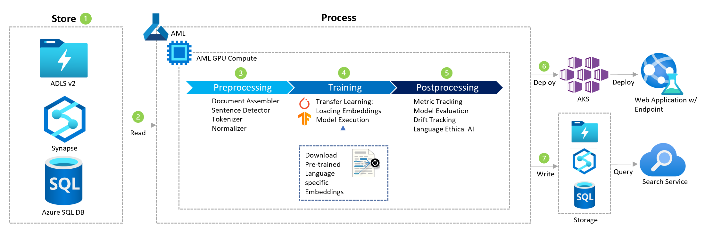

[!INCLUDE [header_file](../../../includes/sol-idea-header.md)]

This article describes how you can use Microsoft AI to improve website content tagging accuracy by combining deep learning and natural language processing (NLP) with data on site-specific search terms.

## Architecture

*Download a [Visio file](https://arch-center.azureedge.net/website-content-tag-suggestion-with-deep-learning-and-nlp.vsdx) of this architecture.*

### Dataflow

1. Data is stored in various formats, depending on its original source. Data can be stored as files within Azure Data Lake Storage or in tabular form in Azure Synapse or Azure SQL Database.

1. Azure Machine Learning (ML) can connect and read from such sources, to ingest the data into the NLP pipeline for pre-processing, model training, and post-processing.

1. NLP pre-processing includes several steps to consume data, with the purpose of text generalization. Once the text is broken up into sentences, NLP techniques, such as lemmatization or stemming, allow the language to be tokenized in a general form.

1. As NLP models are already available pre-trained, the transfer learning approach recommends that you download language-specific embeddings and use an industry standard model, for multi-class text classification, such as variations of [BERT](https://arxiv.org/abs/1810.04805).

1. NLP post-processing recommends storing the model in a model register in Azure ML, to track model metrics. Furthermore, text can be post-processed with specific business rules that are deterministically defined, based on the business goals. Microsoft recommends using ethical AI tools to detect biased language, which ensures the fair training of a language model.

1. The model can be deployed through Azure Kubernetes Service, while running a Kubernetes-managed cluster where the containers are deployed from images that are stored in Azure Container Registry. Endpoints can be made available to a front-end application. The model can be deployed through Azure Kubernetes Service as real-time endpoints.

1. Model results can be written to a storage option in file or tabular format, then properly indexed by Azure Cognitive Search. The model would run as batch inference and store the results in the respective datastore.

### Components

* [Data Lake Storage for Big Data Analytics](https://azure.microsoft.com/services/storage/data-lake-storage)
* [Azure Machine Learning](https://azure.microsoft.com/services/machine-learning)
* [Azure Cognitive Search](https://azure.microsoft.com/services/search)
* [Azure Container Registry](/azure/container-registry)
* [Azure Kubernetes Service (AKS)](https://azure.microsoft.com/services/kubernetes-service)

## Scenario details

Social sites, forums, and other text-heavy Q&A services rely heavily on content tagging, which enables good indexing and user search. Often, however, content tagging is left to users' discretion. Because users don't have lists of commonly searched terms or a deep understanding of the site structure, they frequently mislabel content. Mislabeled content is difficult or impossible to find when it's needed later.

### Potential use cases

By using natural language processing (NLP) with deep learning for content tagging, you enable a scalable solution to create tags across content. As users search for content by keywords, this multi-class classification process enriches untagged content with labels that will allow you to search on substantial portions of text, which improves the information retrieval processes. New incoming content will be appropriately tagged by running NLP inference.

## Contributors

*This article is maintained by Microsoft. It was originally written by the following contributors.*

Principal author:

* [Louis Li](https://www.linkedin.com/in/louisli) | Senior Customer Engineer

## Next steps

See the product documentation:

* [Azure Data Lake Storage Gen2 Introduction](/azure/storage/blobs/data-lake-storage-introduction)
* [Azure Machine Learning](/azure/machine-learning)
* [Azure Cognitive Search documentation](/azure/search)
* [Learn more about Azure Container Registry](/azure/container-registry/container-registry-intro)
* [Azure Kubernetes Service](/azure/aks/intro-kubernetes)

Try these Microsoft Learn modules:

* [Introduction to Natural Language Processing with PyTorch](/training/modules/intro-natural-language-processing-pytorch)
* [Train and evaluate deep learning models](/training/modules/train-evaluate-deep-learn-models)
* [Implement knowledge mining with Azure Cognitive Search](/training/paths/implement-knowledge-mining-azure-cognitive-search)

## Related resources

See the following related architectural articles:

* [Natural language processing technology](/azure/architecture/data-guide/technology-choices/natural-language-processing)
* [Build a delta lake to support ad hoc queries in online leisure and travel booking](/azure/architecture/solution-ideas/articles/build-data-lake-support-adhoc-queries-online)
* [Query a data lake or lakehouse by using Azure Synapse serverless](/azure/architecture/example-scenario/data/synapse-exploratory-data-analytics)
* [Machine learning operations (MLOps) framework to upscale machine learning lifecycle with Azure Machine Learning](/azure/architecture/example-scenario/mlops/mlops-technical-paper)
* [High-performance computing for manufacturing](/azure/architecture/industries/manufacturing/compute-manufacturing-overview)
* [Introduction to predictive maintenance in manufacturing](/azure/architecture/industries/manufacturing/predictive-maintenance-overview)
* [Predictive maintenance solution](/azure/architecture/industries/manufacturing/predictive-maintenance-solution)
