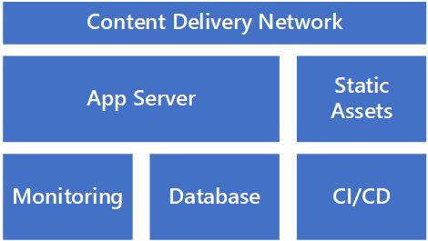
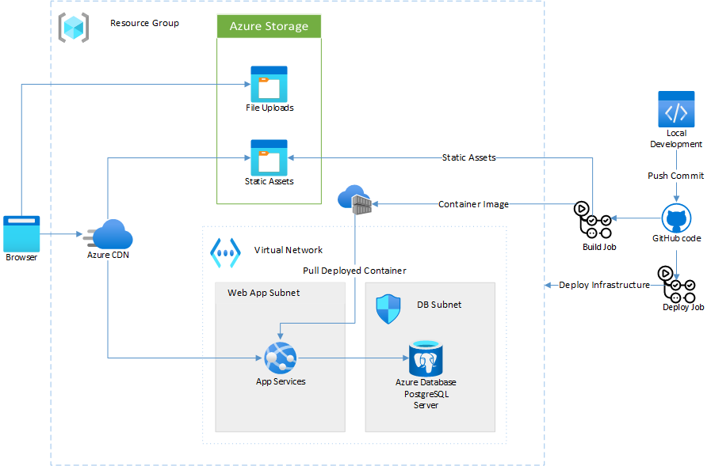

# The Basic Startup Stack

## Approach

It's tempting to take all the lessons learned in previous roles and apply it to a startup’s first stack. However, many lessons learned in larger companies may not be directly applicable to a startup. A Service-Oriented Architecture or microservices might be right for a business that in the expand or extract phase of product development. It's rarely the right choice for a startup that has not found product market fit (commercial traction), and almost definitely not right for the first iteration of a product. The complexity brought by such architectures can often lead to reductions in both speed and optionality.

Our recommendation for a first startup stack is simple. Many technologists might even describe it as boring. Believe it or not, that’s a good thing. If your infrastructure is boring, then that means you’ve spent enough time on it to have it get out of your way.

An _"interesting"_ stack can be problematic in two ways: as the cause of bugs and requiring constant attention, or so sophisticated it sucks energy from building your actual product. Bugs aren't always because of complexity but having a complex stack makes it easier to ship bugs. Similarly, a sophisticated architecture isn't always a waste of energy but if you haven't found product market fit, it probably is.

Below is a simple diagram of the Basic Startup Stack – a recommended set of components that provide _just enough_ to get your product off the ground and into the hands of your customers. For 80% of startups, this stack will be all you need to test the basic hypotheses built into your product. For some (e.g those doing machine learning, working with IoT, or working in highly regulated environments), other components may be required.

## Components

### App Server

To start with, your code needs to run somewhere. Ideally this platform should make deployments easy, while requiring the least amount of operational input as possible. The app server should scale horizontally, however some manual intervention for scaling is fine while you're still in the explore stage.

Like most of this stack, you want to forget about your app server. You want to know that it will essentially run itself. Traditionally the app server would have been a virtual machine, or even an instance of a web server running on a bare-metal server. Now we look to Platform as a Service (PaaS) options and containers as they remove the operational overhead.

### Database

Once you have your code running somewhere, you need to store your data somewhere. That’s where your database comes in. For most cases, we’d suggest a relational database like Azure SQL, PostgreSQL, or MariaDB. There are cases where a document/NoSQL database like MongoDB or CosmosDB is appropriate. Most of the time though, a relational database provides both the optionality of multiple ways of accessing it. You also gain the speed that comes from using a well-trodden path.

### Continuous Integration/Continuous Deployment (CI/CD)

One of the greatest impediments to speed when you’re iterating on a product can be a lack of repeatable and rapid deployments. A well-configured CI/CD pipeline means that the process of taking code and getting it deployed on your app server becomes a non-event. This quick and easy deployment means that you can see the results of your labor quickly. Frequent integration avoids divergent code-bases, which often lead to conflicts when you eventually merge.

### Monitoring

If something goes wrong with your app, you want to spend as little time as possible finding out what it was. The days of logging to a file on your app server to pore over logs should be over. Monitoring your application by aggregating logs and using application tracing from the start has many benefits. In all stages of development, you allow your team to focus on the problems themselves rather than getting the data to diagnose the problems.

### Static Assets

Serving static content from your app server is a waste of resources. Once you have a CI/CD pipeline configured the work to build and deploy static assets with each release is trivial. Most modern web frameworks are configured like this in production, so staying in-line with these best practices is worthwhile even as you're starting out.

### Content Delivery Network (CDN)

A content delivery network might seem like a premature optimization. With few customers to begin with, it may be for you. However given that adding a CDN once your product is in production can have unexpected side-effects, we suggest implementing one up front.

A CDN will cache static content closer to your customers and provide a façade behind which you can iterate on your APIs and the rest of your architecture.

## Example

An exciting startup, Contoso, is building a product that will revolutionize the way we think about widgets. Contoso's technical cofounder, Jane, has experience building micro-service driven applications for large enterprises. Contoso's application, while ambitious, doesn't yet need that architecture so they have opted for a more simple monolithic design.

Jane has built an early prototype using a Python backend, with a React frontend written in Typescript. They've been running demos on their laptop but with the first customer sales meetings looming, it's time to deploy the app.

Based on the Basic Startup Stack, and the technologies used by Contoso, Jane has decided on the following architecture:

### Technology Choices

| Component         | Service                                                           | Notes                                                                                                                                                                |
| ----------------- | ----------------------------------------------------------------- | -------------------------------------------------------------------------------------------------------------------------------------------------------------------- |
| **App Server**    | [Azure App Service](/azure/app-service/overview)                  | A simple way to deploy scalable applications without thinking about servers, load-balancers, or other infrastructure.                                                |
| **Database**      | [Azure Database for PostgreSQL](/azure/postgresql/overview)       | Database as a Service for one of the leading open-source RDBMS solutions. Think about developing your application rather than managing database servers.             |
| **Monitoring**    | [Azure Monitor](/azure/azure-monitor/overview)                    | Monitor and understand what is going on across all your application's infrastructure.                                                                                |
| **CI/CD**         | [GitHub Actions](/learn/paths/automate-workflow-github-actions/)  | Continuous integration and deployment built into your source code management – extensive support for different languages and strong integrations for Azure services. |
| **Static Assets** | [Azure Blob storage](/azure/storage/blobs/storage-blobs-overview) | A place to store static assets while moving load away from the application servers                                                                                   |
| **CDN**           | [Azure CDN](/azure/cdn/cdn-overview)                              | Accelerate the delivery of content to your users using a global network.                                                                                             |

These choices allow Jane to limit the time spent managing infrastructure while still providing ample ability to scale as their startup wins more customers.

### Sample Code

You can see a sample implementation of the Core Startup Stack [on GitHub](https://github.com/Azure-Samples/core-startup-stack-rails). This sample uses a Ruby on Rails app but the concepts and techniques are the same for most projects built using a Dockerfile.

## Next Steps

- See more [Azure Architectures](/azure/architecture/browse/)
