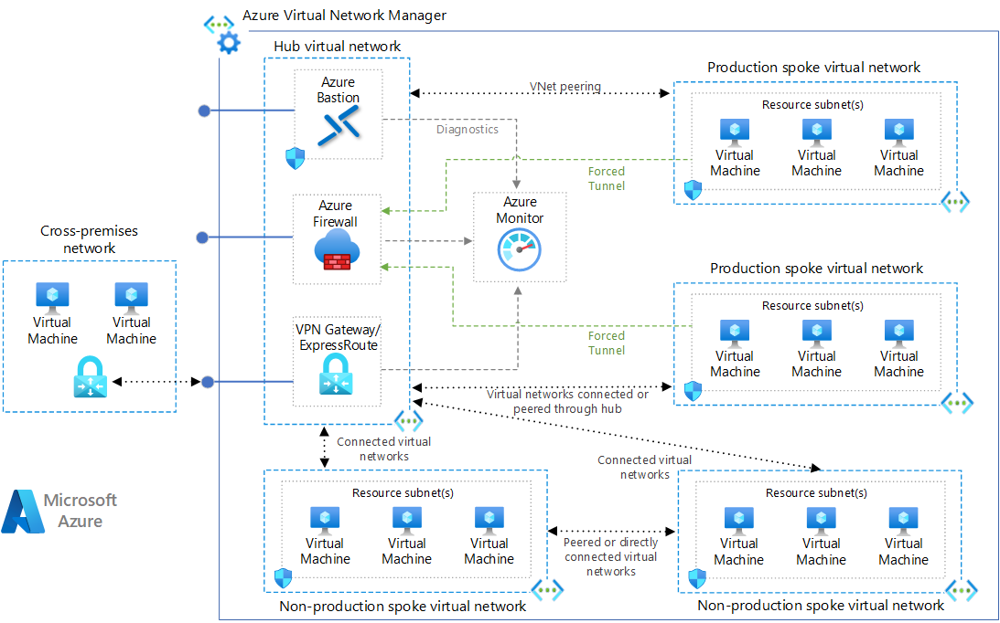

<!-- cSpell:ignore fullheight neuro milliman hymans netapp gluster tibco cyclecloud hpcpack radioss ansys axioma alces slurm mdcs cntk -->

# High-performance computing (HPC) on Azure

## Introduction to HPC

<!-- markdownlint-disable MD034 -->

> [!VIDEO https://www.youtube.com/embed/rKURT32faJk]

<!-- markdownlint-enable MD034 -->

High-performance computing (HPC), also called "big compute", uses a large number of CPU or GPU-based computers to solve complex mathematical tasks.

Many industries use HPC to solve some of their most difficult problems.  These include workloads such as:

- Genomics
- Oil and gas simulations
- Finance
- Semiconductor design
- Engineering
- Weather modeling

### How is HPC different on the cloud?

One of the primary differences between an on-premises HPC system and one in the cloud is the ability for resources to dynamically be added and removed as they're needed.  Dynamic scaling removes compute capacity as a bottleneck and instead allow customers to right size their infrastructure for the requirements of their jobs.

The following articles provide more detail about this dynamic scaling capability.

- [Big Compute Architecture Style](../guide/architecture-styles/big-compute.md)
- [Autoscaling best practices](../best-practices/auto-scaling.md)

## Implementation checklist

As you're looking to implement your own HPC solution on Azure, ensure you're reviewed the following topics:

> [!div class="checklist"]
>
> - Choose the appropriate [architecture](#infrastructure) based on your requirements
> - Know which [compute](#compute) options is right for your workload
> - Identify the right [storage](#storage) solution that meets your needs
> - Decide how you're going to [manage](#management) all your resources
> - Optimize your [application](#hpc-applications) for the cloud
> - [Secure](#security) your Infrastructure

## Infrastructure

There are many infrastructure components that are necessary to build an HPC system. Compute, storage, and networking provide the underlying components, no matter how you choose to manage your HPC workloads.

### Compute

Azure offers a range of sizes that are optimized for both CPU & GPU intensive workloads.

#### CPU-based virtual machines

- [Linux VMs](/azure/virtual-machines/linux/sizes-hpc)
- [Windows VMs](/azure/virtual-machines/windows/sizes-hpc)

#### GPU-enabled virtual machines

N-series VMs feature NVIDIA GPUs designed for compute-intensive or graphics-intensive applications including artificial intelligence (AI) learning and visualization.

- [Linux VMs](/azure/virtual-machines/linux/sizes-gpu)
- [Windows VMs](/azure/virtual-machines/windows/sizes-gpu)

### Storage

Large-scale Batch and HPC workloads have demands for data storage and access that exceed the capabilities of traditional cloud file systems. There are many solutions that manage both the speed and capacity needs of HPC applications on Azure:

- [Azure NetApp Files](/azure/azure-netapp-files/azure-netapp-files-introduction)
- [Storage Optimized Virtual Machines](/azure/virtual-machines/windows/sizes-storage)
- [Blob, table, and queue storage](/azure/storage/common/storage-introduction)
- [Azure SMB File storage](/azure/storage/files/storage-files-introduction)
- [Azure Managed Lustre](/azure/azure-managed-lustre/amlfs-overview)

For more information comparing Lustre, GlusterFS, and BeeGFS on Azure, review the [Parallel Files Systems on Azure](/archive/blogs/azurecat/azurecat-ebook-parallel-virtual-file-systems-on-microsoft-azure) e-book and the [Lustre on Azure](https://techcommunity.microsoft.com/t5/azurecat/lustre-on-azure/ba-p/1052536) blog.

### Networking

H16r, H16mr, A8, and A9 VMs can connect to a high throughput back-end RDMA network. This network can improve the performance of tightly coupled parallel applications running under Microsoft Message Passing Interface better known as MPI or Intel MPI.

- [RDMA Capable Instances](/azure/virtual-machines/windows/sizes-hpc#rdma-capable-instances)
- [Virtual Network](/azure/virtual-network/virtual-networks-overview)
- [ExpressRoute](/azure/expressroute/expressroute-introduction)

## Management

### Do-it-yourself

Building an HPC system from scratch on Azure offers a significant amount of flexibility, but it is often very maintenance intensive.

1. Set up your own cluster environment in Azure virtual machines or [Virtual Machine Scale Sets](/azure/virtual-machine-scale-sets/overview).
2. Use Azure Resource Manager templates to deploy leading [workload managers](#workload-managers), infrastructure, and [applications](#hpc-applications).
3. Choose HPC and GPU [VM sizes](#compute) that include specialized hardware and network connections for MPI or GPU workloads.
4. Add [high-performance storage](#storage) for I/O-intensive workloads.

### Hybrid and cloud Bursting

If you have an existing on-premises HPC system that you'd like to connect to Azure, there are several resources to help get you started.

First, review the [Options for connecting an on-premises network to Azure](../reference-architectures/hybrid-networking/index.yml) article in the documentation.  From there, you can find additional information on these connectivity options:

<ul class="columns is-multiline has-margin-left-none has-margin-bottom-none has-padding-top-medium">
    <li class="column is-one-third has-padding-top-small-mobile has-padding-bottom-small">
        <a class="is-undecorated is-full-height is-block"
            href="/azure/architecture/reference-architectures/hybrid-networking/vpn">
            <article class="card has-outline-hover is-relative is-fullheight">
                    <figure class="image has-margin-right-none has-margin-left-none has-margin-top-none has-margin-bottom-none">
                        
                    </figure>
                

                    

                        <h3 class="is-size-4 has-margin-top-none has-margin-bottom-none has-text-primary">Connect an on-premises network to Azure using a VPN gateway</h3>
                    

                    

                        
This reference architecture shows how to extend an on-premises network to Azure, using a site-to-site virtual private network (VPN).

                    

                

            </article>
        </a>
    </li>
    <li class="column is-one-third has-padding-top-small-mobile has-padding-bottom-small">
        <a class="is-undecorated is-full-height is-block"
            href="/azure/architecture/reference-architectures/hybrid-networking/expressroute-vpn-failover">
            <article class="card has-outline-hover is-relative is-fullheight">
                    <figure class="image has-margin-right-none has-margin-left-none has-margin-top-none has-margin-bottom-none">
                        
                    </figure>
                

                    

                        <h3 class="is-size-4 has-margin-top-none has-margin-bottom-none has-text-primary">Connect an on-premises network to Azure using ExpressRoute with VPN failover</h3>
                    

                    

                        
Implement a highly available and secure site-to-site network architecture that spans an Azure virtual network and an on-premises network connected using ExpressRoute with VPN gateway failover.

                    

                

            </article>
        </a>
    </li>
</ul>

Once network connectivity is securely established, you can start using cloud compute resources on-demand with the bursting capabilities of your existing [workload manager](#workload-managers).

### Marketplace solutions

There are many workload managers offered in the [Azure Marketplace](https://azuremarketplace.microsoft.com/marketplace).

- [SUSE Linux Enterprise Server for HPC](https://www.suse.com/products/server/hpc/)
- [TIBCO DataSynapse GridServer](https://azuremarketplace.microsoft.com/marketplace/apps/tibco-software.tibco_datasynapse_gridserver)
- [Azure Data Science VM for Windows and Linux](/azure/machine-learning/data-science-virtual-machine/overview)
- [UberCloud](https://azuremarketplace.microsoft.com/marketplace/apps/ubercloud.ansys_182_test)

### Azure Batch

[Azure Batch](/azure/batch/batch-technical-overview) is a platform service for running large-scale parallel and HPC applications efficiently in the cloud. Azure Batch schedules compute-intensive work to run on a managed pool of virtual machines, and can automatically scale compute resources to meet the needs of your jobs.

SaaS providers or developers can use the Batch SDKs and tools to integrate HPC applications or container workloads with Azure, stage data to Azure, and build job execution pipelines.

In Azure Batch all the services are running on the Cloud, the image below shows how the architecture looks with Azure Batch, having the scalability and job schedule configurations running in the Cloud while the results and reports can be sent to your on-premises environment.

### Azure CycleCloud

[Azure CycleCloud](/azure/cyclecloud) Provides the simplest way to manage HPC workloads using any scheduler (like Slurm, Grid Engine, HPC Pack, HTCondor, LSF, PBS Pro, or Symphony), on Azure

CycleCloud allows you to:

- Deploy full clusters and other resources, including scheduler, compute VMs, storage, networking, and cache
- Orchestrate job, data, and cloud workflows
- Give admins full control over which users can run jobs, as well as where and at what cost
- Customize and optimize clusters through advanced policy and governance features, including cost controls, Active Directory integration, monitoring, and reporting
- Use your current job scheduler and applications without modification
- Take advantage of built-in autoscaling and battle-tested reference architectures for a wide range of HPC workloads and industries

##### Hybrid / cloud bursting model
In this Hybrid example diagram, we can see clearly how these services are distributed between the cloud and the on-premises environment. Having the opportunity to run jobs in both workloads.

##### Cloud native model
The cloud native model example diagram below, shows how the workload in the cloud will handle everything while still conserving the connection to the on-premises environment.

### Comparison chart

|Feature              |Azure Batch             |Azure CycleCloud     |
|---------------|------------------------|------------------------|
|Scheduler |Batch APIs and tools and command-line scripts in the Azure portal (Cloud Native).  |Use standard HPC schedulers such as Slurm, PBS Pro, LSF, Grid Engine, and HTCondor, or extend CycleCloud autoscaling plugins to work with your own scheduler.|
|Compute Resources |Software as a Service Nodes – Platform as a Service |Platform as a Service Software – Platform as a Service |
|Monitor Tools |Azure Monitor |Azure Monitor, Grafana |
|Customization |Custom image pools, Third Party images, Batch API access. |Use the comprehensive RESTful API to customize and extend functionality, deploy your own scheduler, and support into existing workload managers |
|Integration | Synapse Pipelines, Azure Data Factory, Azure CLI |Built-In CLI for Windows and Linux |
|User type |Developers |Classic HPC administrators and users |
|Work Type |Batch, Workflows |Tightly coupled (Message Passing Interface/MPI).|
|Windows Support |Yes |Varies, depending on scheduler choice |

### Workload managers

The following are examples of cluster and workload managers that can run in Azure infrastructure. Create stand-alone clusters in Azure VMs or burst to Azure VMs from an on-premises cluster.

- Alces Flight Compute
- [Altair PBS Works](https://www.altair.com/pbs-works)
- [Rescale](https://www.rescale.com/azure)
- [Altair Grid Engine](https://www.altair.com/grid-engine)
- [Microsoft HPC Pack](/powershell/high-performance-computing/overview?view=hpc19-ps&preserve-view=true)
  - [HPC Pack for Windows](/azure/virtual-machines/windows/hpcpack-cluster-options)
  - [HPC Pack for Linux](/azure/virtual-machines/linux/hpcpack-cluster-options)

#### Containers

Containers can also be used to manage some HPC workloads.  Services like the Azure Kubernetes Service (AKS) makes it simple to deploy a managed Kubernetes cluster in Azure.

- [Azure Kubernetes Service (AKS)](/azure/aks/intro-kubernetes)
- [Container Registry](/azure/container-registry/container-registry-intro)

## Cost management

Managing your HPC cost on Azure can be done through a few different ways.  Ensure you've reviewed the [Azure purchasing options](https://azure.microsoft.com/pricing/purchase-options) to find the method that works best for your organization.

## Security

For an overview of security best practices on Azure, review the [Azure Security Documentation](/azure/security/azure-security).

In addition to the network configurations available in the [Cloud Bursting](#hybrid-and-cloud-bursting) section, you can implement a hub/spoke configuration to isolate your compute resources:

<ul class="columns is-multiline has-margin-left-none has-margin-bottom-none has-padding-top-medium">
    <li class="column is-one-third has-padding-top-small-mobile has-padding-bottom-small">
        <a class="is-undecorated is-full-height is-block"
            href="/azure/architecture/reference-architectures/hybrid-networking/hub-spoke">
            <article class="card has-outline-hover is-relative is-fullheight">
                    <figure class="image has-margin-right-none has-margin-left-none has-margin-top-none has-margin-bottom-none">
                        
                    </figure>
                

                    

                        <h3 class="is-size-4 has-margin-top-none has-margin-bottom-none has-text-primary">Implement a hub-spoke network topology in Azure</h3>
                    

                    

                        
The hub is a virtual network (VNet) in Azure that acts as a central point of connectivity to your on-premises network. The spokes are VNets that peer with the hub, and can be used to isolate workloads.

                    

                

            </article>
        </a>
    </li>
    <li class="column is-one-third has-padding-top-small-mobile has-padding-bottom-small">
        <a class="is-undecorated is-full-height is-block"
            href="/azure/architecture/reference-architectures/hybrid-networking/#hub-spoke-network-topology">
            <article class="card has-outline-hover is-relative is-fullheight">
                    <figure class="image has-margin-right-none has-margin-left-none has-margin-top-none has-margin-bottom-none">
                        
                    </figure>
                

                    

                        <h3 class="is-size-4 has-margin-top-none has-margin-bottom-none has-text-primary">Implement a hub-spoke network topology with shared services in Azure</h3>
                    

                    

                        
This reference architecture builds on the hub-spoke reference architecture to include shared services in the hub that can be consumed by all spokes.

                    

                

            </article>
        </a>
    </li>
</ul>

## HPC applications

Run custom or commercial HPC applications in Azure. Several examples in this section are benchmarked to scale efficiently with additional VMs or compute cores. Visit the [Azure Marketplace](https://azuremarketplace.microsoft.com/marketplace) for ready-to-deploy solutions.

> [!NOTE]
> Check with the vendor of any commercial application for licensing or other restrictions for running in the cloud. Not all vendors offer pay-as-you-go licensing. You might need a licensing server in the cloud for your solution, or connect to an on-premises license server.

### Engineering applications

- [MATLAB Distributed Computing Server](/azure/virtual-machines/windows/matlab-mdcs-cluster)
- [StarCCM+](/archive/blogs/azurecat/run-star-ccm-in-an-azure-hpc-cluster)

### Graphics and rendering

- [Autodesk Maya, 3ds Max, and Arnold](/azure/batch/batch-rendering-service) on Azure Batch

### AI and deep learning

- [Microsoft Cognitive Toolkit](/cognitive-toolkit/cntk-on-azure)

### MPI providers

- [Microsoft MPI](/message-passing-interface/microsoft-mpi)

## Remote visualization

Run GPU-powered virtual machines in Azure in the same region as the HPC output for the lowest latency, access, and to visualize remotely through Azure Virtual Desktop.

- [GPU-optimized virtual machine sizes](/azure/virtual-machines/sizes-gpu)
- [Configure GPU acceleration for Azure Virtual Desktop](/azure/virtual-desktop/configure-vm-gpu)

<ul class="columns is-multiline has-margin-left-none has-margin-bottom-none has-padding-top-medium">
    <li class="column is-one-third has-padding-top-small-mobile has-padding-bottom-small">
        <a class="is-undecorated is-full-height is-block"
            href="../example-scenario/azure-virtual-desktop/azure-virtual-desktop.yml">
            <article class="card has-outline-hover is-relative is-fullheight">
                    <figure class="image has-margin-right-none has-margin-left-none has-margin-top-none has-margin-bottom-none">
                        
                    </figure>
                

                    

                        <h3 class="is-size-4 has-margin-top-none has-margin-bottom-none has-text-primary">Windows desktops using Azure Virtual Desktop on Azure</h3>
                    

                    

                        
Build a VDI environment for Windows desktops using Azure Virtual Desktop on Azure.

                    

                

            </article>
        </a>
    </li>
</ul>

## Performance benchmarks

- [Compute benchmarks](/azure/virtual-machines/windows/compute-benchmark-scores)

## Other important information

- Ensure your [vCPU quota](/azure/virtual-machines/linux/quotas) has been increased before attempting to run large-scale workloads.

## Next steps

For the latest announcements, see the following resources:

- [Microsoft HPC and Batch team blog](/archive/blogs/windowshpc)
- Visit the [Azure blog](https://azure.microsoft.com/blog/tag/high-performance-computing/).

### Microsoft Batch Examples

These tutorials will provide you with details on running applications on Microsoft Batch:

- [Get started developing with Batch](/azure/batch/quick-run-dotnet)
- [Use low-priority VMs with Batch](/azure/batch/batch-low-pri-vms)
- [Use compute-intensive VMs in Batch pools](/azure/batch/batch-pool-compute-intensive-sizes)

## Related resources

- [Big compute architecture style](../guide/architecture-styles/big-compute.md)
