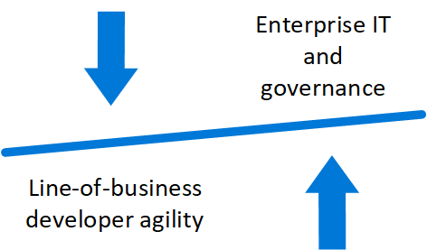
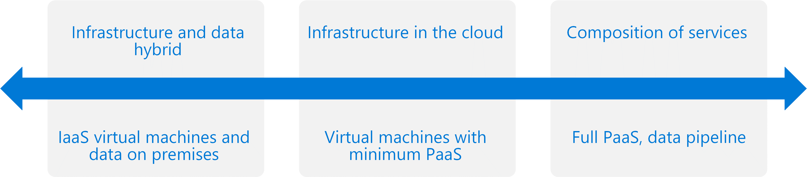

# Azure Virtual Datacenter Concepts: The cloud datacenter transformation

Cloud datacenter transformation is an ongoing process to modernize your IT infrastructure and take advantage of the cloud. As part of this process, your organization needs to plan how to make use of the Azure cloud, and how to best structure workloads to most efficiently use your existing on-premises assets in combination with cloud resources. The Azure Virtual Datacenter model offers a starting point on this journey.

## Balancing governance and agility

As part of any cloud datacenter transformation, enterprise IT and governance teams have two high-level goals: the ability to create isolation boundaries around applications, and the ability to enforce those boundaries with policy. Developers and their line-of-business (LOB) sponsors have goals, too: to make the most of the agility cloud platforms offer to drive competitive advantages.  Striking a balance between these two factors is the objective of the Azure Virtual Datacenter model.

 

Enterprise IT wants their cloud-based applications to be governed by many of the same policies as their on-premises implementations. Even born-in-the-cloud applications, especially multitenant PaaS offerings and SaaS application such as Office 365, need to have well defined isolation boundaries and role-based policy enforcement. The Azure Virtual Datacenter model begins to give enterprise IT the controls they need to enforce governance.

## Virtual datacenter patterns

In the datacenter and application transformation journey, three distinct workload patterns emerge: 
* IaaS compute resources with data remaining in the on-premises datacenter.
* IaaS with data using cloud-based storage, but with minimal use of other PaaS (besides storage).
* Cloud applications composed entirely of multiple platform services.
  

The first pattern is usually called a partial lift and shift, or strictly IaaS, where no multitenant platform services are consumed. In this pattern, the virtual machines processing data are hosted in the cloud, but all data is stored on-premises and accessed over ExpressRoute. Even Active Directory services are located on-premises. This pattern includes scenarios where the data can flow to the cloud in an anonymized or tokenized fashion. Such scenarios remove much of the data sensitivity but severely limit what types of processing that can be done with that data. 

The second pattern involves a limited integration of IaaS resources to build a basic cloud infrastructure. For example, virtual machines may make use of essential PaaS services such as Storage or Key Vault. Some additional services such as Azure SQL Database may also be consumed to provide cost and management savings. 

The third pattern fully uses PaaS services to construct a complete solution such as an Azure data analytics pipeline (IoT Hub, Azure Machine Learning, HDInsight, Azure Data Lake).

## Moving forward with Azure Virtual Datacenter 

The Azure Virtual Datacenter model provides guidance for a coherent and consistent deployment model of workloads in the Azure cloud. The first edition of this model focuses on creating a trusted datacenter extension for virtual machine-based workloads hosted on the public cloud. 

Future editions of this model will show how additional elements can be used to achieve isolation of more complex scenarios, such as orchestrator based workloads, or workloads composed of platform services. 

Future models will also support secure Internet access directly from the virtual datacenter.

> [!div class="nextstepaction"]
> [Understand the Azure Virtual Datacenter framework](framework-overview.md)