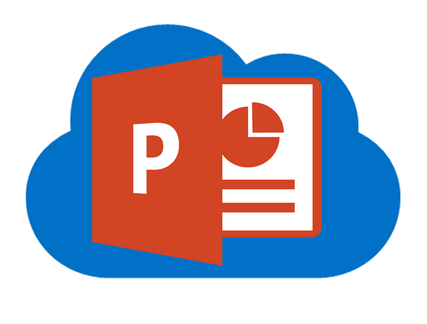
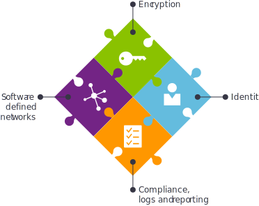

# Azure Virtual Datacenter and the Enterprise Control Plane

Azure Virtual Datacenter is an approach to making the most of the Azure cloud platform's capabilities while respecting your existing security and networking policies. When deploying enterprise workloads to the cloud, IT organizations and business units must balance governance with developer agility. Azure Virtual Datacenter provides models to achieve this balance with an emphasis on governance.
 
## Resources
<table>
<tr>
    <td style="width: 64px; vertical-align: middle;"></td>
    <td>
        <h3><a href="https://aka.ms/VDC/Concepts">Azure Virtual Datacenter: Concepts</a></h3>
        
This eBook shows you how to deploy enterprise workloads to the Azure cloud platform, while respecting your existing security and networking policies.

    </td>
</tr>
<tr>
    <td style="width: 64px; vertical-align: middle;"></td>
    <td>
        <h3><a href="networking-virtual-datacenter.md">Azure Virtual Datacenter: A Network Perspective</a></h3>
        
This online article provides an overview of networking patterns and designs that can be used to solve the architectural scale, performance, and security concerns that many customers face when thinking about moving en masse to the cloud.

    </td>
</tr>
<tr>
    <td style="width: 64px; vertical-align: middle;"></td>
    <td>
        <h3><a href="https://aka.ms/VDC/Lift">Azure Virtual Datacenter: Lift and Shift Guide </a></h3>
        
This whitepaper discusses the process that enterprise IT staff and decision makers can use to identify and plan the migration of applications and servers to Azure using the lift and shift method, minimizing any additional development costs while optimizing cloud hosting options.

    </td>
</tr>
<tr>
    <td style="width: 64px; vertical-align: middle;"></td>
    <td>
        <h3><a href="https://aka.ms/VDC/Deck">Azure Virtual Datacenter: Presentation Deck </a></h3>
        
This presentation deck explores the Azure Virtual Datacenter guidance and tools. It covers the VDC goals, customer drivers, Azure Regions, the elements of a VDC automation, industrialized and trusted Azure VDCs, and it ends with an action plan around CIO guidance. Support and training information is also provided.

    </td>
</tr>
</table>

## What is the Azure Virtual Datacenter?

Deploying workloads to the cloud introduces the need to develop and maintain trust in the cloud to the same degree you trust your existing datacenters. The first model of the Azure Virtual Datacenter guidance is designed to bridge that need through a locked-down approach to virtual infrastructures. This approach isn’t for everyone. It’s specifically designed to guide enterprise IT groups in extending their on-premises infrastructure to the Azure public cloud. We call this approach the trusted datacenter extension model. Over time, several other models will be offered, including those that allow secure Internet access directly from a virtual datacenter.

These four components make the Azure Virtual Datacenter possible: identity, encryption, software-defined networking, and compliance (including logs and reporting).

In the Azure Virtual Datacenter model, you can apply isolation policies, make the cloud more like the physical datacenters you know, and achieve the levels of security and trust you need. Four components any enterprise IT team would recognize make it possible: software-defined networking, encryption, identity management, and the Azure platform's underlying compliance standards and certifications. These four are key to making a virtual datacenter a trusted extension of your existing infrastructure investment.

Continue reading the <a href="https://aka.ms/VDC/eBook">Azure Virtual Datacenter Concepts</a> eBook.
