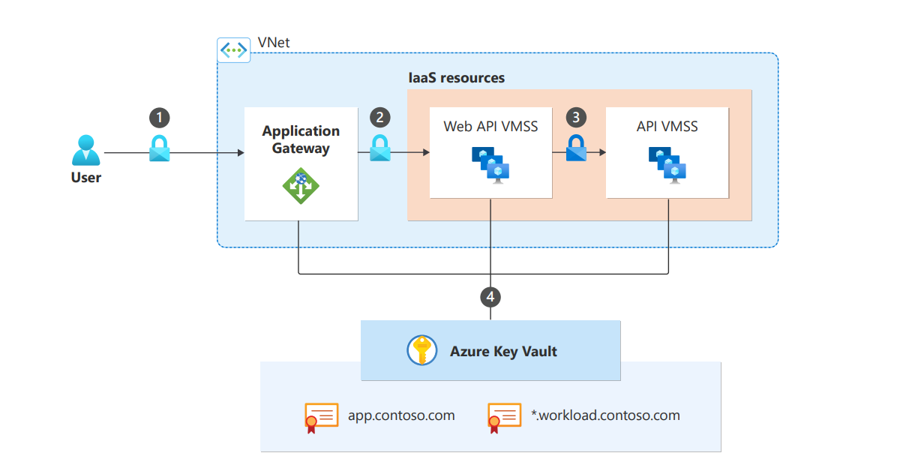

This article provides a foundational reference architecture for an Infrastructure-as-a-Service (IaaS) workload. The intent is to showcase a typical lift-and-shift use case in which an application is rehosted from on-premises to Azure without any code changes.  

The focus of this architecture isn't that application. Instead it provides guidance for configuring and deploying the infrastructure components with which the application interacts. This includes the components such as compute, storage, networking, monitoring and more. 

On-premises architecture are designed with a Capital Expense (CAPEX) mindset. When migrating to the cloud, take advantage of the elastic nature of the cloud services. Certain configurations that worked on-premises can be cost optimized on Azure. Do rigorous testing to establish a baseline that's inline with the expectation of the on-premises systems but can be easily extended to adapt to the changes in business requirements.

> [!TIP]
>  The best practices described in this architecture is demonstrated by a [**reference implementation**](). Consider the implementation as your first step towards production for a lift-and-shift application.
> The implementation includes an application that's a small test harness that will exercise the infrastructure set up end-to-end. 


## Architecture

:::image type="content" source="./media/iaas-baseline-architecture.png" alt-text="IaaS baseline architectural diagram" lightbox="./media/iaas-baseline-architecture.png":::

*Download a [Visio file](https://microsoft-my.sharepoint.com/:u:/r/personal/josev_microsoft_com/_layouts/15/doc2.aspx?sourcedoc=%7B07ba5bba-c61b-4b5e-bd37-1d4c20adf6b3%7D&action=view&share=IQG6W7oHG8ZeS703HUwgrfazAfcpYv2OBI9EIkxS8W1jamA&cid=12c82ef1-48e5-4fdf-b442-c52eb52ea874) of this architecture.*

//TODO: Load final Visio into blob storage (ie: https://arch-center.azureedge.net/iaas-baseline.vsdx)  
//TODO: Refresh all images from Visio and convert to .svg  
//TODO: Create thumbnail for browser  

#### Workload resources

- **Azure Virtual Machine** (VM) serves as the compute needed for the application. For illustrative purposes, there's a mix of both Windows and Linux images. The VMs are spread across availability zones so that the application is resilient to data center failures within a zone.  

- **Azure Virtual Machine Scale Sets** in Flexible orchestration mode provisions and manages the virtual machines individually. This mode was chosen because of the ease of operations, for example automatically spreading VMs across fault domains. Also, scaling demands of the application are met by provisioning more or decommissioning VMs, as needed. For more information, see [Scale sets with Flexible orchestration](/azure/virtual-machine-scale-sets/virtual-machine-scale-sets-orchestration-modes#scale-sets-with-flexible-orchestration).

- **Azure Virtual Network** provides a private network for all workload resources. The network is segmented into subnets that act as isolation boundaries.

- **Azure Application Gateway Standard_v2** is the single point of ingress. It routes user requests to front end servers.  

    This SKU has integrated Azure Web Application Firewall (WAF) that inspects incoming requests to check for OWASP vulnerabilities.

    It also supports cross-zone redundancy.

- **Azure Load Balancer** routes traffic from the frontend tier to the backend servers. The load balancer has zonal redundancy to enable distribution to VMs across zones.  

- **Azure Key Vault** stored certificates used for end-to-end TLS communication by the workload. It also stores application secrets. 

#### Workload supporting resources

- **Azure Bastion** provides operational access to the VMs over Remote Desktop Protocol (RDP) and Secure Shell (SSH). Communication is over a private connection that prevents the VMs from being exposed through public IP addresses.  

- **Azure Application Insights** collects logs and metrics from the application. 

- **Azure Log Analytics** is the monitoring data sink that collects logs and metrics from the Azure resources and Application Insights. A storage account is provisioned as part of the workspace. 

### Workflow

<!-- FOR DRAFT REFERENCE ONLY - TO BE REMOVED -->
THIS DIAGRAM IS TEMPORARY FOR REFERENCE ONLY:
:::image type="content" source="./media/iaas-baseline-architecture-temp.png" alt-text="IaaS baseline architectural diagram" lightbox="./media/iaas-baseline-architecture-temp.png":::
<!-- FOR DRAFT REFERENCE ONLY - TO BE REMOVED -->

##### Workload user

1. Workload user browses to the web site via public IP address and connects to Azure Application Gateway. 
1. Application Gateway receives HTTPS traffic and uses the external certificate to decrypt data for inspection by WAF. If data passes the WAF test, Application Gateway encrypts the data using the internal wildcard certificate for transport to the web tier. 
1. The zone-redundant Application Gateway balances traffic across the three zones in the frontend, connecting to a VM in the pool of web tier VMs, on behalf of the user session.
1. The front-end web tier is the first layer of the three-tier application, with VMs hosted in three availability zones. The front-end VM that receives the request uses the internal certificate to decrypt data for inspection, then encrypts the data for transport to the back-end tier based on the request. 
1. The front-end web app connects to the zone-redundant back-end Azure Load Balancer. Load Balancer connects to a VM in the pool of zone-redundant API tier VMs, forwarding the call to the API app.
1. The back-end VM that receives the request uses the internal certificate to decrypt data for inspection, then encrypts the data for transport to the data tier based on the request.
1. The back-end API app makes an API call to the data tier, which returns a result set to the API app. The API app returns the result to the web tier app. The web tier app returns the result to the Application Gateway, which returns it to the user.

##### Operations user

1. Operations user signs in to Azure portal.
1. The operations user accesses Azure Bastion service, then remotes into desired VM for troubleshooting using the appropriate tool.
1. TBD 

## Compute layout and design choices

The sample application can be represented in two tiers, each requiring its own compute.  

1. Frontend runs the web server and receives user requests.
1. Backend runs business logic to process those requests. 

Both compute are stateless to reduce complexity during scaling operations. Temporary state can be stored on [disks](#managed-disks). This layout may be extended to include a database tier for storing state from the frontend and backend compute. That tier is outside the scope of this architecture.

##### VM SKUs

When migrating an existing workload to the cloud, have a baseline expectation for performance that matches your on-premises servers. This will impact the capabilities you choose for virtual machines on Azure, such as:

- CPU, memory, and disk input/output operations per second (IOPS)
- Storage volumes
- Processors architecture
- Operating system (OS)

As an example of changes to the architecture in the cloud from on-premises, consider the OS. The OS ran on a disk with fixed capacity. In Azure, the OS footprint influences your choice in VM and disk SKUs.

For information about the supported VM SKUs, see [Sizes for virtual machines in Azure](/azure/virtual-machines/sizes).

##### VM connectivity

To enable a VM to communicate with the virtual network, you need Network interfaces (NICs).

On-premises servers can have virtualized networking where hosts connect to external networks through virtual switches. The switches have policies in place that control traffic going in and out of the servers.

If the workload needs low latency, that set up can be a disadvantage because the policy processing requires an extra hop at the switch. Azure VM NICs support **accelerated networking**. The processing is directly offloaded by the VM NIC to the underlying hardware. This results in lower latency and the CPU can process the payload faster. For more information, see [Benefits of accelerated networking](/azure/virtual-network/accelerated-networking-overview?tabs=redhat#benefits).

If you require multiple NICs for your VM, be aware that a maximum number of NICs is defined for each VM size.

//This is disabled on the NIC.

##### Disks

Storage area network (SAN) volumes are needed to run the operating system and application components. They can be used to run the OS or store temporary data. In Azure, these volumes or disks, are _attached_ to the VM. **Ephemeral OS disks** are recommended for OS. **Managed disks** are recommended for data storage.

Azure offers options varying in performance, tunability, and cost. Most production workloads should start with Premium SSD. The choice is tied to the VM SKU. VM SKUs that support Premium SSD contain 's' in the resource name, for example 'Dsv4' but not 'Dv4.'

For more information about the disk options with metrics such as capacity, IOPS, throughput and others, see [Disk type comparison](/azure/virtual-machines/disks-types#disk-type-comparison).

When choosing the appropriate disk, keep in mind the disk characteristics and performance expectations. 

Here are some considerations:

- **The limitations of the VM SKU**. Disks run in context the VM to which its attached. VMs have limits for both IOPS and throughput across all attached disks. A disk must not impose a cap on the attached VM's limits, and vice versa. Determine the required disk size and performance along with the VM core, CPU, and memory capabilities. Then, choose and test SKU combinations that will run the application component optimally on that VM instance.

    Don't overprovision either resource because the overall cost will be impacted.

- **Configuration changes**. You can change certain disk performance and capacity configurations while a VM instance is running. However, many changes might require a complete re-provisioning and rebuilding of content on the disk. Bringing a VM down to make a disk change might impact the availability of the workload. Take a “measure twice, cut once” approach to disk and virtual machine SKU selection in your architecture planning to minimize availability impact and rework.

//{CHAD} What's the workaround for the use case that requires re-provisioning. Include something about scaling? 

- **Ephemeral OS disks**. OS disks must not store application components or state. OS disks should be provisioned as [ephemeral disks](/azure/virtual-machines/ephemeral-os-disks). Managed disks can be considered only when OS files need to be persisted. 

    Ephemeral OS disks capacity is based on the selected virtual machine SKU. Your OS image's expected disk size should be less than the available cache or temp disk available on the SKU. Remaining space can be used for temporary storage. 

- **Disk performance**. It's a common practice to pre-provision disk space based on peak load. However, most workloads don't sustain peak load, which might lead to under utilized resources. 

    Monitor the workload's usage patterns. For example, you might notice a spike during certain times. At other times, there might be sustained high-read operations. Factor in this pattern when you select VM and managed disk SKUs. 
    
    You can change the performance on demand by changing the [performance tiers](/azure/virtual-machines/disks-change-performance#what-tiers-can-be-changed). Another way is to take advantage of the [bursting features](/azure/virtual-machines/disk-bursting) offered in some managed disks SKUs. 

    Over provisioning will need less bursting, however, the tradeoff is unused provisioned capacity that you pay for. To get the best results, combine the two features if possible.

- **Tune caching for the workload**. All disks should have their cache setting configured based on the application component usage. 
     
    Application components that mostly do read operations don't require high disk transactional consistency and can benefit from read-only caching. Components that are write heavy, require high disk transactional consistency. For these disks, caching is often disabled.
    
    Read-write caching for workload components could lead to data loss in the event of a virtual machine crash and is generally not recommended for most data disk scenarios.

In this architecture, the both backend and frontend VMs use Standard HDD LRS. //this seems to be off. 

- All virtual machine OS disks are ephemeral, and are placed on the cache disk. This places the Windows page file on the same ephemeral disk.
- Each virtual machine has its own Premium SSD P3 managed disk attached, giving a base provisioned throughput suitable for our workload.


##### Virtual Machine Scale Sets with flexible orchestration

In this architecture, VMs are provisioned as part of **Virtual Machine Scale Sets (VMSS) with Flexible orchestration** to facilitate operations at scale. VMSS represent a logical organization of VMs. The expected capacity can be met by allocating identical VMs or multiple virtual machine types. You can manage the machine lifecycle, including network interfaces and disks using the standard Azure VM APIs and commands. 

Another benefit is that flexible orchestration can spread VMs across fault domains within an Availability Zone. You to scale out the application while maintaining fault domain isolation.


## Identity and access management

[Azure Active Directory (Azure AD)](/azure/active-directory/) is recommended for authenication of all actors, both users and software components such as services. Use [Azure Role Based Access Control (RBAC)](/azure/role-based-access-control/overview) for authorization of all actors accessing resources, and implementation of the [principle of least privilege](/azure/active-directory/develop/secure-least-privileged-access) when applying roles and permissions to actors. 

In the workload, services will need to communicate with other services. For example, VMs need to reach Key Vault to get certificates. To make sure that access is secure, the service needs to authenticate its identity to the other service. Using managed identity is recommended. Managed identities are based on Azure Active Directory service principals internally, but much easier to use due to the automatic management of the service principal object.

These services in this architecture use [user-assigned managed identities](/azure/active-directory/managed-identities-azure-resources/overview#managed-identity-types). The identities are created and assigned during deployment. 

- **Azure Application Gateway** uses its user-assigned managed identity to access Azure Key Vault and retrieve external and internal TLS certificates. The external certificate is used for encrypting traffic to/from the user, and the internal certificate is used to encrypt traffic to/from the front-end web tier.

- **Front-end web tier and back-end API tier VMs** use their own user-assigned managed identities to access Azure Key Vault and retrieve the internal TLS certificate. The internal certificate is used for encrypting traffic between frontend and backend VMs. VMs also use their managed identity to access the Azure Storage account issued during deployment, which is used to store boot diagnostics.

// It's a good place to add some example of how to continue to use managed identity for extension cases. Like Backend servers would need managed identity for getting secrets from KV for database connection purposes. 

## Secret management

[Azure Key Vault](/azure/key-vault/general/overview) provides secure management of secrets. This architecture uses Key Vault to store the TLS certificates used by the various actors for encrypting and decrypting data in transit between layers. 

The managed identities configured during deployment are used by Application Gateway and the VMs for Key Vault authentication and authorization. Key Vault access policy is configured to allow the managed identities to retrieve the certificate properties. The VMs also use the [Azure Key Vault VM extension](/azure/virtual-machines/extensions/key-vault-linux) for automatic refresh of monitored certificates. If changes are detected in the local certificate store, the extension retrieves and installs the corresponding certificates in Key Vault. The extension supports certificate content types PKCS #12, and PEM. 

> [!IMPORTANT]
> It is your responsibility to ensure your locally stored certificates are rotated regularly. See [Azure Key Vault VM extension for Linux](/azure/virtual-machines/extensions/key-vault-linux) or [Azure Key Vault VM extension for Windows](/azure/virtual-machines/extensions/key-vault-windows) for more details. 

The certificates stored in Key Vault are identified by the following common names:
- **app.contoso.com**: An external certificate used by clients and Application Gateway for secure public Internet traffic
- ***.worload.contoso.com**: A wildcard certificate used by the infrastructure componenets for secure internal traffic.

It's also a good idea to use Key Vault for storage of secrets used for database encryption. For more information, see [Configure Azure Key Vault Integration for SQL Server on Azure VMs](/azure/azure-sql/virtual-machines/windows/azure-key-vault-integration-configure). We also recommend that you store application secrets, such as database connection strings, in Key Vault.

## Monitoring
//{BRYAN} pulling this above the line for now so we can iterate 

:::image type="content" source="./media/iaas-baseline-monitoring.png" alt-text="IaaS network data flow  diagram" lightbox="./media/iaas-baseline-monitoring.png":::
*Download a [Visio file](https://arch-center.azureedge.net/xxx.vsdx) of this architecture.*

### Data collection

Talk about the various ways logs/metrics/etc are collected via agents, Azure log analytics, etc.

##### Health probes
##### Logs
##### Log analytic workspace

##### Managed disks

Your workload will dictate your final metrics to monitor on disks, but most IaaS architectures will have some mix of the following common key metrics. Beyond these, you’ll want to bring in items that represent where your application is most sensitive. When designing your monitoring solution be aware that there is an Azure-platform perspective on managed disks and there is the Guest OS perspective on the managed disks.  The Azure-platform perspective represents the type of metrics that a SAN operator would view, regardless of what workloads are connected.  The guest-perspective represented the type of metrics that the workload operator would view, regardless of the underlying disk technology.  In Azure, workload teams have the responsibility of monitoring both as part of their solution.

##### Platform perspective

The data disk performance (IOPS and throughput) metrics can be looked at individually (per disk) or rolled up to all disks attached to a VM. Both perspectives can be critical in troubleshooting a potential performance issue, as both the individual disks and the VM can cap total performance. To troubleshoot suspected or alert on pending disk capping, use the *Storage IO utilization* metrics, which provide consumed percentage of the provisioned throughput for both virtual machines and disks.

If your architecture uses bursting for cost optimization, then you’ll want to monitor your *Credits Percentage* metrics.  Running out of credits can be expected result, as consistently having left over credits is a sign that further cost optimization could occur on that disk. Meaning if you are using bursting as part of your cost optimization strategy, you should monitor how many credits you're consistently leaving unused and see if you can choose a lower performance tier.

##### OS perspective

VM Insights is how we recommend you get key metrics from an operating system perspective on attached disks. This is where you'll report or alert on disk/drive metrics like *logical disk space used*, and the operating system kernel's own perspective on disk IOPS and throughput. Combining these performance metrics with the platform performance metrics can help isolate OS or even application throughput issues on your disks vs platform bottlenecks.

##### Workload metrics and instrumentation
##### VM Insights

### Data analysis

Talk about how we analyze the monitoring data collected from various sources


***
***

## Dump zone

## Networking 

This architecture uses a single virtual network in which the workload resources are deployed. Isololation boundaries are created through subnetting.

:::image type="content" source="./media/iaas-baseline-network-topology.png" alt-text="IaaS baseline architectural diagram" lightbox="./media/iaas-baseline-network-topology.png":::
*Download a [Visio file](https://arch-center.azureedge.net/xxx.vsdx) of this architecture.*

- Update image to show overall network topology with components for each subsection below
- Q: Do we need to add Azure DDoS Protection?

Do not expose the VMs directly to the Internet, but instead give each VM a private IP address. Clients connect using the public IP address of the load balancer.

If you need to log into the VMs behind the load balancer, consider adding a single VM as a jumpbox (also called a bastion host) with a public IP address you can log into. And then log into the VMs behind the load balancer from the jumpbox. Alternatively, you can configure the load balancer's inbound network address translation (NAT) rules. However, having a jumpbox is a better solution when you are hosting n-tier workloads or multiple workloads.

## Redundancy

#### Redundancy in disks

Managed disks are a regional resource and can only be attached to a virtual machine in the same region. Managed disks can be either LRS or ZRS. For most IaaS architectures, LRS is sufficient for data disks. ZRS is a good candidate for workloads that require lower RTO and RPO options on data disks, but requires a recovery strategy designed to advantage of availability zones and ideally pre-provisioned compute in alternate availability zones ready to recover from a zonal failure. ZRS also introduces an added bit of write latency that should be validated in your workload. Even LRS disks have [zonal failure mitigations](/azure/virtual-machines/disks-redundancy#locally-redundant-storage-for-managed-disks), but only ZRS is capable of achieving zero RPO.

Some specialty workloads, such as SQL Server Always On, can write data to multiple zones. Likewise, custom applications that you write can also follow that strategy and achieving multi-zone redundancy while still using LRS disks. Architecting your IaaS application to take advantage of the flexibility and raw storage access can be a boon for the overall reliability of your workload.

In this architecture, data disks are configured as LRS as no state is persisted locally on any tiers, and the DR playbook for this architecture is redeploy.

- Azure Managed disks themselves do not have a financially backed SLA, no matter what tier is selected. Their availability typically impacts the availability of the virtual machines they are attached to or worse, they do not, but still impact the availability of the workload.

## Scalability

## Patching and updates

## Security

#### Disk encryption

##### Azure disk storage encryption

At the infrastructure level, managed disks, by default are encrypted-at-rest with a platform-managed encryption solution (PMK). Unless your compliance requires an alternative, using this platform-managed encryption is recommended for most architectures. For situations that require the use of customer-managed encryption solutions (CMK) or even double encryption (PMK + CMK), you'll need to introduce a Disk Encryption Set and an Azure Key Vault for your key encryption key (KEK) into the solution architecture as a critical regional component. Disk encryption is applied at the individual disk level, so one virtual machine can support multiple combinations of disk encryption configurations to fit workload requirements. All disk encryption at the platform level is completely transparent to the virtual machine's OS.

Azure disk storage encryption does not encrypt VM temp disks, ephemeral OS disks, disk caches, nor the SAN connection (encryption-at-flow) to disk storage. To extend encryption to the virtual machine's ephemeral disks and the SAN connection, use Encryption at host.

##### Azure disk encryption (ADE)

At the operating system level, there is no default encryption applied. OS-level encryption is provided by solutions such as DM-Crypt on Linux and BitLocker on Windows Server. If your solution absolutely requires OS-level/managed encryption on OS and/or data disks, it is recommended to manage these native OS encryption methods though the ADE virtual machine extension. This scenario is relatively niche and is not covered in the IaaS baseline architecture as it is not a common concern for many architectures.

- PMK is used for server-side encryption, encryption at host nor ADE are enabled.

##### Strategy

Let your security and compliance requirements dictate your disk encryption strategy. Tradeoffs for introducing CMK in Azure disk storage encryption or ADE are additional critical infrastructure components to monitor and manage, additional cost, and potential impact to RTO related to human-error, backups, and failover. Most general-purpose IaaS solutions will find PMK Azure disk storage sufficient; extend to use CMK and/or encryption at host for added broad compliance coverage only when necessary.

## Cost optimization

It's recommended that bursting features of managed disks are considered as part of your SKU selection and cost optimization strategy for IaaS infrastructure. The free bursting credit feature of Premium SSD should be used to achieve desired performance characteristics without the need for excessive over-provisioning.

Balance between disk and VM skus. Don't overprovision either resource because the overall cost will be impacted.

#### Azure reservations

Many IaaS workloads have prolonged expected deployment durations, often years. Ensure your IaaS lifecycle, resource SKUs, and disk needs are available to your cloud FinOps team for inclusion in your organization's pre-purchase reservation scopes.

Resources in this architecture that can benefit from Azure reservations:

- [Azure managed disks](/azure/virtual-machines/disks-reserved-capacity)


##### Zone redundancy

Availability zones are unique physical locations within an Azure region. Each zone is made up of one or more datacenters with independent power, cooling, and networking. The physical separation of availability zones within a region limits the impact to applications and data from zone failures

By replicating VMs across availability zones, you can protect your applications and data from a zone failure. This is how Azure meets the industry-best [VM uptime service-level agreement (SLA)](https://azure.microsoft.com/support/legal/sla/virtual-machines/v1_9). For more information, see [Building solutions for high availability using availability zones](../high-availability/building-solutions-for-high-availability.yml).

##### Update domains

Spreading resources across availability zones also protects an application from planned maintenance. When VMs are distributed across three availability zones, they are, in effect, spread across three update domains. The Azure platform recognizes this distribution across update domains to ensure that VMs in different zones aren't updated at the same time.

## Scenario details

This reference architecture is directed at scenarios where an on-prem web app is being migrated to Azure IaaS ...

The architecture uses resources spread across multiple zones to provide high availability to an Infrastructure as a Service (IaaS) solution. A zone-redundant instance of Azure Application Gateway routes traffic to VMs in the frontend role. A zone-redundant load balancer routes traffic from the frontend VMs to the backend VMs. In case of a zone failure, Application Gateway routes to VMs in other available zones. Routing across zones has higher latency than routing within the zone.

### Business continuity and disaster recovery (BCDR)


##### Guidance for PaaS and other components

With zone-redundant services, the distribution of the workload is a feature of the service and is handled by Azure. Azure automatically replicates the resource across zones without requiring your intervention. For example, zone-redundant load balancer, Azure Application Gateway, virtual private network (VPN), zone-redundant storage.

Using Application Gateway or a Standard Load Balancer configured as zone-redundant, traffic can be routed to VMs located across zones with a single IP address, which will survive zone failures. The load frontend IP can be used to reach all (non-impacted) VMs no matter the zone. One or more availability zones can fail and the data path survives as long as one zone in the region remains healthy.

### Compute

#### Virtual Machine Scale Sets with flexible orchestration

In this baseline architecture we are using Virtual Machine Scale Sets (VMSS) with Flexible orchestration to facilitate the operation of virtual machines at cloud scale. Unlike uniform VMSS, with flexible orchestration Azure enables you to allocate and manage VMs individually. You have full control over the virtual machine lifecycle, as well as network interfaces and disks using the standard Azure VM APIs and commands. At the same time, by joining VM to a flexible VMSS, you get an orchestration layer that facilitates achieving high availability at scale with identical or multiple virtual machine types. Flexible orchestration offers high availability guarantees (up to 1000 VMs) by spreading VMs across fault domains in a region or within an Availability Zone. This enables you to scale out your application while maintaining fault domain isolation that is essential to run quorum-based or stateful workloads, including:

##### Scale out with standard Azure virtual machines

Virtual Machine Scale Sets in Flexible Orchestration mode manage standard Azure VMs. You have full control over the virtual machine lifecycle, as well as network interfaces and disks using the standard Azure VM APIs and commands. Individual instances are compatible with the standard Azure IaaS VM API commands, Azure management features such as Azure Resource Manager resource tagging RBAC permissions, Azure Backup, or Azure Site Recovery.


##### Instance naming
When you create a VM and add it to a Flexible scale set, you have full control over instance names within the Azure Naming convention rules. When VMs are automatically added to the scale set via autoscaling, you provide a prefix and Azure appends a unique number to the end of the name.

##### Automatic instance repairs

Enabling automatic instance repairs for Azure Virtual Machine Scale Sets helps achieve high availability for applications by maintaining a set of healthy instances. The Application Health extension or Load balancer health probes may find that an instance is unhealthy. Automatic instance repairs will automatically perform instance repairs by deleting the unhealthy instance and creating a new one to replace it. Automatic instance repair feature relies on health monitoring of individual instances in a scale set. VM instances in a scale set can be configured to emit application health status using either the Application Health extension or Load balancer health probes. If an instance is found to be unhealthy, then the scale set performs repair action by deleting the unhealthy instance and creating a new one to replace it.

*Terminate notification and automatic repairs* If the terminate notification feature is enabled on a scale set, then during automatic repair operation, the deletion of an unhealthy instance follows the terminate notification configuration. A terminate notification is sent through Azure metadata service – scheduled events – and instance deletion is delayed during the configured delay timeout. However, the creation of a new instance to replace the unhealthy one doesn't wait for the delay timeout to complete.

##### Workload
- Structure of the workload
- VMSS scaling, availability zones
- Packaging/publishing workload artifacts
##### Management


###### Azure Bastion

The solution implements [Azure Bastion](/azure/bastion/bastion-overview) that allows you to connect to virtual machines in the frontend or backend subnets using your browser and the Azure portal, or via the native SSH or RDP client already installed on your local computer. The Transport Layer Security (TLS) protocol protects the connection.

For additional security, you could use Azure Bastion to connect to a jumpbox that's inside your workload's network environment in Azure. In this scenario, the jump box resides in the spoke virtual network, together with the rest of the workload resources. Additional Network Security rules can be implemented to ensure the jumpboxes could only be accessed from the Azure Bastion subnet and in turn, which resources can be accessed from the jumpbox. 

Additionally, you can use just-in-time (JIT), a feature of Microsoft Defender for Cloud. The JIT access feature uses network security groups or Azure Firewall to block all inbound traffic to your jump box. If a user tries to connect to the jump box with appropriate RBAC permissions, this feature configures the network security groups or Azure Firewall to allow inbound access to the selected ports for a specified amount of time. After that time expires, the ports deny all inbound traffic. For more information about JIT access, see [Understanding just-in-time (JIT) VM access](/azure/defender-for-cloud/just-in-time-access-overview?tabs=defender-for-container-arch-aks)
 
##### Managed disks

### DevOps

##### OS patching
##### Packaging/publishing workload artifacts
##### Guest OS config

#### Use Infrastructure as Code (IaC)

Choose an idempotent declarative method over an imperative approach, where possible. Instead of writing a sequence of commands that specify configuration options, use declarative syntax that describes the resources and their properties. One option is an [Azure Resource Manager (ARM)](/azure/azure-resource-manager/templates/overview) templates. Another is Terraform.

Make sure as you provision resources as per the governing policies. For example, when selecting the right VM sizes, stay within the cost constraints, availability zone options to match the requirements of your application.

If you need to write a sequence of commands, use [Azure CLI](/cli/azure/what-is-azure-cli). These commands cover a range of Azure services and can be automated through scripting. Azure CLI is supported on Windows and Linux. Another cross-platform option is Azure PowerShell. Your choice will depend on preferred skillset.

Store and version scripts and template files in your source control system.


### Networking

#### Hub and spoke topology

This architecture uses a hub-spoke network topology. The hub and spoke(s) are deployed in separate virtual networks connected through [peering](/azure/virtual-network/virtual-network-peering-overview). Some advantages of this topology are:

- Segregated management. Enables a way to apply governance and adhere to the principle of least privilege. It also supports the concept of an [Azure landing zone](/azure/cloud-adoption-framework/ready/landing-zone/) with separation of duties.

- Minimizes direct exposure of Azure resources to the public internet.

- Organizations often operate with regional hub-spoke topologies. Hub-spoke network topologies can be expanded in the future and provide workload isolation.

- All web applications should require a web application firewall (WAF) service to help govern HTTP traffic flow.

- A natural choice for workloads that span multiple subscriptions.

- It makes the architecture extensible. To accommodate new features or workloads, new spokes can be added instead of redesigning the network topology.

- Certain resources, such as a firewall and DNS can be shared across networks.

- Aligns with the [Azure enterprise-scale landing zones](/azure/cloud-adoption-framework/ready/enterprise-scale/implementation).

:::image type="content" source="./media/iaas-baseline-network-topology.png" alt-text="IaaS baseline architectural diagram" lightbox="./media/iaas-baseline-network-topology.png":::
*Download a [Visio file](https://arch-center.azureedge.net/xxx.vsdx) of this architecture.*

- Update image to show overall network topology with components for each subsection below
- Q: Do we need to add Azure DDoS Protection?

For additional information, see [Hub-spoke network topology in Azure](../reference-architectures/hybrid-networking/hub-spoke.yml).

#### Hub

The hub virtual network is the central point of connectivity and observability. A hub always contains an Azure Firewall with global firewall policies defined by your central IT teams to enforce organization wide firewall policy, Azure Bastion, a gateway subnet for VPN connectivity, and Azure Monitor for network observability.

Within the network, three subnets are deployed.

#### Subnet to host Azure Firewall

[Azure Firewall](/azure/firewall/) is firewall as a service. The firewall instance secures outbound network traffic. Without this layer of security, this traffic might communicate with a malicious third-party service that could exfiltrate sensitive company data. [Azure Firewall Manager](/azure/firewall-manager/overview) enables you to centrally deploy and configure multiple Azure Firewall instances and manage Azure Firewall policies for this *hub virtual network* network architecture type.

#### Subnet to host a gateway

This subnet is a placeholder for a VPN or ExpressRoute gateway. The gateway provides connectivity between the routers in your on-premises network and the virtual network.

#### Subnet to host Azure Bastion

This subnet is a placeholder for [Azure Bastion](/azure/bastion/bastion-overview). You can use Bastion to securely access Azure resources without exposing the resources to the internet. This subnet is used for management and operations only.

#### Subnet to host Private Link endpoints (platform)

//TODO: similar to the private endpoint subnet for the spoke but this one is linking global resources that can be accessed from the hub and all peered spokes

//TODO: need guidance to address potential issue when there are DNS conflicts between private DNS names in the spokes and the hub. For example: when we want a platform Key Vault instance for platform certificates
//      and also workload managed Key Vault resources for application secrets
### Spoke

The spoke virtual network contains the AKS cluster and other related resources. The spoke has four subnets:

#### Subnet to host Azure Application Gateway

Azure [Application Gateway](/azure/application-gateway/overview) is a web traffic load balancer operating at Layer 7. The reference implementation uses the Application Gateway v2 SKU that enables [Web Application Firewall](/azure/application-gateway/waf-overview) (WAF). WAF secures incoming traffic from common web traffic attacks, including bots. The instance has a public frontend IP configuration that receives user requests. By design, Application Gateway requires a dedicated subnet.

#### Subnet to host the frontend VM resources

//TODO: the frontend Flexible VMSS, hosting the Web component of the sample workload, lives here
#### Subnet to host the backend VM resources

//TODO: the backend Flexible VMSS, hosting the Api component of the sample workload, lives here

#### Subnet to host Private Link endpoints

Azure Private Link connections are created for the [Azure Container Registry](/azure/container-registry/) and [Azure Key Vault](/azure/key-vault/general/overview), so these services can be accessed using [private endpoint](/azure/private-link/private-endpoint-overview) within the spoke virtual network. Private endpoints don't require a dedicated subnet and can also be placed in the hub virtual network. In the baseline implementation, they're deployed to a dedicated subnet within the spoke virtual network. This approach reduces traffic passing the peered network connection, keeps the resources that belong to the cluster in the same virtual network, and allows you to apply granular security rules at the subnet level using network security groups.

For more information, see [Private Link deployment options](../guide/networking/private-link-hub-spoke-network.yml#decision-tree-for-private-link-deployment).

#### Plan the IP addresses

//TODO: DO we need a "Plan the IP addresses" section (exists in other baseline)
#### Network flow


Network flow, in this context, can be categorized as:

- **Ingress traffic**. From the client to the workload running in the virtual machines.

- **Egress traffic**. From a workload virtual machine to location outside of Azure.

- **Traffic within workload**. Communication workload resources. This traffic includes communication between the various virtual machines and other Azure resources like Key Vault. Also, if your workload accesses backend services and databases integrated with the VNet as private endpoints, communication with the private endpoints would fall into this category.

//TODO: revise statement about connection with services exposed as private endpoints, is confusing. Also, consider if we need to cover explicitly communicating with other
// backend services not exposed as private endpoints

- **Management traffic**. Traffic that goes between the client and the virtual machines.
 
:::image type="content" source="./media/iaas-baseline-network-traffic.png" alt-text="IaaS network data flow  diagram" lightbox="./media/iaas-baseline-network-traffic.png":::
*Download a [Visio file](https://arch-center.azureedge.net/xxx.vsdx) of this architecture.*

##### Traffic to/from internet

The architecture only accepts TLS encrypted requests from the client. TLS v1.2 is the minimum allowed version with a restricted set of cyphers. Server Name Indication (SNI) strict is enabled. End-to-end TLS is set up through Application Gateway by using two different TLS certificates, as shown in this image.



*Download a [Visio file](https://arch-center.azureedge.net/xxxx.vsdx) of this architecture.*

//TODO: review ficticious names used to reference to the workload components

1. The client sends an HTTPS request to the domain name: app.contoso.com. That name is associated with through a DNS A record to the public IP address of Azure Application Gateway. This traffic is encrypted to make sure that the traffic between the client browser and gateway cannot be inspected or changed.

2. Application Gateway has an integrated web application firewall (WAF) and negotiates the TLS handshake for app.contoso.com, allowing only secure ciphers. Application Gateway is a TLS termination point, as it's required to process WAF inspection rules, and execute routing rules that forward the traffic to the configured backend. The TLS certificate is stored in Azure Key Vault. It's accessed using a user-assigned managed identity integrated with Application Gateway. For information about that feature, see [TLS termination with Key Vault certificates](/azure/application-gateway/key-vault-certs).

3. As traffic moves from Application Gateway to the backend, it's encrypted again with another TLS certificate (wildcard for \*.workload.contoso.com) as it's forwarded to one of the frontend VMs. This re-encryption makes sure traffic that is not secure doesn't flow into the workload. Communication between the frontend and the backend components of the solution is also encrypted using the same wildcard certificate in order to ensure end-to-end TLS traffic all at every hop the way through to the workload.

4. The certificates are stored in Azure Key Vault. For more information, see [Secret management](#secret-management).

//TODO: Add content to explain how the certificates are deployed to the VMs. Tentatively we'll be using the Key Vault VM extension that should allow us to integrate directly

##### Traffic to/from private network and on-premises
##### Traffic routing within workload

### Management traffic

//TODO: how to secure control plane network traffic

##### Traffic control

###### Network Security Groups (NSG)

Use network security group rules to restrict traffic between tiers. In this architecture, the following rules are implemented.

1. Deny all inbound traffic from the virtual network. (Use the VIRTUAL_NETWORK tag in the rule.)
1. Allow only inbound traffic to the frontend subnet from the Application Gateway subnet.
1. Allow only inbound traffic to the backend load balancer subnet from the frontend subnet.
1. Allow only inbound traffic to the backend VMs from the backend load balancer subnet.
1. Allow only outbound traffic from the Application Gateway subnet to the frontend and private endpoints subnets.
1. Allow only outbound traffic from the frontend subnet to the backend load balancer and private endpoint subnets.
1. Allow only outbound traffic from the backend load balancer to the backend subnet.
1. Allow only outbound traffic from the backend subnet to the private endpoint subnet.

//TODO: review these rules and add details from the actual implementation
###### Application Security Groups (ASG)

[Application security groups (ASG)](/azure/virtual-network/application-security-groups) enable you to configure network security as a natural extension of an application's structure, allowing you to group virtual machines and define network security policies based on those groups. You can reuse your security policy without individually referencing IP addresses. They also make rules easier to read when reviewing the rules within a NSG.

Two ASGs are used in this scenario:

- WebFrontend ASG - The network interface of the frontend VMs are assigned to this ASG. The AGS is referenced in NSGs to filter traffic to and from the frontend VMs.
- ApiBackend ASG - The network interface of the backend VMs are assigned to this ASG. The AGS is referenced in NSGs to filter traffic to and from the frontend VMs.

//TODO: review these rules and add details from the actual implementation

###### Firewall

##### NIC/IPConfig + VM lifecycle
##### Accelerated Networking
##### Private DNS resolution

##### Health probes

Application Gateway and Load Balancer both use health probes to monitor the availability of VM instances.

- Application Gateway always uses an HTTP probe.
- Load Balancer can probe with either HTTP or TCP. Generally, if a VM runs an HTTP server, use an HTTP probe. Otherwise, use TCP.

If a probe can't reach an instance within a timeout period, the gateway or load balancer stops sending traffic to that VM. The probe continues to check, and returns the VM to the back-end pool when the VM becomes available again. HTTP probes send an HTTP GET request to a specified path and listen for an HTTP 200 response. This path can be the root path ("/"), or a health-monitoring endpoint that implements custom logic to check the health of the application. The endpoint must allow anonymous HTTP requests.

For more information about health probes, see these resources:

- [Load Balancer health probes](/azure/load-balancer/load-balancer-custom-probe-overview)
- [Application Gateway health monitoring overview](/azure/application-gateway/application-gateway-probe-overview)

For considerations about designing a health probe endpoint, see [Health Endpoint Monitoring pattern](../patterns/health-endpoint-monitoring.yml).

### Secret management

Encrypt sensitive data at rest and use [Azure Key Vault](https://azure.microsoft.com/services/key-vault) to manage the database encryption keys. Key Vault can store encryption keys in hardware security modules (HSMs). For more information, see [Configure Azure Key Vault Integration for SQL Server on Azure VMs](/azure/azure-sql/virtual-machines/windows/azure-key-vault-integration-configure). We also recommend that you store application secrets, such as database connection strings, in Key Vault.


## Recommendations

The following recommendations apply for most scenarios. Follow these recommendations unless you have a specific requirement that overrides them.

## Considerations

These considerations implement the pillars of the Azure Well-Architected Framework, which is a set of guiding tenets that can be used to improve the quality of a workload. For more information, see [Microsoft Azure Well-Architected Framework](/azure/architecture/framework).

### Reliability

Reliability ensures your application can meet the commitments you make to your customers. For more information, see [Overview of the reliability pillar](/azure/architecture/framework/resiliency/overview).

Availability zones provide high resiliency within a single region. If you need even higher availability, consider replicating the application across two regions. For more information, see [Run an N-tier application in multiple Azure regions for high availability](../reference-architectures/n-tier/multi-region-sql-server.yml).

Not all regions support availability zones, and not all VM sizes are supported in all zones. Run the following Azure CLI command to find the supported zones for each VM size within a region:

```azurecli
az vm list-skus --resource-type virtualMachines --zone false --location eastus -o table
```

### Security

Security provides assurances against deliberate attacks and the abuse of your valuable data and systems. For more information, see [Overview of the security pillar](/azure/architecture/framework/security/overview).

#### DDoS protection

The Azure platform provides basic DDoS protection by default. This basic protection is targeted at protecting the Azure infrastructure. Although basic DDoS protection is automatically enabled, we recommend using [Azure DDoS Protection](/azure/virtual-network/ddos-protection-overview). DDoS Protection uses adaptive tuning, based on your application's network traffic patterns, to detect threats. This practice allows it to apply mitigations against DDoS attacks that might go unnoticed by the infrastructure-wide DDoS policies. DDoS Protection also provides alerting, telemetry, and analytics through Azure Monitor. For more information, see [Azure DDoS Protection: Best practices and reference architectures](/azure/security/fundamentals/ddos-best-practices).

### Cost optimization

Cost optimization is about looking at ways to reduce unnecessary expenses and improve operational efficiencies. For more information, see [Overview of the cost optimization pillar](/azure/architecture/framework/cost/overview).

- Data transfers between availability zones in a region are not free. If your workload is multi-region or there are transfers across availability zones, then expect additional bandwidth cost. For more information, see [Traffic across billing zones and regions](/azure/architecture/framework/cost/design-regions?branch=master#traffic-across-billing-zones-and-regions).

- Create budgets to stay within the cost constraints identified by the organization. One way is to create budgets through Azure Cost Management. You can also create alerts to get notifications when certain thresholds are exceeded. For more information, see [Create a budget using a template](/azure/cost-management-billing/costs/quick-create-budget-template).

- [Azure Cost Management](/azure/cost-management-billing/costs/)

#### Virtual Machine Scale Sets

The Virtual Machine Scale Sets resource is available on all Windows VM sizes. You're charged only for the Azure VMs that you deploy, and for any additional underlying infrastructure resources consumed, such as storage and networking. There are no incremental charges for the Virtual Machine Scale Sets service.

For single VMs pricing options, see [Windows VMs pricing](https://azure.microsoft.com/pricing/details/virtual-machines/windows).

#### Load Balancer

You're charged only for the number of configured load-balancing and outbound rules. Inbound NAT rules are free. There's no hourly charge for the standard load balancer when no rules are configured.

### Operational excellence

Operational excellence covers the operations processes that deploy an application and keep it running in production. For more information, see [Overview of the operational excellence pillar](/azure/architecture/framework/devops/overview).

- Use tags when you create the workload resourcess. Tags are useful in creating custom reports to track the incurred costs. Tags give the ability to track the total of expenses and map any cost to a specific resource or team. Also, if the environment is shared between teams, build chargeback reports per consumer to identify metered costs for shared cloud services.

### Performance efficiency

Performance efficiency is the ability of your workload to scale to meet the demands placed on it by users in an efficient manner. For more information, see [Performance efficiency pillar overview](/azure/architecture/framework/scalability/overview).

## Deploy this scenario

A deployment for a reference architecture that implements these recommendations and considerations is available on [GitHub](https://www.github.com/path-to-repo).

1. First step
1. Second step
1. Third step ...

## Next steps

See product documentation for details on specific Azure services:

- [Azure Virtual Machines](/azure/virtual-machines)
- [Azure Virtual Machine Scale Sets](/azure/virtual-machine-scale-sets/)

## Related resources

IaaS reference architectures showing options for the data tier:

- [IaaS: Web application with relational database](/azure/architecture/high-availability/ref-arch-iaas-web-and-db)
- [Windows N-tier application using SQL Server on Azure](/azure/architecture/reference-architectures/n-tier/n-tier-sql-server)
