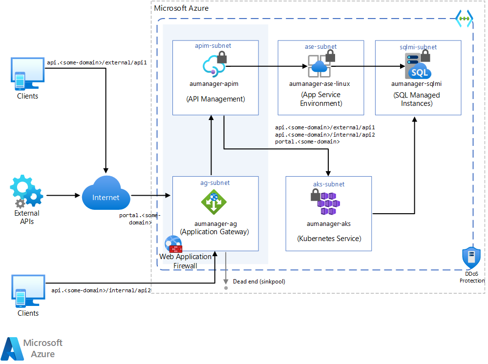

With more workloads adhering to the [API-first approach](https://swagger.io/resources/articles/adopting-an-api-first-approach/) for their design, and the growing number and severity of threats to web applications over the internet, it's critical to have a security strategy to protect APIs. One step toward API security is protecting the network traffic by using the [Gateway Routing pattern](../../../patterns/gateway-routing.yml). You use the gateway to restrict traffic source locations and traffic quality in addition to supporting flexible routing rules. This article describes how to use Azure Application Gateway and Azure API Management to protect API access.

## Architecture

This article doesn't address the application's underlying platforms, like App Service Environment, Azure SQL Managed Instance, and Azure Kubernetes Services. Those parts of the diagram only showcase what you can do as a broader solution. This article specifically discusses the shaded areas, API Management and Application Gateway.

*Download a [Visio file](https://arch-center.azureedge.net/protect-apis.vsdx) of this architecture.*

### Workflow

- The Application Gateway receives HTTP requests that have been allowed by its subnet's Network Security Group (NSG).

- The Web Application Firewall (WAF) on Application Gateway then checks the request against WAF rules, including [Geomatch custom rules](/azure/web-application-firewall/ag/geomatch-custom-rules). If the request is valid, the request proceeds.

- Application Gateway sets up a URL proxy mechanism that sends the request to the proper [backend pool](/azure/application-gateway/application-gateway-components#backend-pools). For example, depending on the URL format of the API call:

  - URLs formatted like `api.<some-domain>/external/*` can reach the back end to interact with the requested APIs.

  - Calls formatted as `api.<some-domain>/*` go to a dead end (sinkpool), which is a back-end pool with no target.

- Also, Application Gateway accepts and proxies internal calls, which come from resources in the same Azure virtual network, under `api.<some-domain>/internal/*`.

- Finally, at the API Management level, APIs are set up to accept calls under the following patterns:

  - `api.<some-domain>/external/*`
  - `api.<some-domain>/internal/*`

  In this scenario, API Management uses two types of IP addresses, public and private. Public IP addresses are for internal communication on port 3443, and for runtime API traffic in the external virtual network configuration. When API Management sends a request to a public internet-facing back end, it shows a public IP address as the origin of the request. For more information, see [IP addresses of API Management service in VNet](/azure/api-management/api-management-howto-ip-addresses#ip-addresses-of-api-management-service-in-vnet).

- A routing rule at the Application Gateway level properly redirects users under `portal.<some-domain>/*` to the developer portal, so that developers can manage APIs and their configurations from both internal and external environments.

### Components

- [Azure Virtual Network](/azure/well-architected/service-guides/virtual-network) enables many types of Azure resources to privately communicate with each other, the internet, and on-premises networks. In this architecture, the Application Gateway is responsible for tunneling public Internet traffic into this private network.

- [Azure Application Gateway](/azure/well-architected/service-guides/azure-application-gateway) is a web traffic load balancer that manages traffic to web applications. This type of routing is known as application layer (OSI layer 7) load balancing. In this architecture, not only is the gateway used for routing, the gateway also hosts a Web Application Firewall (WAF) to protect against common web-based attack vectors.

- [Azure API Management](/azure/well-architected/service-guides/api-management/reliability) is a hybrid, multicloud management platform for APIs across all environments. API Management creates consistent, modern API gateways for existing backend services. In this architecture, API Management is used in a fully private mode to offload cross-cutting concerns from the API code and hosts.

## Recommendations

This solution focuses on implementing the whole solution, and testing API access from inside and outside the API Management virtual network. For more information about the API Management virtual network integration process, see [Integrate API Management in an internal VNET with Application Gateway](/azure/api-management/api-management-howto-integrate-internal-vnet-appgateway).

To communicate with private resources in the back end, Application Gateway and API Management must be in the same virtual network as the resources or in a peered virtual network.

- The private, internal deployment model allows API Management to connect to an existing virtual network, making it reachable from the inside of that network context. To enable this feature, deploy either the **Developer** or **Premium** API Management tiers.

- Manage App Gateway certificates in [Azure Key Vault](/azure/key-vault/general/basic-concepts).

- To personalize interactions with the services, you can use [CNAME entries](/azure/dns/dns-web-sites-custom-domain).

## Alternatives

You can use other services to deliver a similar level of firewall and Web Application Firewall (WAF) protection:

- [Azure Front Door](/azure/frontdoor/front-door-overview)
- [Azure Firewall](/azure/firewall/overview)
- Partner solutions like [Barracuda](https://azuremarketplace.microsoft.com/marketplace/apps/barracudanetworks.waf)
- Other solutions available in [Azure Marketplace](https://azure.microsoft.com/partners/marketplace/)

## Considerations

These considerations implement the pillars of the Azure Well-Architected Framework, which is a set of guiding tenets that can be used to improve the quality of a workload. For more information, see [Microsoft Azure Well-Architected Framework](/azure/well-architected/).

### Reliability

Reliability ensures your application can meet the commitments you make to your customers. For more information, see [Design review checklist for Reliability](/azure/well-architected/reliability/checklist).

Azure Application Gateway is always deployed in a highly available fashion, no matter the instance count. To avoid the impact of a zone malfunction, you can configure the Application Gateway to span multiple Availability Zones. For more information, see [Autoscaling and High Availability](/azure/application-gateway/application-gateway-autoscaling-zone-redundant#autoscaling-and-high-availability).

Enable zone redundancy for your API Management service components to provide resiliency and high availability. Zone redundancy replicates the API Management gateway and control plane across datacenters in physically separated zones, making them resilient to zone failure. The API Management **Premium** tier is required to support [Availability zones](/azure/api-management/high-availability#availability-zones).

API Management also supports multi-region deployments, which can improve availability if one region goes offline. For more information, see [Multi-region deployment](/azure/api-management/high-availability#multi-region-deployment). In this topology, it's important to also have one Application Gateway per region, since Application Gateway is a regional service.

### Security

Security provides assurances against deliberate attacks and the abuse of your valuable data and systems. For more information, see [Design review checklist for Security](/azure/well-architected/security/checklist).

For more information about Application Gateway security, see [Azure security baseline for Application Gateway](/security/benchmark/azure/baselines/application-gateway-security-baseline).

For more information about API Management security, see [Azure security baseline for API Management](/security/benchmark/azure/baselines/api-management-security-baseline).

[Azure DDoS Protection](/azure/ddos-protection/ddos-protection-overview), combined with application-design best practices, provides enhanced DDoS mitigation features to provide more defense against DDoS attacks. You should enable [Azure DDOS Protection](/azure/ddos-protection/ddos-protection-overview) on any perimeter virtual network.

### Cost Optimization

Cost Optimization is about looking at ways to reduce unnecessary expenses and improve operational efficiencies. For more information, see [Design review checklist for Cost Optimization](/azure/well-architected/cost-optimization/checklist).

The cost of this architecture depends on configuration aspects like:

- Service tiers
- Scalability, meaning the number of instances dynamically allocated by services to support a given demand
- Whether this architecture will run continuously or just a few hours a month

After you assess these aspects, go to the [Azure Pricing Calculator](https://azure.microsoft.com/pricing/calculator/) to estimate pricing.

### Performance Efficiency

Performance Efficiency is the ability of your workload to meet the demands placed on it by users in an efficient manner. For more information, see [Design review checklist for Performance Efficiency](/azure/well-architected/performance-efficiency/checklist).

Application Gateway is the entry point for this architecture, and the WAF feature requires additional processing power for each request analysis. To allow Application Gateway to expand its computational capacity on the spot, it's important to enable autoscaling. For more information, see [Specify autoscale](/azure/application-gateway/tutorial-autoscale-ps#specify-autoscale). Follow product documentation recommendations the [size of the subnet](/azure/application-gateway/configuration-infrastructure#size-of-the-subnet) for Application Gateway. This ensures subnet is large enough to support full scale-out.

To support highly concurrent scenarios, turn on API Management autoscaling. Autoscaling expands API Management capabilities in response to growing numbers of incoming requests. For more information, see [Automatically scale an Azure API Management instance](/azure/api-management/api-management-howto-autoscale).

## Deploy this scenario

This scenario is demonstrated in the Azure Quickstart gallery publication of [Application Gateway with internal API Management and Web App](/samples/azure/azure-quickstart-templates/private-webapp-with-app-gateway-and-apim/).

## Next steps

Design your APIs following good [Web API design](../../../best-practices/api-design.md) guidelines and implement them using good [Web API implementation](../../../best-practices/api-implementation.md) practices.

## Related resources

- [URL path-based routing overview](/azure/application-gateway/url-route-overview)
- [Tutorial: Create an application gateway with path-based routing rules using the Azure portal](/azure/application-gateway/create-url-route-portal)
- [Tutorial: Create an application gateway with URL path-based redirection using the Azure CLI](/azure/application-gateway/tutorial-url-redirect-cli)
