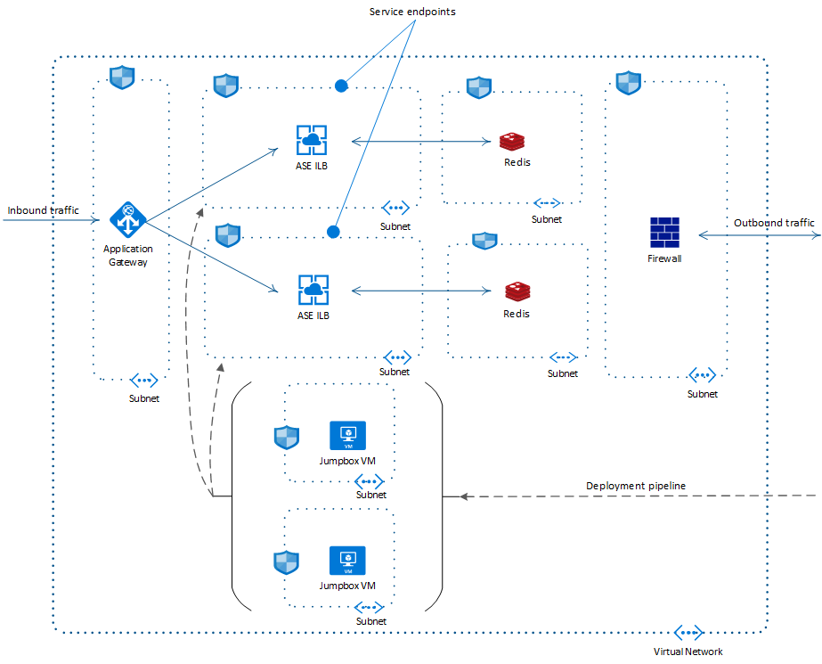

> [!NOTE]
> [App Service Environment](/azure/app-service/environment/overview) is the main component of this architecture. App Service Environment version 3 is now available. Versions 1 and 2 will be [retired on August 31, 2024](https://azure.microsoft.com/updates/app-service-environment-v1-and-v2-retirement-announcement/).

[Availability zones](/azure/availability-zones/az-overview) are physically separated collections of datacenters in a given region. Deploying resources across zones ensures that outages that are limited to a zone don't affect the availability of your applications. This architecture shows how you can improve the resiliency of an App Service Environment deployment by deploying it in a zone-redudant architecture. These zones aren't related to proximity. They can map to different physical locations for different subscriptions. The architecture assumes a single-subscription deployment.

When you configure an App Service Environment to be zone redundant, the platform automatically spreads the instances of the Azure App Service plan across three zones in the selected region. This means that the minimum App Service plan instance count is always three. If you specify a capacity larger than three, and the number of instances is divisible by three, the instances are spread evenly. Otherwise, any remaining instances are added to the remaining zone or spread across the remaining two zones.

Azure services that support availability zones can be zonal, zone-redundant, or both. Zonal services can be deployed to a specific zone, while zone-redundant services can be automatically deployed across zones. For detailed guidance and recommendations, read . The previous version of App Service Environments (ASEv2) only supported Zonal deployments, whereas current version of App Service Environment (ASEv3) support Zone-Redudant deployment.

 A reference implementation for this architecture is available on [GitHub](https://github.com/mspnp/app-service-environments-ILB-deployments).

## Architecture



*Download a [Visio file](../_files/ase-deployment.vsdx) of this architecture.*

The contents of the ASE subnets used in this reference implementation are the same as the ones in the standard ASE deployment architecture [described here](./ase-standard-deployment.yml). This reference implementation uses zone-redudant capabilities of ASEv3 and Azure Redis Cache to provide a higher availability. Note that the scope of this reference architecture is limited to a single region.

### Workflow

The following section shows the nature of availability for services used in this architecture:

[**App Services Environments**](/azure/app-service/environment/intro) - You can deploy an App Service Environment v3 that's enabled for zone redundancy. You can only set zone redundancy during creation and only in regions that support all App Service Environment v3 dependencies. Each App Service Plan in a zone-redundant App Service Environment will need to have a minimum of three instances so that they can be spread across zones.  There's a minimum charge of nine instances. See [this article for pricing guidance](/azure/app-service/environment/overview#pricing). For detailed guidance and recommendations, read [App Service Environment Support for Availability Zones](https://azure.github.io/AppService/2019/12/12/App-Service-Environment-Support-for-Availability-Zones.html).

[**Azure Virtual Network**](/azure/virtual-network/) or *Vnet* spans all availability zones limited to a single region. The subnets within the VNet also span across availability zones. For more information, read [the network requirements for App Service Environments](/azure/app-service/environment/networking#subnet-requirements).

[**Application Gateway**](/azure/application-gateway/overview) **v2** is *zone-redundant*. Like the virtual network, it spans multiple availability zones per region. This in turn means, a single application gateway is sufficient for a highly available system, as shown in this reference architecture. The reference implementation uses the WAF SKU of application gateway, which provides protection against common threats and vulnerabilities based on the Core Rule Set (CRS) from the Open Web Application Security Project (OWASP). For more details, read [Autoscaling and Zone-redundant Application Gateway v2](/azure/application-gateway/application-gateway-autoscaling-zone-redundant).

[**Azure Firewall**](/azure/firewall/overview) has built-in support for high availability. It can span across multiple zones without any additional configuration.  Although not used in this architecture, if necessary you can also configure a specific availability zone when deploying the firewall. Read [Azure Firewall and Availability Zones](/azure/firewall/overview#availability-zones) for more information.

[**Azure Active Directory**](/azure/active-directory/) is a highly available, highly redundant, global service, spanning availability zones as well as regions. Read [Advancing Azure Active Directory availability](https://azure.microsoft.com/blog/advancing-azure-active-directory-availability/) for more insights.

[**Github Actions**](https://azure.microsoft.com/products/devops/pipelines) provides *Continuous Integration and Continuous Deployment* capabilities in this architecture. Since the ASE is internal to the virtual network, a **virtual machine** is used as a *jumpbox* inside the VNet to deploy apps in the App Service plans. The action builds the apps outside the VNet. For enhanced security and seamless RDP/SSH connectivity, consider using [Azure Bastion](/azure/bastion/bastion-overview) as the jumpbox.

[**Azure Cache for Redis**](/azure/azure-cache-for-redis/) is a zone redundant service. A zone-redundant cache runs on VMs spread across multiple Availability Zones. It provides higher resilience and availability.

## Considerations

These considerations implement the pillars of the Azure Well-Architected Framework, which is a set of guiding tenets that can be used to improve the quality of a workload. For more information, see [Microsoft Azure Well-Architected Framework](/azure/architecture/framework).

### Availability

#### App Service Environments

Azure App Service Environment can be deployed across availability zones (AZ) to help you achieve resiliency and reliability for your business-critical workloads. This architecture is also known as zone redundancy.

When you configure to be zone redundant, the platform automatically spreads the instances of the Azure App Service plan across three zones in the selected region. This means that the minimum App Service Plan instance count will always be three. If you specify a capacity larger than three, and the number of instances is divisible by three, the instances are spread evenly. Otherwise, instance counts beyond 3*N are spread across the remaining one or two zones.

- You configure availability zones when you create your App Service Environment.
- All App Service plans created in that App Service Environment will need a minimum of 3 instances and those will automatically be zone redundant.
- You can only specify availability zones when creating a new App Service Environment. A pre-existing App Service Environment can't be converted to use availability zones.
- Availability zones are only supported in a [subset of regions](/azure/reliability/availability-zones-service-support#azure-regions-with-availability-zone-support).

For more details, read [App Service Environment Support for Availability Zones](/azure/reliability/migrate-app-service-environment).

### Resiliency

The applications running in the App Service Environment form the [backend pool](/azure/application-gateway/application-gateway-components#backend-pools) for the Application Gateway. When a request to the application is made from the public internet, the gateway forwards the request to the application running in ASE. This reference architecture implements [Health Checks](/aspnet/core/host-and-deploy/health-checks?view=aspnetcore-3.1) within the main web frontend, the *votingApp*. This health probe checks if the web API as well as the Redis cache are healthy. See the snippet that implements this probe in the [Startup.cs](https://github.com/mspnp/app-service-environments-ILB-deployments/blob/master/code/web-app-ri/VotingWeb/Startup.cs):

```dotnetcli
            var uriBuilder = new UriBuilder(Configuration.GetValue<string>("ConnectionStrings:VotingDataAPIBaseUri"))
            {
                Path = "/health"
            };

            services.AddHealthChecks()
                .AddUrlGroup(uriBuilder.Uri, timeout: TimeSpan.FromSeconds(15))
                .AddRedis(Configuration.GetValue<string>("ConnectionStrings:RedisConnectionString"));
```

The following snippet shows how the [commands_ha.azcli](https://github.com/mspnp/app-service-environments-ILB-deployments/blob/master/deployment/commands_ha.azcli) script configures the backend pools and the health probe for the App Gateway:

```bash
# Generates parameters file for appgw arm script
cat <<EOF > appgwApps.parameters.json
[
{
    "name": "votapp",
    "routingPriority": 100,
    "hostName": "${APPGW_APP1_URL}",
    "backendAddresses": [
      {
        "fqdn": "${INTERNAL_APP1_URL}"
      }
    ],
    "certificate": {
      "data": "${CERT_DATA_1}",
      "password": "${PFX_PASSWORD}"
    },
    "probePath": "/health"
  }
]
```

If either of the components fail in this health probe, that is the web frontend, the API, or the cache, the Application Gateway will route the request to the other application from the backend pool. This makes sure that the request is always routed to the application in a completely available ASE subnet.

The health probe is also implemented in the standard reference implementation. There the gateway simply returns error if the health probe fails. However, in the highly available implementation, it improves the resiliency of the application and the quality of the user experience.

### Cost optimization

Cost optimization is about looking at ways to reduce unnecessary expenses and improve operational efficiencies. For more information, see [Overview of the cost optimization pillar](/azure/architecture/framework/cost/overview).

The cost considerations for the high availability architecture are mostly similar to the standard deployment.

The following differences can affect the cost:

- There's a minimum charge of nine App Service plan instances in a zone redundant App Service Environment. See [App Service Environment pricing](/azure/app-service/environment/overview#pricing) for more information.
- Azure Cache for Redis is also a zone redundant service. A zone-redundant cache runs on VMs spread across multiple Availability Zones to provide higher resilience and availability.

The tradeoff for high availability, resilient, and secure system will be increased cost. Evaluate the enterprise needs with respect to the pricing, using the [pricing calculator](https://azure.microsoft.com/pricing/calculator/).

### Deployment considerations

This reference implementation uses the same production level CI/CD pipeline used in the standard deployment, with just one jumpbox virtual machine. You may, however, decide to have one jumpbox across each of the three zones. This reference architecture simplifies by using just one jumpbox since it doesnt affect the actual availability of the app as the jumpbox is used only for deployment and testing purposes.

## Deploy this scenario

To deploy the reference implementation for this architecture, see the [GitHub readme](https://github.com/mspnp/app-service-environments-ILB-deployments/blob/master/README.md), and follow the script for *high availability deployment*.

## Next steps

You can expand on the learnings demonstrated in this reference architecture, and horizontally scale your applications within the same region or across several regions, based on the expected peak load capacity. Replicating your applications on multiple regions may help mitigate the risks of wider geographical data center failures, such as due to earthquakes or other natural disasters. To learn more on horizontal scaling, read [Geo Distributed Scale with App Service Environments](/azure/app-service/environment/app-service-app-service-environment-geo-distributed-scale). For a global and highly-available routing solution, consider using [Azure Front Door](/azure/frontdoor/front-door-overview).
