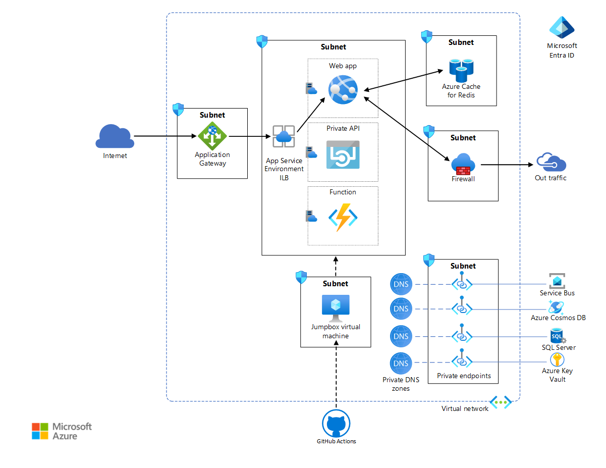
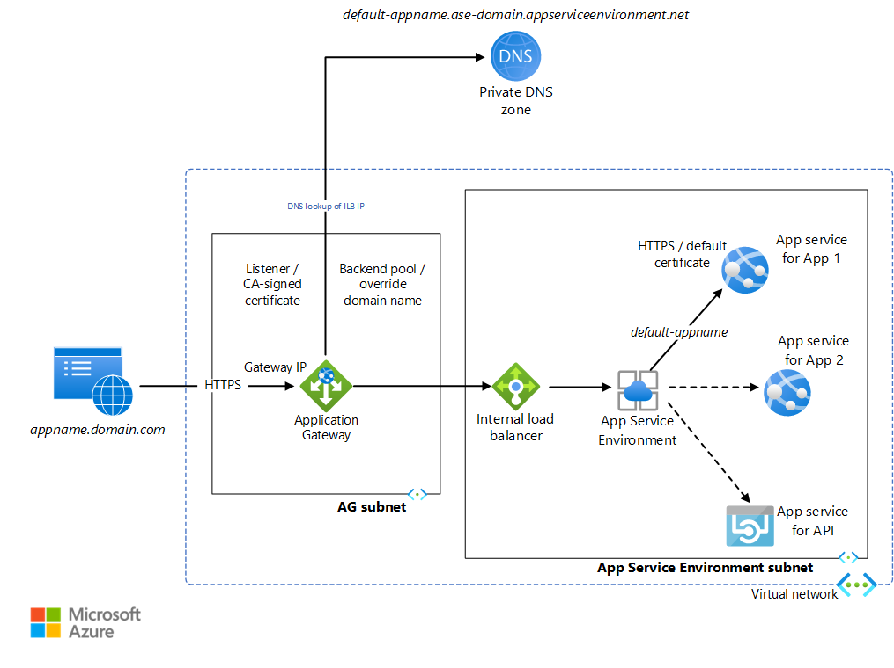

This reference architecture demonstrates a common enterprise workload that uses App Service Environment version 3 and describes best practices for tightening the security of the workload.

> [!NOTE]
> [App Service Environment](/azure/app-service/environment/overview) version 3 is the main component of this architecture. App Service Environment version 3 is now available. Versions 1 and 2 will be [retired on August 31, 2024](https://azure.microsoft.com/updates/app-service-environment-v1-and-v2-retirement-announcement/).

 A reference implementation for this architecture is available on [GitHub](https://github.com/mspnp/app-service-environments-ILB-deployments).

## Architecture



*Download a [Visio file](https://arch-center.azureedge.net/app-service-environment.vsdx) of this architecture.*

### Workflow

App Service Environment version 3 provides [advantages over earlier versions and different features](/azure/app-service/environment/overview#feature-differences). You can deploy App Service Environment as an external App Service Environment with a public IP address or as an internal App Service Environment, with an internal IP address that belongs to the internal load balancer (ILB). This reference architecture deploys an enterprise web application in an internal App Service Environment, also called an ILB App Service Environment. Use an ILB App Service Environment when your scenario requires you to:

- Host intranet applications with enhanced security in the cloud, which you access via a site-to-site VPN or Azure ExpressRoute.
- Provide a layer of protection for apps by using a web application firewall (WAF).
- Host apps in the cloud that aren't listed in public DNS servers.
- Create internet-isolated back-end apps, which your front-end apps can integrate with in a highly secure way.

App Service Environment must be always deployed in its own subnet in the enterprise virtual network to allow tight control of the incoming and outgoing traffic. Within this subnet, App Service applications are deployed in one or more [App Service plans](/azure/app-service/overview-hosting-plans), which is a collection of physical resources required to run the app. Depending on the complexity and resource requirement, an App Service plan can be shared between multiple apps. This reference implementation deploys a web app named *Voting App*, that interacts with a private web API and a function. It also deploys a dummy web app named *Test App* to demonstrate multi-app deployments. Each App Service app is hosted in its own App Service plan, allowing each to be scaled independently if necessary. All resources required by these hosted apps, such as storage and compute, as well as scaling needs are fully managed by the App Service Environment infrastructure.

The simple voting app in this implementation, allows users to view existing or create new entries, as well as vote on the existing entries. The web API is used for creation and retrieval of entries and votes. The data itself is stored in a SQL Server database. To demonstrate asynchronous data updates, the web app queues newly added votes in a Service Bus instance. The function picks up queued votes and updates the SQL database. Azure Cosmos DB is used to store a mock-up ad, that the web app retrieves to display on the browser. The application uses Azure Cache for Redis for cache management. A Premium tier Azure Cache for Redis is used, which allows configuration to the same virtual network as the App Service Environment, in its own subnet. This provides enhanced security and isolation to the cache.

The web apps are the only components accessible to the internet via Application Gateway. The API and the function are inaccessible from an internet client. The inbound traffic is protected by a Web Application Firewall that's configured on Application Gateway.

### Components

The following services are key to locking down the App Service Environment in this architecture:

- [Azure Virtual Network](https://azure.microsoft.com/products/virtual-network) is a private Azure cloud network that's owned by an enterprise. It provides enhanced network-based security and isolation. App Service Environment is an App Service deployment into a subnet of the enterprise-owned virtual network. It allows the enterprise to tightly control that network space and the resources it accesses by using network security groups and private endpoints.

- [Application Gateway](https://azure.microsoft.com/products/application-gateway) is an application-level web traffic load balancer with TLS/SSL offloading and WAF. It listens on a public IP address and routes traffic to the application endpoint in the ILB App Service Environment. Since this is application-level routing, it can route traffic to multiple apps within the same ILB App Service Environment. For more information, see [Application Gateway multiple site hosting](/azure/application-gateway/multiple-site-overview).

- [Azure Firewall](https://azure.microsoft.com/products/azure-firewall) is used to restrict the outbound traffic from the web application. Outgoing traffic that does not go through the private endpoint channels and a route table required by App Service Environment, is directed to the firewall subnet. For the sake of simplicity, this architecture configures all private endpoints on the services subnet.

- [Azure Active Directory](https://azure.microsoft.com/products/active-directory) or Azure AD provides access rights and permissions management to Azure resources and services. [*Managed Identities*](/azure/active-directory/managed-identities-azure-resources/overview) assigns identities to services and apps, automatically managed by Azure AD. These identities can be used to authenticate to any service that supports Azure AD authentication. This removes the need to explicitly configure credentials for these apps. This architecture assigns a managed identity to the web app.

- [Azure Key Vault](https://azure.microsoft.com/products/key-vault) stores any secrets and credentials required by the apps. Use this option over storing secrets directly in the application.

- [GitHub Actions](https://azure.microsoft.com/products/devops/pipelines) provides continuous integration and continuous deployment capabilities in this architecture. Because the App Service Environment is in the virtual network, a virtual machine is used as a jumpbox inside the virtual network to deploy apps in the App Service plans. The action builds the apps outside the virtual network. For enhanced security and seamless RDP/SSH connectivity, consider using [Azure Bastion](/azure/bastion/bastion-overview) for the jumpbox.

### Multi-site configuration



*Download a [Visio file](https://arch-center.azureedge.net/app-service-environment.vsdx) of this architecture.*

Internal App Service Environment can host several web apps and APIs with HTTP endpoints. These applications are locked down from the public internet as the ILB IP is only accessible from within the Virtual Network. [Application Gateway](/azure/application-gateway/overview) is used to selectively expose these applications to the internet. App Service Environment assigns a default URL to each App Service application as `<default-appName>.<app-service- environment-domain>.appserviceenvironment.net`. A [private DNS zone](/azure/dns/private-dns-overview) is created that maps the App Service Environment domain name to the App Service Environment ILB IP address. This avoids using a custom DNS to access the apps within the virtual network.

Application Gateway is configured such that a [listener](/azure/application-gateway/configuration-overview#listeners) listens on the HTTPS port for requests to the Gateway's IP address. For the sake of simplicity, this implementation doesn't use a public DNS name registration. It requires that you modify the localhost file on your computer to point an arbitrarily chosen URL to the Application Gateway IP. For simplicity, the listener uses a self-signed certificate to process these requests. Application Gateway has [backend pools](/azure/application-gateway/configuration-overview#back-end-pool) for each App Service application's default URL. A [routing rule](/azure/application-gateway/configuration-overview#request-routing-rules) is configured to connect the listener to the backend pool. [HTTP settings](/azure/application-gateway/configuration-overview#http-settings) are created that determine whether the connection between the gateway and the App Service Environment will be encrypted. These settings are also used to override the incoming HTTP host header with a host name picked from the backend pool. This implementation uses default certificates created for the default App Service Environment app URLs, which are trusted by the gateway. The request is redirected to the default URL of the corresponding app. The private [DNS linked to the virtual network](/azure/dns/private-dns-virtual-network-links) forwards this request to the ILB IP. The App Service Environment then forwards this to the requested app service. Any HTTP communication within the App Service Environment apps goes through the private DNS. Note that the listener, backend pool, routing rule, and HTTP settings need to be configured on the application gateway for each App Service Environment app.

Review [appgw.bicep](https://github.com/mspnp/app-service-environments-ILB-deployments/blob/master/deployment/templates/appgw.bicep) and [dns.bicep](https://github.com/mspnp/app-service-environments-ILB-deployments/blob/master/deployment/templates/dns.bicep) to learn how these configurations are made to allow multiple sites. The web app named `testapp` is an empty app created to demonstrate this configuration. These JSON files are accessed from the deployment script [commands_std.azcli](https://github.com/mspnp/app-service-environments-ILB-deployments/blob/master/deployment/commands_std.azcli). These are also accessed by [commands_ha.azcli](https://github.com/mspnp/app-service-environments-ILB-deployments/blob/master/deployment/commands_ha.azcli), which is used for [a high availability multi-site App Service Environment deployment](./ase-high-availability-deployment.yml).

## Scenario details

[Azure App Service](/azure/app-service/overview) is a PaaS service used to host a variety of apps on Azure: web apps, API apps, functions, and mobile apps. [App Service Environment](/azure/app-service/environment/intro) allows enterprises to deploy their App Service apps in a subnet in their own [Azure Virtual Network](/azure/virtual-network), providing an isolated, highly scalable, and dedicated environment for their cloud workloads.

## Considerations

These considerations implement the pillars of the Azure Well-Architected Framework, which is a set of guiding tenets that can be used to improve the quality of a workload. For more information, see [Microsoft Azure Well-Architected Framework](/azure/architecture/framework).

### Security

Security provides assurances against deliberate attacks and the abuse of your valuable data and systems. For more information, see [Overview of the security pillar](/azure/architecture/framework/security/overview).

#### App Service Environment

An internal App Service Environment is deployed in the enterprise virtual network, hidden from the public internet. It allows the enterprise to lock down their backend services, such as web APIs and functions, at the network level. Any App Service Environment app with an HTTP endpoint, can be accessed through the ILB, from within the virtual network. Application Gateway is configured to forward requests to the web app through the ILB. The web app itself goes through the ILB to access the API. The critical backend components, that is, the API and the function, are effectively inaccessible from the public internet.

Default certificates are created for each app service for the default domain name assigned by App Service Environment. This certificate can tighten the security of the traffic between the gateway and the app, and might be required in certain scenarios. These certificates aren't visible via the client browser. It can only respond to the certificates configured on Application Gateway.

#### Application Gateway

The reference implementation configures Application Gateway programmatically in [appgw.bicep](https://github.com/mspnp/app-service-environments-ILB-deployments/blob/master/deployment/templates/appgw.bicep). The file [deploy_std.azcli](https://github.com/mspnp/app-service-environments-ILB-deployments/blob/master/deployment/deploy_std.azcli) uses this configuration when deploying the gateway:

```azurecli
az deployment group create --resource-group $RGNAME --template-file templates/appgw.bicep --parameters vnetName=$VNET_NAME appgwSubnetAddressPrefix=$APPGW_PREFIX appgwApplications=@appgwApps.parameters.json
APPGW_PUBLIC_IP=$(az deployment group show -g $RGNAME -n appgw --query properties.outputs.appGwPublicIpAddress.value -o tsv)
```

##### Encryption

As described in the [Overview of TLS termination and end to end TLS with Application Gateway](/azure/application-gateway/ssl-overview), Application Gateway can use Transport Layer Security (TLS)/Secure Sockets Layer (SSL) to encrypt and protect all traffic from web browsers. Encryption can be configured in the following ways:

- **Encryption terminated at the gateway**.  The backend pools in this case are configured for HTTP. The encryption stops at the gateway, and traffic between the gateway and the app service is unencrypted. Since encryption is CPU-intensive, unencrypted traffic at the backend improves performance and allows simpler certificate management. This provides a reasonable level of security since the backend is secured by virtue of the network configuration.

- **End-to-end encryption**. In some scenarios, such as specific security or compliance requirements, the traffic might be required to be encrypted between the gateway and the app. This is achieved by using HTTPS connection, and configuring certificates at the backend pool.

This reference implementation uses self-signed certificates for Application Gateway. For production code, a certificate issued by a Certificate Authority should be used. For a list of supported certificate types, see [Certificates supported for TLS termination](/azure/application-gateway/ssl-overview#certificates-supported-for-tls-termination). Read [Configure an application gateway with TLS termination using the Azure portal](/azure/application-gateway/create-ssl-portal) to learn how to create Gateway-terminated encryption. The following lines of code in appgw.bicep configure this programmatically:

```bicep
          httpListeners: [for item in appgwApplications: {
          name: '${appgwListenerName}${item.name}'
          properties: {
            frontendIPConfiguration: {
              id: '${appgwId}/frontendIPConfigurations/${appgwFrontendName}'
            }
            frontendPort: {
              id: '${appgwId}/frontendPorts/port_443'
            }
            protocol: 'Https'
            sslCertificate: {
              id: '${appgwId}/sslCertificates/${appgwSslCertificateName}${item.name}'
            }
            hostName: item.hostName
            requireServerNameIndication: true
          }
        }]
```

The reference implementation demonstrates end-to-end encryption for traffic between Application Gateway and the web apps on the App Service Environment, the default SSL certificates are used. The backend pools in this implementation are configured to redirect HTTPS traffic with host name overridden by the default domain names associated to the web apps. Application Gateway trusts the default SSL certificates because they're issued by Microsoft. See [Configure App Service with Application Gateway](/azure/application-gateway/configure-web-app-portal) for information about how these configurations are made. The following lines in appgw.bicep show how this is configured in the reference implementation:

```bicep
        backendHttpSettingsCollection: [for item in appgwApplications: {
        name: '${appgwHttpSettingsName}${item.name}'
        properties: {
          port: 443
          protocol: 'Https'
          cookieBasedAffinity: 'Disabled'
          pickHostNameFromBackendAddress: true
          requestTimeout: 20
          probe: {
            id: '${appgwId}/probes/${appgwHealthProbeName}${item.name}'
          }
        }
      }]
```

##### Web Application Firewall

[Web Application Firewall (WAF) on Application Gateway](/azure/web-application-firewall/ag/ag-overview) protects the web apps from malicious attacks, such as SQL injection. It is also integrated with Azure Monitor, to monitor attacks using a real-time log. WAF needs to be enabled on the gateway, as described in [Create an application gateway with a Web Application Firewall using the Azure portal](/azure/web-application-firewall/ag/application-gateway-web-application-firewall-portal). The reference implementation enables WAF programmatically in the appgw.bicep file with the following snippet:

```bicep
        webApplicationFirewallConfiguration: {
        enabled: true
        firewallMode: 'Detection'
        ruleSetType: 'OWASP'
        ruleSetVersion: '3.0'
      }
```

#### Virtual Network

[Network security groups](/azure/virtual-network/security-overview#how-traffic-is-evaluated) can be associated with one or more subnets in the virtual network. These are security rules that allow or deny traffic to flow between various Azure resources. This architecture associates a separate network security group for each subnet. This allows fine-tuning of these rules per subnet, as per the services contained in that subnet. For example, see the configuration for `"type": "Microsoft.Network/networkSecurityGroups"` in the file [ase.bicep](https://github.com/mspnp/app-service-environments-ILB-deployments/blob/master/deployment/templates/ase.bicep) for the network security group for the App Service Environment subnet, and in the file [appgw.bicep](https://github.com/mspnp/app-service-environments-ILB-deployments/blob/master/deployment/templates/appgw.bicep) for the network security group for the Application Gateway subnet.

[Private endpoints](/azure/private-link/private-endpoint-overview) enable enhanced security private connectivity between clients and Azure services over a private network. They provide a privately accessible IP address for the Azure service, enabling enhanced-security traffic to an Azure Private Link resource. The platform validates network connections, allowing only those that connect to the specified Private Link resource. Private endpoints support network policies like network security groups, user defined routes, and application security groups. To improve security, you should enable private endpoints for any Azure service that supports them. You can then improve security for the service in the virtual network by disabling pubic access, effectively blocking any access from the public internet. This architecture configures private endpoints for the services that support it: Azure Service Bus, SQL Server, Key Vault, and Azure Cosmos DB. You can see the configuration in [privatendpoints.bicep](https://github.com/mspnp/app-service-environments-ILB-deployments/blob/master/deployment/templates/privateendpoints.bicep).

To enable private endpoints, you also need to configure private DNS zones. For more information, see [Azure Private Endpoint DNS configuration](/azure/private-link/private-endpoint-dns).

#### Firewall

[Azure Firewall](/azure/firewall/overview) and private endpoints complement each other. Private endpoints help protect resources by allowing only traffic that originates from your virtual network. Azure Firewall enables you to restrict the outbound traffic from your applications. We recommend that you let all outbound traffic to pass through the firewall subnet, including private endpoint traffic. This enables better monitoring of the outbound traffic. For the sake of simplicity, this reference architecture configures all private endpoints on the services subnet instead of on the firewall subnet.

To learn how Azure Firewall integrates with the App Service Environment, see [Configuring Azure Firewall with your App Service Environment](/azure/app-service/environment/networking#network-routing). Any traffic that doesn't traverse the private endpoints and virtual network route table is monitored and gated by the firewall.

#### Azure Active Directory

Azure Active Directory provides security features to authenticate applications and authorize access to resources. This reference architecture uses two key features of Azure Active Directory: managed identities, and Azure role-based access control.

When building cloud applications, the credentials required to authenticate to cloud services, must be secured. Ideally, the credentials should never appear on developer workstations or checked into source control. Azure Key Vault provides a way to securely store credentials and secrets, but the app still has to authenticate to Key Vault to retrieve them. **Managed Identities for Azure resources** provides Azure services with an automatically managed identity in Azure AD. This identity can be used to authenticate to any service that supports Azure AD authentication, including Key Vault, without any credentials in the application.

[Azure role-based access control (Azure RBAC)](/azure/role-based-access-control/overview) manages access to Azure resources. This includes:

- Which entity has the access: user, managed identity, security principal.
- What type of access it has: owner, contributor, reader, admin.
- Scope of the access: resource, resource group, subscription, or management group.

You can lock down access to App Service Environment applications by tightly controlling the role required and the type of access for each app. This way, multiple apps can be deployed on the same App Service Environment from different development teams. For example, the frontend might be handled by one team, and the backend by another. Azure RBAC can be used to limit each team's access to the app(s) it is working on. Explore [Azure custom roles](/azure/role-based-access-control/custom-roles) to create roles suitable to your organization.

#### Key Vault

Some services support managed identities, however they use Azure RBAC to set up permissions for the app. For example, see Service Bus' [built-in roles](/azure/service-bus-messaging/service-bus-managed-service-identity#built-in-rbac-roles-for-azure-service-bus), as well as [Azure RBAC in Azure Cosmos DB](/azure/cosmos-db/role-based-access-control). *Owner* access to the subscription is required for granting these permissions, even though personnel with *Contributor* access can deploy these services. To allow a wider team of developers to be able to run the deployment scripts, the next best option is to use native access control policies of the service:

- For Service Bus, it is [Shared Access Signatures](/azure/service-bus-messaging/service-bus-authentication-and-authorization#shared-access-signature),
- For Azure Cosmos DB, it is the [Master Keys](/azure/cosmos-db/secure-access-to-data#master-keys).

The connection strings for these access control policies are then stored in Key Vault. The vault itself is accessed through managed identities, which require Azure RBAC. Set the access policy for these connection strings appropriately. For example, read-only for the backend, write-only for the frontend, and so on, instead of using default root access policy.

The following code in [services.bicep](https://github.com/mspnp/app-service-environments-ILB-deployments/blob/master/deployment/templates/services.bicep) shows the Key Vault configuration for these services:

```bicep
      resource keyVaultName_CosmosKey 'Microsoft.KeyVault/vaults/secrets@2022-07-01' = {
      parent: keyVaultName
      name: 'CosmosKey'
      properties: {
        value: cosmosName.listKeys().primaryMasterKey 
      }
    }

      resource keyVaultName_ServiceBusListenerConnectionString 'Microsoft.KeyVault/vaults/secrets@2022-07-01' = {
      parent: keyVaultName
      name: 'ServiceBusListenerConnectionString'
      properties: {
        value: listKeys(serviceBusName_ListenerSharedAccessKey.id, '2021-11-01').primaryConnectionString
      }
    }

      resource keyVaultName_ServiceBusSenderConnectionString 'Microsoft.KeyVault/vaults/secrets@2022-07-01' = {
      parent: keyVaultName
      name: 'ServiceBusSenderConnectionString'
      properties: {
        value: listKeys(serviceBusName_SenderSharedAccessKey.id, '2021-11-01').primaryConnectionString
      }
    }
```

These connection string values are accessed by the apps, which reference the Key Vault key/value pair. This is done in the [sites.bicep](https://github.com/mspnp/app-service-environments-ILB-deployments/blob/master/deployment/templates/sites.bicep) file, as the following code for Voting App shows:

```bicep
  properties: {
    enabled: true
    hostingEnvironmentProfile: {
      id:aseId
    }
    serverFarmId: votingWebPlanName.id
    siteConfig: {
      appSettings: [
        {
          name: 'ConnectionStrings:sbConnectionString'
          value: '@Microsoft.KeyVault(SecretUri=${reference(resourceId('Microsoft.KeyVault/vaults/secrets', keyVaultName, serviceBusSenderConnectionStringSecretName), '2022-07-01').secretUriWithVersion})'
        }
        {
          name: 'ConnectionStrings:RedisConnectionString'
          value: '@Microsoft.KeyVault(SecretUri=${reference(keyVaultName_redisSecretName.id, '2022-07-01').secretUriWithVersion})'
        }
        {
          name: 'ConnectionStrings:CosmosKey'
          value: '@Microsoft.KeyVault(SecretUri=${reference(resourceId('Microsoft.KeyVault/vaults/secrets', keyVaultName, cosmosKeySecretName), '2022-07-01').secretUriWithVersion})'
        }
      ]
    }
  }
```

The function also accesses the Service Bus listener connection string in a similar manner.

### Scalability

#### Design scalable apps

The application in this reference architecture is structured so that individual components can be scaled based on usage. Each web app, API, and function is deployed in its own App Service plan. You can monitor each app for any performance bottlenecks, and then [scale it up](/azure/app-service/manage-scale-up) if required. Read [Improve scalability in an Azure web application](../app-service-web-app/scalable-web-app.yml) to learn how to design scalable web applications using Azure App Service.

#### Autoscaling Application Gateway

Autoscaling can be enabled on Azure Application Gateway V2. This allows Application Gateway to scale up or down based on the traffic load patterns. This reference architecture configures `autoscaleConfiguration` in the file [appgw.bicep](https://github.com/mspnp/app-service-environments-ILB-deployments/blob/master/deployment/templates/appgw.bicep) to scale between zero and 10 additional instances. See [Scaling Application Gateway and WAF v2](/azure/application-gateway/application-gateway-autoscaling-zone-redundant#scaling-application-gateway-and-waf-v2) for more details.

### Deployment

The deployment scripts in this reference architecture are used to deploy App Service Environment, other services, and the applications inside the App Service Environment. Once these applications are deployed, enterprises might want to have a plan for continuous integration and deployment for app maintenance and upgrades. This section shows some of the common ways developers use for CI/CD of App Service Environment applications.

Apps can be deployed to an internal App Service Environment only from within the virtual network. The following three methods are widely used to deploy App Service Environment apps:

- **Manually inside the Virtual Network:** Create a virtual machine inside the App Service Environment virtual network with the required tools for the deployment. Open up the RDP connection to the VM using an NSG configuration. Copy your code artifacts to the VM, build, and deploy to the App Service Environment subnet. This is a simple way to set up an initial build and test development environment. It is however not recommended for production environment since it cannot scale the required deployment throughput.

- **Point to site connection from local workstation:** This allows you to extend your App Service Environment virtual network to your development machine, and deploy from there. This is another way to set up an initial dev environment, and not recommended for production.

- **Through Azure Pipelines:** This implements a complete CI/CD pipeline, ending in an agent located inside the virtual network. This is ideal for production environments requiring high throughput of deployment. The build pipeline remains entirely outside the virtual network. The deploy pipeline copies the built objects to the build agent inside the virtual network, and then deploys to the App Service Environment subnet. For more information, read this discussion on the [self-hosted build agent between Pipelines and the App Service Environment virtual network](/azure/devops/pipelines/agents/v2-windows).

Using Azure Pipelines is recommended for production environments. Scripting CI/CD with the help of [Azure Pipelines YAML schema](/azure/devops/pipelines/yaml-schema) helps to automate the build and deployment processes. The [azure-pipelines.yml](https://github.com/mspnp/app-service-environments-ILB-deployments/blob/master/code/web-app-ri/VotingWeb/azure-pipelines.yml) implements such a CI/CD pipeline for the web app in this reference implementation. There are similar CI/CD scripts for the [web API](https://github.com/mspnp/app-service-environments-ILB-deployments/blob/master/code/web-app-ri/VotingData/azure-pipelines.yml) as well as the [function](https://github.com/mspnp/app-service-environments-ILB-deployments/blob/master/code/function-app-ri/azure-pipelines.yml). Read [Use Azure Pipelines](/azure/devops/pipelines/get-started/pipelines-get-started) to learn how these are used to automate CI/CD for each application.

Some enterprises may not want to maintain a permanent build agent inside the virtual network. In that case, you can choose to create a build agent within the DevOps pipeline, and tear it down once the deployment is completed. This adds another step in the DevOps, however it lowers the complexity of maintaining the VM. You may even consider using containers as build agents, instead of VMs. Build agents can also be completely avoiding by deploying from a *zipped file placed outside the virtual network*, typically in a storage account. The storage account will need to be accessible from the App Service Environment. The pipeline should be able to access the storage. At the end of the release pipeline, a zipped file can be dropped into the blob storage. The App Service Environment can then pick it up and deploy. Be aware of the following limitations of this approach:

- There is a disconnect between the DevOps and the actual deployment process, leading to difficulties in monitoring and tracing any deployment issues.
- In a locked down environment with secured traffic, you may need to change the rules to access the zipped file on the storage.
- You will need to install specific extensions and tools on the App Service Environment to be able to deploy from the zip.

To know some more ways the apps can be deployed to the App Service plans, read [the App Service articles focusing on deployment strategies](/azure/app-service/deploy-run-package).

### Cost optimization

Use the [Azure pricing calculator](https://azure.microsoft.com/pricing/calculator) to estimate costs. Other considerations are described in the Cost section in [Microsoft Azure Well-Architected Framework](/azure/architecture/framework/cost/overview). Azure Reservations help you save money by committing to one-year or three-years plans for many Azure resources. Read more in the article [Buy a reservation](/azure/cost-management-billing/reservations/prepare-buy-reservation).

Here are some points to consider for some of the key services used in this architecture.

#### App Service Environment v3

There are various [pricing options available for App Service](https://azure.microsoft.com/pricing/details/app-service/windows). An App Service Environment is deployed using the Isolated v2 Service Plan. Within this plan, there are multiple options for CPU sizes, from I1v2 through I6v2. This reference implementation uses three I1v2s per instance.

#### Application Gateway

[Application Gateway pricing](https://azure.microsoft.com/pricing/details/application-gateway/) provides various pricing options. This implementation uses the Application Gateway Standard v2 and WAF v2 SKU, which supports autoscaling and zone redundancy. See [Scaling Application Gateway v2 and WAF v2](/azure/application-gateway/application-gateway-autoscaling-zone-redundant#pricing) for more information about the pricing model used for this SKU.

#### Azure Cache for Redis

[Azure Cache for Redis pricing](https://azure.microsoft.com/pricing/details/cache) provides the various pricing options for this service. This architecture uses the *Premium SKU*, for the virtual network support.

The following are pricing pages for other services used to lock down the App Service Environment:

- [Azure Firewall pricing](https://azure.microsoft.com/pricing/details/azure-firewall)

- [Key Vault pricing](https://azure.microsoft.com/pricing/details/key-vault)

- [Azure Active Directory pricing](https://azure.microsoft.com/pricing/details/active-directory)

## Deploy this scenario

To deploy the reference implementation for this architecture, see the [GitHub readme](https://github.com/mspnp/app-service-environments-ILB-deployments/blob/master/README.md), and follow the script for *standard deployment*.

## Contributors

*This article is maintained by Microsoft. It was originally written by the following contributors.* 

Principal author:

- [Dhanashri Kshirsagar](https://www.linkedin.com/in/dhanashrikr/) | Senior Content PM

 Other contributors:

- [Deep Bhattacharya](https://www.linkedin.com/in/deeplydiligent/) | Cloud Solution Architect
- [Suhas Rao](https://www.linkedin.com/in/suhasaraos/) | Cloud Solution Architect

*To see non-public LinkedIn profiles, sign in to LinkedIn.*

## Next steps

- [Run your app in Azure App Service directly from a ZIP package](/azure/app-service/deploy-run-package)
- [Azure Pipelines YAML schema](/azure/devops/pipelines/yaml-schema)
- [Get your management addresses from API](/azure/app-service/environment/management-addresses#get-your-management-addresses-from-api)
- [Azure Key Vault](/azure/key-vault)
- [Azure Pipelines](/azure/devops/pipelines)

## Related resources

To learn how to extend this architecture to support high availability, read [High availability app deployment using App Services Environment](./ase-high-availability-deployment.yml).
