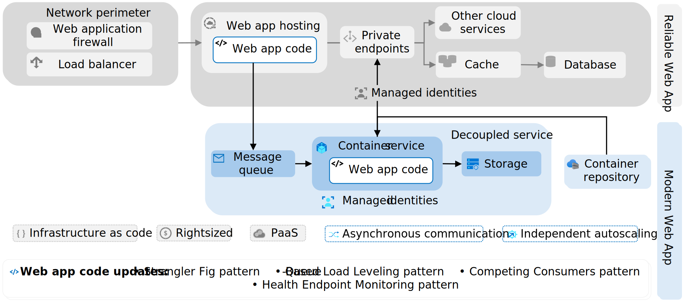
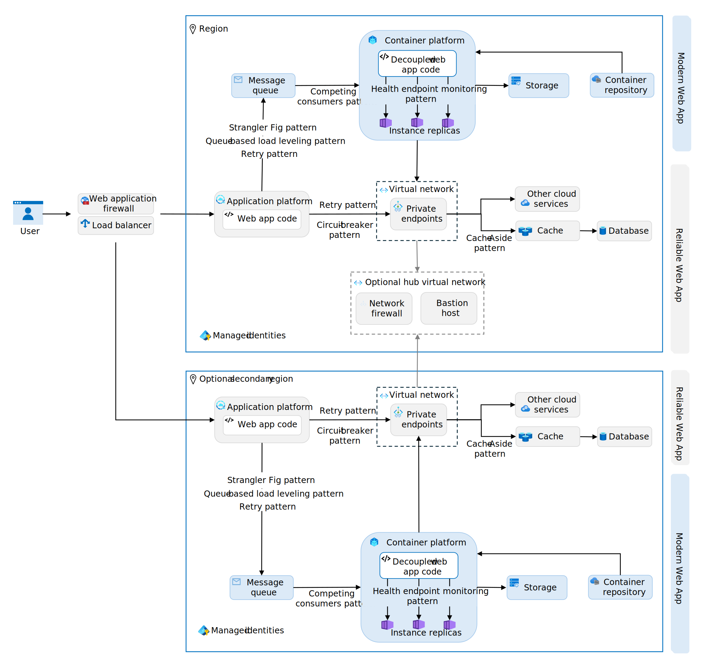
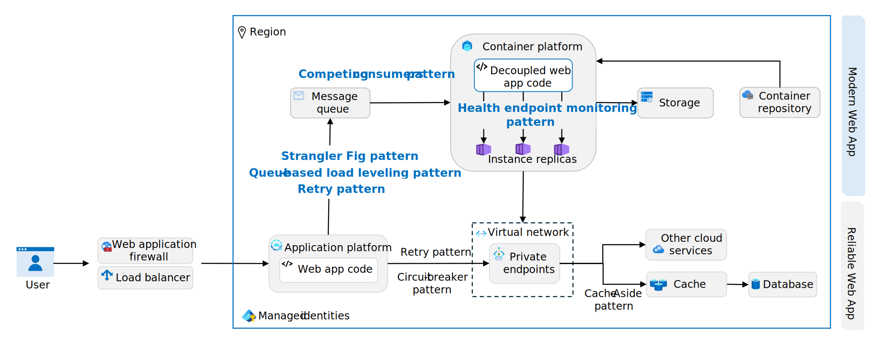
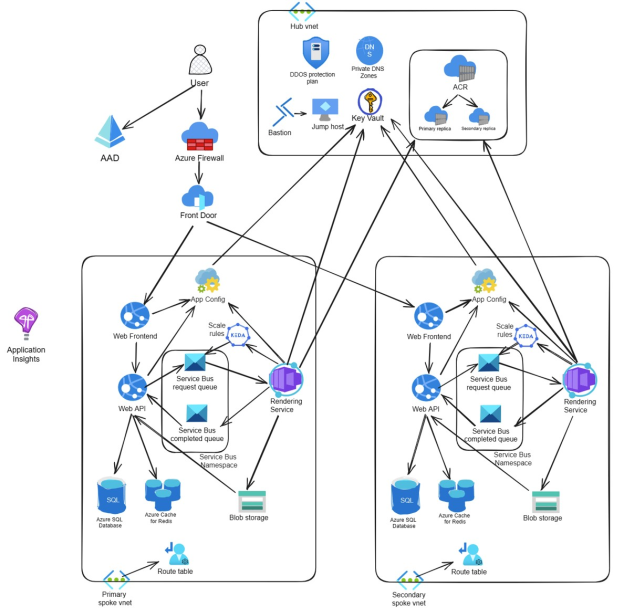

This article shows you how to implement the Modern Web App pattern. The Modern Web App pattern defines how you should modernize web apps in the cloud and introduce a service-oriented architecture. The Modern Web App pattern provides prescriptive architecture, code, and configuration guidance that aligns with the principles of the [Well-Architected Framework](/azure/well-architected/) (WAF) and builds on the [Reliable Web App pattern](../../overview.md#reliable-web-app-pattern).

*Why use the Modern Web App pattern?* The Modern Web App pattern helps optimize high-demand areas of your web application. It offers detailed guidance to decouple these areas, enabling independent scaling for cost optimization. This approach allows you to allocate dedicated resources to critical components, enhancing overall performance. Decoupling separable services can improve reliability by preventing slowdowns in one part of the app from affecting others and enable versioning individual app components independently.

*How to implement the Modern Web App pattern:* This article contains architecture, code, and configuration guidance to implement the Modern Web App pattern. Use the following links to navigate to the guidance you need:

- [***Architecture guidance***](#architecture-guidance): Learn how to modularize web app components and select appropriate platform-as-a-service (PaaS) solutions.
- [***Code guidance***](#code-guidance): Implement four design patterns to optimize the decoupled components: Strangler Fig, Queue-Based Load Leveling, Competing Consumers, and Health Endpoint Monitoring patterns.
- [***Configuration guidance***](#configuration-guidance): Configure authentication, authorization, autoscaling, and containerization for the decoupled components.

> [!TIP]
>  There's a ***[reference implementation][reference-implementation]*** (sample app) of the Modern Web App pattern. It represents the end-state of the Modern Web App implementation. It's a production-grade web app that features all the code, architecture, and configuration updates discussed in this article. Deploy and use the reference implementation to guide your implementation of the Modern Web App pattern.

## Architecture guidance

The Modern Web App pattern builds on the Reliable Web App pattern. It requires a few additional architectural components to implement. You need a message queue, container platform, another storage service, and a container registry (*see figure 1*).

[](../../../_images/mwa-architecture.svg#lightbox)
*Figure 1. Essential architectural elements of the Modern Web App pattern.*

To reach a higher service-level objective, you can use multiple region, in which case you should use a hub-and-spoke architecture to derive the benefits of shared network resources (*see figure 2*).

[](../../../_images/mwa-architecture-plus-optional.svg#lightbox)
*Figure 2. The Modern Web App pattern architecture with second region and hub-and-spoke network topology.*

### Decouple architecture

To implement the Modern Web App pattern, you need to decouple the existing web app architecture. Decoupling architecture involves breaking down a monolithic application into smaller, independent services, each responsible for a specific feature or functionality. This process entails evaluating the current web app, modifying the architecture, and finally, extracting the web app code to a container platform. The goal is to systematically identify and extract application services that will benefit most from being decoupled. To decouple your architecture, follow these recommendations:

- *Identify service boundaries* Apply domain driven design principles to identify bounded contexts within your monolithic application. Each bounded context represents a logical boundary and can be a candidate for a separate service. Services that represent distinct business functions and have fewer dependencies are good candidates for decoupling.

- *Evaluate service benefits.* Focus on services that benefit most from independent scaling. For example, a high-traffic service like order processing in an e-commerce application might require more frequent scaling. Consider services that undergo frequent updates or changes. Decoupling these services allows for independent deployment and reduces the risk of affecting other parts of the application.

- *Assess technical feasibility.* Examine the current architecture to identify technical constraints and dependencies that might affect the decoupling process. Plan how data is managed and shared across services. Decoupled services should manage their own data and minimize direct database access across service boundaries.

- *Deploy Azure services.* Select and deploy the Azure services you need to support the web app service you intended to extract. Use the following [Select the right Azure services](#select-the-right-azure-services) section for guidance.

- *Decouple web app service.* Define clear interfaces and APIs for the newly extracted web app services to interact with other parts of the system. Design a data management strategy that allows each service to manage its own data while ensuring consistency and integrity. For specific implementation strategies and design patterns to use during this extraction process, refer to the [Code guidance](#code-guidance) section.

- *Use independent storage for decoupled services.* Each decoupled service should have its own data stores to ease versioning and deployment. For example, the reference implementation separates the ticket rendering service from the web API and eliminates the need for the service to access the API’s database. Instead, the service communicates the URL where ticket images were generated back to the web API via a Service Bus message, and the API persists the path to its database.

- *Implement separate deployment pipelines for each decoupled service.* Separate deployment pipelines allow each service to be updated at its own pace. If different teams or organizations within your company own different services, having separate deployment pipelines gives each team control over their own deployments. Use CI/CD tools like Jenkins, GitHub Actions, or Azure Pipelines to set up these pipelines.

- *Revise security controls.* Ensure that your security controls are updated to account for the new architecture, including firewall rules and access controls.

### Select the right Azure services

For the Modern Web App pattern, you need a messaging system to support asynchronous messaging, an application platform that supports containerization, and a container image repository.

- *Choose a message queue.* A message queue is an important piece of service-oriented architectures. It decouples message senders and receivers to enable [asynchronous messaging](/azure/architecture/guide/technology-choices/messaging). Use the guidance on choosing an [Azure messaging service](/azure/service-bus-messaging/compare-messaging-services) to pick an Azure messaging system that supports your design needs. Azure has three messaging services: Azure Event Grid, Azure Event Hubs, and Azure Service Bus. Start with Azure Service Bus as the default choice and use the other two options if Azure Service Bus doesn't meet your needs.

| Service| Description |
|-------|-------|
| Azure Service Bus | Choose Azure Service Bus for reliable, ordered, and possibly transactional delivery of high-value messages in enterprise applications. |
| Azure Event Grid | Choose Azure Event Grid when you need a highly scalable service to react to status changes through a publish-subscribe model.|
| Azure Event Hubs| Choose Azure Event Hubs for large-scale data ingestion, especially when dealing with data that requires real-time processing.|

- *Implement a container service.* For the parts of your application that you want to containerize, you need an application platform that supports containers. Use the [Choose an Azure container service](/azure/architecture/guide/choose-azure-container-service) guidance to help make your decision. Azure has three principal container services: Azure Container Apps, Azure Kubernetes Service, and App Service. Start with Azure Container Apps as the default choice and use the other two options if Azure Container Apps doesn't meet your needs.

| Service | Description  |
|--------|--------|
| Azure Container Apps (ACA) | Choose ACA if you need a serverless platform that automatically scales and manages containers in event-driven applications. |
| Azure Kubernetes Service (AKS) | Choose AKS if you need detailed control over Kubernetes configurations and advanced features for scaling, networking, and security.  |
| Web Apps for Container | Choose Web App for Containers on Azure App Service for the simplest PaaS experience.|

- *Implement a container repository.* When using any container-based compute service, it’s necessary to have a repository to store the container images. You can use a public container registry like Docker Hub or a managed registry like Azure Container Registry. Use the [Introduction to Container registries in Azure](/azure/container-registry/container-registry-intro) guidance to help make your decision.

## Code guidance

To successfully decouple and extract an independent services, ou need to update your web app code with the following design patterns: the Strangler Fig pattern, Queue-Based Load Leveling pattern, Competing Consumers pattern, Health Endpoint Monitoring pattern, and Retry pattern. Each design pattern provides workload design benefits that align with one or more pillars of the Well-Architected Framework.

| Design Pattern | Implementation Location | Reliability | Security | Cost Optimization | Operational Excellence | Performance Efficiency |
|----------------|-------------------------|-------------|----------|--------------------|-----------------------|------------------------|
| [Strangler Fig Pattern](#implement-the-strangler-fig-pattern) | Main web app | ✔ |  | ✔ | ✔ |  |
| [Queue-Based Load Leveling Pattern](#implement-the-queue-based-load-leveling-pattern) | Decoupled service | ✔ |  | ✔ |  | ✔ |
| [Competing Consumers Pattern](#implement-the-competing-consumers-pattern) | Decoupled service | ✔ |  | ✔ |  | ✔ |
| [Health Endpoint Monitoring Pattern](#implement-the-health-endpoint-monitoring-pattern) | Decoupled service | ✔ |  |  | ✔ | ✔ |
| [Retry Pattern](#implement-the-retry-pattern) | Main web app & decoupled service | ✔ |  |  |  |  |

[](../../../_images/mwa-design-patterns.svg#lightbox)
*Figure 3. The role of the design patterns in the web app architecture.*

To update your code with these design patterns and effectively integrate extracted services, follow this detailed guidance:

### Implement the Strangler Fig pattern

:::row:::
    :::column:::
        *Well-Architected Framework benefit: Reliability ([RE:08](/azure/well-architected/reliability/testing-strategy)), Cost Optimization ([CO:07](/azure/well-architected/cost-optimization/optimize-component-costs), [CO:08](/azure/well-architected/cost-optimization/optimize-environment-costs)), Operational Excellence ([OE:06](/azure/well-architected/operational-excellence/workload-supply-chain), [OE:11](/azure/well-architected/operational-excellence/safe-deployments))*
    :::column-end:::
:::row-end:::

Use the [Strangler fig](/azure/architecture/patterns/strangler-fig) pattern to gradually migrate functionality from the monolithic codebase to new independent services. Extract new services from the existing monolithic code base and slowly modernize critical parts of the web app. To implement the Strangler Fig pattern, follow these recommendations:

- *Set up a routing layer* In the monolithic web app code base, implement a routing layer that directs traffic based on endpoints. Use custom routing logic as needed to handle specific business rules for directing traffic. For example, if you have a `/users` endpoint in your monolithic app and you moved that functionality to the decoupled service, the routing layer would direct all requests to `/users` to the new service.

- *Manage feature rollout.* Use .NET Feature Management libraries to [implement feature flags](/azure/azure-app-configuration/use-feature-flags-dotnet-core) and [staged rollout](/azure/azure-app-configuration/howto-targetingfilter-aspnet-core) to gradually rollout of the decoupled service. The existing monolithic app routing should control how many requests the decoupled services receives. Start with a small percentage of requests and increase usage over time as you gain confidence in its stability and performance.

    For example, the reference implementation extracts the ticket rendering functionality into a standalone service, which can be gradually introduced to handle a larger portion of the ticket rendering requests. As the new service proves its reliability and performance, it can eventually take over the entire ticket rendering functionality from the monolith, completing the transition.

- *Use a façade service (if necessary).* A façade service is useful when a single request needs to interact with multiple services or when you want to hide the complexity of the underlying system from the client. However, if the decoupled service doesn’t have any public-facing APIs, a façade service might not be necessary.

    In the monolithic web app code base, implement a façade service to route requests to the appropriate backend (monolith or microservice). In the new decoupled service, ensure the new service can handle requests independently when accessed through the façade.

### Implement the Queue-Based Load Leveling pattern

:::row:::
    :::column:::
        *Well-Architected Framework benefit: Reliability ([RE:06](/azure/well-architected/reliability/background-jobs), [RE:07](/azure/well-architected/reliability/handle-transient-faults)), Cost Optimization ([CO:12](/azure/well-architected/cost-optimization/optimize-scaling-costs)), Performance Efficiency ([PE:05](/azure/well-architected/performance-efficiency/scale-partition))*
    :::column-end:::
:::row-end:::

Implement the [Queue-Based Load Leveling pattern](/azure/architecture/patterns/queue-based-load-leveling) in the decoupled service code to asynchronously handle tasks that don't need immediate responses. This pattern enhances overall system responsiveness and scalability by using a queue to manage workload distribution, allowing services to process requests at a consistent rate. To implement this pattern effectively, follow these recommendations:

- *Use nonblocking message queuing.* Ensure that the task queuing messages doesn't block while waiting for messages to be handled. If the task requires the result of the queued operation, implement a standby code path that can be used until the data is available. For example, the reference implementation uses Azure Service Bus and the `await` keyword with `messageSender.PublishAsync()` to asynchronously publish messages without blocking the calling thread (*see example code*):

    ```csharp
    // Asynchronously publish a message without blocking the calling thread
    await messageSender.PublishAsync(new TicketRenderRequestMessage(Guid.NewGuid(), ticket, null, DateTime.Now), CancellationToken.None);
    ```

- *Implement message retry and removal.* Implement a mechanism to retry processing of queued messages that can't be processed successfully. If failures persist, these messages should be removed from the queue. For example, Azure Service Bus has built-in retry and dead letter queue features.

- *Configure idempotent message processing.* The logic that processes messages from the queue must be idempotent to handle cases where a message might be processed more than once. For example, the reference implementation uses `ServiceBusClient.CreateProcessor` with `AutoCompleteMessages = true` and `ReceiveMode = ServiceBusReceiveMode.PeekLock` to ensure messages are only processed once and can be reprocessed on failure (*see following code*).
  
    ```csharp
    // Create a processor for idempotent message processing
    var processor = serviceBusClient.CreateProcessor(path, new ServiceBusProcessorOptions
    {
        // Allow the messages to be auto-completed if processing finishes without failure
        AutoCompleteMessages = true,
    
        // PeekLock mode provides reliability in that unsettled messages will be redelivered on failure
        ReceiveMode = ServiceBusReceiveMode.PeekLock,
    
        // Containerized processors can scale at the container level and need not scale via the processor options
        MaxConcurrentCalls = 1,
        PrefetchCount = 0
    });
    ```

- *Manage changes to the experience.* Asynchronous processing can lead to tasks not being immediately completed. This change in user experience is important to manage. Users should be made aware when their task is still being processed to set correct expectations and avoid confusion. Use visual cues or messages to indicate that a task is in progress. Give users the option to receive notifications when their task is done, such as an email or push notification.

### Implement the Competing Consumers pattern

:::row:::
    :::column:::
        *Well-Architected Framework benefit: Reliability ([RE:05](/azure/well-architected/reliability/regions-availability-zones), [RE:07](/azure/well-architected/reliability/background-jobs)), Cost Optimization ([CO:05](/azure/well-architected/cost-optimization/get-best-rates), [CO:07](/azure/well-architected/cost-optimization/optimize-component-costs)), Performance Efficiency ([PE:05](/azure/well-architected/performance-efficiency/scale-partition), [PE:07](/azure/well-architected/performance-efficiency/optimize-code-infrastructure))*
    :::column-end:::
:::row-end:::

Implement the [Competing Consumers pattern](/azure/architecture/patterns/competing-consumers) in the newly decoupled service code base to efficiently manage incoming tasks. This pattern involves distributing tasks across multiple instances of decoupled services. These services process messages from the queue, enhancing load balancing and boosting the system’s capacity to handle simultaneous requests. The Competing Consumers pattern is effective when:

- The sequence of message processing isn't crucial.
- The queue remains unaffected by malformed messages.
- The processing operation is idempotent, meaning it can be applied multiple times without changing the result beyond the initial application.

To implement the Competing Consumers pattern, follow these recommendations:

- *Handle concurrent messages.* When receiving messages from a queue, ensure that your system is designed to handle multiple messages concurrently. Set the maximum concurrent calls to 1 so a separate consumer handles each message.

- *Disable prefetching.* Disable message prefetching of messages so consumers fetching messages only when they're ready.

- *Use reliable message processing modes.* Use a reliable processing mode, such as PeekLock (or its equivalent), that automatically retry messages that fail processing. This mode enhances reliability over deletion-first methods. If one worker fails to handle a message, another must be able to process it without errors, even if the message is processed multiple times.

- *Implement error handling.* Route malformed or unprocessable messages to a separate, dead-letter queue. This design prevents repetitive processing. For example, you can catch exceptions during message processing and move the problematic message to the separate queue.

- *Handle out-of-order messages.* Design consumers to process messages that arrive out of sequence. Multiple parallel consumers means they might process messages out of order.

- *Scale based on queue length.* Services consuming messages from a queue should autoscale based on queue length. Scale-based autoscaling allows for efficient processing of spikes of incoming messages.

- *Use message-reply queue.* If the system requires notifications post-message processing, set up a dedicated reply or response queue. This setup divides operational messaging from notification processes.

- *Use stateless services.* Consider using stateless services to process requests from a queue. It allows for easy scaling and efficient resource usage.

- *Configure logging.* Integrate logging and specific exception handling within the message processing workflow. Focus on capturing serialization errors and directing these problematic messages to a dead letter mechanism. These logs provide valuable insights for troubleshooting.

For example, the reference implementation uses the Competing Consumers pattern a stateless service on Azure Container App to process ticket-rendering requests from an Azure Service Bus queue. It configures a queue processor with:

- *AutoCompleteMessages*: Automatically completes messages if processed without failure.
- *ReceiveMode*: Uses PeekLock mode and redelivers messages if they aren't settled.
- *MaxConcurrentCalls*: Set to 1 to handle one message at a time.
- *PrefetchCount*: Set to 0 to avoid prefetching messages.

The processor logs message processing details, aiding in troubleshooting and monitoring. It captures deserialization errors and routes invalid messages to a dead-letter queue, preventing repetitive processing of faulty messages. The service scales at the container level, allowing for efficient handling of message spikes based on queue length.

```C#
// Create a processor for the given queue that will process incoming messages
var processor = serviceBusClient.CreateProcessor(path, new ServiceBusProcessorOptions
{
    // Allow the messages to be auto-completed if processing finishes without failure
    AutoCompleteMessages = true,
    // PeekLock mode provides reliability in that unsettled messages will be redelivered on failure
    ReceiveMode = ServiceBusReceiveMode.PeekLock,
    // Containerized processors can scale at the container level and need not scale via the processor options
    MaxConcurrentCalls = 1,
    PrefetchCount = 0
});

// Called for each message received by the processor
processor.ProcessMessageAsync += async args =>
{
    logger.LogInformation("Processing message {MessageId} from {ServiceBusNamespace}/{Path}", args.Message.MessageId, args.FullyQualifiedNamespace, args.EntityPath);
    // Unhandled exceptions in the handler will be caught by the processor and result in abandoning and dead-lettering the message
    try
    {
        var message = args.Message.Body.ToObjectFromJson<T>();
        await messageHandler(message, args.CancellationToken);
        logger.LogInformation("Successfully processed message {MessageId} from {ServiceBusNamespace}/{Path}", args.Message.MessageId, args.FullyQualifiedNamespace, args.EntityPath);
    }
    catch (JsonException)
    {
        logger.LogError("Invalid message body; could not be deserialized to {Type}", typeof(T));
        await args.DeadLetterMessageAsync(args.Message, $"Invalid message body; could not be deserialized to {typeof(T)}", cancellationToken: args.CancellationToken);
    }
};
```

### Implement the Health Endpoint Monitoring pattern

:::row:::
    :::column:::
        *Well-Architected Framework benefit: Reliability ([RE:07](/azure/well-architected/reliability/background-jobs), [RE:10](/azure/well-architected/reliability/monitoring-alerting-strategy)), Operational Excellence ([OE:07](/azure/well-architected/operational-excellence/observability)), Performance Efficiency ([PE:05](/azure/well-architected/performance-efficiency/scale-partition))*
    :::column-end:::
:::row-end:::

Implement the [Health Endpoint Monitoring pattern](/azure/architecture/patterns/health-endpoint-monitoring) in the decoupled service to track the health of application endpoints. Implement health endpoints for each decoupled service to ensure they function correctly. Orchestrators like Azure Kubernetes Service or Azure Container Apps can poll these endpoints to verify service health and restart unhealthy instances. ASP.NET Core apps can add dedicated [health check middleware](/aspnet/core/host-and-deploy/health-checks) to efficiently serve endpoint health data and key dependencies. To implement the Health Endpoint Monitoring pattern, follow these recommendations:

- *Implement health checks.* Use [ASP.NET Core health checks middleware](/aspnet/core/host-and-deploy/health-checks) to provide health check endpoints.

- *Validate dependencies.* Ensure that your health checks validate the availability of key dependencies, such as the database, storage, and messaging system. The non-Microsoft package, [AspNetCore.Diagnostics.HealthChecks](https://github.com/Xabaril/AspNetCore.Diagnostics.HealthChecks), can implement health check dependency checks for many common app dependencies.

    For example, the reference implementation uses ASP.NET Core health check middleware to expose health check endpoints, using the `AddHealthChecks()` method on the `builder.Services` object. The code validates the availability of key dependencies, Azure Blob Storage, and Azure Service Bus Queue with the `AddAzureBlobStorage()` and `AddAzureServiceBusQueue()` methods, which are part of the `AspNetCore.Diagnostics.HealthChecks` package. Azure Container Apps allows configuration of [health probes](/azure/container-apps/health-probes) that are monitored to gauge whether apps are healthy or in need of recycling.

    ```C#
    // Add health checks, including health checks for Azure services that are used by this service.
    // The Blob Storage and Service Bus health checks are provided by AspNetCore.Diagnostics.HealthChecks
    // (a popular open source project) rather than by Microsoft. https://github.com/Xabaril/AspNetCore.Diagnostics.HealthChecks
    builder.Services.AddHealthChecks()
    .AddAzureBlobStorage(options =>
    {
        // AddAzureBlobStorage will use the BlobServiceClient registered in DI
        // We just need to specify the container name
        options.ContainerName = builder.Configuration.GetRequiredConfigurationValue("App:StorageAccount:Container");
    })
    .AddAzureServiceBusQueue(
        builder.Configuration.GetRequiredConfigurationValue("App:ServiceBus:Host"),
        builder.Configuration.GetRequiredConfigurationValue("App:ServiceBus:RenderRequestQueueName"),
        azureCredentials);
    
    // Further app configuration omitted for brevity
    app.MapHealthChecks("/health");
    ```

- *Configure Azure resources.* Configure the Azure resource to use the app’s health check URLs to confirm liveness and readiness. For example, the reference implementation uses Bicep to configure the health check URLs to confirm the liveness and readiness of the Azure resource. A liveness probe to hit the `/health` endpoint every 10 seconds after an initial delay of 2 seconds.

    ```bicep
    probes: [
      {
        type: 'liveness'
        httpGet: {
          path: '/health'
          port: 8080
        }
        initialDelaySeconds: 2
        periodSeconds: 10
      }
    ]
    ```

### Implement the Retry Pattern

:::row:::
    :::column:::
        *Well-Architected Framework benefit: Reliability ([RE:07](/azure/well-architected/reliability/self-preservation))*
    :::column-end:::
:::row-end:::

The [Retry pattern](/azure/architecture/patterns/retry) allows applications to recover from transient faults. The Retry pattern is central to the Reliable Web App pattern, so your web app should be using the Retry pattern already. Apply the Retry pattern to requests to the messaging systems and requests issued by the decoupled services you extract from the web app. To implement the Retry pattern, follow these recommendations:

- *Configure retry options.* When integrating with a message queue, make sure to configure the client responsible for interactions with the queue with appropriate retry settings. Specify parameters such as the maximum number of retries, delay between retries, and maximum delay.

- *Use exponential backoff.* Implement exponential backoff strategy for retry attempts. This means increasing the time between each retry exponentially, which helps reduce the load on the system during periods of high failure rates.

- *Use SDK Retry functionality.* For services with specialized SDKs, like Azure Service Bus or Azure Blob Storage, use the built-in retry mechanisms. The built-in retry mechanisms are optimized for the service's typical use cases and can handle retries more effectively with less configuration required on your part. For example, the reference implementation uses the built-in retry functionality of the Azure Service Bus SDK (`ServiceBusClient` and `ServiceBusRetryOptions`). The `ServiceBusRetryOptions` fetches settings from `MessageBusOptions` to configure retry settings such as MaxRetries, Delay, MaxDelay, and TryTimeout.

    ```csharp
    // ServiceBusClient is thread-safe and can be reused for the lifetime of the application.
    services.AddSingleton(sp =>
    {
        var options = sp.GetRequiredService<IOptions<MessageBusOptions>>().Value;
        var clientOptions = new ServiceBusClientOptions
        {
            RetryOptions = new ServiceBusRetryOptions
            {
                Mode = ServiceBusRetryMode.Exponential,
                MaxRetries = options.MaxRetries,
                Delay = TimeSpan.FromSeconds(options.BaseDelaySecondsBetweenRetries),
                MaxDelay = TimeSpan.FromSeconds(options.MaxDelaySeconds),
                TryTimeout = TimeSpan.FromSeconds(options.TryTimeoutSeconds)
            }
        };
        return new ServiceBusClient(options.Host, azureCredential ?? new DefaultAzureCredential(), clientOptions);
    });
    ```

- *Adopt standard resilience Libraries for HTTP Clients.* For HTTP communications, integrate a standard resilience library such as Polly or `Microsoft.Extensions.Http.Resilience`. These libraries offer comprehensive retry mechanisms that are crucial for managing communications with external web services.

- *Handle message locking.* For message-based systems, implement message handling strategies that support retries without data loss, such as using "peek-lock" modes where available. Ensure that failed messages are retried effectively and moved to a dead-letter queue after repeated failures.

## Configuration guidance

The following sections provide guidance on implementing the configuration updates. Each section aligns with one or more pillars of the Well-Architected Framework.

|Configuration|Reliability|Security|Cost Optimization|Operational Excellence|Performance Efficiency|
|---|---|---|---|---|---|
|[Configure authentication and authorization](#configure-authentication-and-authorization)| |✔| |✔| |
|[Implement independent autoscaling](#configure-independent-autoscaling)|✔| |✔| |✔|
|[Containerize service deployment](#containerize-service-deployment)| | |✔| |✔|

### Configure authentication and authorization

:::row:::
    :::column:::
        *Well-Architected Framework benefit: Security ([SE:05](/azure/well-architected/security/identity-access)), Operational Excellence ([OE:10](/azure/well-architected/operational-excellence/enable-automation#authentication-and-authorization))*
    :::column-end:::
:::row-end:::

To configure authentication and authorization on any new Azure services (*workload identities*) you add to the web app, follow these recommendations:

- *Use managed identities for each new service.* Each independent service should have its own identity and use managed identities for service-to-service authentication. Managed identities eliminate the need to manage credentials in your code and reduce the risk of credential leakage. It helps you avoid putting sensitive information like connection strings in your code or configuration files.

- *Grant least privilege to each new service.* Assign only necessary permissions to each new service identity. For example, if an identity only needs to push to a container registry, don’t give it pull permissions. Review these permissions regularly and adjust as necessary. Use different identities for different roles, such as deployment and the application. This limits the potential damage if one identity is compromised.

- *Adopt infrastructure as code (IaC).* Use Azure Bicep or similar IaC tools to define and manage your cloud resources. IaC ensures consistent application of security configurations in your deployments and allows you to version control your infrastructure setup.

The reference implementation uses IaC to assign managed identities to added services and specific roles to each identity. It defines roles and permissions access for deployment (`containerRegistryPushRoleId`), application owner (`containerRegistryPushRoleId`), and Azure Container Apps application (`containerRegistryPullRoleId`) (*see following code*).

```bicep
roleAssignments: \[
    {
    principalId: deploymentSettings.principalId
    principalType: deploymentSettings.principalType
    roleDefinitionIdOrName: containerRegistryPushRoleId
    }
    {
    principalId: ownerManagedIdentity.outputs.principal_id
    principalType: 'ServicePrincipal'
    roleDefinitionIdOrName: containerRegistryPushRoleId
    }
    {
    principalId: appManagedIdentity.outputs.principal_id
    principalType: 'ServicePrincipal'
    roleDefinitionIdOrName: containerRegistryPullRoleId
    }
\]
```

The reference implementation assigns the managed identity the new Azure Container App identity at deployment (*see following code*).

```bicep
module renderingServiceContainerApp 'br/public:avm/res/app/container-app:0.1.0' = {
  name: 'application-rendering-service-container-app'
  scope: resourceGroup()
  params: {
    // Other parameters omitted for brevity
    managedIdentities: {
      userAssignedResourceIds: [
        managedIdentity.id
      ]
    }
  }
}
```

To configure authentication and authorization on users (*user identities*), follow these recommendations:

- *Grant least privilege to users.* Just like with services, ensure that users are given only the permissions they need to perform their tasks. Regularly review and adjust these permissions.

- *Conduct regular security audits.* Regularly review and audit your security setup. Look for any misconfigurations or unnecessary permissions and rectify them immediately.

### Configure independent autoscaling

:::row:::
    :::column:::
        *Well-Architected Framework benefit: Reliability ([RE:06](/azure/well-architected/reliability/scaling)), Cost Optimization ([CO:12](/azure/well-architected/cost-optimization/optimize-scaling-costs)), Performance Efficiency ([PE:05](/azure/well-architected/performance-efficiency/scale-partition))*
    :::column-end:::
:::row-end:::

The Modern Web App pattern begins breaking up the monolithic architecture and introduces service decoupling. When you decouple a web app architecture, you can scale decoupled services independently. Scaling the Azure services to support an independent web app service, rather than an entire web app, optimizes scaling costs while meeting demands. To autoscale containers, follow these recommendations:

- *Use stateless services.* Ensure your services are stateless. If your .NET application contains in-process session state, externalize it to a distributed cache like Redis or a database like Azure SQL Server.

- *Configure autoscaling rules.* Use the autoscaling configurations that provide the most cost-effective control over your services. For containerized services, consider event-based scaling, such as Kubernetes Event-Driven Autoscaler (KEDA) often provides granular control, allowing you to scale based on event metrics. [Azure Container Apps](/azure/container-apps/scale-app) and Azure Kubernetes Service support KEDA. For services that don't support KEDA, such as [Azure App Service](/azure/app-service/manage-automatic-scaling), use the autoscaling features provided by the platform itself. These features often include scaling based on metrics-based rules or HTTP traffic.

- *Configure minimum replicas.* To prevent a cold start, configure autoscaling settings to maintain a minimum of one replica. A cold start is when you initialize a service from a stopped state, which often creates a delayed response. If minimizing costs is a priority and you can tolerate cold start delays, set the minimum replica count to 0 when configuring autoscaling.

- *Configure a cooldown period.* Apply an appropriate cooldown period to introduce a delay between scaling events. The goal is to [prevent excessive scaling](/azure/well-architected/cost-optimization/optimize-scaling-costs#optimize-autoscaling) activities triggered by temporary load spikes.
- *Configure queue-based scaling.* If your application uses a message queue like Azure Service Bus, configure your autoscaling settings to scale based on the length of the queue with request messages. The scaler aims to maintain one replica of the service for every N message in the queue (rounded up).

For example, the reference implementation uses the [Azure Service Bus KEDA scaler](/azure/container-apps/scale-app) to scale the Container App based on the length of the queue. The `service-bus-queue-length-rule` scales the service based on the length of a specified Azure Service Bus queue. The `messageCount` parameter is set to 10, so the scaler has one service replica for every 10 messages in the queue. The `scaleMaxReplicas` and `scaleMinReplicas` parameters set the maximum and minimum number of replicas for the service. The `queue-connection-string secret`, which contains the connection string for the Service Bus queue, is retrieved from Key Vault. This secret is used to authenticate the scaler to the Service Bus.

```yml
scaleRules: [
  {
    name: 'service-bus-queue-length-rule'
    custom: {
      type: 'azure-servicebus'
      metadata: {
        messageCount: '10'
        namespace: renderRequestServiceBusNamespace
        queueName: renderRequestServiceBusQueueName
      }
      auth: [
        {
          secretRef: 'render-request-queue-connection-string'
          triggerParameter: 'connection'
        }
      ]
    }
  }
]

scaleMaxReplicas: 5
scaleMinReplicas: 0
```

### Containerize service deployment

:::row:::
    :::column:::
        *Well-Architected Framework benefit: Performance Efficiency ([PE:09](/azure/well-architected/performance-efficiency/prioritize-critical-flows#isolate-critical-flows), [PE:03](/azure/well-architected/performance-efficiency/select-services#evaluate-compute-requirements))*
    :::column-end:::
:::row-end:::

Containerization means that all dependencies for the app to function are encapsulated in a lightweight image that can be reliably deployed to a wide range of hosts. To containerize deployment, follow these recommendations:

- *Identify domain boundaries.* Start by identifying the domain boundaries within your monolithic application. This helps determine which parts of the application you can extract into separate services.

- *Create docker images.* When creating Docker images for your .NET services, use chiseled base images. These images contain only the minimal set of packages needed for .NET to run, which minimizes both the package size and the attack surface area.

- *Use multi-stage Dockerfiles.* Implement multi-stage Dockerfiles to separate build-time assets from the runtime container image. It helps to keep your production images small and secure.

- *Run as nonroot user.* Run your .NET containers as a nonroot user (via user name or UID, $APP_UID) to align with the principle of least privilege. It limits the potential effects of a compromised container.

- *Listen on port 8080.* When running as a nonroot user, configure your application to listen on port 8080. It's a common convention for nonroot users.

- *Encapsulate dependencies.* Ensure that all dependencies for the app to function are encapsulated in the Docker container image. Encapsulation allows the app to be reliably deployed to a wide range of hosts.

- *Choose the right base images.* The base image you choose depends on your deployment environment. If you’re deploying to Azure Container Apps, for instance, you need to use Linux Docker images.

For example, the reference implementation uses a [multi-stage](https://docs.docker.com/build/building/multi-stage/) build process. The initial stages compile and build the application using a full SDK image (`mcr.microsoft.com/dotnet/sdk:8.0-jammy`). The final runtime image is created from the `chiseled` base image, which excludes the SDK and build artifacts. The service runs as a nonroot user (`USER $APP_UID`) and exposes port 8080. The dependencies required for the application to operate are included within the Docker image, as evidenced by the commands to copy project files and restore packages. The choice of Linux-based images (`mcr.microsoft.com/dotnet/aspnet:8.0-jammy-chiseled`) for the runtime environment for deployment within Azure Container Apps, which requires Linux containers.

```dockerfile
# Build in a separate stage to avoid copying the SDK into the final image
FROM mcr.microsoft.com/dotnet/sdk:8.0-jammy AS build
ARG BUILD_CONFIGURATION=Release
WORKDIR /src

# Restore packages
COPY ["Relecloud.TicketRenderer/Relecloud.TicketRenderer.csproj", "Relecloud.TicketRenderer/"]
COPY ["Relecloud.Messaging/Relecloud.Messaging.csproj", "Relecloud.Messaging/"]
COPY ["Relecloud.Models/Relecloud.Models.csproj", "Relecloud.Models/"]
RUN dotnet restore "./Relecloud.TicketRenderer/Relecloud.TicketRenderer.csproj"

# Build and publish
COPY . .
WORKDIR "/src/Relecloud.TicketRenderer"
RUN dotnet publish "./Relecloud.TicketRenderer.csproj" -c $BUILD_CONFIGURATION -o /app/publish /p:UseAppHost=false

# Chiseled images contain only the minimal set of packages needed for .NET 8.0
FROM mcr.microsoft.com/dotnet/aspnet:8.0-jammy-chiseled AS final
WORKDIR /app
EXPOSE 8080

# Copy the published app from the build stage
COPY --from=build /app/publish .

# Run as non-root user
USER $APP_UID
ENTRYPOINT ["dotnet", "./Relecloud.TicketRenderer.dll"]
```

## Deploy the reference implementation

 Deploy the reference implementation of the [Modern Web App Pattern for .NET](https://github.com/azure/modern-web-app-pattern-dotnet). There are instructions for both development and production deployment in the repository. After you deploy, you can simulate and observe design patterns.

[](../../../_images/mwa-dotnet-architecture.svg)
*Figure 3. Architecture of the reference implementation. Download a [Visio file](https://arch-center.azureedge.net/reliable-web-app-dotnet-1.1.vsdx) of this architecture.*

>[!div class="nextstepaction"]
>[Modern Web App pattern for .NET reference implementation](reference-implementation)

[reference-implementation]: aka.ms/eap/mwa/dotnet