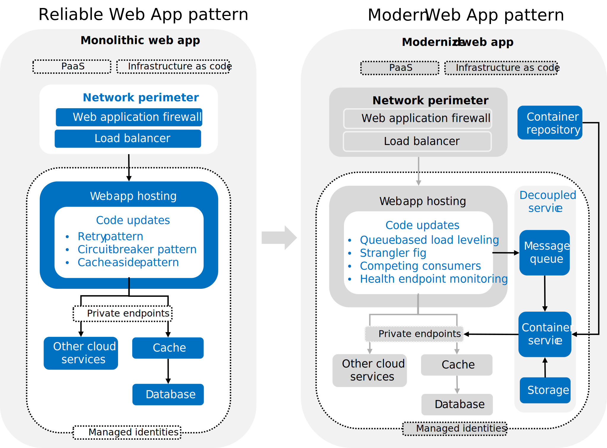

This article shows you how to implement the Modern Web App pattern. The Modern Web App pattern defines how you should modernize web apps in the cloud. It aligns with the principles of the [Well-Architected Framework](/azure/well-architected/) and builds on the [Reliable Web App pattern](../../overview.md#reliable-web-app-pattern).

[](../../../_images/rwa-to-mwa.svg)

The Modern Web App pattern focuses on optimizing high-demand areas of your application in a cost efficient way. These changes include three design patterns and other key updates to your web app.

:::row:::
    :::column:::
        **Benefits**<br>
        Targeted performance efficiency\
        Cost-optimized scaling
    :::column-end:::

    :::column:::
      **Design patterns**<br>
        Strangler Fig\
        Queue-Based Load Leveling\
        Competing Consumers\
        Health Endpoint Monitoring
    :::column-end:::

    :::column:::
      **Key updates**<br>
        Decouple components\
        Containerization\
        Asynchronous communication\
        Autoscale independent services\
        Data autonomy
    :::column-end:::
:::row-end:::

The first step is to review the [Reliable Web App pattern](../../overview.md#reliable-web-app-pattern) and apply the guidance. Next, choose the right services that meet the needs of your web app and design your architecture. Finally, update your web app code and configurations in line with the pillars of the Well-Architected Framework.

> [!TIP]
>  This article is backed by a **[reference implementation](https://aka.ms/eap/rwa/dotnet)** of the Modern Web App pattern. It features all the code and architecture updates discussed in this article. Deploy and use the reference implementation to guide your application of the Modern Web App pattern.

## Choose the right services

The Modern Web App pattern introduces a service-oriented architecture. It applies containerization and asynchronous communication to all independent services. The Azure services you selected for the implementation of the Reliable Web App pattern might not support these implementation techniques. For the Modern Web App pattern, you need an application platform that supports containerization and a container image repository. You need a messaging system to support asynchronous messaging.

### Choose a container service

For the parts of your application that you want to containerize, you need an application platform that supports containers. Azure has three principle container services: Azure Container Apps, Azure Kubernetes Service, and App Service.

- *Azure Container Apps (ACA)*: Choose ACA if you need a serverless platform that automatically scales and manages containers in event-driven applications.
- *Azure Kubernetes Service (AKS)*: Choose AKS if you need detailed control over Kubernetes configurations and advanced features for scaling, networking, and security.
- *Web Apps for Container*: Choose Web App for Containers on Azure App Service for the simplest PaaS experience.

For more information, see [Choose an Azure container service](/azure/architecture/guide/choose-azure-container-service).

### Choose a container repository

When using any container-based compute service, it’s necessary to have a repository to store the container images. You can use a public container registry like Docker Hub or a managed registry like Azure Container Registry. For more information, see [Introduction to Container registries in Azure](/azure/container-registry/container-registry-intro).

### Choose a messaging system

A messaging system is an important piece of service-oriented architectures. It decouples message senders and receivers to enable [asynchronous messaging](/azure/architecture/guide/technology-choices/messaging). Pick an Azure messaging system that supports your design needs. Azure has three messaging services: Azure Event Grid, Azure Event Hub, and Azure Service Bus.

- *Azure Event Grid*: Choose Azure Event Grid when you need a highly scalable service to react to status changes through a publish-subscribe model.
- *Azure Event Hubs*: Choose Azure Event Hubs for large-scale data ingestion, especially when dealing with telemetry and event streams that require real-time processing.
- *Azure Service Bus*: Choose Azure Service Bus for reliable, ordered, and possibly transactional delivery of high-value messages in enterprise applications.

For more information, see [Choose between Azure messaging services](https://learn.microsoft.com/azure/service-bus-messaging/compare-messaging-services).

## Design the architecture

- *Design network topology.* Choose the right network topology for your web and networking requirements. A [hub and spoke network topology](/azure/cloud-adoption-framework/ready/azure-best-practices/hub-spoke-network-topology) is standard configuration in Azure. It provides cost, management, and security benefits with hybrid connectivity options to on-premises networks.

- *Design for availability.* Determine how many availability zones and regions you need to meet your availability needs. Define a target SLO for your web app, such as 99.9% uptime. Then, calculate the [composite SLA](/azure/well-architected/reliability/metrics#slos-and-slas) for all the services that affect the availability of your web app. Add availability zones and regions until the composite SLA meets your SLO.

- *Design for resiliency.* Design your infrastructure to support your [recovery metrics](/azure/well-architected/reliability/metrics#recovery-metrics), such as recovery time objective (RTO) and recovery point objective (RPO). The RTO affects availability and must be less than your SLO. Determine a recovery point objective (RPO) and configure [data redundancy](/azure/well-architected/reliability/redundancy#data-resources) to meet the RPO. Most Azure services support synchronous replication across zones in a single region with minimal application code changes. A multi-region, active-active setup requires near real-time synchronization between regions, potentially needing code adjustments.

- *Configure private endpoints.* Use [private endpoints](/azure/architecture/framework/security/design-network-endpoints) in all production environments for all supported Azure services. Private endpoints help secure access to PaaS services and don't require any code changes, app configurations, or connection strings.

## Update the code and configuration

The following sections details essential the code and configuration updates you need to make to your web app. It follows the pillars of the Well-Architected Framework and covers the design patterns and key updates of the Modern Web App pattern.

### Reliability

Reliability ensures your application can meet the commitments you make to your customers. For more information, see the [Design review checklist for Reliability](/azure/well-architected/reliability/checklist). The Modern Web App pattern uses two design patterns to improve web app reliability:

- *Queue-Based Load Leveling pattern* improves message-based communication.
- *Retry pattern* improves request-response communication.

#### Implement the Queue-Based Load Leveling pattern

The [Queue-Based Load Leveling pattern](/azure/architecture/patterns/queue-based-load-leveling) improves the reliability of code by separating tasks and services with a queue. Unlike synchronous methods, such as HTTP, this pattern prevents the workload spikes from directly affecting services. The queue smooths out workload demand and allows services to process tasks at a consistent rate, enhancing the reliability of the system. To implement the Queue-Based Load Leveling pattern, follow these recommendations:

- *Use non-blocking message queuing.* Ensure that the task queuing messages does not block while waiting for messages to be handled. If the task requires the result of the queued operation, implement a ‘standby’ code path that can be used until the data is available.

  The reference implementation uses Azure Service Bus and the `await` keyword with `messageSender.PublishAsync()` to asynchronously publish messages without blocking the calling thread (*see example code*):

    ```csharp
    // Asynchronously publish a message without blocking the calling thread
    await messageSender.PublishAsync(new TicketRenderRequestMessage(Guid.NewGuid(), ticket, null, DateTime.Now), CancellationToken.None);
    ```

- *Implement message retry and removal.* Implement a mechanism to retry processing of queued messages that cannot be processed successfully. If failures persist, these messages should be removed from the queue. For example, Azure Service Bus has built-in retry and dead letter queue features.

- *Configure idempotent message processing.* The logic that processes messages from the queue must be idempotent to handle cases where a message might be processed more than once.

    The reference implementation uses `ServiceBusClient.CreateProcessor` with `AutoCompleteMessages = true` and `ReceiveMode = ServiceBusReceiveMode.PeekLock` to ensure messages are only processed once and can be reprocessed on failure (*see following code*).
  
    ```csharp
    // Create a processor for idempotent message processing
    var processor = serviceBusClient.CreateProcessor(path, new ServiceBusProcessorOptions
    {
        // Allow the messages to be auto-completed if processing finishes without failure
        AutoCompleteMessages = true,
    
        // PeekLock mode provides reliability in that unsettled messages will be redelivered on failure
        ReceiveMode = ServiceBusReceiveMode.PeekLock,
    
        // Containerized processors can scale at the container level and need not scale via the processor options
        MaxConcurrentCalls = 1,
        PrefetchCount = 0
    });
    ```

### Implement the Retry Pattern

The [Retry pattern](/azure/architecture/patterns/retry) allows applications recover from transient faults. The Retry pattern is central to the Reliable Web App pattern, so your web app should be using the Retry pattern already. Apply the Retry pattern to the messaging systems and independent services you extract from the web app. To implement the Retry pattern, follow these recommendations:

- *Configure retry options.* When integrating with a message queue, ensure that the client responsible for interactions with the queue is configured with appropriate retry settings. This involves specifying parameters such as the maximum number of retries, delay between retries, and maximum delay.
- *Use exponential backoff.* Implement exponential backoff strategy for retry attempts. This means increasing the time between each retry exponentially, which helps reduce the load on the system during periods of high failure rates.
- *Use SDK Retry functionality.* For services with specialized SDKs, like Azure Service Bus or Azure Blob Storage, use the built-in retry functionalities. These are optimized for the service's typical use cases and can handle retries more effectively with less configuration required on your part.

The reference implementation uses the built-in retry functionality of the Azure Service Bus SDK (`ServiceBusClient` and `ServiceBusRetryOptions`). The `ServiceBusRetryOptions` fetches settings from `MessageBusOptions` to configures retry settings such as MaxRetries, Delay, MaxDelay, and TryTimeout. The Mode property of `ServiceBusRetryOptions` implements an exponential backoff strategy using `ServiceBusRetryMode.Exponential`.

```csharp
// ServiceBusClient is thread-safe and can be reused for the lifetime of the application.
services.AddSingleton(sp =>
{
    var options = sp.GetRequiredService<IOptions<MessageBusOptions>>().Value;
    var clientOptions = new ServiceBusClientOptions
    {
        RetryOptions = new ServiceBusRetryOptions
        {
            Mode = ServiceBusRetryMode.Exponential,
            MaxRetries = options.MaxRetries,
            Delay = TimeSpan.FromSeconds(options.BaseDelaySecondsBetweenRetries),
            MaxDelay = TimeSpan.FromSeconds(options.MaxDelaySeconds),
            TryTimeout = TimeSpan.FromSeconds(options.TryTimeoutSeconds)
        }
    };
    return new ServiceBusClient(options.Host, azureCredential ?? new DefaultAzureCredential(), clientOptions);
});
```

- *Adopt Standard Resilience Libraries for HTTP Clients.* For HTTP communications, integrate a standard resilience library such as Polly or `Microsoft.Extensions.Http.Resilience`. These libraries offer comprehensive retry mechanisms, including exponential backoff, circuit breaker patterns, and more. These are crucial for managing communications with external web services.
- *Handle message locking.* For message-based systems, implement message handling strategies that support retries without data loss, such as using "peek-lock" modes where available. Ensure that failed messages are retried effectively and moved to a dead-letter queue after repeated failures.
- *Use a dead-letter queue.* Implement a mechanism to handle messages that fail processing. Move failed messages to a dead-letter queue to prevent them from blocking the main processing queue. Regularly review messages in the dead-letter queue to identify and address underlying issues.

## Security

Security provides assurances against deliberate attacks and the abuse of your valuable data and systems. For more information, see [Design review checklist for Security](/azure/well-architected/security/checklist). The Modern Web App pattern applies security best practices to new services added to the architecture to support the service-oriented architecture.

### Configure service authentication and authorization

To configure service authentication and authorization on any new Azure services you add to the web app, follow these recommendations:

- *Use managed identities for each new service.* Each independent service should have its own identity and use managed identities for service-to-service authentication. Managed identities eliminate the need to manage credentials in your code and reduce the risk of credential leakage. It helps you avoid putting sensitive information like connection strings in your code or configuration files.
- *Grant least privilege to each new service.* Assign only necessary permissions to each new service identity. For example, if an identity only needs to push to a container registry, don’t give it pull permissions. Review these permissions regularly and adjust as necessary. Use different identities for different roles, such as deployment and the application. This limits the potential damage if one identity is compromised.
- *Adopt infrastructure as code (IaC).* Use Azure Bicep or similar IaC tools to define and manage your cloud resources. This ensures consistent application of security configurations in your deployments and allows you to version control your infrastructure setup.
- *Update firewall rules.* Update your firewall rules to account for the new network traffic patterns that results from the extraction of the microservice.

The reference implementation uses IaC to assign managed identities to added services and specific roles to each identity. It defines roles and permissions access for deployment (`containerRegistryPushRoleId`), application owner (`containerRegistryPushRoleId`), and Azure Container Apps application (`containerRegistryPullRoleId`) (*see following code*).

```bicep
roleAssignments: \[
    {
    principalId: deploymentSettings.principalId
    principalType: deploymentSettings.principalType
    roleDefinitionIdOrName: containerRegistryPushRoleId
    }
    {
    principalId: ownerManagedIdentity.outputs.principal_id
    principalType: 'ServicePrincipal'
    roleDefinitionIdOrName: containerRegistryPushRoleId
    }
    {
    principalId: appManagedIdentity.outputs.principal_id
    principalType: 'ServicePrincipal'
    roleDefinitionIdOrName: containerRegistryPullRoleId
    }
\]
```

The reference implementation assigns the managed identity the new Azure Container App identity at deployment (*see following code*).

```bicep
module renderingServiceContainerApp 'br/public:avm/res/app/container-app:0.1.0' = {
  name: 'application-rendering-service-container-app'
  scope: resourceGroup()
  params: {
    // Other parameters omitted for brevity
    managedIdentities: {
      userAssignedResourceIds: [
        managedIdentity.id
      ]
    }
  }
}
```

### Configure user authentication and authorization

To configure user authentication and authorization, follow these recommendations:

- *Grant least privilege to users.* Just like with services, ensure that users are given only the permissions they need to perform their tasks. Regularly review and adjust these permissions.
- *Conduct regular security audits.* Regularly review and audit your security setup. Look for any misconfigurations or unnecessary permissions and rectify them immediately.

## Cost optimization

Cost optimization is about looking at ways to reduce unnecessary expenses and management overhead. For more information, see the [Design review checklist for Cost Optimization](/azure/well-architected/cost-optimization/checklist). The Modern Web App pattern implements independent autoscaling on the newly decoupled service.

### Autoscale decoupled services

The Modern Web App pattern begins breaking up the monolithic architecture and introduces service decoupling. When you decouple a web app architecture, you can scale decoupled services independently. Scaling the Azure services to support an independent web app service, rather than an entire web app, optimizes scaling costs while meeting demands. To autoscale containers, follow these recommendations:

- *Use stateless services.* Ensure your services are stateless. If your .NET application contains in-process session state, externalize it to a distributed cache like Redis or a database like Azure SQL Server.
- *Configure autoscaling rules.* Use the autoscaling configurations that provide the most cost-effective control over your services. For containerized services, consider [event-based scaling](/azure/well-architected/cost-optimization/optimize-scaling-costs#consider-event-based-scaling), such as Kubernetes Event-Driven Autoscaler (KEDA) often provides granular control, allowing you to scale based on event metrics. [Azure Container Apps](/azure/container-apps/scale-app) and Azure Kubernetes Service support KEDA. For services that don't support KEDA, such as [Azure App Service](](/azure/app-service/manage-automatic-scaling)), use the autoscaling features provided by the platform itself. These features often include scaling based on metrics-based rules or HTTP traffic.
- *Configure minimum replicas.* To prevent a cold start, configure autoscaling settings to maintain a minimum of 1 replica at all times. A cold start is when you initialize a service from a stopped state, which often creates a delayed response. If minimizing costs is a priority and you can tolerate cold start delays, set the minimum replica count to 0 when configuring autoscaling.
- *Configure a cooldown period.* Apply an appropriate cooldown period to introduce a delay between scaling events. The goal is to [prevent excessive scaling](/azure/well-architected/cost-optimization/optimize-scaling-costs#optimize-autoscaling) activities triggered by temporary load spikes.
- *Configure queue-based scaling.* If your application uses a message queue like Azure Service Bus, configure your autoscaling settings to scale based on the length of the queue with request messages. The scaler aims to maintain one replica of the service for every N messages in the queue (rounded up).

The reference implementation uses the [Azure Service Bus KEDA scaler](/azure/container-apps/scale-app) to scale the Container App based on the length of the queue with request messages. The `service-bus-queue-length-rule` scales the service based on the length of a specified Azure Service Bus queue. The `messageCount` parameter is set to 10, so the scaler has one service replica for every ten messages in the queue. The `scaleMaxReplicas` and `scaleMinReplicas` parameters set the maximum and minimum number of replicas for the service. The `queue-connection-string secret`, which contains the connection string for the Service Bus queue, is retrieved from Key Vault. This secret is used to authenticate the scaler to the Service Bus.

```yml
scaleRules: [
  {
    name: 'service-bus-queue-length-rule'
    custom: {
      type: 'azure-servicebus'
      metadata: {
        messageCount: '10'
        namespace: renderRequestServiceBusNamespace
        queueName: renderRequestServiceBusQueueName
      }
      auth: [
        {
          secretRef: 'render-request-queue-connection-string'
          triggerParameter: 'connection'
        }
      ]
    }
  }
]

scaleMaxReplicas: 5
scaleMinReplicas: 0
```

## Operational excellence

Operational excellence covers the operations processes that deploy an application and keep it running in production. For more information, see the [Design review checklist for Operational Excellence](/azure/well-architected/operational-excellence/checklist).

The Modern Web App pattern introduces the Strangler Fig and Health Endpoint Monitoring patterns. In a service-oriented architecture, where each service is self-contained, different teams within an organization can take ownership of various services, allowing them to innovate at their own pace.

### Implement the Strangler Fig pattern

The [Strangler fig](/azure/architecture/patterns/strangler-fig) pattern allows you to separate larger services into more granular services. It allows you to move specific logical components to new services. The strangler fig pattern is useful for making incremental progress on large modernization tasks that would be intractable if they had to be completed all at once. Dividing a monolithic solution into finer-grained services allows services to version and scale independently. A service-oriented architecture in which each service is self-contained makes it easy for different teams in an organization to own different services and innovate at the pace that makes sense for them. And when load increases, only the services that represent the performance bottleneck need to scale out. The strangler fig pattern is a useful pattern for transitioning gradually into such an architecture. To implement the Strangler Fig pattern, follow these recommendations:

- *Identify services to extract.* Start by identifying the services that can be extracted according to domain boundaries. These services should be logically separate pieces of functionality that can benefit from independent scaling, versioning, or deployment. For example, in an e-commerce application, services like user management, product catalog, and order processing can be identified as separate domains.
- *Use a façade service if necessary.* In some cases, a strangler fig façade service is used to route requests to the various backend solutions while the pattern is being applied. This is particularly useful when you have multiple services running in parallel during the transition period. However, if the extracted service doesn’t have any public-facing APIs, such a façade service might not be necessary.
- *Unify the API surface area.* If your application exposes an API to callers, consider using a management platform like [Azure API Management](/azure/api-management/api-management-key-concepts). It can help unify the surface area of multiple services which have been extracted from one another, making it easier for clients to consume your services.
- *Manage feature rollout.* If you want an extracted service to be rolled out gradually, use ASP.NET Core feature management and [staged rollout](/azure/azure-app-configuration/howto-targetingfilter-aspnet-core). This allows you to use the new service for only a portion of requests initially, and then increase its usage over time as you gain confidence in its stability and performance.

The reference implementation extracts the ticket rendering functionality from a web API into a standalone service, which can be toggled via a feature flag. The Strangler Fig pattern allows for a gradual transition from the old in-process implementation to the new service. The extracted service was also updated to run in a Linux container and shows how services can be upgraded during extraction.

### Implement the Health Endpoint Monitoring pattern

The [Health Endpoint Monitoring pattern](/azure/architecture/patterns/health-endpoint-monitoring) is useful for tracking the health of application endpoints. This is especially important in services that are managed by an orchestrator such as those deployed in Azure Kubernetes Service or Azure Container Apps. These orchestrators can poll health endpoints to make sure services are running properly and restart instances that are not healthy. ASP.NET Core apps can add dedicated [health check middleware](/aspnet/core/host-and-deploy/health-checks) to efficiently serve endpoint health data, including checking the health of key dependencies. To implement the Health Endpoint Monitoring pattern, follow these recommendations:

- *Implement health checks.* Use ASP.NET Core [Health Checks Middleware](/aspnet/core/host-and-deploy/health-checks) to provide health check endpoints.
- *Validate dependencies.* Ensure that your health checks validate the availability of key dependencies, such as the database, storage, and messaging system. The non-Microsoft package, [AspNetCore.Diagnostics.HealthChecks](https://github.com/Xabaril/AspNetCore.Diagnostics.HealthChecks), can implement health check dependency checks for many common app dependencies.

    The reference implementation uses [ASP.NET Core health check middleware](/aspnet/core/host-and-deploy/health-checks) to expose health check endpoints, using the `AddHealthChecks()` method on the `builder.Services` object. The code validates the availability of key dependencies, Azure Blob Storage and Azure Service Bus Queue with the `AddAzureBlobStorage()` and `AddAzureServiceBusQueue()` methods, which are part of the AspNetCore.Diagnostics.HealthChecks package. Azure Container Apps allow configuration of [health probes](https://learn.microsoft.com/azure/container-apps/health-probes) that are monitored to gauge whether apps are healthy or in need of recycling.

```C#
// Add health checks, including health checks for Azure services that are used by this service.
// The Blob Storage and Service Bus health checks are provided by AspNetCore.Diagnostics.HealthChecks
// (a popular open source project) rather than by Microsoft. https://github.com/Xabaril/AspNetCore.Diagnostics.HealthChecks
builder.Services.AddHealthChecks()
.AddAzureBlobStorage(options =>
{
    // AddAzureBlobStorage will use the BlobServiceClient registered in DI
    // We just need to specify the container name
    options.ContainerName = builder.Configuration.GetRequiredConfigurationValue("App:StorageAccount:Container");
})
.AddAzureServiceBusQueue(
    builder.Configuration.GetRequiredConfigurationValue("App:ServiceBus:Host"),
    builder.Configuration.GetRequiredConfigurationValue("App:ServiceBus:RenderRequestQueueName"),
    azureCredentials);

// Further app configuration omitted for brevity
app.MapHealthChecks("/health");
```

- *Configure Azure resources.* Configure the Azure resource to use the app’s health check URLs to confirm liveness and readiness.

    The reference implementation uses Bicep to configure the health check URLs to confirm the liveness and readiness of the Azure resource. A liveness probe to hits the `/health` endpoint every 10 seconds after an initial delay of 2 seconds.

    ```bicep
    probes: [
      {
        type: 'liveness'
        httpGet: {
          path: '/health'
          port: 8080
        }
        initialDelaySeconds: 2
        periodSeconds: 10
      }
    ]
    
    ```

### Containerize service deployment

This means that all dependencies for the app to function are encapsulated in a lightweight image that can be reliably deployed to a wide range of hosts including, in the case of the reference implementation, Azure Container Apps. An important part of the modern web app pattern is dividing services according to domain boundaries (as discussed in the strangler fig pattern). To containerize deployment, follow these recommendations:

- *Identify domain boundaries.* Start by identifying the domain boundaries within your monolithic application. This helps determine which parts of the application you can extract into separate services.
- *Create docker images.* When creating Docker images for your .NET services, use chiseled base images. These images contain only the minimal set of packages needed for .NET to run, which minimizes both the package size and the attack surface area.
- *Use multi-stage Dockerfiles.* Implement multi-stage Dockerfiles to separate build-time assets from the runtime container image. This helps to keep your production images small and secure.
- *Run as non-root user.* Run your .NET containers as a non-root user (via user name or UID, $APP_UID) to align with the principle of least privilege. It limits the potential impact of a compromised container.
- *Listen on port 8080.* When running as a non-root user, configure your application to listen on port 8080. It's a common convention for non-root users.
- *Encapsulate dependencies.* Ensure that all dependencies for the app to function are encapsulated in the Docker container image. This allows the app to be reliably deployed to a wide range of hosts.
- *Choose the right base images.* The base image you choose depends on your deployment environment. If you’re deploying to Azure Container Apps, for instance, you’ll need to use Linux Docker images.

The reference implementation uses a [multi-stage](https://docs.docker.com/build/building/multi-stage/) build process. The initial stages compile and build the application using a full SDK image (`mcr.microsoft.com/dotnet/sdk:8.0-jammy`). The final runtime image is created from the `chiseled` base image, which excludes the SDK and build artifacts. The service runs as a non-root user (`USER $APP_UID`) and exposes port 8080. The ll dependencies required for the application to operate are included within the Docker image, as evidenced by the commands to copy project files and restore packages. The choice of Linux-based images (`mcr.microsoft.com/dotnet/aspnet:8.0-jammy-chiseled`) for the runtime environment for deployment within Azure Container Apps, which requires Linux containers.

```dockerfile
# Build in a separate stage to avoid copying the SDK into the final image
FROM mcr.microsoft.com/dotnet/sdk:8.0-jammy AS build
ARG BUILD_CONFIGURATION=Release
WORKDIR /src

# Restore packages
COPY ["Relecloud.TicketRenderer/Relecloud.TicketRenderer.csproj", "Relecloud.TicketRenderer/"]
COPY ["Relecloud.Messaging/Relecloud.Messaging.csproj", "Relecloud.Messaging/"]
COPY ["Relecloud.Models/Relecloud.Models.csproj", "Relecloud.Models/"]
RUN dotnet restore "./Relecloud.TicketRenderer/Relecloud.TicketRenderer.csproj"

# Build and publish
COPY . .
WORKDIR "/src/Relecloud.TicketRenderer"
RUN dotnet publish "./Relecloud.TicketRenderer.csproj" -c $BUILD_CONFIGURATION -o /app/publish /p:UseAppHost=false

# Chiseled images contain only the minimal set of packages needed for .NET 8.0
FROM mcr.microsoft.com/dotnet/aspnet:8.0-jammy-chiseled AS final
WORKDIR /app
EXPOSE 8080

# Copy the published app from the build stage
COPY --from=build /app/publish .

# Run as non-root user
USER $APP_UID
ENTRYPOINT ["dotnet", "./Relecloud.TicketRenderer.dll"]
```

## Performance efficiency

Performance efficiency is the ability of your workload to scale to meet the demands placed on it by users in an efficient manner. For more information, see the [Design review checklist for Performance Efficiency](/azure/well-architected/performance-efficiency/checklist).
The Modern Web App uses the Competing Consumers pattern to optimize performance efficiency.

As applications move from the Reliable Web App pattern to the Modern Web App pattern, performance benefits from greater service decoupling. This architecture prevents a slowdown in one component from affecting others. Queue-based load leveling helps both reliability and performance efficiency by distributing tasks evenly. Competing consumers pattern further enhances performance by distributing tasks among multiple workers efficiently. Moreover, when the system experiences increased load, only the services acting as performance bottlenecks need to be scaled out.

### Competing Consumers pattern

The [Competing Consumers pattern](https://learn.microsoft.com/azure/architecture/patterns/competing-consumers) distributes incoming tasks across multiple parallel workers. It handles demand surges by scaling the number of workers horizontally. Workers simultaneously retrieve and process tasks from a shared message queue. This pattern is suitable when the order of messages is not critical, malformed messages do not disrupt the queue, and processing is idempotent. If one worker fails to handle a message, another must be able to process it without errors, even if the message is processed multiple times. To implement the Competing Consumers pattern, follow these recommendations:

- *Handle concurrent messages.* When receiving messages from a queue, ensure that your system is designed to handle multiple messages concurrently. Set the maximum concurrent calls to 1 so a separate consumer handles each message.
- *Disable prefetching.* Disable message prefetching of messages so consumers fetching messages only when they are ready.
- *Use reliable message processing modes.* Use a reliable processing mode, such as PeekLock (or its equivalent), that automatically retry messages that fail processing. This mode enhances reliability over deletion-first methods.
- *Implement error handling.* Route malformed or unprocessable messages to a separate, dead-letter queue. This design prevents repetitive processing. For example, you can catch exceptions during message processing and move the problematic message to the separate queue.
- *Handle out-of-order messages.* Design consumers to is capable of processing messages that arrive out of sequence. Multiple parallel consumers means they might process messages out of order.
- *Scale based on queue length.* Services consuming messages from a queue should auto-scale based on queue length. This allows for efficient processing of spikes of incoming messages.
- *Use message-reply queue.* If the system requires notifications post-message processing, set up a dedicated reply or response queue. This divides operational messaging from notification processes.
- *Use stateless services.* Consider using stateless services to process requests from a queue. This allows for easy scaling and efficient resource usage.
- *Configure logging.* Integrate logging and specific exception handling within the message processing workflow. Focus on capturing serialization errors and directing these problematic messages to a dead letter mechanism. These logs provide valuable insights for troubleshooting.

The reference implementation uses a stateless service running on Azure Container App that processes ticket-rendering requests from an Azure Service Bus queue. It creates a processor for the queue to handle incoming messages. The processor is configured to automatically complete messages if they are processed without failure, use the PeekLock mode for reliable message delivery, and handle one message at a time without prefetching. When a message is received, it logs the message details, deserializes the message body to a specific type, and then handles the message. If the message body is invalid and cannot be deserialized, it logs an error and moves the message to a dead-letter queue. This ensures that problematic messages do not block the processing of other messages. The service can scale at the container level to efficiently process messages from the queue.

```C#
// Create a processor for the given queue that will process incoming messages
var processor = serviceBusClient.CreateProcessor(path, new ServiceBusProcessorOptions
{
    // Allow the messages to be auto-completed if processing finishes without failure
    AutoCompleteMessages = true,
    // PeekLock mode provides reliability in that unsettled messages will be redelivered on failure
    ReceiveMode = ServiceBusReceiveMode.PeekLock,
    // Containerized processors can scale at the container level and need not scale via the processor options
    MaxConcurrentCalls = 1,
    PrefetchCount = 0
});

// Called for each message received by the processor
processor.ProcessMessageAsync += async args =>
{
    logger.LogInformation("Processing message {MessageId} from {ServiceBusNamespace}/{Path}", args.Message.MessageId, args.FullyQualifiedNamespace, args.EntityPath);
    // Unhandled exceptions in the handler will be caught by the processor and result in abandoning and dead-lettering the message
    try
    {
        var message = args.Message.Body.ToObjectFromJson<T>();
        await messageHandler(message, args.CancellationToken);
        logger.LogInformation("Successfully processed message {MessageId} from {ServiceBusNamespace}/{Path}", args.Message.MessageId, args.FullyQualifiedNamespace, args.EntityPath);
    }
    catch (JsonException)
    {
        logger.LogError("Invalid message body; could not be deserialized to {Type}", typeof(T));
        await args.DeadLetterMessageAsync(args.Message, $"Invalid message body; could not be deserialized to {typeof(T)}", cancellationToken: args.CancellationToken);
    }
};
```

## Next steps

You can deploy the reference implementation by following the instructions in the [modern web app pattern for .NET repository](https://github.com/azure/modern-web-app-pattern-dotnet). There are instructions for both development and production deployment of the reference implementation. Once deployed, you can observe the patterns described in this document in action.
