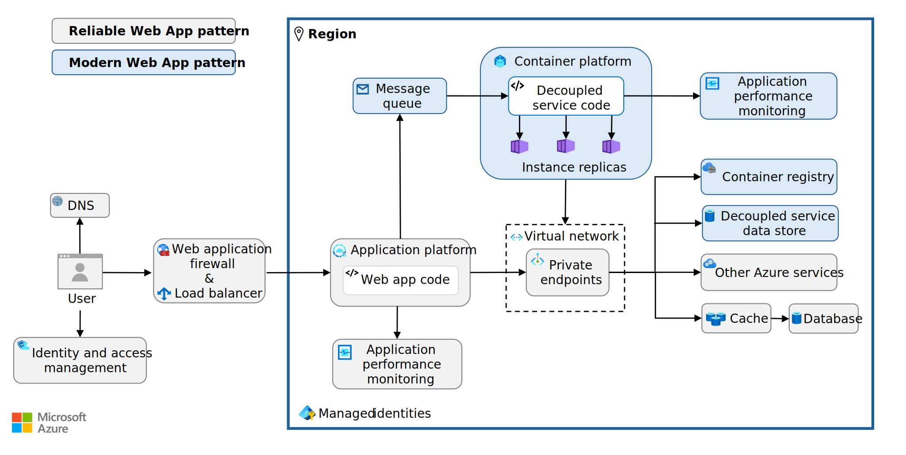
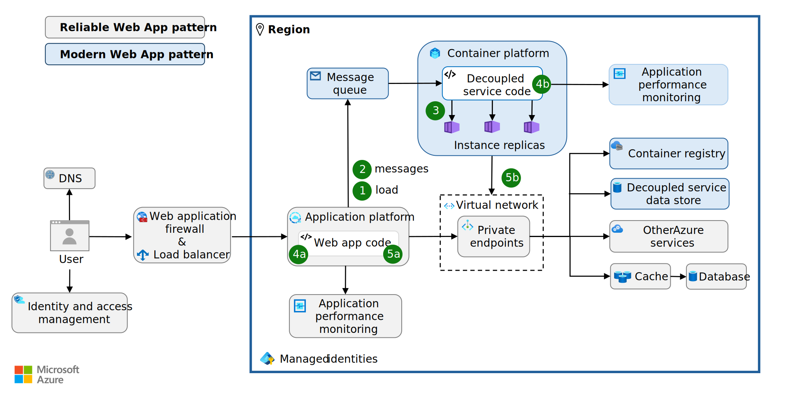
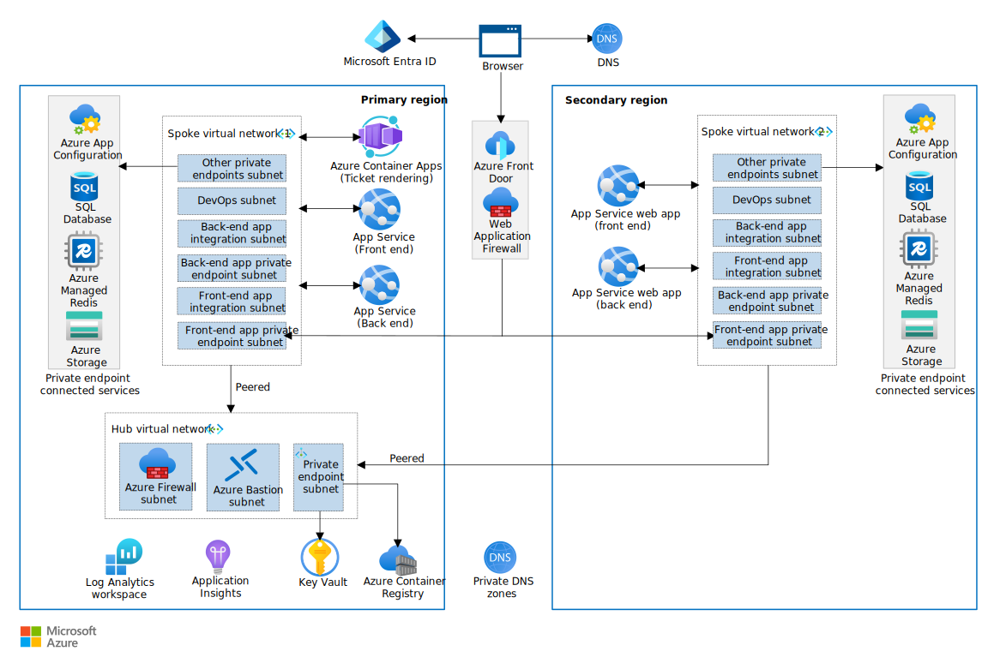

This article shows how to implement the Modern Web App pattern. The Modern Web App pattern defines how you should modernize web apps in the cloud and introduce a service-oriented architecture. The Modern Web App pattern provides prescriptive architecture, code, and configuration guidance that aligns with the principles of the [Azure Well-Architected Framework](/azure/well-architected/) and builds on the [Reliable Web App pattern](../../overview.md#reliable-web-app-pattern).

## Why use the Modern Web App pattern?

The Modern Web App pattern can help you optimize high-demand areas of a web app. It provides detailed guidance for decoupling these areas, which enables independent scaling for cost optimization. This approach allows you to allocate dedicated resources to critical components, which enhances overall performance. Decoupling separable services can improve reliability by preventing slowdowns in one part of the app from affecting others. Decoupling also enables you to version individual app components independently.

## How to implement the Modern Web App pattern

This article contains architecture, code, and configuration guidance for implementing the Modern Web App pattern. Use the following links to go to the guidance you need:

- [***Architecture guidance***](#architecture-guidance). Learn how to modularize web app components and select appropriate platform as a service (PaaS) solutions.
- [***Code guidance***](#code-guidance). Implement four design patterns to optimize the decoupled components: Strangler Fig, Queue-Based Load Leveling, Competing Consumers, and Health Endpoint Monitoring.
- [***Configuration guidance***](#configuration-guidance). Configure authentication, authorization, autoscaling, and containerization for the decoupled components.

> [!TIP]
>  There's a ***[reference implementation][reference-implementation]*** (sample app) of the Modern Web App pattern. It represents the end state of the Modern Web App implementation. It's a production-grade web app that features all the code, architecture, and configuration updates discussed in this article. Deploy and use the reference implementation to guide your implementation of the Modern Web App pattern.

## Architecture guidance

The Modern Web App pattern builds on the Reliable Web App pattern. It requires a few extra architectural components to implement. You need a message queue, container platform, decoupled service data store, and container registry. The following diagram illustrates the baseline architecture.

[](../../../_images/modern-web-app-architecture.svg#lightbox)

For a higher service-level objective (SLO), you can add a second region to your web app architecture. If you add a second region, you need to configure your load balancer to route traffic to that region to support either an active-active or an active-passive configuration. Use a hub-and-spoke network topology to centralize and share resources, such as a network firewall. Access the container repository through the hub virtual network. If you have virtual machines, add a bastion host to the hub virtual network to manage them with enhanced security. The following diagram illustrates this architecture.

[](../../../_images/modern-web-app-architecture-plus-optional.svg#lightbox)

### Decouple the architecture

To implement the Modern Web App pattern, you need to decouple the existing web app architecture. Decoupling the architecture involves breaking down a monolithic application into smaller independent services that are each responsible for a specific feature or functionality. This process entails evaluating the current web app, modifying the architecture, and finally, extracting the web app code to a container platform. The goal is to systematically identify and extract application services that benefit most from being decoupled. To decouple your architecture, follow these recommendations:

- *Identify service boundaries.* Apply domain-driven design principles to identify bounded contexts within your monolithic application. Each bounded context represents a logical boundary and can be a candidate for a separate service. Services that represent distinct business functions and have fewer dependencies are good candidates for decoupling.

- *Evaluate service benefits.* Focus on services that benefit most from independent scaling. Decoupling these services and converting processing tasks from synchronous to asynchronous operations enables more efficient resource management, supports independent deployments, and reduces the risk of affecting other parts of the application during updates or changes. For example, you can separate the order checkout from order processing.

- *Assess technical feasibility.* Examine the current architecture to identify technical constraints and dependencies that might affect the decoupling process. Plan how data is managed and shared across services. Decoupled services should manage their own data and minimize direct database access across service boundaries.

- *Deploy Azure services.* Select and deploy the Azure services you need to support the web app service you intend to extract. For guidance, see [Select the right Azure services](#select-the-right-azure-services).

- *Decouple web app services.* Define clear interfaces and APIs to enable the newly extracted web app services to interact with other parts of the system. Design a data-management strategy that allows each service to manage its own data while ensuring consistency and integrity. For more information about implementation strategies and design patterns during this extraction process, see the [Code guidance](#code-guidance) section of this article.

- *Use independent storage for decoupled services.* Each decoupled service should have its own isolated data store to facilitate independent versioning, deployment, and scalability and to maintain data integrity. For example, the reference implementation separates the ticket-rendering service from the web API and eliminates the need for the service to access the API's database. Instead, the service passes the URL where ticket images were generated back to the web API via an Azure Service Bus message, and the API persists the path to its database.

- *Implement separate deployment pipelines for each decoupled service.* Separate deployment pipelines allow each service to be updated at its own pace. If different teams or organizations within your company own different services, having separate deployment pipelines gives each team control over their own deployments. Use continuous integration and continuous delivery (CI/CD) tools like Jenkins, GitHub Actions, or Azure Pipelines to set up these pipelines.

- *Revise security controls.* Ensure that your security controls are updated to account for the new architecture, including firewall rules and access controls.

### Select the right Azure services

For each Azure service in your architecture, consult the relevant [Azure service guide](/azure/well-architected/service-guides) in the Well-Architected Framework. For the Modern Web App pattern, you need a messaging system to support asynchronous messaging, an application platform that supports containerization, and a container image repository.

- *Choose a message queue.* A message queue is an important component of service-oriented architectures. It decouples message senders and receivers to enable [asynchronous messaging](/azure/architecture/guide/technology-choices/messaging). Use the guidance on choosing an [Azure messaging service](/azure/service-bus-messaging/compare-messaging-services) to pick an Azure messaging system that supports your design needs. Azure has three messaging services: Azure Event Grid, Azure Event Hubs, and Azure Service Bus. Start with Service Bus as the default choice, and use the other two options if Service Bus doesn't meet your needs.<br><br>

    | Service  | Use case   |
    |-------|--------|
    | Service Bus | Choose Service Bus for reliable, ordered, and possibly transactional delivery of high-value messages in enterprise applications. |
    | Event Grid | Choose Event Grid when you need to handle a large number of discrete events efficiently. Event Grid is scalable for event-driven applications where many small independent events (like resource state changes) need to be routed to subscribers in a low-latency publish-subscribe model.        |
    | Event Hubs | Choose Event Hubs for massive, high-throughput data ingestion, like telemetry, logs, or real-time analytics. Event Hubs is optimized for streaming scenarios where bulk data needs to be ingested and processed continuously.         |

- *Implement a container service.* For the components of your application that you want to containerize, you need an application platform that supports containers. The [Choose an Azure container service](/azure/architecture/guide/choose-azure-container-service) guidance can help you make your decision. Azure has three principal container services: Azure Container Apps, Azure Kubernetes Service (AKS), and Azure App Service. Start with Container Apps as the default choice and use the other two options if Container Apps doesn't meet your needs.<br><br>

    | Service  | Use case       |
    |------------------------------|---------------------|
    | Container Apps | Choose Container Apps if you need a serverless platform that automatically scales and manages containers in event-driven applications.                |
    | AKS | Choose AKS if you need detailed control over Kubernetes configurations and advanced features for scaling, networking, and security.    |
    | Web Apps for Containers    | Choose Web App for Containers in App Service for the simplest PaaS experience.                                                      |

- *Implement a container repository.* When you use any container-based compute service, you need to have a repository to store the container images. You can use a public container registry like Docker Hub or a managed registry like Azure Container Registry. The [Introduction to container registries in Azure](/azure/container-registry/container-registry-intro) guidance can help you make your decision.

## Code guidance

To successfully decouple and extract an independent service, you need to update your web app code with the following design patterns: the Strangler Fig pattern, Queue-Based Load Leveling pattern, Competing Consumers pattern, Health Endpoint Monitoring pattern, and Retry pattern. The roles of these patterns are illustrated here:

[](../../../_images/modern-web-app-design-patterns.svg#lightbox)

1. *Strangler Fig pattern*: The Strangler Fig pattern incrementally migrates functionality from a monolithic application to the decoupled service. Implement this pattern in the main web app to gradually migrate functionality to independent services by directing traffic based on endpoints.

1. *Queue-Based Load Leveling pattern*: The Queue-Based Load Leveling pattern manages the flow of messages between the producer and the consumer by using a queue as a buffer. Implement this pattern in the codebase that produces messages for the queue. The decoupled service then consumes these messages from the queue asynchronously.

1. *Competing Consumers pattern*: The Competing Consumers pattern allows multiple instances of the decoupled service to independently read from the same message queue and compete to process messages. Implement this pattern in the decoupled service to distribute tasks across multiple instances.

1. *Health Endpoint Monitoring pattern*: The Health Endpoint Monitoring pattern exposes endpoints for monitoring the status and health of different parts of the web app. **(4a)** Implement this pattern in the  main web app. **(4b)** Also implement it in the decoupled service to track the health of endpoints.

1. *Retry pattern*: The Retry pattern handles transient failures by retrying operations that might fail intermittently. **(5a)** Implement this pattern on all outbound calls to other Azure services in the main web app, such as calls to message queue and private endpoints. **(5b)** Also implement this pattern in the decoupled service to handle transient failures in calls to the private endpoints.

Each design pattern provides benefits that align with one or more pillars of the Well-Architected Framework. See the following table for details.

| Design pattern | Implementation location | Reliability (RE) | Security (SE) | Cost Optimization (CO) | Operational Excellence (OE) | Performance Efficiency (PE) | Supporting Well-Architected Framework principles |
|----------|-----------|-------|----|----------|---------------|------| --- |
| [Strangler Fig pattern](#implement-the-strangler-fig-pattern) | Main web app | ✔ |  | ✔ | ✔ |  | [RE:08](/azure/well-architected/reliability/testing-strategy) <br> [CO:07](/azure/well-architected/cost-optimization/optimize-component-costs) <br> [CO:08](/azure/well-architected/cost-optimization/optimize-environment-costs) <br> [OE:06](/azure/well-architected/operational-excellence/workload-supply-chain) <br> [OE:11](/azure/well-architected/operational-excellence/safe-deployments) |
| [Queue-Based Load Leveling pattern](#implement-the-queue-based-load-leveling-pattern) | Main web app (message producer) | ✔ |  | ✔ |  | ✔ | [RE:07](/azure/well-architected/reliability/background-jobs) <br> [RE:07](/azure/well-architected/reliability/handle-transient-faults) <br> [CO:12](/azure/well-architected/cost-optimization/optimize-scaling-costs) <br> [PE:05](/azure/well-architected/performance-efficiency/scale-partition) |
| [Competing Consumers pattern](#implement-the-competing-consumers-pattern) | Decoupled service | ✔ |  | ✔ |  | ✔ | [RE:05](/azure/well-architected/reliability/regions-availability-zones) <br> [RE:07](/azure/well-architected/reliability/background-jobs) <br> [CO:05](/azure/well-architected/cost-optimization/get-best-rates) <br> [CO:07](/azure/well-architected/cost-optimization/optimize-component-costs) <br> [PE:05](/azure/well-architected/performance-efficiency/scale-partition) <br> [PE:07](/azure/well-architected/performance-efficiency/optimize-code-infrastructure) |
| [Health Endpoint Monitoring pattern](#implement-the-health-endpoint-monitoring-pattern) | Main web app and decoupled service | ✔ |  |  | ✔ | ✔ | [RE:07](/azure/well-architected/reliability/background-jobs) <br> [RE:10](/azure/well-architected/reliability/monitoring-alerting-strategy) <br> [OE:07](/azure/well-architected/operational-excellence/observability) <br> [PE:05](/azure/well-architected/performance-efficiency/scale-partition) |
| [Retry pattern](#implement-the-retry-pattern) | Main web app and decoupled service | ✔ |  |  |  |  | [RE:07](/azure/well-architected/reliability/self-preservation) |

### Implement the Strangler Fig pattern

Use the [Strangler Fig](/azure/architecture/patterns/strangler-fig) pattern to gradually migrate functionality from the monolithic code base to new independent services. Extract new services from the existing monolithic code base and slowly modernize critical parts of the web app. To implement the Strangler Fig pattern, follow these recommendations:

- *Set up a routing layer.* In the monolithic web app code base, implement a routing layer that directs traffic based on endpoints. Use custom routing logic as needed to handle specific business rules for directing traffic. For example, if you have a `/users` endpoint in your monolithic app and you move that functionality to the decoupled service, the routing layer directs all requests to `/users` to the new service.

- *Manage feature rollout.* Use .NET feature management libraries to [implement feature flags](/azure/azure-app-configuration/use-feature-flags-dotnet-core) and [staged rollout](/azure/azure-app-configuration/howto-targetingfilter-aspnet-core) to gradually roll out the decoupled services. The existing monolithic app routing should control how many requests the decoupled services receive. Start with a small percentage of requests and increase usage over time as you gain confidence in the new service's stability and performance. For example, the reference implementation extracts the ticket-rendering functionality into a standalone service, which can be gradually introduced to handle a larger portion of the ticket-rendering requests. As the new service proves its reliability and performance, it can eventually take over the entire ticket-rendering functionality from the monolith, completing the transition.

- *Use a façade service (if necessary).* A façade service is useful when a single request needs to interact with multiple services or when you want to hide the complexity of the underlying system from the client. However, if the decoupled service doesn't have any public-facing APIs, a façade service might not be necessary. In the monolithic web app code base, implement a façade service to route requests to the appropriate back end (monolith or microservice). In the new decoupled service, ensure that the new service can handle requests independently when accessed through the façade.

### Implement the Queue-Based Load Leveling pattern

Implement the [Queue-Based Load Leveling pattern](/azure/architecture/patterns/queue-based-load-leveling) on the producer portion of the decoupled service to asynchronously handle tasks that don't need immediate responses. This pattern enhances overall system responsiveness and scalability by using a queue to manage workload distribution. It allows the decoupled service to process requests at a consistent rate. To implement this pattern effectively, follow these recommendations:

- *Use nonblocking message queuing.* Ensure the process that sends messages to the queue doesn't block other processes while waiting for the decoupled service to handle messages in the queue. If the process requires the result of the decoupled-service operation, have an alternative way to handle the situation while waiting for the queued operation to complete. For example, the reference implementation uses Service Bus and the `await` keyword with `messageSender.PublishAsync()` to asynchronously publish messages to the queue without blocking the thread that runs this code:

    ```csharp
    // Asynchronously publish a message without blocking the calling thread.
    await messageSender.PublishAsync(new TicketRenderRequestMessage(Guid.NewGuid(), ticket, null, DateTime.Now), CancellationToken.None);
    ```

    This approach ensures that the main application remains responsive and can handle other tasks concurrently, while the decoupled service processes the queued requests at a manageable rate.

- *Implement message retry and removal.* Implement a mechanism to retry processing of queued messages that can't be processed successfully. If failures persist, these messages should be removed from the queue. For example, Service Bus has built-in retry and dead-letter queue features.

- *Configure idempotent message processing.* The logic that processes messages from the queue must be [idempotent](/azure/architecture/reference-architectures/containers/aks-mission-critical/mission-critical-data-platform#idempotent-message-processing) to handle cases where a message might be processed more than once. For example, the reference implementation uses `ServiceBusClient.CreateProcessor` with `AutoCompleteMessages = true` and `ReceiveMode = ServiceBusReceiveMode.PeekLock` to ensure that messages are only processed once and can be reprocessed on failure. The following code illustrates this logic. 
  
    ```csharp
    // Create a processor for idempotent message processing.
    var processor = serviceBusClient.CreateProcessor(path, new ServiceBusProcessorOptions
    {
        // Allow the messages to be auto-completed
        // if processing finishes without failure.
        AutoCompleteMessages = true,
    
        // PeekLock mode provides reliability in that unsettled messages
        // will be redelivered on failure.
        ReceiveMode = ServiceBusReceiveMode.PeekLock,
    
        // Containerized processors can scale at the container level
        // and need not scale via the processor options.
        MaxConcurrentCalls = 1,
        PrefetchCount = 0
    });
    ```

- *Manage changes to the experience.* Asynchronous processing can lead to tasks not being immediately completed. Users should be made aware when their task is still being processed to set correct expectations and avoid confusion. Use visual cues or messages to indicate that a task is in progress. Give users the option to receive notifications when their task is done, such as an email or push notification.

### Implement the Competing Consumers pattern

Implement the [Competing Consumers pattern](/azure/architecture/patterns/competing-consumers) in the decoupled services to manage incoming tasks from the message queue. This pattern involves distributing tasks across multiple instances of decoupled services. These services process messages from the queue, enhancing load balancing and boosting the system's capacity to handle simultaneous requests. The Competing Consumers pattern is effective when:

- The sequence of message processing isn't crucial.
- The queue remains unaffected by malformed messages.
- The processing operation is idempotent, meaning it can be applied multiple times without changing the result beyond the initial application.

To implement the Competing Consumers pattern, follow these recommendations:

- *Handle concurrent messages.* When your system receives messages from a queue, ensure that the system is designed to handle multiple messages concurrently. Set the maximum concurrent calls to 1 so a separate consumer handles each message.

- *Disable prefetching.* Disable prefetching of messages so consumers fetch messages only when they're ready.

- *Use reliable message processing modes.* Use a reliable processing mode, such as PeekLock (or its equivalent), that automatically retries messages that fail processing. This mode provides more reliability than deletion-first methods. If one worker fails to handle a message, another must be able to process it without errors, even if the message is processed multiple times.

- *Implement error handling.* Route malformed or unprocessable messages to a separate dead-letter queue. This design prevents repetitive processing. For example, you can catch exceptions during message processing and move the problematic message to the separate queue.

- *Handle out-of-order messages.* Design consumers to process messages that arrive out of sequence. If you have multiple parallel consumers, they might process messages out of order.

- *Scale based on queue length.* Services consuming messages from a queue should consider autoscaling based on queue length or using [additional scaling criteria](/azure/architecture/best-practices/auto-scaling#additional-scaling-criteria) to better process spikes of incoming messages.

- *Use a message-reply queue.* If the system requires notifications for post-message processing, set up a dedicated reply or response queue. This setup divides operational messaging from notification processes.

- *Use stateless services.* Consider using stateless services to process requests from a queue. These services enable easy scaling and efficient resource usage.

- *Configure logging.* Integrate logging and specific exception handling within the message-processing workflow. Focus on capturing serialization errors and directing these problematic messages to a dead-letter mechanism. These logs provide valuable insights for troubleshooting.

For example, the reference implementation uses the Competing Consumers pattern on a stateless service running in Container Apps to process ticket-rendering requests from a Service Bus queue. It configures a queue processor with:

- `AutoCompleteMessages`. Automatically completes messages if they're processed without failure.
- `ReceiveMode`. Uses PeekLock mode and redelivers messages if they aren't settled.
- `MaxConcurrentCalls`. Set to 1 to handle one message at a time.
- `PrefetchCount`. Set to 0 to avoid prefetching messages.

The processor logs message-processing details, which can help with troubleshooting and monitoring. It captures deserialization errors and routes invalid messages to a dead-letter queue to prevent repetitive processing of faulty messages. The service scales at the container level, which enables efficient handling of message spikes based on queue length.

```C#
// Create a processor for the given queue that will process
// incoming messages.
var processor = serviceBusClient.CreateProcessor(path, new ServiceBusProcessorOptions
{
    // Allow the messages to be auto-completed
    // if processing finishes without failure.
    AutoCompleteMessages = true,
    // PeekLock mode provides reliability in that unsettled messages
    // are redelivered on failure.
    ReceiveMode = ServiceBusReceiveMode.PeekLock,
    // Containerized processors can scale at the container level
    // and need not scale via the processor options.
    MaxConcurrentCalls = 1,
    PrefetchCount = 0
});

// Called for each message received by the processor.
processor.ProcessMessageAsync += async args =>
{
    logger.LogInformation("Processing message {MessageId} from {ServiceBusNamespace}/{Path}", args.Message.MessageId, args.FullyQualifiedNamespace, args.EntityPath);
    // Unhandled exceptions in the handler will be caught by
    // the processor and result in abandoning and dead-lettering the message.
    try
    {
        var message = args.Message.Body.ToObjectFromJson<T>();
        await messageHandler(message, args.CancellationToken);
        logger.LogInformation("Successfully processed message {MessageId} from {ServiceBusNamespace}/{Path}",args.Message.MessageId, args.FullyQualifiedNamespace, args.EntityPath);
    }
    catch (JsonException)
    {
        logger.LogError("Invalid message body; could not be deserialized to {Type}", typeof(T));
        await args.DeadLetterMessageAsync(args.Message, $"Invalid message body; could not be deserialized to {typeof(T)}",cancellationToken: args.CancellationToken);
    }
};
```

### Implement the Health Endpoint Monitoring pattern

Implement the [Health Endpoint Monitoring pattern](/azure/architecture/patterns/health-endpoint-monitoring) in the main app code and decoupled service code to track the health of application endpoints. Orchestrators like AKS or Container Apps can poll these endpoints to verify service health and restart unhealthy instances. ASP.NET Core apps can add dedicated [health check middleware](/aspnet/core/host-and-deploy/health-checks) to efficiently serve endpoint health data and key dependencies. To implement the Health Endpoint Monitoring pattern, follow these recommendations:

- *Implement health checks.* Use [ASP.NET Core health checks middleware](/aspnet/core/host-and-deploy/health-checks) to provide health check endpoints.

- *Validate dependencies.* Ensure that your health checks validate the availability of key dependencies, such as the database, storage, and messaging system. The non-Microsoft package [AspNetCore.Diagnostics.HealthChecks](https://github.com/Xabaril/AspNetCore.Diagnostics.HealthChecks) can implement health check dependency checks for many common app dependencies.

    For example, the reference implementation uses ASP.NET Core health check middleware to expose health check endpoints. It uses the `AddHealthChecks()` method on the `builder.Services` object. The code validates the availability of key dependencies, Azure Blob Storage, and the Service Bus queue by using the `AddAzureBlobStorage()` and `AddAzureServiceBusQueue()` methods, which are part of the `AspNetCore.Diagnostics.HealthChecks` package. Container Apps allows configuration of [health probes](/azure/container-apps/health-probes) that are monitored to gauge whether apps are healthy or in need of recycling.

    ```C#
    // Add health checks, including health checks for Azure services
    // that are used by this service.
    // The Blob Storage and Service Bus health checks are provided by
    // AspNetCore.Diagnostics.HealthChecks
    // (a popular open source project) rather than by Microsoft. 
    // https://github.com/Xabaril/AspNetCore.Diagnostics.HealthChecks
    builder.Services.AddHealthChecks()
    .AddAzureBlobStorage(options =>
    {
        // AddAzureBlobStorage will use the BlobServiceClient registered in DI.
        // We just need to specify the container name.
        options.ContainerName = builder.Configuration.GetRequiredConfigurationValue("App:StorageAccount:Container");
    })
    .AddAzureServiceBusQueue(
        builder.Configuration.GetRequiredConfigurationValue("App:ServiceBus:Host"),
        builder.Configuration.GetRequiredConfigurationValue("App:ServiceBus:RenderRequestQueueName"),
        azureCredentials);
    
    // Further app configuration omitted for brevity.
    app.MapHealthChecks("/health");
    ```

- *Configure Azure resources.* Configure the Azure resources to use the app's health check URLs to confirm liveness and readiness. For example, the reference implementation uses Bicep to configure the health check URLs to confirm the liveness and readiness of the Azure resource. A liveness probe hits the `/health` endpoint every 10 seconds after an initial delay of 2 seconds.

    ```bicep
    probes: [
      {
        type: 'liveness'
        httpGet: {
          path: '/health'
          port: 8080
        }
        initialDelaySeconds: 2
        periodSeconds: 10
      }
    ]
    ```

### Implement the Retry pattern

The [Retry pattern](/azure/architecture/patterns/retry) allows applications to recover from transient faults. The Retry pattern is central to the Reliable Web App pattern, so your web app should be using the Retry pattern already. Apply the Retry pattern to requests to the messaging systems and requests issued by the decoupled services that you extract from the web app. To implement the Retry pattern, follow these recommendations:

- *Configure retry options.* When integrating with a message queue, be sure to configure the client that's responsible for interactions with the queue with appropriate retry settings. Specify parameters like the maximum number of retries, delay between retries, and maximum delay.

- *Use exponential backoff.* Implement an exponential backoff strategy for retry attempts. This strategy involves increasing the time between each retry exponentially, which helps reduce the load on the system during periods of high failure rates.

- *Use SDK retry functionality.* For services that have specialized SDKs, like Service Bus or Blob Storage, use the built-in retry mechanisms. The built-in retry mechanisms are optimized for the service's typical use cases and can handle retries more effectively with less configuration required. For example, the reference implementation uses the built-in retry functionality of the Service Bus SDK (`ServiceBusClient` and `ServiceBusRetryOptions`). The `ServiceBusRetryOptions` object fetches settings from `MessageBusOptions` to configure retry settings like `MaxRetries`, `Delay`, `MaxDelay`, and `TryTimeout`.

    ```csharp
    // ServiceBusClient is thread-safe and can be reused for the lifetime
    // of the application.
    services.AddSingleton(sp =>
    {
        var options = sp.GetRequiredService<IOptions<MessageBusOptions>>().Value;
        var clientOptions = new ServiceBusClientOptions
        {
            RetryOptions = new ServiceBusRetryOptions
            {
                Mode = ServiceBusRetryMode.Exponential,
                MaxRetries = options.MaxRetries,
                Delay = TimeSpan.FromSeconds(options.BaseDelaySecondsBetweenRetries),
                MaxDelay = TimeSpan.FromSeconds(options.MaxDelaySeconds),
                TryTimeout = TimeSpan.FromSeconds(options.TryTimeoutSeconds)
            }
        };
        return new ServiceBusClient(options.Host, azureCredential ?? new DefaultAzureCredential(), clientOptions);
    });
    ```

- *Adopt standard resilience Libraries for HTTP clients.* For HTTP communications, integrate a standard resilience library like Polly or `Microsoft.Extensions.Http.Resilience`. These libraries offer comprehensive retry mechanisms that are crucial for managing communications with external web services.

- *Handle message locking.* For message-based systems, implement message handling strategies that support retries without data loss, like using "peek-lock" modes where available. Ensure that failed messages are retried effectively and moved to a dead-letter queue after repeated failures.

### Implement distributed tracing

As applications become more service-oriented and their components are decoupled, monitoring the execution flow between services is crucial. The Modern Web App pattern uses Application Insights and Azure Monitor for visibility into application health and performance through OpenTelemetry APIs, which support distributed tracing.

Distributed tracing tracks a user request as it traverses multiple services. When a request is received, it's tagged with a trace identifier, which is passed to other components via HTTP headers, and Service Bus properties during dependencies invocation. Traces and logs then include both the trace identifier and an activity identifier (or span identifier), which corresponds to the specific component and its parent activity. Monitoring tools like Application Insights use this information to display a tree of activities and logs across different services, which is crucial for monitoring distributed applications.

- *Install OpenTelemetry libraries.* Use instrumentation libraries to enable tracing and metrics from common components. Add custom instrumentation with `System.Diagnostics.ActivitySource` and `System.Diagnostics.Activity` if necessary. Use exporter libraries to listen for OpenTelemetry diagnostics and record them in persistent stores. Use existing exporters or create your own by using `System.Diagnostics.ActivityListener`.

- *Set up OpenTelemetry.* Use the Azure Monitor distribution of OpenTelemetry (`Azure.Monitor.OpenTelemetry.AspNetCore`). Ensure that it exports diagnostics to Application Insights and includes built-in instrumentation for common metrics, traces, logs, and exceptions from the .NET runtime and ASP.NET Core. Include other OpenTelemetry instrumentation packages for SQL, Redis, and Azure SDK clients.

- *Monitor and analyze.* After you configure tracing, ensure that logs, traces, metrics, and exceptions are captured and sent to Application Insights. Verify that trace, activity, and parent activity identifiers are included. These identifiers enable Application Insights to provide end-to-end trace visibility across HTTP and Service Bus boundaries. Use this setup to monitor and analyze your application's activities across services.

The Modern Web App sample uses the Azure Monitor distribution of OpenTelemetry (`Azure.Monitor.OpenTelemetry.AspNetCore`). More instrumentation packages are used for SQL, Redis, and Azure SDK clients. OpenTelemetry is configured in the Modern Web App sample ticket-rendering service like this:

```csharp
builder.Logging.AddOpenTelemetry(o => 
{ 
    o.IncludeFormattedMessage = true; 
    o.IncludeScopes = true; 
}); 

builder.Services.AddOpenTelemetry() 
    .UseAzureMonitor(o => o.ConnectionString = appInsightsConnectionString) 
    .WithMetrics(metrics => 
    { 
        metrics.AddAspNetCoreInstrumentation() 
                .AddHttpClientInstrumentation() 
                .AddRuntimeInstrumentation(); 
    }) 
    .WithTracing(tracing => 
    { 
        tracing.AddAspNetCoreInstrumentation() 
                .AddHttpClientInstrumentation() 
                .AddSource("Azure.*"); 
    }); 
```

The `builder.Logging.AddOpenTelemetry` method routes all logging through OpenTelemetry to ensure consistent tracing and logging across the application. Because OpenTelemetry services are registered with `builder.Services.AddOpenTelemetry`, the application is set up to collect and export diagnostics, which are then sent to Application Insights via `UseAzureMonitor`. Additionally, client instrumentation for components like Service Bus and HTTP clients is configured by `WithMetrics` and `WithTracing`, which enables automatic metrics and trace collection without requiring changes to the existing client usage. Only an update to the configuration is required.

## Configuration guidance

The following sections provide guidance on implementing the configuration updates. Each section aligns with one or more pillars of the Well-Architected Framework.

|Configuration|Reliability (RE) |Security (SE) |Cost Optimization (CO) |Operational Excellence (OE)|Performance Efficiency (PE)| Supporting Well-Architected Framework principles |
|---|---|---|---|---|---| --- |
|[Configure authentication and authorization](#configure-authentication-and-authorization)| |✔| |✔| | [SE:05](/azure/well-architected/security/identity-access) <br> [OE:10](/azure/well-architected/operational-excellence/enable-automation#authentication-and-authorization)
|[Implement independent autoscaling](#configure-independent-autoscaling)|✔| |✔| |✔| [RE:06](/azure/well-architected/reliability/scaling) <br> [CO:12](/azure/well-architected/cost-optimization/optimize-scaling-costs) <br> [PE:05](/azure/well-architected/performance-efficiency/scale-partition) |
|[Containerize service deployment](#containerize-service-deployment)| | |✔| |✔| [CO:13](/azure/well-architected/cost-optimization/optimize-personnel-time) <br> [PE:09](/azure/well-architected/performance-efficiency/prioritize-critical-flows#isolate-critical-flows) <br> [PE:03](/azure/well-architected/performance-efficiency/select-services#evaluate-compute-requirements) |

### Configure authentication and authorization

To configure authentication and authorization on any new Azure services (*workload identities*) that you add to the web app, follow these recommendations:

- *Use managed identities for each new service.* Each independent service should have its own identity and use managed identities for service-to-service authentication. Managed identities eliminate the need to manage credentials in your code and reduce the risk of credential leakage. They help you avoid putting sensitive information like connection strings in your code or configuration files.

- *Grant least privilege to each new service.* Assign only necessary permissions to each new service identity. For example, if an identity only needs to push to a container registry, don't give it pull permissions. Review these permissions regularly and adjust them as necessary. Use different identities for different roles, such as deployment and the application. This limits the potential damage if one identity is compromised.

- *Adopt infrastructure as code (IaC).* Use Bicep or similar IaC tools to define and manage your cloud resources. IaC ensures consistent application of security configurations in your deployments and allows you to version control your infrastructure setup.

To configure authentication and authorization on users (*user identities*), follow these recommendations:

- *Grant least privilege to users.* As with services, ensure that users are given only the permissions they need to perform their tasks. Regularly review and adjust these permissions.

- *Conduct regular security audits.* Regularly review and audit your security setup. Look for any misconfigurations or unnecessary permissions and rectify them immediately.

The reference implementation uses IaC to assign managed identities to added services and specific roles to each identity. It defines roles and permissions access for deployment (`containerRegistryPushRoleId`), application owner (`containerRegistryPushRoleId`), and Container Apps application (`containerRegistryPullRoleId`). The following example illustrates the code.

```bicep
roleAssignments: \[
    {
    principalId: deploymentSettings.principalId
    principalType: deploymentSettings.principalType
    roleDefinitionIdOrName: containerRegistryPushRoleId
    }
    {
    principalId: ownerManagedIdentity.outputs.principal_id
    principalType: 'ServicePrincipal'
    roleDefinitionIdOrName: containerRegistryPushRoleId
    }
    {
    principalId: appManagedIdentity.outputs.principal_id
    principalType: 'ServicePrincipal'
    roleDefinitionIdOrName: containerRegistryPullRoleId
    }
\]
```

The reference implementation assigns the managed identity as the new Container Apps identity at deployment:

```bicep
module renderingServiceContainerApp 'br/public:avm/res/app/container-app:0.1.0' = {
  name: 'application-rendering-service-container-app'
  scope: resourceGroup()
  params: {
    // Other parameters omitted for brevity.
    managedIdentities: {
      userAssignedResourceIds: [
        managedIdentity.id
      ]
    }
  }
}
```

### Configure independent autoscaling

The Modern Web App pattern begins breaking up the monolithic architecture and introduces service decoupling. When you decouple a web app architecture, you can scale decoupled services independently. Scaling the Azure services to support an independent web app service, rather than an entire web app, optimizes scaling costs while meeting demands. To autoscale containers, follow these recommendations:

- *Use stateless services.* Ensure that your services are stateless. If your .NET application contains in-process session state, externalize it to a distributed cache like Redis or a database like SQL Server.

- *Configure autoscaling rules.* Use the autoscaling configurations that provide the most cost-effective control over your services. For containerized services, event-based scaling, such as Kubernetes Event-Driven Autoscaler (KEDA), often provides granular control that allows you to scale based on event metrics. [Container Apps](/azure/container-apps/scale-app) and AKS support KEDA. For services that don't support KEDA, such as [App Service](/azure/app-service/manage-automatic-scaling), use the autoscaling features that the platform provides. These features often include scaling that's based on metrics-based rules or HTTP traffic.

- *Configure minimum replicas.* To prevent a cold start, configure autoscaling settings to maintain a minimum of one replica. A *cold start* occurs when you initialize a service from a stopped state, which often creates a delayed response. If minimizing costs is a priority and you can tolerate cold start delays, set the minimum replica count to 0 when you configure autoscaling.

- *Configure a cooldown period.* Apply an appropriate cooldown period to introduce a delay between scaling events. The goal is to [prevent excessive scaling](/azure/well-architected/cost-optimization/optimize-scaling-costs#optimize-autoscaling) activities that are triggered by temporary load spikes.
- *Configure queue-based scaling.* If your application uses a message queue like Service Bus, configure your autoscaling settings to scale based on the length of the queue with request messages. The scaler aims to maintain one replica of the service for every *N* messages in the queue (rounded up).

For example, the reference implementation uses the [Service Bus KEDA scaler](/azure/container-apps/scale-app) to scale the container app based on the length of the queue. The `service-bus-queue-length-rule` scales the service based on the length of a specified Service Bus queue. The `messageCount` parameter is set to 10, so the scaler has one service replica for every 10 messages in the queue. The `scaleMaxReplicas` and `scaleMinReplicas` parameters set the maximum and minimum number of replicas for the service. The `queue-connection-string` secret, which contains the connection string for the Service Bus queue, is retrieved from Azure Key Vault. This secret is used to authenticate the scaler to the Service Bus.

```yml
scaleRules: [
  {
    name: 'service-bus-queue-length-rule'
    custom: {
      type: 'azure-servicebus'
      metadata: {
        messageCount: '10'
        namespace: renderRequestServiceBusNamespace
        queueName: renderRequestServiceBusQueueName
      }
      auth: [
        {
          secretRef: 'render-request-queue-connection-string'
          triggerParameter: 'connection'
        }
      ]
    }
  }
]

scaleMaxReplicas: 5
scaleMinReplicas: 0
```

### Containerize service deployment

In a containerized deployment, all dependencies required by the app are encapsulated in a lightweight image that can be reliably deployed to a wide range of hosts. To containerize deployment, follow these recommendations:

- *Identify domain boundaries.* Start by identifying the domain boundaries in your monolithic application. Doing so helps you determine which parts of the application can be extracted into separate services.

- *Create Docker images.* When you create Docker images for your .NET services, use [chiseled base images](https://devblogs.microsoft.com/dotnet/announcing-dotnet-chiseled-containers/). These images contain only the minimal set of packages that are needed for .NET to run, which minimizes both the package size and the attack surface area.

- *Use multi-stage Dockerfiles.* Implement multi-stage Dockerfiles to separate build-time assets from the runtime container image. Using this type of file helps to keep your production images small and secure.

- *Run as a nonroot user.* Run your .NET containers as a nonroot user (via user name or UID $APP_UID) to align with the principle of least privilege. Doing so limits the potential effects of a compromised container.

- *Listen on port 8080.* When you run containers as a nonroot user, configure your application to listen on port 8080. This is a common convention for nonroot users.

- *Encapsulate dependencies.* Ensure that all dependencies for the app are encapsulated in the Docker container image. Encapsulation allows you to reliably deploy the app to a wide range of hosts.

- *Choose the right base images.* The base image you choose depends on your deployment environment. If you're deploying to Container Apps, for instance, you need to use Linux Docker images.

For example, the reference implementation uses a [multi-stage](https://docs.docker.com/build/building/multi-stage/) build process. The initial stages compile and build the application using a full SDK image (`mcr.microsoft.com/dotnet/sdk:8.0-jammy`). The final runtime image is created from the `chiseled` base image, which excludes the SDK and build artifacts. The service runs as a nonroot user (`USER $APP_UID`) and exposes port 8080. The dependencies required for the application to operate are included in the Docker image, as evidenced by the commands to copy project files and restore packages. The use of Linux-based images (`mcr.microsoft.com/dotnet/aspnet:8.0-jammy-chiseled`) ensures compatibility with Container Apps, which requires Linux containers for deployment.

```dockerfile
# Build in a separate stage to avoid copying the SDK into the final image.
FROM mcr.microsoft.com/dotnet/sdk:8.0-jammy AS build
ARG BUILD_CONFIGURATION=Release
WORKDIR /src

# Restore packages.
COPY ["Relecloud.TicketRenderer/Relecloud.TicketRenderer.csproj", "Relecloud.TicketRenderer/"]
COPY ["Relecloud.Messaging/Relecloud.Messaging.csproj", "Relecloud.Messaging/"]
COPY ["Relecloud.Models/Relecloud.Models.csproj", "Relecloud.Models/"]
RUN dotnet restore "./Relecloud.TicketRenderer/Relecloud.TicketRenderer.csproj"

# Build and publish.
COPY . .
WORKDIR "/src/Relecloud.TicketRenderer"
RUN dotnet publish "./Relecloud.TicketRenderer.csproj" -c $BUILD_CONFIGURATION -o /app/publish /p:UseAppHost=false

# Chiseled images contain only the minimal set of packages needed for .NET 8.0.
FROM mcr.microsoft.com/dotnet/aspnet:8.0-jammy-chiseled AS final
WORKDIR /app
EXPOSE 8080

# Copy the published app from the build stage.
COPY --from=build /app/publish .

# Run as nonroot user.
USER $APP_UID
ENTRYPOINT ["dotnet", "./Relecloud.TicketRenderer.dll"]
```

## Deploy the reference implementation

Deploy the reference implementation of the [Modern Web App Pattern for .NET](https://github.com/azure/modern-web-app-pattern-dotnet). There are instructions for both development and production deployment in the repository. After you deploy the implementation, you can simulate and observe design patterns. 

The following diagram shows the architecture of the reference implementation:

[](../../../_images/modern-web-app-dotnet.svg)

*Download a [Visio file](https://arch-center.azureedge.net/modern-web-app-architecture-dotnet.vsdx) of this architecture.*

>[!div class="nextstepaction"]
>[Reference implementation: Modern Web App pattern for .NET][reference-implementation]

[reference-implementation]: https://github.com/Azure/modern-web-app-pattern-dotnet
