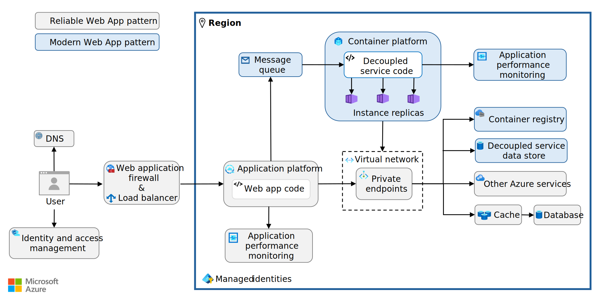
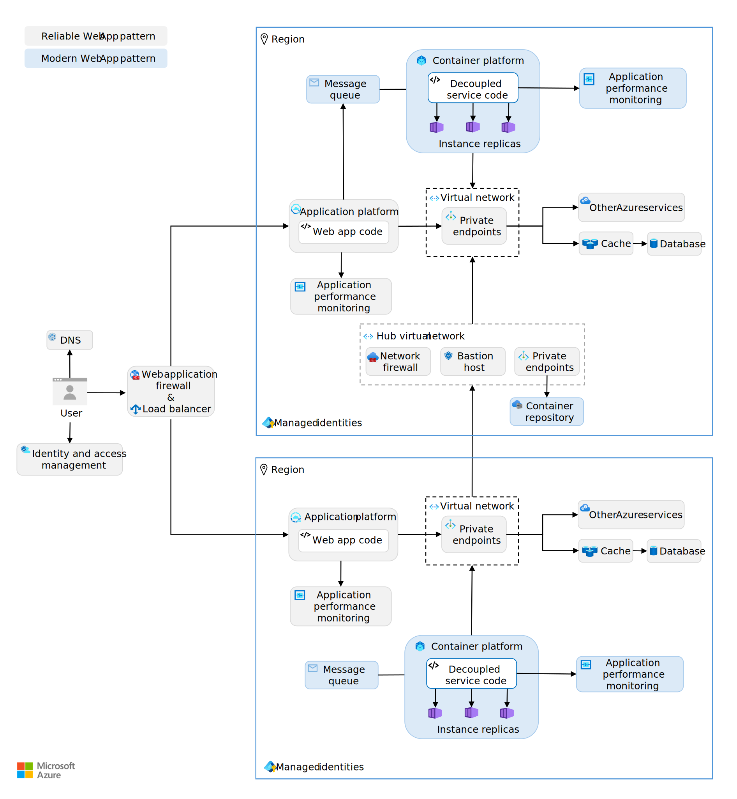
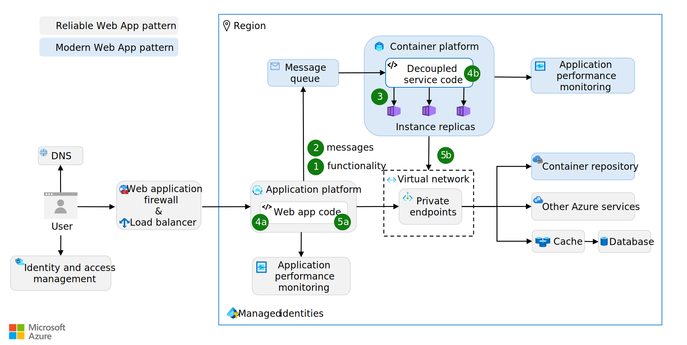
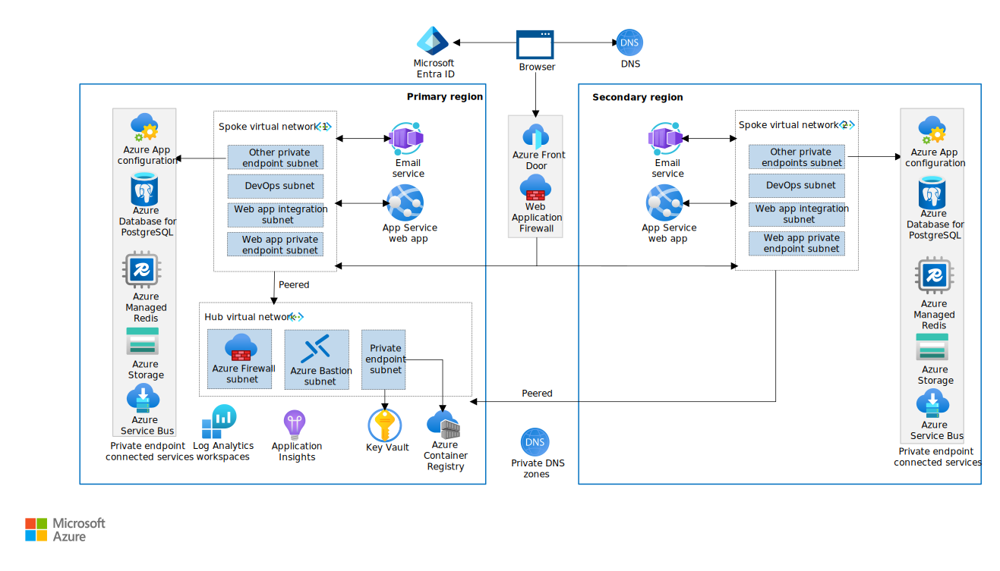

This article shows you how to implement the Modern Web App pattern. The Modern Web App pattern defines how you should modernize web apps in the cloud and introduce a service-oriented architecture. The Modern Web App pattern provides prescriptive architecture, code, and configuration guidance that aligns with the principles of the [Well-Architected Framework](/azure/well-architected/) (WAF) and builds on the [Reliable Web App pattern](../../overview.md#reliable-web-app-pattern).

*Why use the Modern Web App pattern?* The Modern Web App pattern helps optimize high-demand areas of your web application. It offers detailed guidance to decouple these areas, enabling independent scaling for cost optimization. This approach allows you to allocate dedicated resources to critical components, enhancing overall performance. Decoupling separable services can improve reliability by preventing slowdowns in one part of the app from affecting others and enable versioning individual app components independently.

*How to implement the Modern Web App pattern:* This article contains architecture, code, and configuration guidance to implement the Modern Web App pattern. Use the following links to navigate to the guidance you need:

- [***Architecture guidance***](#architecture-guidance): Learn how to modularize web app components and select appropriate platform-as-a-service (PaaS) solutions.
- [***Code guidance***](#code-guidance): Implement four design patterns to optimize the decoupled components: Strangler Fig, Queue-Based Load Leveling, Competing Consumers, and Health Endpoint Monitoring patterns.
- [***Configuration guidance***](#configuration-guidance): Configure authentication, authorization, autoscaling, and containerization for the decoupled components.

> [!TIP]
>  There's a ***[reference implementation][reference-implementation]*** (sample app) of the Modern Web App pattern. It represents the end-state of the Modern Web App implementation. It's a production-grade web app that features all the code, architecture, and configuration updates discussed in this article. Deploy and use the reference implementation to guide your implementation of the Modern Web App pattern.

## Architecture guidance

The Modern Web App pattern builds on the Reliable Web App pattern. It requires a few extra architectural components to implement. You need a message queue, container platform, storage service, and a container registry (*see figure 1*).

[](../../../_images/modern-web-app-architecture.svg#lightbox)
*Figure 1. Essential architectural elements of the Modern Web App pattern.*

For a higher service-level objective (SLO), you can add a second region to your web app architecture. Configure your load balancer to route traffic to the second region to support either an active-active or active-passive configuration depending on your business need. The two regions require the same services except one region has a hub virtual network that connects. Adopt a hub-and-spoke network topology to centralize and share resources, such as a network firewall. Access the container repository through the hub virtual network. If you have virtual machines, add a bastion host to the hub virtual network to manage them securely (*see figure 2*).

[](../../../_images/modern-web-app-architecture-plus-optional.svg#lightbox)
*Figure 2. The Modern Web App pattern architecture with second region and hub-and-spoke network topology.*

### Decouple architecture

To implement the Modern Web App pattern, you need to decouple the existing web app architecture. Decoupling architecture involves breaking down a monolithic application into smaller, independent services, each responsible for a specific feature or functionality. This process entails evaluating the current web app, modifying the architecture, and finally, extracting the web app code to a container platform. The goal is to systematically identify and extract application services that benefit most from being decoupled. To decouple your architecture, follow these recommendations:

- *Identify service boundaries* Apply domain driven design principles to identify bounded contexts within your monolithic application. Each bounded context represents a logical boundary and can be a candidate for a separate service. Services that represent distinct business functions and have fewer dependencies are good candidates for decoupling.

- *Evaluate service benefits.* Focus on services that benefit most from independent scaling. For example, an external dependency like an email service provider in an LOB application might require more isolation from failure. Consider services that undergo frequent updates or changes. Decoupling these services allows for independent deployment and reduces the risk of affecting other parts of the application.

- *Assess technical feasibility.* Examine the current architecture to identify technical constraints and dependencies that might affect the decoupling process. Plan how data is managed and shared across services. Decoupled services should manage their own data and minimize direct database access across service boundaries.

- *Deploy Azure services.* Select and deploy the Azure services you need to support the web app service you intended to extract. Use the following [Select the right Azure services](#select-the-right-azure-services) section for guidance.

- *Decouple web app service.* Define clear interfaces and APIs for the newly extracted web app services to interact with other parts of the system. Design a data management strategy that allows each service to manage its own data while ensuring consistency and integrity. For specific implementation strategies and design patterns to use during this extraction process, refer to the [Code guidance](#code-guidance) section.

- *Use independent storage for decoupled services.* Each decoupled service should have its own data stores to ease versioning and deployment. For example, the reference implementation separates the email service from the web app and eliminates the need for the service to access the database. Instead, the service communicates the email delivery status back to the web app via a Service Bus message, and the web app saves a note to its database.

- *Implement separate deployment pipelines for each decoupled service.* Separate deployment pipelines allow each service to be updated at its own pace. If different teams or organizations within your company own different services, having separate deployment pipelines gives each team control over their own deployments. Use CI/CD tools like Jenkins, GitHub Actions, or Azure Pipelines to set up these pipelines.

- *Revise security controls.* Ensure that your security controls are updated to account for the new architecture, including firewall rules and access controls.

### Select the right Azure services

For each Azure service in your architecture, consult the relevant [Azure service guide](/azure/well-architected/service-guides) in the Well-Architected Framework. For the Modern Web App pattern, you need a messaging system to support asynchronous messaging, an application platform that supports containerization, and a container image repository.

- *Choose a message queue.* A message queue is an important piece of service-oriented architectures. It decouples message senders and receivers to enable [asynchronous messaging](/azure/architecture/guide/technology-choices/messaging). Use the guidance on choosing an [Azure messaging service](/azure/service-bus-messaging/compare-messaging-services) to pick an Azure messaging system that supports your design needs. Azure has three messaging services: Azure Event Grid, Azure Event Hubs, and Azure Service Bus. Start with Azure Service Bus as the default choice and use the other two options if Azure Service Bus doesn't meet your needs.

    | Service  | Use Case   |
    |-------|--------|
    | Azure Service Bus | Choose Azure Service Bus for reliable, ordered, and possibly transactional delivery of high-value messages in enterprise applications. |
    | Azure Event Grid | Choose Azure Event Grid when you need to handle a large number of discrete events efficiently. Azure Event Grid is scalable for event-driven applications where many small, independent events (like resource state changes) need to be routed to subscribers in a low-latency, publish-subscribe model.        |
    | Azure Event Hubs | Choose Azure Event Hubs for massive, high-throughput data ingestion—such as telemetry, logs, or real-time analytics. Azure Event Hubs is optimized for streaming scenarios where bulk data needs to be ingested and processed continuously.         |

- *Implement a container service.* For the parts of your application that you want to containerize, you need an application platform that supports containers. Use the [Choose an Azure container service](/azure/architecture/guide/choose-azure-container-service) guidance to help make your decision. Azure has three principal container services: Azure Container Apps, Azure Kubernetes Service, and App Service. Start with Azure Container Apps as the default choice and use the other two options if Azure Container Apps doesn't meet your needs.

    | Service  | Use Case       |
    |------------------------------|---------------------|
    | Azure Container Apps (ACA) | Choose ACA if you need a serverless platform that automatically scales and manages containers in event-driven applications.                |
    | Azure Kubernetes Service (AKS) | Choose AKS if you need detailed control over Kubernetes configurations and advanced features for scaling, networking, and security.    |
    | Web Apps for Container    | Choose Web App for Containers on Azure App Service for the simplest PaaS experience.                                                      |

- *Implement a container repository.* When using any container-based compute service, it's necessary to have a repository to store the container images. You can use a public container registry like Docker Hub or a managed registry like Azure Container Registry. Use the [Introduction to Container registries in Azure](/azure/container-registry/container-registry-intro) guidance to help make your decision.

## Code guidance

To successfully decouple and extract an independent service, you need to update your web app code with the following design patterns: the Strangler Fig pattern, Queue-Based Load Leveling pattern, Competing Consumers pattern, Health Endpoint Monitoring pattern, and Retry pattern.

[](../../../_images/modern-web-app-design-patterns.svg#lightbox)
*Figure 3. Role of the design patterns.*

1. *Strangler Fig pattern*: The Strangler Fig pattern incrementally migrates functionality from a monolithic application to the decoupled service. Implement this pattern in the main web app to gradually migrate functionality to independent services by directing traffic based on endpoints.

1. *Queue-based Load Leveling pattern*: The Queue-Based Load Leveling pattern manages the flow of messages between the producer and the consumer by using a queue as a buffer. Implement this pattern on the producer portion of the decoupled service to manage message flow asynchronously using a queue.

1. *Competing Consumers pattern*: The Competing Consumers pattern allows multiple instances of the decoupled service to independently read from the same message queue and compete to process messages. Implement this pattern in the decoupled service to distribute tasks across multiple instances.

1. *Health Endpoint Monitoring pattern*: The Health Endpoint Monitoring pattern exposes endpoints for monitoring the status and health of different parts of the web app. **(4a)** Implement this pattern in the  main web app. **(4b)** Also implement it in the decoupled service to track the health of endpoints.

1. *Retry pattern*: The Retry pattern handles transient failures by retrying operations that might fail intermittently. **(5a)** Implement this pattern on all outbound calls to other Azure services in main web app, such as calls to message queue and private endpoints. **(5b)** Also implement this pattern in the decoupled service to handle transient failures in calls to the private endpoints.

Each design pattern provides benefits that align with one or more pillars of the Well-Architected Framework (*see following table*).

| Design Pattern | Implementation location | Reliability (RE) | Security (SE) | Cost Optimization (CO) | Operational Excellence (OE) | Performance Efficiency (PE) | Supporting WAF principles |
|----------|-----------|-------|----|----------|---------------|------| --- |
| [Strangler Fig Pattern](#implement-the-strangler-fig-pattern) | Main web app | ✔ |  | ✔ | ✔ |  | [RE:08](/azure/well-architected/reliability/testing-strategy) <br> [CO:07](/azure/well-architected/cost-optimization/optimize-component-costs) <br> [CO:08](/azure/well-architected/cost-optimization/optimize-environment-costs) <br> [OE:06](/azure/well-architected/operational-excellence/workload-supply-chain) <br> [OE:11](/azure/well-architected/operational-excellence/safe-deployments) |
| [Queue-Based Load Leveling Pattern](#implement-the-queue-based-load-leveling-pattern) | Producer of decoupled service | ✔ |  | ✔ |  | ✔ | [RE:06](/azure/well-architected/reliability/background-jobs) <br> [RE:07](/azure/well-architected/reliability/handle-transient-faults) <br> [CO:12](/azure/well-architected/cost-optimization/optimize-scaling-costs) <br> [PE:05](/azure/well-architected/performance-efficiency/scale-partition) |
| [Competing Consumers Pattern](#implement-the-competing-consumers-pattern) | Decoupled service | ✔ |  | ✔ |  | ✔ | [RE:05](/azure/well-architected/reliability/regions-availability-zones) <br> [RE:07](/azure/well-architected/reliability/background-jobs) <br> [CO:05](/azure/well-architected/cost-optimization/get-best-rates) <br> [CO:07](/azure/well-architected/cost-optimization/optimize-component-costs) <br> [PE:05](/azure/well-architected/performance-efficiency/scale-partition) <br> [PE:07](/azure/well-architected/performance-efficiency/optimize-code-infrastructure) |
| [Health Endpoint Monitoring Pattern](#implement-the-health-endpoint-monitoring-pattern) | Main web app & decoupled service | ✔ |  |  | ✔ | ✔ | [RE:07](/azure/well-architected/reliability/background-jobs) <br> [RE:10](/azure/well-architected/reliability/monitoring-alerting-strategy) <br> [OE:07](/azure/well-architected/operational-excellence/observability) <br> [PE:05](/azure/well-architected/performance-efficiency/scale-partition) |
| [Retry Pattern](#implement-the-retry-pattern) | Main web app & decoupled service | ✔ |  |  |  |  | [RE:07](/azure/well-architected/reliability/self-preservation) |

### Implement the Strangler Fig pattern

Use the [Strangler fig](/azure/architecture/patterns/strangler-fig) pattern to gradually migrate functionality from the monolithic codebase to new independent services. Extract new services from the existing monolithic code base and slowly modernize critical parts of the web app. To implement the Strangler Fig pattern, follow these recommendations:

- *Set up a routing layer* In the monolithic web app code base, implement a routing layer that directs traffic based on endpoints. Use custom routing logic as needed to handle specific business rules for directing traffic. For example, if you have a `/users` endpoint in your monolithic app and you moved that functionality to the decoupled service, the routing layer would direct all requests to `/users` to the new service.

- *Manage feature rollout.* [Implement feature flags](/azure/azure-app-configuration/use-feature-flags-spring-boot) and [staged rollout](/azure/azure-app-configuration/howto-targetingfilter) to gradually roll out the decoupled services. The existing monolithic app routing should control how many requests the decoupled services receives. Start with a small percentage of requests and increase usage over time as you gain confidence in its stability and performance.

    For example, the reference implementation extracts the email delivery functionality into a standalone service, which can be gradually introduced to handle a larger portion of the requests to send emails containing Contoso support guides. As the new service proves its reliability and performance, it can eventually take over the entire set of email responsibilities from the monolith, completing the transition.

- *Use a façade service (if necessary).* A façade service is useful when a single request needs to interact with multiple services or when you want to hide the complexity of the underlying system from the client. However, if the decoupled service doesn't have any public-facing APIs, a façade service might not be necessary.

    In the monolithic web app code base, implement a façade service to route requests to the appropriate backend (monolith or microservice). In the new decoupled service, ensure the new service can handle requests independently when accessed through the façade.

### Implement the Queue-Based Load Leveling pattern

Implement the [Queue-Based Load Leveling pattern](/azure/architecture/patterns/queue-based-load-leveling) on producer portion of the decoupled service to asynchronously handle tasks that don't need immediate responses. This pattern enhances overall system responsiveness and scalability by using a queue to manage workload distribution. It allows the decoupled service to process requests at a consistent rate. To implement this pattern effectively, follow these recommendations:

- *Use nonblocking message queuing.* Ensure the process that sends messages to the queue doesn't block other processes while waiting for the decoupled service to handle messages in the queue. If the process requires the result of the decoupled-service operation, implement an alternative way to handle the situation while waiting for the queued operation to complete. For example, in Spring Boot, you can use the `StreamBridge` class to asynchronously publish messages to the queue without blocking the calling thread (*see example code*):

    ```java
    private final StreamBridge streamBridge;

    public SupportGuideQueueSender(StreamBridge streamBridge) {
        this.streamBridge = streamBridge;
    }

    // Asynchronously publish a message without blocking the calling thread
    @Override
    public void send(String to, String guideUrl, Long requestId) {
        EmailRequest emailRequest = EmailRequest.newBuilder()
                .setRequestId(requestId)
                .setEmailAddress(to)
                .setUrlToManual(guideUrl)
                .build();

        log.info("EmailRequest: {}", emailRequest);

        var message = emailRequest.toByteArray();
        streamBridge.send(EMAIL_REQUEST_QUEUE, message);

        log.info("Message sent to the queue");
    }
    ```

    This Java example uses `StreamBridge` to send messages asynchronously. This approach ensures that the main application remains responsive and can handle other tasks concurrently, while the decoupled service processes the queued requests at a manageable rate.

- *Implement message retry and removal.* Implement a mechanism to retry processing of queued messages that can't be processed successfully. If failures persist, these messages should be removed from the queue. For example, Azure Service Bus has built-in retry and dead letter queue features.

- *Configure idempotent message processing.* The logic that processes messages from the queue must be idempotent to handle cases where a message might be processed more than once. In Spring Boot, you can use `@StreamListener` or `@KafkaListener` with a unique message identifier to prevent duplicate processing. Or you can organize the business process o operate in a functional approach with Spring Cloud Stream, where the `consume` method is defined in a way that produces the same result when it's executed repeatedly. Read [Spring Cloud Stream with Azure Service Bus](/azure/developer/java/spring-framework/configure-spring-cloud-stream-binder-java-app-with-service-bus?tabs=use-a-service-bus-queue) for further list of settings that manage the behavior of how messages are consumed.

- *Manage changes to the experience.* Asynchronous processing can lead to tasks not being immediately completed. Users should be made aware when their task is still being processed to set correct expectations and avoid confusion. Use visual cues or messages to indicate that a task is in progress. Give users the option to receive notifications when their task is done, such as an email or push notification.

### Implement the Competing Consumers pattern

Implement the [Competing Consumers pattern](/azure/architecture/patterns/competing-consumers) in the decoupled service to manage incoming tasks from the message queue. This pattern involves distributing tasks across multiple instances of decoupled services. These services process messages from the queue, enhancing load balancing and boosting the system's capacity to handle simultaneous requests. The Competing Consumers pattern is effective when:

- The sequence of message processing isn't crucial.
- The queue remains unaffected by malformed messages.
- The processing operation is idempotent, meaning it can be applied multiple times without changing the result beyond the initial application.

To implement the Competing Consumers pattern, follow these recommendations:

- *Handle concurrent messages.* When receiving messages from a queue, ensure that your system scales predictably by configuring the concurrency to match your system design. Your load test results help you decide the appropriate number of concurrent messages to handle and you can start from 1 to measure the impact how the system will perform.

- *Disable prefetching.* Disable prefetching of messages so consumers only fetch messages when they're ready.

- *Use reliable message processing modes.* Use a reliable processing mode, such as PeekLock (or its equivalent), that automatically retries messages that fail processing. This mode enhances reliability over deletion-first methods. If one worker fails to handle a message, another must be able to process it without errors, even if the message is processed multiple times.

- *Implement error handling.* Route malformed or unprocessable messages to a separate, dead-letter queue. This design prevents repetitive processing. For example, you can catch exceptions during message processing and move the problematic message to the separate queue. For Azure Service Bus, messages are moved to the dead-leter queue after a specified number of delivery attempts or on explicit rejection by the application.

- *Handle out-of-order messages.* Design consumers to process messages that arrive out of sequence. Multiple parallel consumers means they might process messages out of order.

- *Scale based on queue length.* Services consuming messages from a queue should autoscale based on queue length. Scale-based autoscaling allows for efficient processing of spikes of incoming messages.

- *Use message-reply queue.* If the system requires notifications post-message processing, set up a dedicated reply or response queue. This setup divides operational messaging from notification processes.

- *Use stateless services.* Consider using stateless services to process requests from a queue. It allows for easy scaling and efficient resource usage.

- *Configure logging.* Integrate logging and specific exception handling within the message processing workflow. Focus on capturing serialization errors and directing these problematic messages to a dead letter mechanism. These logs provide valuable insights for troubleshooting.

For example, the reference implementation uses the Competing Consumers pattern on a stateless service running in Azure Container App to process the email delivery requests from an Azure Service Bus queue.

The processor logs message processing details, aiding in troubleshooting and monitoring. It captures deserialization errors and provides insights needed when debugging the process. The service scales at the container level, allowing for efficient handling of message spikes based on queue length (*see following code*).

```java
@Configuration
public class EmailProcessor {

    private static final Logger log = LoggerFactory.getLogger(EmailProcessor.class);

    @Bean
    Function<byte[], byte[]> consume() {
        return message -> {

            log.info("New message received");

            try {
                EmailRequest emailRequest = EmailRequest.parseFrom(message);
                log.info("EmailRequest: {}", emailRequest);

                EmailResponse emailResponse = EmailResponse.newBuilder()
                        .setEmailAddress(emailRequest.getEmailAddress())
                        .setUrlToManual(emailRequest.getUrlToManual())
                        .setRequestId(emailRequest.getRequestId())
                        .setMessage("Email sent to " + emailRequest.getEmailAddress() + " with URL to manual " + emailRequest.getUrlToManual())
                        .setStatus(Status.SUCCESS)
                        .build();

                return emailResponse.toByteArray();

            } catch (InvalidProtocolBufferException e) {
                throw new RuntimeException("Error parsing email request message", e);
            }
        };
    }
}
```

### Implement the Health Endpoint Monitoring pattern

Implement the [Health Endpoint Monitoring pattern](/azure/architecture/patterns/health-endpoint-monitoring) in the main app code and decoupled service code to track the health of application endpoints. Orchestrators like Azure Kubernetes Service or Azure Container Apps can poll these endpoints to verify service health and restart unhealthy instances. Spring Boot provides built-in support for health checks with Spring Boot Actuator, which can expose health check endpoints for key dependencies like databases, message brokers, and storage systems. To implement the Health Endpoint Monitoring pattern, follow these recommendations:

- *Implement Health Checks.* Use Spring Boot Actuator to provide health check endpoints. Spring Boot Actuator exposes an endpoint `/actuator/health` that includes built-in health indicators and custom checks for various dependencies. To enable the health endpoint, add the `spring-boot-starter-actuator` dependency in your `pom.xml` or `build.gradle` file.

    ```xml
    <!-- Add Spring Boot Actuator dependency -->
    <dependency>
        <groupId>org.springframework.boot</groupId>
        <artifactId>spring-boot-starter-actuator</artifactId>
    </dependency>
    ```

    Configure the health endpoint in `application.properties` as shown in the reference implementation:
        ```txt
        management.endpoints.web.exposure.include=metrics,health,info,retry,retryevents
        ```

- *Validate dependencies.* Spring Boot Actuator includes health indicators for various dependencies like databases, message brokers (RabbitMQ or Kafka), and storage services. To validate the availability of Azure services such as Azure Blob Storage or Azure Service Bus, use community plugins like Spring Cloud Azure or Micrometer integrations, which provide health indicators for these services. If custom checks are needed, you can implement them by creating a custom `HealthIndicator` bean.

    ```java
    import org.springframework.boot.actuate.health.Health;
    import org.springframework.boot.actuate.health.HealthIndicator;
    import org.springframework.stereotype.Component;

    @Component
    public class CustomAzureServiceBusHealthIndicator implements HealthIndicator {
        @Override
        public Health health() {
            // Implement your health check logic here (e.g., ping Azure Service Bus)
            boolean isServiceBusHealthy = checkServiceBusHealth();
            return isServiceBusHealthy ? Health.up().build() : Health.down().build();
        }

        private boolean checkServiceBusHealth() {
            // Implement health check logic (pinging or connecting to the service)
            return true; // Placeholder, implement actual logic
        }
    }
    ```

- *Configure Azure resources.* Configure the Azure resource to use the app's health check URLs to confirm liveness and readiness. For example, you can use Terraform to use the health check URLs to confirm the liveness and readiness of apps deployed to Azure Container Apps. For more information, see [Health probes in Azure Container Apps](/azure/container-apps/health-probes).

### Implement the Retry Pattern

The [Retry pattern](/azure/architecture/patterns/retry) allows applications to recover from transient faults. The Retry pattern is central to the Reliable Web App pattern, so your web app should be using the Retry pattern already. Apply the Retry pattern to requests to the messaging systems and requests issued by the decoupled services you extract from the web app. To implement the Retry pattern, follow these recommendations:

- *Configure retry options.* When integrating with a message queue, make sure to configure the client responsible for interactions with the queue with appropriate retry settings. Specify parameters such as the maximum number of retries, delay between retries, and maximum delay.

- *Use exponential backoff.* Implement exponential backoff strategy for retry attempts. This means increasing the time between each retry exponentially, which helps reduce the load on the system during periods of high failure rates.

- *Use SDK Retry functionality.* For services with specialized SDKs, like Azure Service Bus or Azure Blob Storage, use the built-in retry mechanisms. The built-in retry mechanisms are optimized for the service's typical use cases and can handle retries more effectively with less configuration required on your part.

- *Adopt standard resilience Libraries for HTTP Clients.* For HTTP clients, you can use Resilience4* along with Spring's RestTemplate or WebClient to handle retries in HTTP communications. Spring's RestTemplate can be wrapped with Resilience4j's retry logic to handle transient HTTP errors effectively.

- *Handle message locking.* For message-based systems, implement message handling strategies that support retries without data loss, such as using "peek-lock" modes where available. Ensure that failed messages are retried effectively and moved to a dead-letter queue after repeated failures.

## Configuration guidance

The following sections provide guidance on implementing the configuration updates. Each section aligns with one or more pillars of the Well-Architected Framework.

|Configuration|Reliability (RE) |Security (SE) |Cost Optimization (CO) |Operational Excellence (OE)|Performance Efficiency (PE)| Supporting WAF principles |
|---|---|---|---|---|---| --- |
|[Configure authentication and authorization](#configure-authentication-and-authorization)| |✔| |✔| | [SE:05](/azure/well-architected/security/identity-access) <br> [OE:10](/azure/well-architected/operational-excellence/enable-automation#authentication-and-authorization)
|[Implement independent autoscaling](#configure-independent-autoscaling)|✔| |✔| |✔| [RE:06](/azure/well-architected/reliability/scaling) <br> [CO:12](/azure/well-architected/cost-optimization/optimize-scaling-costs) <br> [PE:05](/azure/well-architected/performance-efficiency/scale-partition) |
|[Containerize service deployment](#containerize-service-deployment)| | |✔| |✔| [CO:13](/azure/well-architected/cost-optimization/optimize-personnel-time) <br> [PE:09](/azure/well-architected/performance-efficiency/prioritize-critical-flows#isolate-critical-flows) <br> [PE:03](/azure/well-architected/performance-efficiency/select-services#evaluate-compute-requirements) |

### Configure authentication and authorization

To configure authentication and authorization on any new Azure services (*workload identities*) you add to the web app, follow these recommendations:

- *Use managed identities for each new service.* Each independent service should have its own identity and use managed identities for service-to-service authentication. Managed identities eliminate the need to manage credentials in your code and reduce the risk of credential leakage. It helps you avoid putting sensitive information like connection strings in your code or configuration files.

- *Grant least privilege to each new service.* Assign only necessary permissions to each new service identity. For example, if an identity only needs to push to a container registry, don't give it pull permissions. Review these permissions regularly and adjust as necessary. Use different identities for different roles, such as deployment and the application. This limits the potential damage if one identity is compromised.

- *Adopt infrastructure as code (IaC).* Use Azure Bicep or similar IaC tools like Terraform to define and manage your cloud resources. IaC ensures consistent application of security configurations in your deployments and allows you to version control your infrastructure setup.

To configure authentication and authorization on users (*user identities*), follow these recommendations:

- *Grant least privilege to users.* Just like with services, ensure that users are given only the permissions they need to perform their tasks. Regularly review and adjust these permissions.

- *Conduct regular security audits.* Regularly review and audit your security setup. Look for any misconfigurations or unnecessary permissions and rectify them immediately.

The reference implementation uses IaC to assign managed identities to added services and specific roles to each identity. It defines roles and permissions access for deployment by defining roles for ACR push and pull (*see following code*).

```terraform
resource "azurerm_role_assignment" "container_app_acr_pull" {
  principal_id         = var.aca_identity_principal_id
  role_definition_name = "AcrPull"
  scope                = azurerm_container_registry.acr.id
}

resource "azurerm_user_assigned_identity" "container_registry_user_assigned_identity" {
  name                = "ContainerRegistryUserAssignedIdentity"
  resource_group_name = var.resource_group
  location            = var.location
}

resource "azurerm_role_assignment" "container_registry_user_assigned_identity_acr_pull" {
  scope                = azurerm_container_registry.acr.id
  role_definition_name = "AcrPull"
  principal_id         = azurerm_user_assigned_identity.container_registry_user_assigned_identity.principal_id
}


# For demo purposes, allow current user access to the container registry
# Note: when running as a service principal, this is also needed
resource "azurerm_role_assignment" "acr_contributor_user_role_assignement" {
  scope                = azurerm_container_registry.acr.id
  role_definition_name = "Contributor"
  principal_id         = data.azuread_client_config.current.object_id
}
```

### Configure independent autoscaling

The Modern Web App pattern begins breaking up the monolithic architecture and introduces service decoupling. When you decouple a web app architecture, you can scale decoupled services independently. Scaling the Azure services to support an independent web app service, rather than an entire web app, optimizes scaling costs while meeting demands. To autoscale containers, follow these recommendations:

- *Use stateless services.* Ensure your services are stateless. If your web app contains in-process session state, externalize it to a distributed cache like Redis or a database like Azure SQL Server.

- *Configure autoscaling rules.* Use the autoscaling configurations that provide the most cost-effective control over your services. For containerized services, consider event-based scaling, such as Kubernetes Event-Driven Autoscaler (KEDA) often provides granular control, allowing you to scale based on event metrics. [Azure Container Apps](/azure/container-apps/scale-app) and Azure Kubernetes Service support KEDA. For services that don't support KEDA, such as [Azure App Service](/azure/app-service/manage-automatic-scaling), use the autoscaling features provided by the platform itself. These features often include scaling based on metrics-based rules or HTTP traffic.

- *Configure minimum replicas.* To prevent a cold start, configure autoscaling settings to maintain a minimum of one replica. A cold start is when you initialize a service from a stopped state, which often creates a delayed response. If minimizing costs is a priority and you can tolerate cold start delays, set the minimum replica count to 0 when configuring autoscaling.

- *Configure a cooldown period.* Apply an appropriate cooldown period to introduce a delay between scaling events. The goal is to [prevent excessive scaling](/azure/well-architected/cost-optimization/optimize-scaling-costs#optimize-autoscaling) activities triggered by temporary load spikes.

- *Configure queue-based scaling.* If your application uses a message queue like Azure Service Bus, configure your autoscaling settings to scale based on the length of the queue with request messages. The scaler aims to maintain one replica of the service for every N message in the queue (rounded up).

For example, the reference implementation uses the Azure Service Bus KEDA scaler to automatically scale the Azure Container App based on the length of the Azure Service Bus queue. The scaling rule, named `service-bus-queue-length-rule`, adjusts the number of service replicas depending on the message count in the specified Azure Service Bus queue. The `messageCount` parameter is set to 10, which means the scaler adds one replica for every 10 messages in the queue. The maximum replicas (`max_replicas`) are set to 10, and minimum replicas are implicitly 0 unless overridden, which allows the service to scale down to zero when there are no messages in the queue. The connection string for the Service Bus queue is stored securely as a secret in Azure, named `azure-servicebus-connection-string`, which is used to authenticate the scaler to the Service Bus.

```terraform
    max_replicas = 10
    min_replicas = 1

    custom_scale_rule {
      name             = "service-bus-queue-length-rule"
      custom_rule_type = "azure-servicebus"
      metadata = {
        messageCount = 10
        namespace    = var.servicebus_namespace
        queueName    = var.email_request_queue_name
      }
      authentication {
        secret_name       = "azure-servicebus-connection-string"
        trigger_parameter = "connection"
      }
    }
```

### Containerize service deployment

Containerization means that all dependencies for the app to function are encapsulated in a lightweight image that can be reliably deployed to a wide range of hosts. To containerize deployment, follow these recommendations:

- *Identify domain boundaries.* Start by identifying the domain boundaries within your monolithic application. This helps determine which parts of the application you can extract into separate services.

- *Create docker images.* When creating Docker images for your Java services, use official OpenJDK base images. These images contain only the minimal set of packages needed for Java to run, which minimizes both the package size and the attack surface area.

- *Use multi-stage Dockerfiles.* Use a multi-stage Dockerfiles to separate build-time assets from the runtime container image. It helps to keep your production images small and secure. You can also use a preconfigured build server and copy the jar file into the container image.

- *Run as nonroot user.* Run your Java containers as a nonroot user (via user name or UID, $APP_UID) to align with the principle of least privilege. It limits the potential effects of a compromised container.

- *Listen on port 8080.* When running as a nonroot user, configure your application to listen on port 8080. It's a common convention for nonroot users.

- *Encapsulate dependencies.* Ensure that all dependencies for the app to function are encapsulated in the Docker container image. Encapsulation allows the app to be reliably deployed to a wide range of hosts.

- *Choose the right base images.* The base image you choose depends on your deployment environment. If you're deploying to Azure Container Apps, for instance, you need to use Linux Docker images.

The reference implementation demonstrates a Docker build process for containerizing a Java application. This Dockerfile uses a single-stage build with the OpenJDK base image (`mcr.microsoft.com/openjdk/jdk:17-ubuntu`), which provides the necessary Java runtime environment.

The Dockerfile includes the following steps:

1. *Volume declaration*: A temporary volume (`/tmp`) is defined, allowing for temporary file storage separate from the container's main filesystem.
1. *Copying artifacts*: The application's JAR file (`email-processor.jar`) is copied into the container, along with the Application Insights agent (`applicationinsights-agent.jar`) for monitoring.
1. *Setting the entrypoint*: The container is configured to run the application with the Application Insights agent enabled, using `java -javaagent` to monitor the application during runtime.

This Dockerfile keeps the image lean by only including runtime dependencies, suitable for deployment environments like Azure Container Apps, which support Linux-based containers.

```dockerfile
# Use OpenJDK 17 base image on Ubuntu as the foundation
FROM mcr.microsoft.com/openjdk/jdk:17-ubuntu

# Define a volume to allow temporary files to be stored separately from the container's main file system
VOLUME /tmp

# Copy the packaged JAR file into the container
COPY target/email-processor.jar app.jar

# Copy the Application Insights agent for monitoring
COPY target/agent/applicationinsights-agent.jar applicationinsights-agent.jar

# Set the entry point to run the application with the Application Insights agent
ENTRYPOINT ["java", "-javaagent:applicationinsights-agent.jar", "-jar", "/app.jar"]
```

## Deploy the reference implementation

 Deploy the reference implementation of the [Modern Web App Pattern for Java](https://github.com/azure/modern-web-app-pattern-java). There are instructions for both development and production deployment in the repository. After you deploy, you can simulate and observe design patterns.

[](../../../_images/modern-web-app-java.svg)
*Figure 3. Architecture of the reference implementation. Download a [Visio file](https://arch-center.azureedge.net/modern-web-app-java.vsdx) of this architecture.*

>[!div class="nextstepaction"]
>[Modern Web App pattern for Java reference implementation][reference-implementation]

[reference-implementation]: https://github.com/Azure/modern-web-app-pattern-java