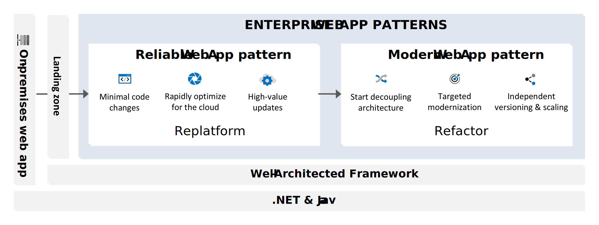

# Enterprise Web App Patterns

Enterprise Web App patterns provide a structured approach to guide developers and architects through the cloud journey, specifically focusing on web application. It divides into distinct phases, called web app patterns. Each represents a common business goals and step towards a more advanced web application. The web app patterns provide prescriptive architecture, code, and configuration guidance that align with the principles of the [Well-Architected Framework](/azure/well-architected/pillars).

For each pattern, there's tailored guidance for .NET and Java web apps. These patterns serve as a roadmap to help you transform legacy web apps into cloud-optimized solutions that deliver greater business value. The guidance provided by the Enterprise Web App patterns is instrumental in ensuring a smooth and successful transition through the cloud journey.

*Figure 1. Overview of the Enterprise Web App patterns.*

## Reliable Web App pattern

The Reliable Web App pattern facilitates the initial migration of applications to the cloud with minimal changes. It shows you how to cloud-optimize and replatform on-premises, monolithic web apps moving to the cloud. It details the high-value updates to quickly harness the benefits of the cloud with minimal effort. This pattern assumes your organization has an established [landing zone](/azure/cloud-adoption-framework/ready/landing-zone/) for the web app, providing a solid foundation for cloud deployment.

>[!div class="nextstepaction"]
>[Reliable Web App pattern for .NET](./reliable-web-app/dotnet/guidance.yml)

>[!div class="nextstepaction"]
>[Reliable Web App pattern for Java](./reliable-web-app/java/guidance.yml)

## Modern Web App pattern

The Modern Web App pattern provides a clear strategy for targeted modernization of web apps in the cloud. It focuses on optimizing and transforming high-demand areas by gradually decoupling them into stand-alone services, allowing for independent versioning and scaling. This approach enables performance optimization in a cost-efficient manner and serves as an intermediate step between monolithic and microservices architectures. By supporting independent development and flexible deployments, the pattern accelerates development cycles and enhances overall application performance.

>[!div class="nextstepaction"]
>[Modern Web App pattern for .NET](./modern-web-app/dotnet/guidance.yml)
