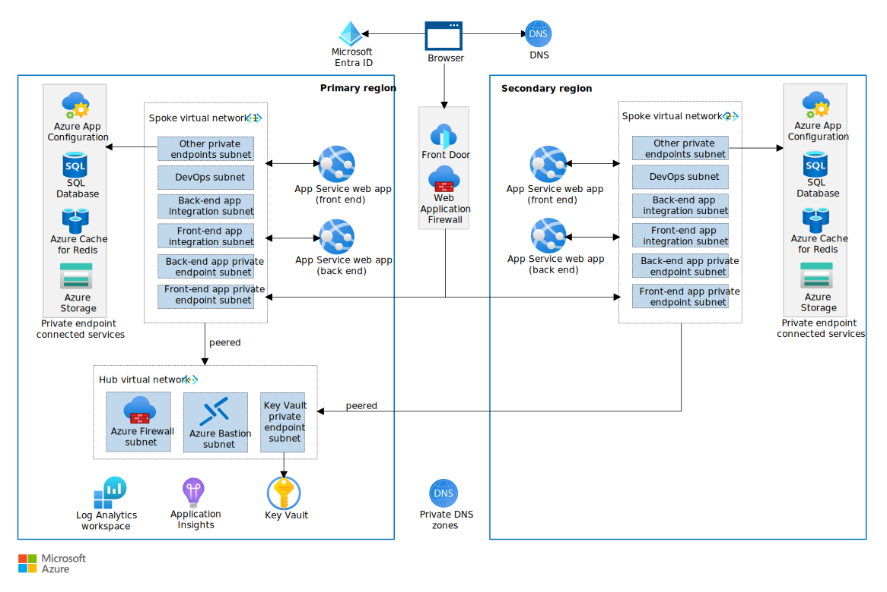

---
ms.custom:
  - devx-track-dotnet
  - sfi-ropc-nochange
---

[!INCLUDE [intro 1](../includes/intro-1.md)]

## Why the Reliable Web App pattern for .NET?

The Reliable Web App pattern is a set of principles and implementation techniques that define how you should replatform web apps when you migrate them to the cloud. It focuses on the minimal code updates you need to make to be successful in the cloud. The following guidance uses a reference implementation as an example throughout. The guidance follows the replatform journey of the fictional company Relecloud to provide business context for your journey. Before implementing the Reliable Web App pattern for .NET, Relecloud had a monolithic on-premises ticketing web app that used the ASP.NET framework.

> [!TIP]
>  There's [***reference implementation***][reference-implementation] (sample) of the Reliable Web App pattern. It represents the end state of the Reliable Web App implementation for a fictional company named Relecloud. It's a production-grade web app that features all the code, architecture, and configuration updates discussed in this article. Deploy and use the reference implementation to guide your implementation of the Reliable Web App pattern.

[!INCLUDE [intro 2](../includes/intro-2.md)]

## Business context

The first step in replatforming a web app is to define your business objectives. You should set immediate goals, like service-level objectives (SLO) and cost optimization targets, and also future goals for your web application. These objectives influence your choice of cloud services and the architecture of your web application in the cloud. Define a target SLO for your web app, such as 99.9% uptime. Calculate the [composite SLA](/azure/well-architected/reliability/metrics#slos-and-slas) for all the services that affect the availability of your web app.

For example, Relecloud has a positive sales forecast and anticipates increased demand on their ticketing web app. To meet this demand, they defined the goals for the web application:

- Apply low-cost, high-value code changes.
- Reach an SLO of 99.9%.
- Adopt DevOps practices.
- Create cost-optimized environments.
- Improve reliability and security.

Relecloud's on-premises infrastructure wasn't a cost-effective solution to reach these goals. They decided that migrating their web application to Azure was the most cost-effective way to achieve their immediate and future objectives.

## Architecture guidance

[!INCLUDE [reliable web app pattern architecture updates](../includes/architecture-updates.md)]

### Pick the right Azure services

When you move a web app to the cloud, you should choose Azure services that meet your business requirements and align with the current features of the on-premises web app. This alignment helps minimize the replatforming effort. For example, use services that allow you to keep the same database engine and support existing middleware and frameworks. The following sections provide guidance for selecting the right Azure services for your web app.

For example, before it was moved to the cloud, Relecloud's ticketing web app was an on-premises monolithic ASP.NET app. It ran on two virtual machines and used a SQL Server database. The web app suffered from common problems with scalability and feature deployment. This starting point, their business goals, and SLO drove their service choices.

- *Application platform:* Use [Azure App Service](/azure/app-service/overview) as your application platform. Relecloud chose App Service as the application platform for the following reasons:

    - *High service-level agreement (SLA).* It has a high SLA that meets the production environment SLO of 99.9%.
    - *Reduced management overhead.* It's a fully managed solution that handles scaling, health checks, and load balancing.
    - *.NET support.* It supports the version of .NET that the application is written in.
    - *Containerization capability.* The web app can converge on the cloud without containerizing, but the application platform also supports containerization without changing Azure services.
    - *Automatic scaling.* The web app can automatically scale in and out based on user traffic and configuration settings. The platform also supports scaling up or down to accommodate different hosting requirements.
    
- *Identity management:* Use [Microsoft Entra ID](/entra/fundamentals/whatis) as your identity and access management solution. Relecloud chose Microsoft Entra ID for the following reasons:

    - *Authentication and authorization.* The application needs to authenticate and authorize call center employees.
    - *Scalable.* Microsoft Entra ID scales to support larger scenarios.
    - *User-identity control.* Call center employees can use their existing enterprise identities.
    - *Authorization protocol support.* Microsoft Entra ID supports OAuth 2.0 for managed identities.

- *Database:* Use a service that allows you to keep the same database engine. Use the [data store decision tree](/azure/architecture/guide/technology-choices/data-store-decision-tree) to guide your selection. Relecloud's web app used SQL Server on-premises. They wanted to use the existing database schema, stored procedures, and functions. Several SQL products are available on Azure, but Relecloud chose [Azure SQL Database](/azure/azure-sql/azure-sql-iaas-vs-paas-what-is-overview?view=azuresql) for the following reasons:

    - *Reliability.* The general-purpose tier provides a high SLA and multi-region redundancy. It can support a high user load.
    - *Reduced management overhead.* SQL Database provides a managed SQL database instance.
    - *Migration support.* It supports database migration from on-premises SQL Server.
    - *Consistency with on-premises configurations.* It supports the existing stored procedures, functions, and views.
    - *Recoverability.* Supports backups and point-in-time restore so the database can be restored to a previous consistent state after a disruption.
    - *Expertise and minimal rework.* SQL Database enables Relecloud to take advantage of existing expertise and requires minimal work to adopt.

- *Application performance monitoring:* Use [Application Insights](/azure/azure-monitor/app/app-insights-overview) to analyze telemetry for your application. Relecloud chose to use Application Insights for the following reasons:

    - *Integration with Azure Monitor.* It provides the best integration with Azure Monitor.
    - *Anomaly detection.* It automatically detects performance anomalies.
    - *Troubleshooting.* It helps you diagnose problems in the running app.
    - *Monitoring.* It collects information about how users are using the app and enables you to easily track custom events.
    - *Visibility gap.* The on-premises solution didn't have an application performance monitoring solution. Application Insights provides easy integration with the application platform and code.

- *Cache:* Choose whether to add a cache to your web app architecture. [Azure Managed Redis](/azure/redis/overview) is the primary Azure cache solution. It's a managed in-memory data store that's based on Redis software. Relecloud's web app load is heavily skewed toward viewing concerts and venue details. Relecloud added Azure Managed Redis for the following reasons:

  - *Reduced management overhead.* It's a fully managed service.
  - *Speed and volume.* It has high-data throughput and low latency reads for commonly accessed, slow-changing data.
  - *Diverse supportability.* It's a unified cache location for all instances of the web app to use.
  - *External data store.* The on-premises application servers performed VM-local caching. This setup didn't offload highly frequented data, and it couldn't invalidate data.
  - *Nonsticky sessions.* Externalizing session state supports nonsticky sessions.

- *Load balancer:* Web applications that use PaaS solutions should use Azure Front Door, Azure Application Gateway, or both, depending on web app architecture and requirements. Use the [load balancer decision tree](/azure/architecture/guide/technology-choices/load-balancing-overview) to pick the right load balancer. Relecloud needed a layer-7 load balancer that could route traffic across multiple regions. The company needed a multi-region web app to meet the SLO of 99.9%. Relecloud chose [Azure Front Door](/azure/frontdoor/front-door-overview) for the following reasons:

    - *Global load balancing.* It's a layer-7 load balancer that can route traffic across multiple regions.
    - *Web application firewall.* It integrates natively with Azure Web Application Firewall.
    - *Routing flexibility.* It allows the application team to configure ingress needs to support future changes in the application.
    - *Traffic acceleration.* It uses anycast to reach the nearest Azure point of presence and find the fastest route to the web app.
    - *Custom domains.* It supports custom domain names with flexible domain validation.
    - *Health probes.* The application requires intelligent health probe monitoring. Azure Front Door uses responses from the probe to determine the best origin for routing client requests.
    - *Monitoring support.* It supports built-in reports with an all-in-one dashboard for both Azure Front Door and security patterns. You can configure alerts that integrate with Azure Monitor. Azure Front Door enables the application to log each request and failed health probes.
    - *DDoS protection.* It has built-in layer 3-4 DDoS protection.
    - *Content delivery network.* It positions Relecloud to use a content delivery network. The content delivery network provides site acceleration.

- *Web application firewall:* Use [Azure Web Application Firewall](/azure/web-application-firewall/overview) to provide centralized protection from common web exploits and vulnerabilities. Relecloud uses Azure Web Application Firewall for the following reasons:

    - *Global protection.* It provides improved global web app protection without sacrificing performance.
    - *Botnet protection.* The team can monitor and configure settings to address security concerns related to botnets.
    - *Parity with on-premises.* The on-premises solution was running behind a web application firewall managed by IT.
    - *Ease of use.* Web Application Firewall integrates with Azure Front Door.

- *Configuration storage:* Choose whether to add app configuration storage to your web app. [Azure App Configuration](/azure/azure-app-configuration/overview) is a service for centrally managing application settings and feature flags. Review [App Configuration best practices](/azure/azure-app-configuration/howto-best-practices#app-configuration-bootstrap) to decide whether this service is a good fit for your app. Relecloud wanted to replace file-based configuration with a central configuration store that integrates with the application platform and code. They added App Configuration to the architecture for the following reasons:

    - *Flexibility.* It supports feature flags. Feature flags allow users to opt in and out of early preview features in a production environment without requiring app redeployment.
    - *Git pipeline support.* The source of truth for configuration data needed to be a Git repository. The pipeline needed to update the data in the central configuration store.
    - *Managed identity support.* It supports managed identities to simplify and help secure the connection to the configuration store.

- *Secrets manager:* Use [Azure Key Vault](/azure/key-vault/general/overview) if you have secrets to manage in Azure. You can incorporate Key Vault in .NET apps by using the [ConfigurationBuilder object](/azure/azure-app-configuration/quickstart-dotnet-core-app). Relecloud's on-premises web app stored secrets in code configuration files, but a better security practice is to store secrets in a location that supports Azure role-based access control (Azure RBAC) and audit controls. Although [managed identities](/entra/architecture/service-accounts-managed-identities) are the preferred solution for connecting to Azure resources, Relecloud had application secrets they needed to manage. Relecloud used Key Vault for the following reasons:

    - *Encryption.* It supports encryption at rest and in transit.
    - *Managed identity support.* The application services can use managed identities to access the secret store.
    - *Monitoring and logging.* Key Vault facilitates audit access and generates alerts when stored secrets change.
    - *Integration.* Key Vault provides native integration with the Azure configuration store (App Configuration) and web hosting platform (App Service).

- *Storage solution:* See [Azure storage options](/azure/architecture/guide/technology-choices/storage-options) to pick the right storage solution based on your requirements. Relecloud's on-premises web app had disk storage mounted to each web server, but the team wanted to use an external data storage solution. Relecloud chose [Azure Blob Storage](/azure/storage/blobs/storage-blobs-introduction) for the following reasons:

    - *Enhanced-security access.* The web app can eliminate endpoints for accessing storage exposed to the public internet with anonymous access.
    - *Encryption.* Blob Storage encrypts data at rest and in transit.
    - *Resiliency.* Blob Storage supports zone-redundant storage (ZRS). Zone-redundant storage replicates data synchronously across three Azure availability zones in the primary region. Each availability zone is in a separate physical location that has independent power, cooling, and networking. This configuration should make the ticketing images resilient against loss.

- *Endpoint security:* Use [Azure Private Link](/azure/private-link/private-link-overview) to access platform as a service (PaaS) solutions over a private endpoint in your virtual network. Traffic between your virtual network and the service travels across the Microsoft backbone network. Relecloud chose Private Link for the following reasons:

    - *Enhanced-security communication.* Private Link lets the application privately access services on the Azure platform and reduces the network footprint of data stores to help protect against data leakage.
    - *Minimal effort.* The private endpoints support the web app platform and database platform that the web app uses. Both platforms mirror existing on-premises configurations, so minimal change is required.

- *Network security.* Use [Azure Firewall](/azure/firewall/overview) to control inbound and outbound traffic at the network level. Use [Azure Bastion](/azure/bastion/bastion-overview) to connect to virtual machines with enhanced security, without exposing RDP/SSH ports. Relecloud adopted a hub-and-spoke network topology and wanted to put shared network security services in the hub. Azure Firewall improves security by inspecting all outbound traffic from the spokes to increase network security. Relecloud needed Azure Bastion for enhanced-security deployments from a jump host in the DevOps subnet.

## Code guidance

[!INCLUDE [Code updates](../includes/code-updates.md)]

### Implement the Retry pattern

[!INCLUDE [Retry pattern intro](../includes/retry.md)]

- *Use built-in retry mechanisms.* Use the built-in retry mechanism that most Azure services provide to expedite your implementation. For example, the reference implementation uses [connection resiliency in Entity Framework Core](/ef/core/miscellaneous/connection-resiliency) to apply the Retry pattern in requests to SQL Database:

    ```csharp
    services.AddDbContextPool<ConcertDataContext>(options => options.UseSqlServer(sqlDatabaseConnectionString,
        sqlServerOptionsAction: sqlOptions =>
        {
            sqlOptions.EnableRetryOnFailure(
            maxRetryCount: 5,
            maxRetryDelay: TimeSpan.FromSeconds(3),
            errorNumbersToAdd: null);
        }));
    ```

- *Use retry programming libraries.* For HTTP communications, integrate a standard resilience library like [Polly](https://www.pollydocs.org/) or `Microsoft.Extensions.Http.Resilience`. These libraries provide comprehensive retry mechanisms that are crucial for managing communications with external web services. For example, the reference implementation uses Polly to enforce the Retry pattern every time the code constructs an object that calls the `IConcertSearchService` object:

    ```csharp
    private void AddConcertSearchService(IServiceCollection services)
    {
        var baseUri = Configuration["App:RelecloudApi:BaseUri"];
        if (string.IsNullOrWhiteSpace(baseUri))
        {
            services.AddScoped<IConcertSearchService, MockConcertSearchService>();
        }
        else
        {
            services.AddHttpClient<IConcertSearchService, RelecloudApiConcertSearchService>(httpClient =>
            {
                httpClient.BaseAddress = new Uri(baseUri);
                httpClient.DefaultRequestHeaders.Add(HeaderNames.Accept, "application/json");
                httpClient.DefaultRequestHeaders.Add(HeaderNames.UserAgent, "Relecloud.Web");
            })
            .AddPolicyHandler(GetRetryPolicy())
            .AddPolicyHandler(GetCircuitBreakerPolicy());
        }
    }
    
    private static IAsyncPolicy<HttpResponseMessage> GetRetryPolicy()
    {
        var delay = Backoff.DecorrelatedJitterBackoffV2(TimeSpan.FromMilliseconds(500), retryCount: 3);
        return HttpPolicyExtensions
          .HandleTransientHttpError()
          .OrResult(msg => msg.StatusCode == System.Net.HttpStatusCode.NotFound)
          .WaitAndRetryAsync(delay);
    }
    ```

### Implement the Circuit Breaker pattern

[!INCLUDE [Circuit-breaker pattern intro](../includes/circuit-breaker.md)]

For example, the reference implementation applies the Circuit Breaker pattern on all requests to the API. It uses the `HandleTransientHttpError` logic to detect HTTP requests that it can safely retry but limits the number of aggregate faults over a specified period of time:

```csharp
private static IAsyncPolicy<HttpResponseMessage> GetCircuitBreakerPolicy()
{
    return HttpPolicyExtensions
        .HandleTransientHttpError()
        .OrResult(msg => msg.StatusCode == System.Net.HttpStatusCode.NotFound)
        .CircuitBreakerAsync(5, TimeSpan.FromSeconds(30));
}
```

### Implement the Cache-Aside pattern

[!INCLUDE [Cache-aside pattern intro](../includes/cache-aside.md)]

- *Configure the application to use a cache.* Production apps should use a distributed Redis cache. This cache improves performance by reducing database queries. It also enables nonsticky sessions so that the load balancer can evenly distribute traffic. The reference implementation uses a distributed Redis cache. The [`AddRedisCache` method](/dotnet/api/microsoft.extensions.dependencyinjection.memorycacheservicecollectionextensions.adddistributedmemorycache) configures the application to use Azure Managed Redis:

    ```csharp
    private void AddRedisCache(IServiceCollection services)
    {
        if (!string.IsNullOrWhiteSpace(Configuration["App:RedisCache:ConnectionString"]))
        {
            services.AddStackExchangeRedisCache(options =>
            {
                options.Configuration = Configuration["App:RedisCache:ConnectionString"];
            });
        }
        else
        {
            services.AddDistributedMemoryCache();
        }
    }
    ```

- *Cache high-need data.* Apply the Cache-Aside pattern on high-need data to enhance its effectiveness. Use Azure Monitor to track the CPU, memory, and storage of the database. These metrics help you determine whether you can use a smaller database SKU after you apply the Cache-Aside pattern. For example, the reference implementation caches high-need data that supports the Upcoming Concerts page. The `GetUpcomingConcertsAsync` method pulls data into the Redis cache from the SQL Database and populates the cache with the latest concert data:

    ```csharp
    public async Task<ICollection<Concert>> GetUpcomingConcertsAsync(int count)
    {
        IList<Concert>? concerts;
        var concertsJson = await this.cache.GetStringAsync(CacheKeys.UpcomingConcerts);
        if (concertsJson != null)
        {
            // There is cached data. Deserialize the JSON data.
            concerts = JsonSerializer.Deserialize<IList<Concert>>(concertsJson);
        }
        else
        {
            // There's nothing in the cache. Retrieve data 
            // from the repository and cache it for one hour.
            concerts = await this.database.Concerts.AsNoTracking()
                .Where(c => c.StartTime > DateTimeOffset.UtcNow && c.IsVisible)
                .OrderBy(c => c.StartTime)
                .Take(count)
                .ToListAsync();
            concertsJson = JsonSerializer.Serialize(concerts);
            var cacheOptions = new DistributedCacheEntryOptions {
                AbsoluteExpirationRelativeToNow = TimeSpan.FromHours(1)
            };
            await this.cache.SetStringAsync(CacheKeys.UpcomingConcerts, concertsJson, cacheOptions);
        }
        return concerts ?? new List<Concert>();
    }
    ```

- *Keep cache data fresh.* Schedule regular cache updates to sync with the latest database changes. Use data volatility and user needs to determine the optimal refresh rate. This practice ensures that the application uses the Cache-Aside pattern to provide both rapid access and current information. For example, the reference implementation caches data only for one hour and uses the `CreateConcertAsync` method to clear the cache key when the data changes:

    ```csharp
    public async Task<CreateResult> CreateConcertAsync(Concert newConcert)
    {
        database.Add(newConcert);
        await this.database.SaveChangesAsync();
        this.cache.Remove(CacheKeys.UpcomingConcerts);
        return CreateResult.SuccessResult(newConcert.Id);
    }
    ```

- *Ensure data consistency.* Implement mechanisms to update the cache immediately after any database write operation. Use event-driven updates or dedicated data management classes to ensure cache coherence. Consistently synchronizing the cache with database modifications is central to the Cache-Aside pattern. The reference implementation uses the `UpdateConcertAsync` method to keep the data in the cache consistent:

    ```csharp
    public async Task<UpdateResult> UpdateConcertAsync(Concert existingConcert), 
    {
       database.Update(existingConcert);
       await database.SaveChangesAsync();
       this.cache.Remove(CacheKeys.UpcomingConcerts);
       return UpdateResult.SuccessResult();
    }
    ```

## Configuration guidance

[!INCLUDE [configuration guidance intro](../includes/configuration.md)]

### Configure user authentication and authorization

[!INCLUDE [User authN and authZ](../includes/authn-authz.md)]

- *Use an identity platform.* Use the [Microsoft Identity platform](/entra/identity-platform/v2-overview) to [set up web app authentication](/entra/identity-platform/index-web-app). This platform supports applications that use a single Microsoft Entra directory, multiple Microsoft Entra directories from different organizations, and Microsoft identities or social accounts.

- *Create an application registration.* Microsoft Entra ID requires an application registration in the primary tenant. The application registration helps ensure that users who get access to the web app have identities in the primary tenant.

- *Use platform features.* Minimize the need for custom authentication code by using platform capabilities to authenticate users and access data. For example, [App Service](/azure/app-service/overview-authentication-authorization) provides built-in authentication support, so you can sign in users and access data while writing minimal or no code in your web app.

- *Enforce authorization in the application.* Use Azure RBAC to assign least privileges to [application roles](/entra/identity-platform/custom-rbac-for-developers). Define specific roles for different user actions to avoid overlap and ensure clarity. Map users to the appropriate roles and ensure they have access to only necessary resources and actions.

[!INCLUDE [User authN and authZ bullet points](../includes/authn-authz-notes.md)]

### Use managed identities

[!INCLUDE [Managed identity intro](../includes/managed-id.md)]

The reference implementation uses the `Authentication` argument in the SQL database connection string so that App Service can [connect to the SQL database](/azure/app-service/tutorial-connect-msi-sql-database) by using a managed identity: `Server=tcp:my-sql-server.database.windows.net,1433;Initial Catalog=my-sql-database;Authentication=Active Directory Default`. It uses `DefaultAzureCredential` to allow the web API to connect to Key Vault by using a managed identity:

```csharp
    builder.Configuration.AddAzureAppConfiguration(options =>
    {
         options
            .Connect(new Uri(builder.Configuration["Api:AppConfig:Uri"]), new DefaultAzureCredential())
            .ConfigureKeyVault(kv =>
            {
                // Some of the values coming from App Configuration
                // are stored in Key Vault. Use the managed identity
                // of this host for the authentication.
                kv.SetCredential(new DefaultAzureCredential());
            });
    });
```

### Rightsize environments

[!INCLUDE [Right size environments intro](../includes/right-size.md)]

For example, the reference implementation uses Bicep parameters to deploy more expensive tiers (SKUs) to the production environment.

### Implement autoscaling

[!INCLUDE [Autoscaling](../includes/autoscaling.md)]

### Automate resource deployment

[!INCLUDE [Automate deployment guidance](../includes/automate-deployment.md)]

### Implement monitoring

[!INCLUDE [Monitoring](../includes/monitor.md)]

- *Collect application telemetry.* Use [autoinstrumentation](/azure/azure-monitor/app/codeless-overview) in Azure Application Insights to collect application [telemetry](/azure/azure-monitor/app/data-model-complete), such as request throughput, average request duration, errors, and dependency monitoring. You don't need to make any code changes to use this telemetry. 

    The reference implementation uses `AddApplicationInsightsTelemetry` from the NuGet package `Microsoft.ApplicationInsights.AspNetCore` to enable [telemetry collection](/azure/azure-monitor/app/asp-net-core):

    ```csharp
    public void ConfigureServices(IServiceCollection services)
    {
       ...
       services.AddApplicationInsightsTelemetry(Configuration["App:Api:ApplicationInsights:ConnectionString"]);
       ...
    }
    ```

- *Create custom application metrics.* Use code-based instrumentation for [custom application telemetry](/azure/azure-monitor/app/api-custom-events-metrics). Add the Application Insights SDK to your code and use the Application Insights API.

    The reference implementation gathers telemetry on events related to cart activity. `this.telemetryClient.TrackEvent` counts the tickets added to the cart. It supplies the event name (`AddToCart`) and specifies a dictionary that has the `concertId` and `count`:

    ```csharp
    this.telemetryClient.TrackEvent("AddToCart", new Dictionary<string, string> {
        { "ConcertId", concertId.ToString() },
        { "Count", count.ToString() }
    });
    ```

- *Monitor the platform.* Enable diagnostics for all supported services. Send diagnostics to the same destination as the application logs for correlation. Azure services create platform logs automatically but only store them when you enable diagnostics. Enable diagnostic settings for each service that supports diagnostics.

## Deploy the reference implementation

The reference implementation guides developers through a simulated migration from an on-premises ASP.NET application to Azure, highlighting changes that are necessary during the initial adoption phase. This example uses a concert-ticketing application for the fictional company Relecloud, which sells tickets through its on-premises web application. Relecloud set the following goals for their web application:

- Implement low-cost, high-value code changes.
- Achieve an SLO of 99.9%.
- Adopt DevOps practices.
- Create cost-optimized environments.
- Enhance reliability and security.

Relecloud determined that their on-premises infrastructure wasn't a cost-effective solution for meeting these goals. They decided that migrating their web application to Azure was the most cost effective way to achieve their immediate and future goals. The following architecture represents the end state of Relecloud's Reliable Web App pattern implementation.

[](../../../_images/reliable-web-app-dotnet.svg)

*Figure 4. Architecture of the reference implementation. Download a [Visio file](https://arch-center.azureedge.net/reliable-web-app-dotnet-1.1.vsdx) of this architecture.*

>[!div class="nextstepaction"]
>[Reference implementation][reference-implementation]

[reference-implementation]: https://github.com/Azure/reliable-web-app-pattern-dotnet