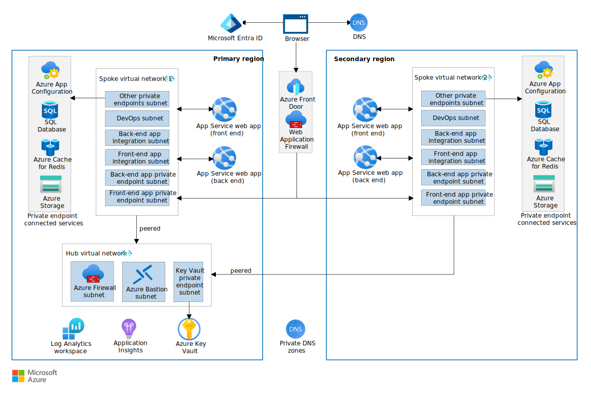

[!INCLUDE [intro 1](../includes/intro1.md)]

*Why the Reliable Web App pattern for .NET?* The Reliable Web App pattern shows you how to transition an on-premises .NET web app to the cloud. It helps you quickly realize cloud benefits by providing high-value updates and minimal code changes. These enhancements significantly improve the reliability, security, performance, and operational excellence of your web app.

[!INCLUDE [intro 2](../includes/intro2.md)]

> [!TIP]
>  There's [***reference implementation***][reference-implementation] (sample) of the Reliable Web App pattern. It represents the end-state of the Reliable Web App implementation. It's a production-grade web app that features all the code, architecture, and configuration updates discussed in this article. Deploy and use the reference implementation to guide your implementation of the Reliable Web App pattern.

## Architecture guidance

[!INCLUDE [reliable web app pattern architecture updates](../includes/architecture-updates.md)]

## Code guidance

[!INCLUDE [Code updates](../includes/code-updates.md)]

### Implement the Retry pattern

[!INCLUDE [Retry pattern intro](../includes/retry.md)]

- *Use built-in retry mechanisms.* Use the [built-in retry mechanism](/azure/architecture/best-practices/retry-service-specific) that most Azure services have to expedite the implementation. For example, the reference implementation uses the [connection resiliency in Entity Framework Core](/ef/core/miscellaneous/connection-resiliency) to apply the Retry pattern in requests to [Azure SQL Database](/azure/architecture/best-practices/retry-service-specific#sql-database-using-entity-framework-core) (*see the following code*).

    ```csharp
    services.AddDbContextPool<ConcertDataContext>(options => options.UseSqlServer(sqlDatabaseConnectionString,
        sqlServerOptionsAction: sqlOptions =>
        {
            sqlOptions.EnableRetryOnFailure(
            maxRetryCount: 5,
            maxRetryDelay: TimeSpan.FromSeconds(3),
            errorNumbersToAdd: null);
        }));
    ```

- *Use programming libraries.* For services that don't have built-in support for the Retry pattern, use programming libraries that support the Retry pattern, such as [Polly](https://github.com/App-vNext/Polly). For example, the reference implementation uses Polly to enforce the Retry pattern every time the code constructs an object that calls the `IConcertSearchService` object (*see the following code*).

    ```csharp
    private void AddConcertSearchService(IServiceCollection services)
    {
        var baseUri = Configuration["App:RelecloudApi:BaseUri"];
        if (string.IsNullOrWhiteSpace(baseUri))
        {
            services.AddScoped<IConcertSearchService, MockConcertSearchService>();
        }
        else
        {
            services.AddHttpClient<IConcertSearchService, RelecloudApiConcertSearchService>(httpClient =>
            {
                httpClient.BaseAddress = new Uri(baseUri);
                httpClient.DefaultRequestHeaders.Add(HeaderNames.Accept, "application/json");
                httpClient.DefaultRequestHeaders.Add(HeaderNames.UserAgent, "Relecloud.Web");
            })
            .AddPolicyHandler(GetRetryPolicy())
            .AddPolicyHandler(GetCircuitBreakerPolicy());
        }
    }
    
    private static IAsyncPolicy<HttpResponseMessage> GetRetryPolicy()
    {
        var delay = Backoff.DecorrelatedJitterBackoffV2(TimeSpan.FromMilliseconds(500), retryCount: 3);
        return HttpPolicyExtensions
          .HandleTransientHttpError()
          .OrResult(msg => msg.StatusCode == System.Net.HttpStatusCode.NotFound)
          .WaitAndRetryAsync(delay);
    }
    ```

### Implement the Circuit Breaker pattern

[!INCLUDE [Circuit-breaker pattern intro](../includes/circuit-breaker.md)]

For example, the reference implementation applies the Circuit Breaker pattern on all requests to the API. It uses the `HandleTransientHttpError` logic to detect HTTP requests that it can safely retry but limits the number of aggregate faults over a specified period of time (*see the following code*).

```csharp
private static IAsyncPolicy<HttpResponseMessage> GetCircuitBreakerPolicy()
{
    return HttpPolicyExtensions
        .HandleTransientHttpError()
        .OrResult(msg => msg.StatusCode == System.Net.HttpStatusCode.NotFound)
        .CircuitBreakerAsync(5, TimeSpan.FromSeconds(30));
}
```

### Implement the Cache-Aside pattern

[!INCLUDE [Cache-aside pattern intro](../includes/cache-aside.md)]

- *Configure application to use a cache.* Production apps should use the Distributed Redis Cache because it's the most performant. For example, the reference implementation uses distributed Redis cache. The [`AddAzureCacheForRedis` method](/dotnet/api/microsoft.extensions.dependencyinjection.memorycacheservicecollectionextensions.adddistributedmemorycache) configures the application to use Azure Cache for Redis (*see the following code*).

    ```csharp
    private void AddAzureCacheForRedis(IServiceCollection services)
    {
        if (!string.IsNullOrWhiteSpace(Configuration["App:RedisCache:ConnectionString"]))
        {
            services.AddStackExchangeRedisCache(options =>
            {
                options.Configuration = Configuration["App:RedisCache:ConnectionString"];
            });
        }
        else
        {
            services.AddDistributedMemoryCache();
        }
    }
    ```

- *Cache high-need data.* Apply the Cache-Aside pattern on high-need data to amplify its effectiveness. Use Azure Monitor to track the CPU, memory, and storage of the database. These metrics help you determine whether you can use a smaller database SKU after applying the Cache-Aside pattern. For example, the reference implementation caches high-need data that supports the Upcoming Concerts page. The `GetUpcomingConcertsAsync` method pulls data into the Redis cache from the SQL Database and populates the cache with the latest concerts data (*see following code*).

    ```csharp
    public async Task<ICollection<Concert>> GetUpcomingConcertsAsync(int count)
    {
        IList<Concert>? concerts;
        var concertsJson = await this.cache.GetStringAsync(CacheKeys.UpcomingConcerts);
        if (concertsJson != null)
        {
            // There is cached data. Deserialize the JSON data.
            concerts = JsonSerializer.Deserialize<IList<Concert>>(concertsJson);
        }
        else
        {
            // There's nothing in the cache. Retrieve data from the repository and cache it for one hour.
            concerts = await this.database.Concerts.AsNoTracking()
                .Where(c => c.StartTime > DateTimeOffset.UtcNow && c.IsVisible)
                .OrderBy(c => c.StartTime)
                .Take(count)
                .ToListAsync();
            concertsJson = JsonSerializer.Serialize(concerts);
            var cacheOptions = new DistributedCacheEntryOptions {
                AbsoluteExpirationRelativeToNow = TimeSpan.FromHours(1)
            };
            await this.cache.SetStringAsync(CacheKeys.UpcomingConcerts, concertsJson, cacheOptions);
        }
        return concerts ?? new List<Concert>();
    }
    ```

- *Keep cache data fresh.* Schedule regular cache updates to sync with the latest database changes. Determine the optimal refresh rate based on data volatility and user needs. This practice ensures the application uses the Cache-Aside pattern to provide both rapid access and current information. For example, the reference implementation caches data only for one hour and uses the `CreateConcertAsync` method to clear the cache key when the data changes (*see the following code*).

    ```csharp
    public async Task<CreateResult> CreateConcertAsync(Concert newConcert)
    {
        database.Add(newConcert);
        await this.database.SaveChangesAsync();
        this.cache.Remove(CacheKeys.UpcomingConcerts);
        return CreateResult.SuccessResult(newConcert.Id);
    }
    ```

- *Ensure data consistency.* Implement mechanisms to update the cache immediately after any database write operation. Use event-driven updates or dedicated data management classes to ensure cache coherence. Consistently synchronizing the cache with database modifications is central to the Cache-Aside pattern. For example, the reference implementation uses the `UpdateConcertAsync` method to keep the data in the cache consistent (*see the following code*).

    ```csharp
    public async Task<UpdateResult> UpdateConcertAsync(Concert existingConcert), 
    {
       database.Update(existingConcert);
       await database.SaveChangesAsync();
       this.cache.Remove(CacheKeys.UpcomingConcerts);
       return UpdateResult.SuccessResult();
    }
    ```

## Configuration guidance

[!INCLUDE [configuration guidance intro](../includes/configuration.md)]

### Configure user authentication and authorization

[!INCLUDE [User authN and authZ](../includes/authn-authz.md)]

- *Use an identity platform.* Use the [Microsoft Identity platform](/entra/identity-platform/v2-overview) to [set up web app authentication](/entra/identity-platform/index-web-app). This platform supports both single-tenant and multi-tenant applications, allowing users to sign in with their Microsoft identities or social accounts.

- *Create an app registration.* Microsoft Entra ID requires an application registration in the primary tenant. The application registration ensures the users that get access to the web app have identities in the primary tenant.

- *Use platform features.* Minimize the need for custom authentication code by using platform capabilities to authenticate users and access data. For example, [App Service](/azure/app-service/overview-authentication-authorization) provides built-in authentication support, so you can sign in users and access data by writing minimal or no code in your web app.

- *Enforce authorization in the application.* Use role-based access controls (RBAC) to assign least privileges to [application roles](/entra/identity-platform/custom-rbac-for-developers). Define specific roles for different user actions to avoid overlap and ensure clarity. Map users to the appropriate roles and ensure they only have access to necessary resources and actions.

[!INCLUDE [User authN and authZ](../includes/authn-authz.md)]

### Implement managed identities

[!INCLUDE [Managed identity intro](../includes/managed-id.md)]

For example, the reference implementation uses the `Authentication` argument in the SQL database connection string so App Service can [connect to the SQL database](/azure/app-service/tutorial-connect-msi-sql-database) with a managed identity: `Server=tcp:my-sql-server.database.windows.net,1433;Initial Catalog=my-sql-database;Authentication=Active Directory Default`. It uses the `DefaultAzureCredential` to allow the web API to connect to Key Vault using a managed identity (*see the following code*).

```csharp
    builder.Configuration.AddAzureAppConfiguration(options =>
    {
         options
            .Connect(new Uri(builder.Configuration["Api:AppConfig:Uri"]), new DefaultAzureCredential())
            .ConfigureKeyVault(kv =>
            {
                // Some of the values coming from Azure App Configuration are stored Key Vault. Use
                // the managed identity of this host for the authentication.
                kv.SetCredential(new DefaultAzureCredential());
            });
    });
```

### Right size environments

[!INCLUDE [Right size environments intro](../includes/rightsize.md)]

For example, the reference implementation uses Bicep parameters to deploy more expensive tiers (SKUs) to the production environment.
    
    ```bicep
        var redisCacheSkuName = isProd ? 'Standard' : 'Basic'
        var redisCacheFamilyName = isProd ? 'C' : 'C'
        var redisCacheCapacity = isProd ? 1 : 0
    ```

### Implement autoscaling

[!INCLUDE [Autoscaling](../includes/autoscaling.md)]

### Automate resource deployment

[!INCLUDE [Automate deployment guidance](../includes/automate-deployment.md)]

### Implement monitoring

[!INCLUDE [Monitoring](../includes/monitor.md)]

- *Collect application telemetry.* Use [autoinstrumentation](/azure/azure-monitor/app/codeless-overview) in Azure Application Insights to collect application [telemetry](/azure/azure-monitor/app/data-model-complete), such as request throughput, average request duration, errors, and dependency monitoring, with no code changes.

    The reference implementation uses `AddApplicationInsightsTelemetry` from the NuGet package `Microsoft.ApplicationInsights.AspNetCore` to enable [telemetry collection](/azure/azure-monitor/app/asp-net-core) (*see the following code*).

    ```csharp
    public void ConfigureServices(IServiceCollection services)
    {
       ...
       services.AddApplicationInsightsTelemetry(Configuration["App:Api:ApplicationInsights:ConnectionString"]);
       ...
    }
    ```

- *Create custom application metrics.* Use code-based instrumentation for [custom application telemetry](/azure/azure-monitor/app/api-custom-events-metrics). Add the Application Insights SDK to your code and use the Application Insights API.

    The reference implementation gathers telemetry on events related to cart activity. `this.telemetryClient.TrackEvent` counts the tickets added to the cart. It supplies the event name (`AddToCart`) and specifies a dictionary that has the `concertId` and `count` (*see the following code*).

    ```csharp
    this.telemetryClient.TrackEvent("AddToCart", new Dictionary<string, string> {
        { "ConcertId", concertId.ToString() },
        { "Count", count.ToString() }
    });
    ```

- *Monitor the platform.* Enable diagnostics for all supported services and Send diagnostics to same destination as the application logs for correlation. Azure services create platform logs automatically but only stores them when you enable diagnostics. Enable diagnostic settings for each service that supports diagnostics.

## Deploy the reference implementation

The reference implementation guides developers through a simulated migration from an on-premises ASP.NET application to Azure, highlighting necessary changes during the initial adoption phase. This example uses a concert-ticketing application for the fictional company Relecloud, which sells tickets through its on-premises web application. Relecloud set the following goals for their web application:

- Implement low-cost, high-value code changes
- Achieve a service level objective (SLO) of 99.9%
- Adopt DevOps practices
- Create cost-optimized environments
- Enhance reliability and security

Relecloud determined that their on-premises infrastructure wasn't a cost-effective solution to meet these goals. They decided that migrating their CAMS web application to Azure was the most cost effective way to achieve their immediate and future goals. The following architecture represents the end-state of Relecloud's Reliable Web App pattern implementation.

[](../../../_images/reliable-web-app-dotnet.svg)
*Figure 3. Architecture of the reference implementation. Download a [Visio file](https://arch-center.azureedge.net/reliable-web-app-dotnet-1.1.vsdx) of this architecture.*

>[!div class="nextstepaction"]
>[Reference implementation][reference-implementation]

[reference-implementation]: https://github.com/Azure/reliable-web-app-pattern-dotnet